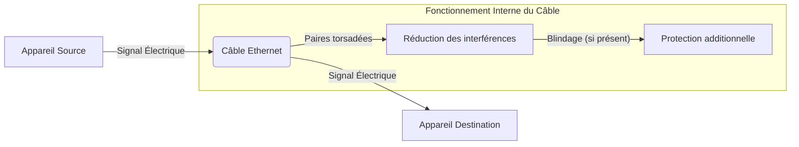

---
aliases:
  - Câble Ethernet
  - Ethernet Cable
  - RJ45 Cable
archetype: materiel
cssclasses:
  - max
couche_osi:
  - "Couche 1 - Physique"
tags:
  - materiel
  - materiel/cable
  - cable/ethernet
  - reseau
  - reseau/lan
  - rj45
  - materiel/connecteur
  - modele-osi/couche-1
  - protocole/ethernet
  - cable/ethernet/droit
  - cable/ethernet/croise
  - reseau/auto-mdix
  - cable/utp/cat5e
  - cable/utp/cat6
  - cable/utp/cat6a
  - cable/utp/cat7
  - cable/utp/cat8
  - cable/blindage
  - cable/stp
  - cable/utp
  - interferences
  - diaphonie
  - cable/dommage-physique
  - securite/menaces
---

# Ethernet Cable

> [!info] Rôle Principal
> Un **câble Ethernet** est un type de câble réseau utilisé pour les connexions filaires au sein de réseaux locaux (LAN). Il permet la transmission de données entre différents périphériques réseau, tels que les ordinateurs, les routeurs, les commutateurs et les imprimantes, en utilisant le protocole Ethernet. Ces câbles sont essentiels pour établir une infrastructure réseau fiable et performante.

## 🛠️ Spécifications Techniques

| Caractéristique | Valeur |
|---|---|
| **Type** | Paire torsadée blindée ou non blindée |
| **Connecteurs** | RJ45 (8P8C) |
| **Couche OSI** | Couche 1 - Physique |

### Types de Câbles Ethernet

Il existe principalement deux types de câbles Ethernet, différenciés par le brochage de leurs connecteurs RJ45 :

*   **Câble Droit (Straight-Through Cable)** : L'ordre des fils est identique aux deux extrémités du câble, suivant généralement la norme T568A ou T568B. C'est le type le plus courant, utilisé pour connecter des périphériques de types différents, comme un ordinateur à un commutateur (switch) ou un routeur.
*   **Câble Croisé (Crossover Cable)** : L'ordre des fils est inversé entre les deux extrémités (une extrémité T568A, l'autre T568B), ce qui permet de connecter directement deux périphériques de même type, comme deux ordinateurs ou deux commutateurs, sans passer par un équipement intermédiaire. Cependant, avec l'avènement de la fonction **Auto-MDIX** sur la plupart des équipements réseau modernes, les câbles droits sont désormais utilisés dans la majorité des cas, même pour connecter des périphériques similaires.

### Catégories de Câbles Ethernet

Les câbles Ethernet sont classés par catégories (Cat) qui définissent leurs performances en termes de bande passante et de débit maximal. Les catégories les plus courantes sont :

*   **Cat5e (Catégorie 5e)** : Supporte des débits allant jusqu'à 1 Gbps (Gigabit par seconde) avec une bande passante de 100 MHz sur une distance de 100 mètres. Il est adapté aux réseaux domestiques et aux utilisations bureautiques basiques.
*   **Cat6 (Catégorie 6)** : Offre des débits de 1 Gbps sur 100 mètres et peut atteindre 10 Gbps sur des distances plus courtes (jusqu'à 55 mètres). Sa bande passante est de 250 MHz. Il est devenu un standard pour les réseaux d'entreprise.
*   **Cat6a (Catégorie 6a)** : Amélioration de la Cat6, il supporte 10 Gbps sur une distance de 100 mètres avec une bande passante de 500 MHz, réduisant la diaphonie exogène. Idéal pour les réseaux d'entreprise avancés et les centres de données.
*   **Cat7 (Catégorie 7)** : Conçu pour des débits de 10 Gbps sur 100 mètres, avec une bande passante de 600 MHz. Il requiert un blindage intégral des paires torsadées (SSTP/SFTP) pour une meilleure résistance au bruit. Les connecteurs peuvent être de type GG45 ou TERA, mais sont souvent compatibles RJ45.
*   **Cat8 (Catégorie 8)** : La catégorie la plus récente, supportant des débits de 25 Gbps ou 40 Gbps sur une distance allant jusqu'à 30 mètres, avec une bande passante de 2000 MHz (2 GHz). Les câbles Cat8 nécessitent un blindage et sont principalement destinés aux centres de données et aux infrastructures critiques.

### Connecteurs RJ45

Le connecteur **RJ45** (Registered Jack 45) est le connecteur standard utilisé pour les câbles Ethernet. Il s'agit d'un connecteur 8P8C (8 positions, 8 contacts), ce qui signifie qu'il peut accueillir jusqu'à huit fils. Les câbles sont raccordés selon les normes EIA/TIA 568A ou 568B, qui définissent l'ordre des fils dans le connecteur.

## ⚙️ Fonctionnement Interne
Les câbles Ethernet transmettent des données via des paires de fils de cuivre torsadés. La torsion des paires permet de réduire les interférences électromagnétiques (EMI) et la diaphonie (crosstalk) entre les fils adjacents. Le blindage (foil ou tresse) peut être ajouté autour des paires individuelles ou de l'ensemble du câble pour améliorer davantage la protection contre les interférences, comme c'est le cas pour les câbles FTP, STP ou SFTP. Le signal électrique est converti en données numériques par les cartes réseau des périphériques connectés. Au niveau de la couche physique du modèle OSI, le câble Ethernet est le support de transmission des bits sous forme de signaux électriques.

## 🛡️ Sécurité & Risques

> [!warning] Menaces Physiques
> *   **Dommages Physiques** : Les câbles peuvent être coupés, écrasés ou pliés de manière excessive, entraînant une perte de signal ou une dégradation des performances.
> *   **Interférences Électromagnétiques (EMI)** : Des sources externes (moteurs, alimentations électriques, autres câbles) peuvent induire du bruit dans le câble, perturbant la transmission des données, surtout pour les câbles non blindés (UTP).
> *   **Écoute Clandestine (Tapping)** : Bien que difficile, un accès physique au câble permettrait théoriquement l'interception de données.
> *   **Déconnexion Accidentelle ou Volontaire** : Une déconnexion peut entraîner une coupure de service.

> [!tip] Bonnes Pratiques
> 1.  **Cheminement Soigné** : Acheminer les câbles dans des goulottes, conduits ou chemins de câbles pour les protéger des dommages physiques.
> 2.  **Respecter les Rayons de Courbure** : Éviter de plier les câbles trop fortement pour ne pas endommager les paires torsadées internes.
> 3.  **Utilisation de Câbles Blindés** : Dans les environnements à fortes interférences électromagnétiques, privilégier les câbles blindés (FTP, STP, SFTP) pour une meilleure intégrité du signal.
> 4.  **Sécurisation Physique** : Dans les baies de serveurs, utiliser des gestionnaires de câbles et des portes verrouillées pour prévenir les déconnexions non autorisées et le vol.
> 5.  **Tests Réguliers** : Effectuer des tests de continuité et de performance pour détecter tout problème de câblage.

