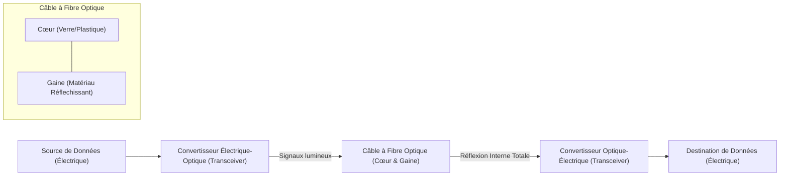

---
aliases:
  - Câble à Fibre Optique
  - Fiber Optic Cable
  - Fibre Optique
  - Optical Fiber
  - Optical Fibre Cable
archetype: materiel
couche_osi:
  - "Couche 1 - Physique"
cssclasses:
  - max
tags:
  - matériel/câble/fibre-optique
  - réseau/couche-1
  - sécurité/sûreté-physique
  - transmission-données/optique
---

# Fiber Optic Cable

> [!info] Rôle Principal
> Le **câble à fibre optique** est un support de transmission essentiel qui utilise des impulsions de lumière pour transférer des informations numériques sur de longues distances et à des vitesses très élevées. Il constitue l'épine dorsale des infrastructures de communication modernes, assurant la transmission de données pour l'internet, la télévision par câble et les systèmes téléphoniques.

## 🛠️ Spécifications Techniques
| Caractéristique | Valeur |
|---|---|
| **Type** | Câble Fibre Optique (Single-mode, Multimode) |
| **Débit Max** | Jusqu'à 100 Gbps commercialement ; plus de 1 Petabit par seconde en laboratoire. |
| **Connecteurs** | LC, SC, ST, MTP/MPO, FC (LC est privilégié pour les applications haute densité) |
| **Couche OSI** | Couche 1 - Physique |

## ⚙️ Fonctionnement Interne
Les câbles à fibre optique sont composés de brins extrêmement minces de verre ou de plastique pur, appelés "cœur" (core), entourés d'une couche réfléchissante appelée "gaine" (cladding). La transmission des données se fait par des impulsions de lumière générées par des lasers ou des LED.

La lumière voyage à travers le cœur du câble en rebondissant constamment sur les parois de la gaine, un phénomène appelé *réflexion interne totale*. La gaine a un indice de réfraction inférieur à celui du cœur, ce qui maintient les signaux lumineux à l'intérieur. Des dispositifs appelés émetteurs-récepteurs (transceivers) convertissent les signaux électriques en signaux optiques avant l'envoi, et reconvertissent les signaux optiques en électriques à la réception.

Contrairement aux câbles en cuivre, la fibre optique présente une atténuation de signal minimale sur de longues distances et offre une bande passante bien plus élevée, permettant de transporter de grandes quantités de données simultanément.

## 🛡️ Sécurité & Risques
> [!warning] Menaces Physiques
> *   **Dommages Physiques** : Les câbles à fibre optique sont vulnérables aux coupures accidentelles lors de travaux de construction, aux catastrophes naturelles (tremblements de terre, inondations, incendies de forêt) et au vandalisme ou sabotage délibéré.
> *   **Rongeurs** : Les animaux comme les écureuils et les gophers peuvent mâcher les câbles, causant des interruptions de service.
> *   **Courbure excessive** : Plier un câble à fibre optique au-delà de son rayon de courbure minimal peut entraîner une perte de signal significative ou une rupture du câble.
> *   **Tapotement de la fibre (Fiber Tapping)** : Bien que plus difficile que pour les câbles en cuivre, des outils sophistiqués peuvent permettre aux attaquants d'intercepter les données en accédant physiquement au câble, soit par courbure pour faire fuir la lumière, soit par des diviseurs optiques.
> *   **Environnement** : Les conditions extrêmes (températures, humidité) et les environnements difficiles (sous-marins) peuvent dégrader les câbles au fil du temps.

> [!tip] Bonnes Pratiques
> 1.  **Sécurité Physique Renforcée** : Déployer les câbles dans des conduits enterrés sécurisés ou des installations protégées pour réduire l'accessibilité aux menaces physiques.
> 2.  **Surveillance et Détection** : Mettre en place des systèmes de détection d'intrusion (IDS) pour surveiller l'intégrité de la fibre et détecter toute altération anormale du signal.
> 3.  **Chiffrement des Données** : Utiliser des technologies de chiffrement robustes pour protéger logiquement les données transitant par la fibre, surtout lorsque la connexion physique n'est pas entièrement maîtrisée.
> 4.  **Installation Professionnelle** : Respecter scrupuleusement les spécifications d'installation, notamment le rayon de courbure minimal, pour éviter les dommages et les pertes de signal.
> 5.  **Protection contre les Pests** : Utiliser des gaines protectrices pour minimiser les risques liés à l'activité des rongeurs.
> 6.  **Redondance** : Mettre en place des routes de câbles redondantes pour assurer la continuité de la communication en cas de compromission d'une ligne.

## 🔗 Notes Connexes
*   **Protocole utilisé** : ProtocoleReseau
*   **Alternative** : MaterielAlternatif
*   **Dépendance** : DependanceTechnique