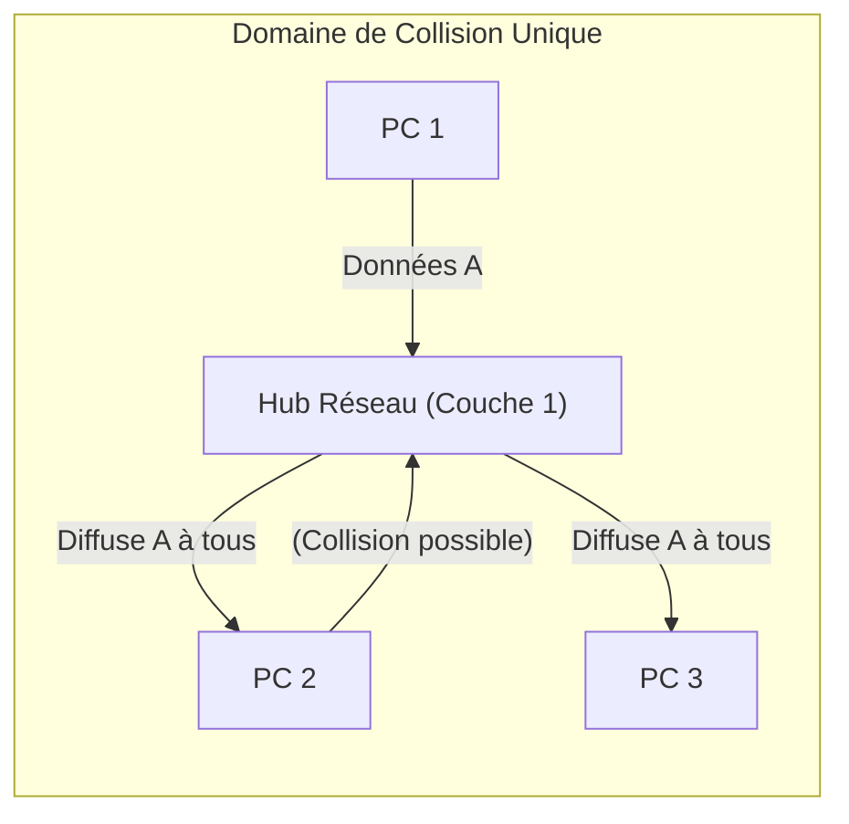

---
aliases:
  - Hub Réseau
  - Network Hub
  - Concentrateur Ethernet
  - Ethernet Hub
  - Concentrator
  - Concentrateur
  - hub
archetype: materiel
cssclasses:
  - max
couche_osi:
  - "Couche 1 - Physique"
tags:
  - materiel/reseau
  - materiel/reseau/hub
  - reseau/lan
  - modele-osi/couche-1
  - reseau/broadcast
  - domaine-collision
  - mode-transmission/semi-duplex
  - bande-passante/partagee
  - securite/reseau
  - vulnerabilite
  - sniffing-reseau
  - interception
---

# Hub Réseau

> [!info] Rôle Principal
> Un **hub réseau**, ou **concentrateur Ethernet**, est un équipement matériel fondamental qui permet de connecter plusieurs périphériques Ethernet au sein d'un même réseau local (LAN). Son rôle principal est de centraliser les transmissions et de régénérer le signal, créant ainsi un point de connexion commun pour les appareils.

## 🛠️ Spécifications Techniques
| Caractéristique | Valeur |
|---|---|
| **Type** | Concentrateur (répéteur multiport) |
| **Débit Max** | Généralement 10 ou 100 Mbit/s (Fast Ethernet) |
| **Connecteurs** | Ports RJ45 (généralement 4, 8, 16 ou plus) |
| **Couche OSI** | Couche 1 - Physique |

## ⚙️ Fonctionnement Interne
Le hub opère au niveau de la **couche physique (Couche 1)** du modèle OSI. Lorsqu'il reçoit un paquet de données sur l'un de ses ports, il ne l'analyse pas. Au lieu de cela, il régénère le signal électrique et le diffuse à *tous* les autres ports connectés, sans distinction de destination.

Ce mode de fonctionnement, appelé **semi-duplex**, implique que tous les périphériques connectés à un hub partagent la même bande passante et se trouvent dans un unique **domaine de collision**. Si deux appareils tentent de transmettre des données simultanément, une collision se produit, ce qui nécessite une retransmission des trames après une attente aléatoire. Cela limite considérablement l'efficacité du réseau, surtout avec un trafic élevé.

### Différences avec un Switch
Il est crucial de distinguer un hub d'un **switch (commutateur réseau)**, qui est une évolution plus "intelligente" et performante :

*   **Couche OSI** : Un hub fonctionne à la **Couche 1 (Physique)** du modèle OSI. Un switch opère principalement à la **Couche 2 (Liaison de Données)**, et parfois à la Couche 3 (Réseau) pour les switchs de niveau 3.
*   **Mode de Transmission** : Le hub utilise la **diffusion** (broadcast) : il envoie les données reçues sur un port à *tous* les autres ports. Le switch, en revanche, apprend les adresses MAC des appareils connectés à chaque port et transmet les trames de manière **ciblée** uniquement au port du destinataire.
*   **Domaine de Collision** : Avec un hub, tous les ports partagent un **domaine de collision unique**. Chaque port d'un switch représente son propre domaine de collision, ce qui réduit considérablement les collisions et améliore les performances.
*   **Bande Passante** : Dans un réseau avec un hub, la bande passante est **partagée** entre tous les appareils, ce qui entraîne une dégradation des performances avec l'augmentation du trafic. Un switch permet une bande passante dédiée à chaque connexion, offrant des communications en **full-duplex** (émission et réception simultanées).
*   **Intelligence** : Un hub est un appareil "passif" sans intelligence, se contentant de régénérer et diffuser les signaux. Un switch est un appareil "actif" qui dispose de capacités de "mémoire intelligente" et d'apprentissage, en construisant et en utilisant une table d'adresses MAC.

## 🛡️ Sécurité & Risques
> [!warning] Menaces Physiques
> *   **Accès** : Les hubs ne disposent d'aucune fonctionnalité de sécurité logicielle. Un accès physique au hub permet l'interception de tout le trafic réseau.
> *   **Environnement** : Comme tout équipement électronique, les hubs sont sensibles aux conditions environnementales telles que la surchauffe, l'humidité et la poussière.
> *   **Interception de Données** : En raison de leur fonctionnement par diffusion, les hubs sont très vulnérables aux attaques par **analyseur de paquets (sniffer)**, car toutes les données transitent par tous les ports, permettant à n'importe quel appareil connecté d'intercepter le trafic des autres.

> [!tip] Bonnes Pratiques
> 1.  **Remplacement par des Switchs** : Pour la grande majorité des usages actuels, il est fortement recommandé d'utiliser des switchs plutôt que des hubs pour bénéficier de meilleures performances, d'une meilleure sécurité et d'une gestion plus efficace du trafic réseau.
> 2.  **Sécurité Physique** : Si un hub doit être utilisé (par exemple pour des tâches d'analyse réseau spécifiques ou sur des réseaux très anciens), il doit être sécurisé physiquement dans une baie verrouillée pour éviter tout accès non autorisé.
> 3.  **Surveillance** : Mettre en place une surveillance réseau pour détecter toute activité suspecte, bien que la nature du hub rende cette tâche plus complexe pour isoler l'origine.