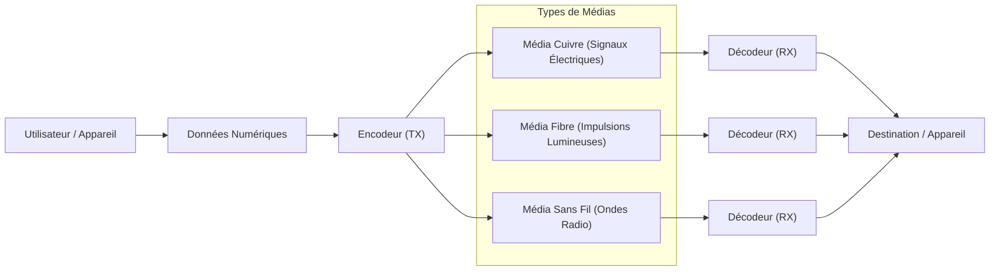

---
aliases:
  - "Médias Réseau"
  - "Transmission Media"
  - "Médias de Transmission"
  - "Network Media"
archetype: materiel
couche_osi:
  - "Couche 1 - Physique"
cssclasses:
  - max
tags:
  - reseau
  - materiel
  - materiel/cable
  - materiel/reseau
  - reseau/transmission-donnees
  - materiel/cable/cuivre
  - materiel/cable/fibre-optique
  - cable/utp
  - cable/stp
  - cable/utp/cat5e
  - cable/utp/cat6
  - cable/utp/cat6a
  - cable/utp/cat7
  - cable/utp/cat8
  - materiel/cable/fibre-optique/mono-mode
  - materiel/cable/fibre-optique/multi-mode
  - reseau/sans-fil
  - reseau/sans-fil/wi-fi
  - connectivite/bluetooth
  - reseau/cellulaire
  - reseau/transmission/satellite
  - modele-osi/couche-1
  - rj45
  - cable/attenuation
  - debit
  - impedance
  - diaphonie
  - ethernet
  - lan
  - wan
  - man
  - connectivite
---

# Network Media

> [!info] Rôle Principal
> Les **médias de transmission réseau** constituent le canal physique ou sans fil par lequel les informations numériques sont transportées d'un point à un autre au sein d'une infrastructure de communication. Ils définissent la méthode de transport des signaux électriques, optiques ou radiofréquences et sont fondamentaux pour la connectivité.

## 🛠️ Spécifications Techniques
| Caractéristique | Valeur |
|---|---|
| **Type** | Média de transmission (Cuivre, Fibre Optique, Sans Fil) |
| **Débit Max** | Varie de quelques Mbps à plusieurs Tbps (selon le média) |
| **Connecteurs** | RJ45, SC, LC, ST, Antenne (selon le média) |
| **Couche OSI** | Couche 1 |

## ⚙️ Fonctionnement Interne

Les médias de transmission réseau sont les véhicules qui transportent les données entre les appareils. Ils se divisent principalement en trois catégories : les câbles en cuivre, les câbles à fibre optique et les technologies sans fil. Chaque type a ses propres propriétés physiques et est adapté à des applications spécifiques.

### Câbles en Cuivre

Les câbles en cuivre transmettent les données sous forme de signaux électriques. Ils sont largement utilisés pour les réseaux locaux (LAN) en raison de leur coût relativement faible et de leur facilité d'installation.

#### Types Communs
*   **Paire Torsadée Non Blindée (UTP)** : Le type de câble le plus courant pour les réseaux Ethernet. Les paires de fils sont torsadées pour réduire les interférences électromagnétiques (EMI) et les diaphonies.
    *   *Catégories* : Les catégories (Cat5e, Cat6, Cat6a, Cat7, Cat8) indiquent les performances et débits maximaux supportés. Par exemple, Cat6a peut supporter 10 Gigabit Ethernet sur 100 mètres.
*   **Paire Torsadée Blindée (STP)** : Des blindages supplémentaires (feuille d'aluminium ou tresse métallique) entourent les paires torsadées ou le câble entier pour une meilleure protection contre les interférences externes.

#### Caractéristiques Techniques
| Caractéristique | Valeur Typique |
|---|---|
| **Débit Max** | 10 Mbps (Cat3) à 40 Gbps (Cat8) |
| **Distance Max** | Généralement 100 mètres pour Ethernet |
| **Impédance** | 100 ohms |
| **Fréquence** | Jusqu'à 2 GHz (Cat8) |

#### Avantages et Inconvénients
*   **Avantages** : Faible coût, facile à installer et à terminer, supporte l'alimentation via Ethernet ([[PowerOverEthernet|PoE]]).
*   **Inconvénients** : Sensible aux interférences électromagnétiques (surtout UTP), distance limitée, moins sécurisé (interception facile), poids et encombrement.

#### Applications Typiques
Principalement utilisé pour la connectivité des postes de travail, les caméras de surveillance (PoE), et les courtes distances dans les centres de données.

### Câbles à Fibre Optique

Les câbles à fibre optique transmettent les données sous forme d'impulsions lumineuses à travers des brins de verre ou de plastique. Ils sont immuns aux interférences électromagnétiques et peuvent atteindre des débits et des distances bien supérieurs à ceux des câbles en cuivre.

#### Types Communs
*   **Mono-mode (SMF)** : Possède un petit cœur qui permet à la lumière de voyager sur un seul chemin. Idéal pour les longues distances et les débits élevés.
*   **Multi-mode (MMF)** : Possède un cœur plus grand permettant à la lumière de voyager sur plusieurs chemins (modes). Utilisé pour des distances plus courtes, généralement dans les bâtiments et les campus.

#### Caractéristiques Techniques
| Caractéristique | Valeur Typique |
|---|---|
| **Débit Max** | De 1 Gbps à plusieurs Tbps |
| **Distance Max** | Jusqu'à 40 km et plus (mono-mode) ; jusqu'à quelques centaines de mètres (multi-mode) |
| **Perte (Atténuation)** | Très faible (dB/km) |
| **Bande Passante** | Très élevée |

#### Avantages et Inconvénients
*   **Avantages** : Très haut débit, longues distances, immunité aux interférences électromagnétiques, haute sécurité (difficile à intercepter), léger et fin.
*   **Inconvénients** : Coût plus élevé, installation et terminaison plus complexes (nécessite des outils et compétences spécifiques), fragilité du verre.

#### Applications Typiques
Backbones de réseaux, centres de données, réseaux métropolitains (MAN), réseaux longue distance (WAN), Fibre To The Home (FTTH).

### Technologies Sans Fil

Les technologies sans fil utilisent des ondes radiofréquences ou des micro-ondes pour transmettre des données à travers l'air. Elles offrent une flexibilité et une mobilité inégalées, mais sont sujettes aux interférences et ont des portées limitées.

#### Types Communs
*   **Wi-Fi (IEEE 802.11)** : La norme la plus répandue pour les réseaux locaux sans fil (WLAN). Différentes versions (802.11ac, 802.11ax/Wi-Fi 6, 802.11be/Wi-Fi 7) offrent des débits et des fonctionnalités améliorés.
*   **Bluetooth** : Pour les communications sans fil à courte portée entre appareils (ex: casques, claviers).
*   **Cellulaire (3G, 4G, 5G)** : Pour la connectivité mobile sur de vastes zones géographiques.
*   **Satellite** : Pour la couverture de zones reculées ou maritimes.

#### Caractéristiques Techniques
| Caractéristique | Valeur Typique |
|---|---|
| **Débit Max** | De quelques Mbps (Bluetooth) à plusieurs Gbps (Wi-Fi 6E/7, 5G) |
| **Distance Max** | Quelques mètres (Bluetooth) à des kilomètres (Cellulaire) ou milliers de kilomètres (Satellite) |
| **Fréquence** | 2.4 GHz, 5 GHz, 6 GHz (Wi-Fi) ; bandes sub-6 GHz et mmWave (5G) |
| **Sécurité** | Chiffrement (WPA2/3 pour Wi-Fi) |

#### Avantages et Inconvénients
*   **Avantages** : Mobilité, flexibilité, facilité de déploiement (pas de câbles), peut couvrir de grandes zones.
*   **Inconvénients** : Moins sécurisé (vulnérable à l'interception et aux attaques), sensible aux interférences (autres signaux radio, obstacles physiques), débits potentiellement moins stables, portée limitée pour le Wi-Fi, dépendance à la puissance du signal.

#### Applications Typiques
Accès internet mobile, réseaux d'entreprise flexibles, maisons connectées, IoT, communications industrielles.

## 🛡️ Sécurité & Risques

> [!warning] Menaces Physiques
> *   **Accès Physique** : Les câbles en cuivre sont vulnérables à l'interception physique (écoutes). Les câbles à fibre optique sont plus difficiles à intercepter sans détection, mais ne sont pas invulnérables. Les signaux sans fil peuvent être interceptés à distance.
> *   **Environnement** :
    *   **Câbles Cuivre** : Sensibles aux interférences électromagnétiques (EMI), aux surtensions électriques et à la corrosion.
    *   **Fibre Optique** : Fragile, sensible aux courbures excessives, nécessite une protection contre l'humidité et les rongeurs.
    *   **Sans Fil** : Sensible aux interférences radio, aux obstacles physiques, aux conditions météorologiques (pluie, brouillard pour certaines fréquences).
> *   **Dommages Accidentels** : Coupes de câbles (cuivre ou fibre), défaillance des antennes.
> *   **Surchauffe** : Peut affecter les performances et la durabilité des équipements connectés aux médias.

> [!tip] Bonnes Pratiques
> 1.  **Sécurisation Physique** : Acheminer les câbles dans des conduits sécurisés, des chemins de câbles ou des baies verrouillées pour prévenir l'accès non autorisé et les dommages physiques.
> 2.  **Protection Environnementale** : Utiliser des câbles et équipements adaptés aux conditions environnementales (extérieur, fortes EMI). Assurer une gestion thermique adéquate pour les équipements actifs.
> 3.  **Surveillance** : Mettre en place une surveillance des infrastructures physiques pour détecter les tentatives d'accès ou les dégradations.
> 4.  **Chiffrement (Sans Fil)** : Utiliser des protocoles de sécurité robustes comme WPA3 pour les réseaux Wi-Fi et des chiffrements de bout en bout pour toutes les communications sans fil.
> 5.  **Planification** : Concevoir les réseaux sans fil en tenant compte de la couverture, des interférences et des risques de "signal leakage" hors des zones contrôlées.
> 6.  **Redondance** : Mettre en œuvre des chemins de câbles ou des liaisons sans fil redondants pour minimiser l'impact des défaillances.