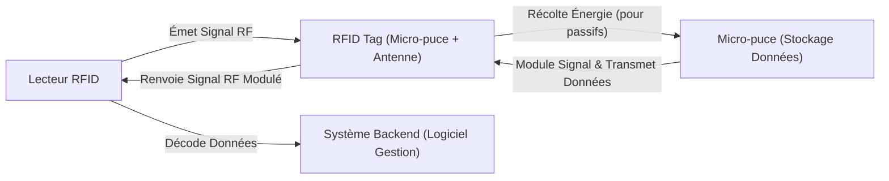

---
aliases:
  - RFID Tag
  - RFID Tags
  - Radio-Frequency Identification Tag
  - Tag d'identification par radiofréquence
  - Étiquette RFID
  - Étiquette à identification par radiofréquence
archetype: materiel
couche_osi:
  - "Couche 1 - Physique"
cssclasses:
  - max
tags:
  - rfid
  - materiel/composant
  - radiofrequence
  - identification
  - iot/objets-connectes
  - technologie/sans-contact
  - mode/passif
  - mode/actif
  - rfid/type/semi-passif
  - radiofrequence/lf
  - radiofrequence/hf
  - radiofrequence/uhf
  - modele-osi/couche-1
  - couplage-inductif
  - rfid/retro-diffusion
  - vulnerabilite
  - attaque/interception
  - spoofing
  - vol-d-identite
  - donnee/manipulation
  - attaque/par-relais
  - attaque/deni-de-service
  - attaque/physique
  - malware
  - chiffrement
  - authentification
  - securite/surete-physique
  - securite/reseau
---

# RFID Tag

> [!info] Rôle Principal
> Un **RFID Tag** (étiquette d'identification par radiofréquence) est un petit dispositif électronique utilisé pour stocker et transmettre des données via des ondes radio à un lecteur RFID. Il permet l'identification et le suivi automatique d'objets, d'animaux ou de personnes sans contact visuel direct.

## 🛠️ Spécifications Techniques

| Caractéristique | Valeur |
|---|---|
| **Type Principal** | Passif, Actif, Semi-passif (BAP) |
| **Fréquence d'Opération** | Basse Fréquence (LF: 125-134 kHz), Haute Fréquence (HF: 13.56 MHz), Ultra Haute Fréquence (UHF: 860-960 MHz), Micro-ondes (>3 GHz) |
| **Portée de Lecture** | Passive: Quelques centimètres à 12 mètres (UHF), Semi-passive: 10-30 mètres, Active: Jusqu'à 150 mètres |
| **Source d'Alimentation** | Passive: Énergie du lecteur, Active: Batterie interne, Semi-passive: Batterie pour la puce, énergie du lecteur pour la communication |
| **Connecteurs** | Antenne intégrée (micro-puce et antenne) |
| **Couche OSI** | Couche 1 - Physique |
| **Capacité de Données** | Variable, d'un identifiant unique à des données plus complexes |

## ⚙️ Fonctionnement Interne

Un RFID Tag est composé d'une micro-puce (circuit intégré) qui stocke les données et d'une antenne pour la communication radio. Le fonctionnement se déroule en plusieurs étapes clés :

1.  **Alimentation du Tag** :
    *   Les **tags passifs** n'ont pas de batterie interne et tirent l'énergie du champ électromagnétique émis par le lecteur RFID. L'antenne du tag convertit les ondes radio en courant électrique pour alimenter la micro-puce et transmettre les données.
    *   Les **tags actifs** possèdent leur propre source d'énergie (batterie) et peuvent émettre des signaux de manière autonome sur de plus longues distances.
    *   Les **tags semi-passifs** (ou *Battery-Assisted Passive - BAP*) intègrent une batterie pour alimenter la micro-puce, mais dépendent du signal du lecteur pour initier la communication.

2.  **Communication avec le Lecteur** :
    *   Un lecteur RFID émet des ondes radio à une fréquence spécifique. L'antenne du tag reçoit cette énergie, ce qui active la micro-puce.
    *   Le tag module les ondes radio (méthode de *rétrodiffusion* pour les UHF, *couplage inductif* pour les LF/HF) et renvoie les données stockées à l'antenne du lecteur.

3.  **Traitement des Données** :
    *   Le lecteur reçoit le signal modulé, décode les données du tag et les transmet à un système informatique backend pour traitement, comme la gestion des stocks ou le contrôle d'accès.

## 🛡️ Sécurité & Risques

Les RFID Tags, bien qu'efficaces, présentent plusieurs vulnérabilités et risques de sécurité.

> [!warning] Menaces Physiques & Logiques
> *   **Accès Non Autorisé / Espionnage (Eavesdropping)** : La communication entre le tag et le lecteur peut être interceptée si elle n'est pas chiffrée, permettant à un attaquant d'écouter et d'enregistrer les identifiants et les données.
> *   **Clonage et Usurpation (Spoofing)** : Les identifiants de tag peuvent être copiés et utilisés pour créer des tags contrefaits, permettant un accès non autorisé ou la falsification de marchandises. Les identifiants statiques et prévisibles sont particulièrement vulnérables.
> *   **Manipulation de Données** : Sans chiffrement ou mécanismes d'intégrité, les données sur un tag peuvent être modifiées par des acteurs malveillants, compromettant l'authenticité des produits ou des informations.
> *   **Attaques par Relais (Relay Attacks)** : Un attaquant peut utiliser deux dispositifs pour étendre la portée du signal RFID, obtenant ainsi un accès non autorisé à un système de contrôle d'accès ou de paiement.
> *   **Attaques par Déni de Service (DoS)** : L'interférence électromagnétique peut perturber la communication entre les tags et les lecteurs, rendant le système inopérant.
> *   **Attaques Physiques** : La suppression ou le remplacement physique d'un tag peut être utilisé pour contourner les contrôles d'accès. La destruction des données par des sondes ou des radiations est également possible.
> *   **Logiciels Malveillants (Malware)** : Si un lecteur RFID est infecté, il peut entraîner un accès non autorisé ou la manipulation des données stockées sur les tags.

> [!tip] Bonnes Pratiques
> 1.  **Chiffrement et Authentification** : Mettre en œuvre le chiffrement des communications entre les tags et les lecteurs. Utiliser des protocoles cryptographiques et une authentification mutuelle (tag et lecteur se vérifient mutuellement) pour empêcher l'espionnage et l'usurpation.
> 2.  **Sécurité Physique** : Protéger physiquement les tags par des scellés inviolables ou des boîtiers sécurisés. Les tags conçus pour résister à la falsification (tamper-evident/resistant) augmentent la sécurité.
> 3.  **Gestion des Accès** : Implémenter des contrôles d'accès robustes pour les systèmes RFID et leurs données backend.
> 4.  **Mises à Jour Régulières** : Maintenir les logiciels et firmwares des lecteurs RFID à jour pour se protéger contre les vulnérabilités connues et les logiciels malveillants.
> 5.  **Formation du Personnel** : Sensibiliser les employés aux risques liés aux RFID et aux meilleures pratiques de sécurité pour éviter le phishing, l'ingénierie sociale et d'autres attaques.
> 6.  **Audits et Surveillance** : Effectuer des audits réguliers et surveiller les systèmes RFID pour détecter toute anomalie ou tentative d'attaque.