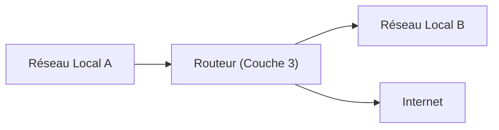

---
tags:
  - reseau/materiel
  - reseau/routage
  - reseau/securite
  - securite/gestion-acces
  - securite/cyberattaque
  - modele-osi/couche3
  - maintenance/mise-a-jour
aliases:
  - Routeur
  - Router
  - Layer 3 device
  - Gateway
archetype: materiel
cssclasses:
  - max
---

# Router

> [!info] Rôle Principal
> Un *routeur* est un équipement réseau essentiel qui a pour fonction principale d'interconnecter différents réseaux informatiques et de diriger le trafic (paquets de données) entre eux. Il prend des décisions de transfert basées sur les *adresses IP* de destination pour assurer la communication entre des réseaux distincts, comme un réseau local et Internet.

## 🛠️ Spécifications Techniques
| Caractéristique | Valeur |
|---|---|
| **Type** | Routeur (Hardware) |
| **Débit Max** | Variable (ex: 1 Gbps, 10 Gbps, 40 Gbps, 100 Gbps et plus) |
| **Connecteurs** | Ethernet (RJ45), Fibre Optique (SFP, SFP+, QSFP), Console (RJ45, DB9), USB |
| **Couche OSI** | Couche 3 (Réseau) |

## ⚙️ Fonctionnement Interne
Un routeur opère au niveau de la couche 3 (réseau) du modèle OSI. Il maintient une *table de routage* interne qui contient des informations sur les chemins disponibles vers différents réseaux. Lorsqu'un paquet de données arrive sur une interface du routeur, ce dernier examine l'*adresse IP de destination* du paquet. Il consulte ensuite sa table de routage pour déterminer l'interface de sortie appropriée et la prochaine "saut" (next hop) vers laquelle le paquet doit être envoyé pour atteindre sa destination finale. Ce processus, appelé *routage*, est fondamental pour la connectivité inter-réseaux et le fonctionnement d'Internet. Les routeurs utilisent des protocoles de routage (comme OSPF, EIGRP, BGP) pour échanger dynamiquement des informations sur les routes et maintenir leurs tables à jour.

## 🛡️ Sécurité & Risques
> [!warning] Menaces Physiques
> *   **Accès non autorisé** : L'accès physique au routeur, notamment au port console, peut permettre à un attaquant de prendre le contrôle de l'appareil.
> *   **Vol ou sabotage** : Le vol de l'équipement ou sa dégradation physique peut entraîner une interruption totale des services réseau.
> *   **Conditions environnementales** : Les routeurs sont sensibles aux variations extrêmes de température, d'humidité et à la poussière, ce qui peut affecter leur performance et leur durée de vie.
> *   **Attaques par déni de service (DoS)** : Une surcharge de trafic ou des paquets malformés peuvent saturer le routeur et empêcher le traitement du trafic légitime.

> [!tip] Bonnes Pratiques
> 1.  **Sécurité Physique** : Placer les routeurs dans des baies de serveurs sécurisées et verrouillées, dans des environnements contrôlés (température, humidité).
> 2.  **Gestion des Accès** : Utiliser des mots de passe administrateur forts et uniques, désactiver les comptes par défaut, et implémenter l'authentification multi-facteur si possible. Restreindre l'accès à l'interface de gestion (CLI, Web) à des adresses IP spécifiques.
> 3.  **Mises à Jour** : Maintenir le firmware et le système d'exploitation du routeur à jour pour patcher les vulnérabilités de sécurité connues.
4.  **Configuration Sécurisée** : Désactiver les ports physiques et les services réseau inutilisés. Implémenter des listes de contrôle d'accès (ACLs) pour filtrer le trafic indésirable.
5.  **Surveillance** : Mettre en place une journalisation robuste (syslog) et une surveillance des activités du routeur pour détecter toute activité suspecte ou tentative d'intrusion.