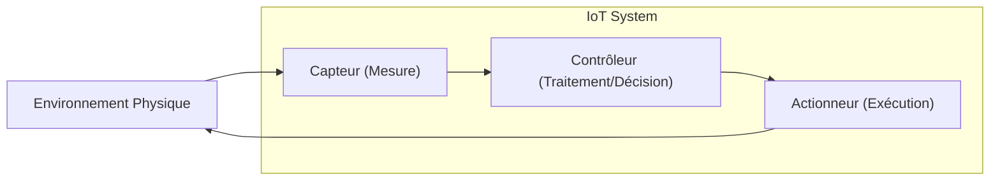

---
aliases:
  - Capteurs et Actionneurs
  - Sensor
  - Actuator
  - IoT Sensors
  - IoT Actuators
archetype: materiel
cssclasses:
  - max
couche_osi:
  - "Couche 1 - Physique"
tags:
  - materiel
  - materiel/composant
  - iot
  - iot/objets-connectes
  - modele-osi/couche-1
  - peripherique
  - peripherique/entree
  - peripherique/sortie
  - composant/electronique
  - systeme/embarque
  - capteur
  - actionneur
---

# Sensors and Actuators

> [!info] Rôle Principal
> Les **capteurs** (sensors) sont des dispositifs qui détectent et mesurent des phénomènes physiques ou chimiques dans l'environnement, convertissant ces informations en signaux électriques. Les **actionneurs** (actuators), quant à eux, reçoivent des signaux électriques et les convertissent en actions physiques, permettant ainsi aux systèmes d'interagir avec le monde réel. Ils sont des composants fondamentaux des systèmes embarqués et de l'Internet des Objets (IoT) pour la détection et l'exécution.

## 🛠️ Spécifications Techniques

Les capteurs et actionneurs sont variés, chacun ayant des caractéristiques techniques spécifiques à leur fonction.

| Caractéristique | Capteurs (Général) | Actionneurs (Général) |
|---|---|---|
| **Type** | Détecteur de phénomènes physiques/chimiques | Convertisseur de signal électrique en action physique |
| **Input** | Énergie physique/chimique (lumière, température, pression, mouvement, etc.) | Signal électrique (tension, courant) du système de contrôle |
| **Output** | Signal électrique (analogique ou numérique) | Mouvement, force, chaleur, lumière, son, etc. |
| **Principe de Fonctionnement** | Transduction d'une énergie physique en signal électrique | Conversion d'un signal électrique en énergie mécanique ou autre forme physique |
| **Exemples de Types** | Température, pression, lumière, mouvement, humidité, gaz, proximité | Moteurs (DC, pas à pas, servo), solénoïdes, vannes, pompes, LEDs |
| **Couche OSI** | Couche 1 - Physique | Couche 1 - Physique |

### Description des Composants et leurs Caractéristiques Techniques Détaillées

#### Capteurs (Sensors)
Les capteurs fonctionnent en convertissant des attributs physiques en signaux électriques. Ce processus implique généralement un récepteur qui capte le phénomène, une étape de transduction qui convertit l'input en une autre forme d'énergie, et un conditionnement du signal pour l'amplification et le traitement.

*   **Capteurs de Température** :
    *   **Types** : Thermocouples, Thermistances (CTN/PTC), RTD (Resistance Temperature Detector), DHT11.
    *   **Principe** : Changement de résistance électrique en fonction de la température (Thermistances, RTD) ou génération d'une tension due à la différence de température entre deux métaux différents (Thermocouples).
    *   **Applications** : Systèmes CVC (Chauffage, Ventilation, Climatisation), processus industriels, surveillance météorologique.
*   **Capteurs de Pression** :
    *   **Types** : Jauges de contrainte, Piezoélectriques, MEMS (Micro-Electro-Mechanical Systems), Capacitifs.
    *   **Principe** : Mesure de la force par unité de surface, souvent via la déformation d'un diaphragme qui modifie une résistance ou une capacitance.
    *   **Applications** : Moteurs automobiles, systèmes hydrauliques, surveillance de la pression atmosphérique et différentielle.
*   **Capteurs de Lumière** :
    *   **Types** : Photodiodes, Phototransistors, LDR (Light Dependent Resistor).
    *   **Principe** : Détection des variations de lumière (intensité, réflexion, transmission) et conversion en signal électrique.
    *   **Applications** : Éclairage automatique, panneaux solaires, systèmes d'exposition de caméra.
*   **Capteurs de Mouvement/Proximité** :
    *   **Types** : Infrarouge Passif (PIR), Ultrasoniques, Capacitifs, Inductifs.
    *   **Principe** : Détection de la présence ou du mouvement d'un objet sans contact physique, en émettant un champ électromagnétique/sonore et en détectant les perturbations ou réflexions.
    *   **Applications** : Systèmes de sécurité, portes automatiques, robotique, lignes d'assemblage.

#### Actionneurs (Actuators)
Les actionneurs reçoivent des signaux électriques d'un système de contrôle et les transforment en une action physique, comme le mouvement, la force ou la chaleur.

*   **Actionneurs Électriques** :
    *   **Types** : Moteurs DC, Moteurs pas à pas, Servo-moteurs, Solénoïdes.
    *   **Principe** : Conversion de l'énergie électrique en mouvement mécanique (linéaire ou rotatif) via des champs magnétiques générés par le moteur.
    *   **Applications** : Bras robotiques, bandes transporteuses, vannes de régulation, serrures de porte.
*   **Actionneurs Hydrauliques** :
    *   **Types** : Cylindres hydrauliques, moteurs hydrauliques.
    *   **Principe** : Utilisation de la pression d'un fluide (liquide) pour générer une force élevée et un mouvement.
    *   **Applications** : Machinerie lourde, presses industrielles, équipements de construction.
*   **Actionneurs Pneumatiques** :
    *   **Types** : Cylindres pneumatiques, moteurs pneumatiques.
    *   **Principe** : Utilisation de l'air comprimé pour créer un mouvement linéaire ou rotatif.
    *   **Applications** : Automatisation industrielle (légère et répétitive), vannes de contrôle.
*   **Actionneurs Thermiques** :
    *   **Principe** : Réponse aux changements de température par expansion ou contraction de matériaux, déclenchant un mouvement mécanique.
    *   **Applications** : Dispositifs de commutation thermique, systèmes de régulation de débit.

## ⚙️ Fonctionnement Interne

Dans un système embarqué ou IoT, les capteurs et actionneurs travaillent en synergie pour créer une boucle de rétroaction (feedback loop). Les capteurs collectent des données de l'environnement physique et les convertissent en signaux électriques. Ces signaux sont ensuite transmis à un contrôleur (microcontrôleur, carte IoT) où ils sont traités et analysés. Sur la base de cette analyse, le contrôleur prend des décisions et envoie des signaux électriques aux actionneurs, qui exécutent alors une action physique pour modifier l'environnement.

## 🛡️ Sécurité & Risques

Les capteurs et actionneurs, en tant qu'éléments physiques d'un système, sont sujets à des menaces et risques spécifiques.

> [!warning] Menaces Physiques
> *   **Accès non autorisé/Sabotage** : Les capteurs et actionneurs peuvent être physiquement manipulés, endommagés ou désactivés par un accès non autorisé, entraînant des lectures erronées ou des actions incorrectes.
> *   **Vulnérabilités environnementales** : Les conditions extrêmes (température, humidité, vibrations, poussière) peuvent affecter la précision, la fiabilité et la durée de vie des composants.
> *   **Attaques sur la chaîne d'approvisionnement** : Des dispositifs malveillants ou altérés peuvent être introduits lors de la fabrication ou de la livraison.
> *   **Défauts d'équipement** : Les pannes matérielles, qu'elles soient dues à l'usure ou à des défauts de fabrication, peuvent entraîner des dysfonctionnements.
> *   **Interférences** : Des interférences électromagnétiques ou acoustiques peuvent perturber le fonctionnement des capteurs et actionneurs.
> *   **Attaques par injection/modification de données** : Dans les systèmes cyber-physiques, des attaquants peuvent corrompre les informations des capteurs ou intercepter et modifier les ordres envoyés aux actionneurs, induisant le système en erreur.

> [!tip] Bonnes Pratiques
> 1.  **Sécurité Physique** : Protéger physiquement les capteurs et actionneurs dans des boîtiers sécurisés ou des zones à accès contrôlé, surtout dans les environnements industriels.
> 2.  **Redondance et Résilience** : Implémenter des capteurs et actionneurs redondants pour assurer la continuité des opérations en cas de défaillance d'un composant.
> 3.  **Surveillance Environnementale** : Utiliser des capteurs supplémentaires pour surveiller les conditions environnementales (température, humidité) autour des équipements critiques.
> 4.  **Authentification et Autorisation** : Mettre en place des mécanismes d'authentification et d'autorisation robustes pour l'accès aux interfaces de configuration et de contrôle.
> 5.  **Mises à jour et Durcissement (Hardening)** : Maintenir le firmware des dispositifs à jour et appliquer les meilleures pratiques de durcissement pour réduire les surfaces d'attaque.
> 6.  **Détection d'Intrusion** : Intégrer des systèmes de détection d'intrusion qui peuvent alerter en cas de manipulation physique ou de comportement anormal des capteurs/actionneurs.