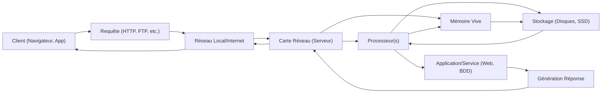

---
tags:
  - informatique/serveur
  - materiel/composant
  - reseau/infrastructure
  - systeme-exploitation/serveur
  - donnees/gestion
  - securite/infrastructure
  - services/hebergement
aliases:
  - Serveur
  - Serveur Informatique
  - Computer Server
archetype: materiel
cssclasses:
  - max
---

# Server

> [!info] Rôle Principal
> Un serveur est un ordinateur ou un programme informatique qui fournit des ressources, des données, des services ou des programmes à d'autres ordinateurs, appelés clients, sur un réseau. Il est conçu pour traiter de grandes quantités de données et gérer de nombreuses requêtes simultanément, agissant comme le cœur de nombreuses infrastructures informatiques.

## 🛠️ Spécifications Techniques
| Caractéristique | Valeur |
|---|---|
| **Type** | Ordinateur spécialisé (tour, rack, lame, microserver) |
| **Processeurs** | Multiples CPU (Intel Xeon, AMD EPYC), multi-cœurs |
| **Mémoire Vive** | Grande capacité (souvent ECC DDR4/DDR5), de 32 Go à plusieurs To |
| **Stockage** | SSD (SATA, NVMe), HDD (SAS, SATA), configuré en RAID, allant de quelques centaines de Go à plusieurs Po |
| **Cartes Réseau** | Multiples interfaces Gigabit Ethernet, 10 GbE, 25 GbE, 100 GbE, Fibre Channel |
| **Couche OSI** | Couches 4 (Transport) à 7 (Application) pour les services et applications qu'il héberge, mais son interface réseau opère à la Couche 2 (Liaison de données) et 3 (Réseau). |

## ⚙️ Fonctionnement Interne
Un serveur est une machine puissante dotée de composants conçus pour la fiabilité et la performance. Il exécute un système d'exploitation serveur (comme Windows Server, Linux distributions) qui gère les ressources matérielles et permet l'exécution d'applications et de services. Les processeurs effectuent les calculs, la mémoire vive stocke les données temporairement pour un accès rapide, et les dispositifs de stockage conservent les données de manière persistante. Les interfaces réseau assurent la connectivité avec le reste du réseau, permettant aux clients d'accéder aux services hébergés.

## 🛡️ Sécurité & Risques
> [!warning] Menaces Physiques
> *   **Accès non autorisé** : Le vol ou la manipulation directe du matériel peut compromettre les données. Les ports USB ou consoles KVM peuvent être utilisés pour installer des malwares ou extraire des informations.
> *   **Environnement** : Sensible à la surchauffe (panne matérielle, dégradation des performances), à l'humidité (corrosion), aux coupures de courant (perte de données, indisponibilité), et aux incendies.
> *   **Défaillance matérielle** : Les disques durs, l'alimentation électrique, la mémoire ou les processeurs peuvent tomber en panne, entraînant une perte de service ou de données.

> [!tip] Bonnes Pratiques
> 1.  **Sécurité physique** : Installer les serveurs dans des baies de serveurs verrouillées, dans des salles de serveurs sécurisées avec contrôle d'accès.
> 2.  **Surveillance environnementale** : Utiliser des systèmes de surveillance de la température, de l'humidité et des détecteurs d'incendie.
> 3.  **Alimentation redondante** : Utiliser des alimentations sans interruption (UPS) et des générateurs de secours pour prévenir les coupures de courant.
> 4.  **Mises à jour et correctifs** : Appliquer régulièrement les mises à jour logicielles et les correctifs de sécurité du système d'exploitation et des applications.
> 5.  **Sauvegardes** : Mettre en place une stratégie de sauvegarde et de récupération des données robuste et testée régulièrement.

## 🔗 Notes Connexes
*   **Protocole utilisé** : NetworkProtocols
*   **Alternative** : CloudComputing
*   **Dépendance** : NetworkInfrastructure