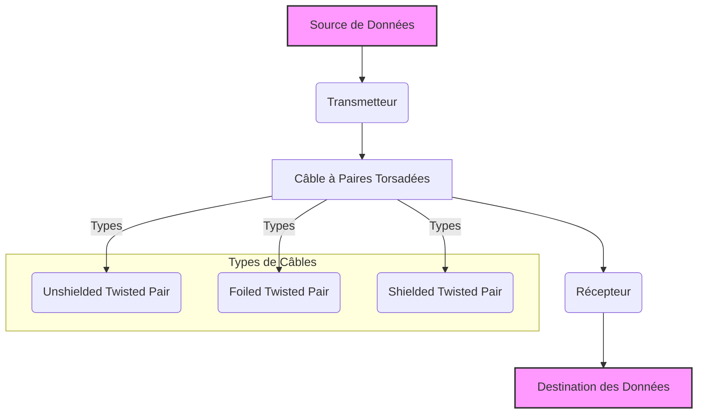

---
aliases:
  - Câble à Paires Torsadées
  - Twisted Pair Cable
  - UTP Cable
  - STP Cable
  - FTP Cable
  - Câble Réseau
archetype: materiel
couche_osi:
  - "Couche 1 - Physique"
cssclasses:
  - max
tags:
  - materiel
  - materiel/cable
  - materiel/reseau
  - cable/ethernet
  - reseau
  - modele-osi/couche-1
  - cable/utp
  - cable/ftp
  - cable/stp
  - rj45
  - interferences
  - diaphonie
  - attaque/interception
  - attaque/physique
  - securite/reseau
---

# Câble à Paires Torsadées

> [!info] Rôle Principal
> Le câble à paires torsadées est un type de câblage dans lequel deux conducteurs d'un circuit unique sont torsadés ensemble dans le but d'annuler les interférences électromagnétiques (EMI) provenant de sources externes et la diaphonie entre les paires de câbles adjacentes. Il est utilisé pour connecter des périphériques réseau tels que des ordinateurs, des commutateurs et des routeurs dans les réseaux locaux (LAN).

## 🛠️ Spécifications Techniques
| Caractéristique | Valeur |
|---|---|
| **Type** | Câble réseau |
| **Débit Max** | Varie selon la catégorie (ex: Cat5e : 1 Gbps ; Cat6a : 10 Gbps ; Cat8 : 25/40 Gbps) |
| **Connecteurs** | RJ45 (8P8C) |
| **Paires** | Généralement 4 paires torsadées |
| **Blindage** | UTP (Unshielded Twisted Pair), FTP (Foiled Twisted Pair), STP (Shielded Twisted Pair) |
| **Longueur Max** | Typiquement 100 mètres pour les réseaux Ethernet (sans répéteur) |
| **Couche OSI** | Couche 1 - Physique |

## ⚙️ Fonctionnement Interne
Un câble à paires torsadées est composé de plusieurs paires de fils conducteurs en cuivre, chaque paire étant torsadée l'une autour de l'autre. Cette torsion est cruciale car elle permet de réduire significativement la **diaphonie** (interférence entre paires adjacentes) et les **interférences électromagnétiques (EMI)** externes. Le bruit est induit de manière égale dans les deux fils d'une paire torsadée, mais en opposition de phase. Le récepteur est capable de soustraire le bruit, ne laissant que le signal original.

Il existe principalement deux types de câbles à paires torsadées :
*   **UTP (Unshielded Twisted Pair)** : Câble non blindé, le plus courant et le moins cher, adapté à la plupart des environnements de bureau.
*   **STP (Shielded Twisted Pair)** : Câble blindé, où chaque paire (ou l'ensemble des paires) est enveloppée d'un blindage métallique (feuille d'aluminium ou tresse), offrant une meilleure protection contre les interférences. Idéal pour les environnements avec de fortes sources de bruit électromagnétique. Les variantes incluent FTP (Foiled Twisted Pair) et S/FTP (Shielded/Foiled Twisted Pair).

## 🛡️ Sécurité & Risques
> [!warning] Menaces Physiques
> *   **Accès** : Les câbles exposés peuvent être facilement coupés ou endommagés accidentellement ou intentionnellement, entraînant une interruption de service.
> *   **Environnement** : Sensibilité aux fortes sources d'interférences électromagnétiques (moteurs, lignes électriques), surtout pour les câbles UTP.
> *   **Écoute Clandestine (Eavesdropping)** : Bien que les paires torsadées réduisent la diaphonie, des équipements spécialisés peuvent toujours intercepter des signaux à courte distance, surtout si le blindage est insuffisant ou endommagé.
> *   **Dommages Physiques** : La courbure excessive, l'écrasement ou l'étirement des câbles peuvent dégrader les performances ou provoquer des pannes.

> [!tip] Bonnes Pratiques
> 1.  **Gestion des Câbles** : Utiliser des chemins de câbles, des goulottes et des gestionnaires de câbles pour protéger les câbles des dommages physiques et maintenir un rayon de courbure adéquat.
> 2.  **Sélection du Blindage** : Choisir le type de blindage (UTP, FTP, STP) adapté à l'environnement. Les câbles STP sont préférables dans les zones à fortes interférences électromagnétiques.
> 3.  **Tests et Certification** : Tester régulièrement les câbles après l'installation pour s'assurer qu'ils respectent les normes de performance (débit, atténuation, diaphonie).
> 4.  **Sécurité Physique** : Limiter l'accès aux zones où les câbles sont déployés (armoires de brassage, faux-plafonds) pour prévenir tout sabotage ou écoute clandestine.
> 5.  **Mise à la Terre (pour STP/FTP)** : S'assurer que le blindage des câbles STP ou FTP est correctement mis à la terre pour une efficacité maximale contre les interférences.