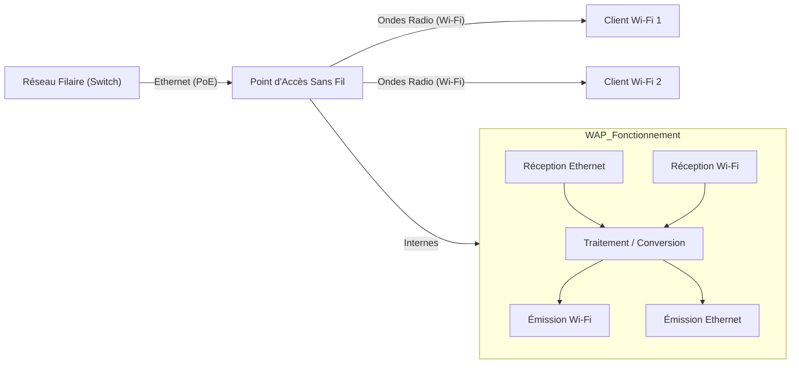

---
aliases:
  - Point d'Accès Sans Fil
  - Wireless Access Point
  - WAP
  - AP
archetype: materiel
couche_osi:
  - "Couche 1 - Physique"
  - "Couche 2 - Liaison"
cssclasses:
  - max
tags:
  - materiel
  - peripherique/reseau
  - materiel/reseau/point-acces-sans-fil
  - reseau/sans-fil
  - wifi
  - protocole/ieee-802.11
  - norme/ieee-802.3
  - wifi/wi-fi-4
  - wifi/wi-fi-5
  - wifi/wi-fi-6
  - wifi/wi-fi-7
  - wpa2
  - wpa3
  - rj45
  - reseau/poe
  - reseau/vlan
  - authentification
  - chiffrement
  - modele-osi/couche-1
  - modele-osi/couche-2
  - securite/rogue-ap
  - hardware/firmware
  - wifi/mimo
  - wifi/mu-mimo
  - wifi/beamforming
  - wifi/ofdma
  - wifi/twt
  - gestion-configuration
  - securite/bonnes-pratiques
---

# Wireless Access Point

> [!info] Rôle Principal
> Un **Point d'Accès Sans Fil** (WAP) sert de pont entre un réseau filaire et des clients sans fil. Il permet aux appareils compatibles Wi-Fi (ordinateurs portables, smartphones, tablettes) de se connecter au réseau local et, par extension, à Internet, en convertissant les signaux radio en signaux Ethernet et inversement. Il gère l'accès, l'authentification et le chiffrement des communications sans fil.

## 🛠️ Spécifications Techniques
| Caractéristique | Valeur |
|---|---|
| **Type** | Point d'Accès Sans Fil (WAP) |
| **Débit Max** | Jusqu'à plusieurs Gbps (selon norme Wi-Fi) |
| **Connecteurs** | RJ45 Gigabit Ethernet (souvent PoE), Antenne(s) interne(s) ou externe(s) |
| **Couche OSI** | Couche 1 (Physique), Couche 2 (Liaison) |
| **Normes Wi-Fi** | IEEE 802.11a/b/g/n/ac/ax (Wi-Fi 6), 802.11be (Wi-Fi 7) |
| **Bandes de fréquence** | 2.4 GHz, 5 GHz, 6 GHz (Tri-bande avec Wi-Fi 6E/7) |
| **Fonctionnalités Clés** | MIMO/MU-MIMO, Beamforming, OFDMA, WPA3, VLAN tagging, PoE |

Les WAP modernes supportent diverses normes IEEE 802.11. Les plus courantes incluent :
*   **802.11n (Wi-Fi 4)** : Jusqu'à 600 Mbps, bandes 2.4 GHz et 5 GHz.
*   **802.11ac (Wi-Fi 5)** : Seulement bande 5 GHz, débits multi-Gigabit (jusqu'à 6.9 Gbps), introduction du MU-MIMO.
*   **802.11ax (Wi-Fi 6/6E)** : Bandes 2.4 GHz, 5 GHz et 6 GHz (pour 6E), amélioration significative de la capacité et de l'efficacité dans les environnements denses grâce à l'OFDMA et TWT.
*   **802.11be (Wi-Fi 7)** : Encore en développement, vise des débits extrêmes (Extremely High Throughput - EHT) avec des canaux plus larges et une modulation plus dense.

## ⚙️ Fonctionnement Interne
Le WAP agit comme un *convertisseur* et un *gestionnaire*. Il reçoit des paquets de données du réseau filaire via son port Ethernet, les encapsule dans des trames Wi-Fi, puis les diffuse sous forme d'ondes radio. Inversement, il capte les ondes radio émises par les clients sans fil, désencapsule les trames Wi-Fi et les transmet au réseau filaire sous forme de paquets Ethernet.

Il gère les aspects suivants :
*   **Association/Désassociation** : Permet aux clients de rejoindre ou de quitter le réseau sans fil.
*   **Authentification** : Vérifie l'identité des clients (ex: WPA2/WPA3-PSK, 802.1X).
*   **Chiffrement** : Sécurise les données transmises (ex: AES-256).
*   **Gestion des ressources** : Allocation du temps d'antenne, QoS (Quality of Service).

## 🛡️ Sécurité & Risques
> [!warning] Menaces Physiques
> *   **Accès physique non autorisé** : Un attaquant ayant un accès physique au WAP peut le réinitialiser, extraire des informations de configuration ou installer un micrologiciel malveillant.
> *   **Clonage/Remplacement** : Un appareil dérobé peut être remplacé par un *rogue AP* (point d'accès malveillant) pour intercepter le trafic.
> *   **Dégâts environnementaux** : La surchauffe, l'humidité ou les chocs peuvent endommager l'appareil et perturber le service.

> [!tip] Bonnes Pratiques
> 1.  **Sécurité Physique** : Installer le WAP dans un emplacement sécurisé (plafond haut, boîtier verrouillé, rack sécurisé) pour prévenir le vol ou la manipulation.
> 2.  **Mises à jour du micrologiciel** : Appliquer régulièrement les patchs de sécurité et les mises à jour du micrologiciel pour corriger les vulnérabilités.
> 3.  **Authentification Forte** : Utiliser WPA3-Enterprise avec 802.1X si possible, ou WPA3-Personal avec des mots de passe complexes.
> 4.  **Désactiver les fonctionnalités inutiles** : Désactiver le WPS (Wi-Fi Protected Setup) et les interfaces d'administration non utilisées.
> 5.  **Segmentation Réseau** : Isoler le trafic Wi-Fi des invités et des IoT via des VLANs séparés pour limiter les mouvements latéraux en cas de compromission.
> 6.  **Surveillance des *Rogue APs*** : Mettre en place des outils de détection pour identifier les points d'accès non autorisés qui pourraient tenter d'imiter votre réseau.
> 7.  **Gestion Centralisée** : Utiliser un contrôleur de WAP pour une gestion, une surveillance et une application des politiques de sécurité uniformes.