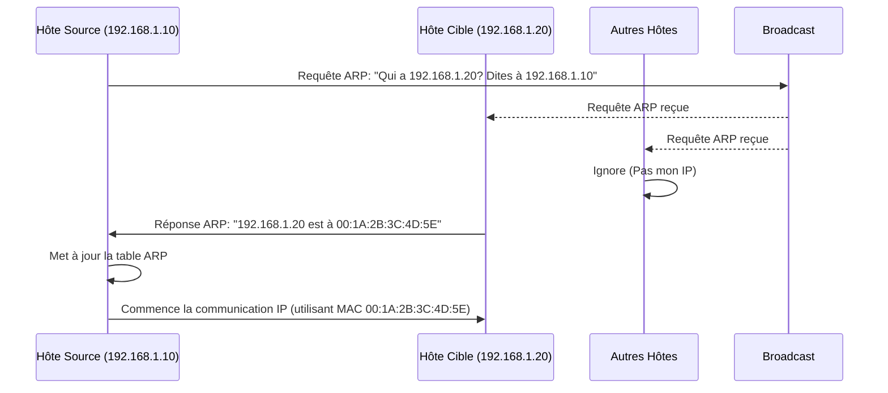

---
aliases:
  - "Protocole de Résolution d'Adresse"
  - "Address Resolution Protocol"
  - "ARP"
archetype: protocole
port_defaut: N/A
couche_osi:
  - "Couche 2 - Liaison"
rfc:
  - "RFC 826"
cssclasses:
  - max
tags:
  - protocole/arp
  - reseau
  - reseau/adressage/ip
  - reseau/adressage/mac
  - modele-osi/couche-2
  - ethernet
  - reseau/local
  - table-arp
  - requete-arp
  - reponse-arp
---

# Address Resolution Protocol (ARP)

> [!info] Carte d'Identité
> * **Couche OSI** : Couche 2 - Liaison
> * **Port par défaut** : `N/A`
> * **Transport** : ARP est un protocole de couche 2, il n'utilise pas TCP/UDP.

L'**Address Resolution Protocol (ARP)** est un protocole fondamental dans les réseaux IP qui assure la correspondance entre les adresses de couche réseau (adresses IP) et les adresses de couche liaison (adresses MAC) au sein d'un réseau local (LAN). Son rôle principal est de permettre à un appareil de trouver l'adresse MAC d'un autre appareil sur le même segment de réseau, étant donné son adresse IP.

## ⚙️ Fonctionnement (Requête et Réponse ARP)
Le fonctionnement d'ARP repose sur un mécanisme de requête et de réponse pour découvrir les adresses MAC. Lorsqu'un hôte souhaite communiquer avec une autre machine sur le même réseau local et ne connaît pas son adresse MAC, il envoie une **requête ARP**.

1.  **Requête ARP** :
    *   L'hôte émetteur (par exemple, un client) crée un paquet de requête ARP. Ce paquet contient son adresse IP source et son adresse MAC source, ainsi que l'adresse IP cible dont il souhaite connaître l'adresse MAC.
    *   La requête ARP est diffusée (broadcast) sur le réseau local, ce qui signifie qu'elle est envoyée à toutes les machines du segment. L'adresse MAC de destination du paquet Ethernet encapsulant la requête ARP est `FF:FF:FF:FF:FF:FF`, indiquant une diffusion.

2.  **Réponse ARP** :
    *   Chaque machine du segment reçoit la requête ARP. Elles examinent l'adresse IP cible contenue dans la requête.
    *   Seule la machine dont l'adresse IP correspond à l'adresse IP cible de la requête ARP répondra.
    *   La machine cible envoie une **réponse ARP** directement (unicast) à l'hôte émetteur original. Cette réponse contient son adresse IP et son adresse MAC.
    *   L'hôte demandeur reçoit la réponse et met à jour sa **table ARP** (également appelée cache ARP) avec l'association IP-MAC apprise. Les entrées dans le cache ARP ont une durée de vie limitée (TTL) pour garantir que les informations restent à jour.

Ce processus établit la relation entre l'adresse IP (logique, couche 3) et l'adresse MAC (physique, couche 2), permettant ainsi la transmission de données au niveau de la couche liaison.



## 📦 Structure du Paquet (Header)
Le paquet ARP est encapsulé dans une trame Ethernet. Sa structure contient les champs suivants:

| Champ              | Taille (bits) | Description                                                                                                                                                                                                                                                                                                                                                                                     |
| :----------------- | :------------ | :---------------------------------------------------------------------------------------------------------------------------------------------------------------------------------------------------------------------------------------------------------------------------------------------------------------------------------------------------------------------------------------------- |
| **Hardware Type**  | 16            | Spécifie le type de matériel de la couche liaison. Pour Ethernet, la valeur est `1`.                                                                                                                                                                                                                                                                                                |
| **Protocol Type**  | 16            | Indique le protocole de couche réseau pour lequel l'ARP est utilisé. Pour IPv4, la valeur est `0x0800`.                                                                                                                                                                                                                                                                              |
| **Hardware Length**| 8             | Longueur de l'adresse de la couche liaison en octets. Pour Ethernet (MAC), la valeur est `6`.                                                                                                                                                                                                                                                                                      |
| **Protocol Length**| 8             | Longueur de l'adresse de la couche réseau en octets. Pour IPv4, la valeur est `4`.                                                                                                                                                                                                                                                                                                   |
| **Opcode**         | 16            | Spécifie le type d'opération ARP. `1` pour une requête ARP (ARP Request), `2` pour une réponse ARP (ARP Reply). D'autres valeurs existent pour RARP.                                                                                                                                                                                                                                |
| **Sender Hardware Address (SHA)** | 48            | Adresse MAC de l'expéditeur de la requête ou de la réponse ARP.                                                                                                                                                                                                                                                                                                            |
| **Sender Protocol Address (SPA)** | 32            | Adresse IP de l'expéditeur de la requête ou de la réponse ARP.                                                                                                                                                                                                                                                                                                             |
| **Target Hardware Address (THA)** | 48            | Adresse MAC du destinataire. Dans une requête ARP, ce champ est généralement rempli de zéros (`00:00:00:00:00:00`) car l'adresse est inconnue. Dans une réponse ARP, c'est l'adresse MAC du demandeur. |
| **Target Protocol Address (TPA)** | 32            | Adresse IP du destinataire de la requête ou de la réponse ARP.                                                                                                                                                                                                                                                                                                             |

## 🦈 Analyse Wireshark
L'analyse des paquets ARP avec Wireshark est essentielle pour diagnostiquer les problèmes de connectivité réseau ou détecter les activités malveillantes comme l'ARP spoofing.

> [!tip] Filtres Utiles
> ```
> # Filtrer par protocole ARP
> arp
>
> # Filtrer les requêtes ARP
> arp.opcode == 1
>
> # Filtrer les réponses ARP
> arp.opcode == 2
>
> # Filtrer les paquets ARP impliquant une IP spécifique
> arp.src.proto_ipv4 == 192.168.1.1 || arp.dst.proto_ipv4 == 192.168.1.1
>
> # Filtrer les paquets ARP impliquant une MAC spécifique
> arp.src.hw_mac == 00:11:22:33:44:55 || arp.dst.hw_mac == 00:11:22:33:44:55
> ```

## 🛡️ Sécurité
ARP est un protocole de base conçu pour fonctionner dans un environnement de confiance. Il ne dispose pas de mécanismes d'authentification ou de chiffrement intégrés, ce qui le rend vulnérable à plusieurs types d'attaques.

> [!danger] Vulnérabilités Connues
> *   **ARP Spoofing (Empoisonnement de cache ARP)** : C'est la vulnérabilité la plus connue. Un attaquant envoie de fausses réponses ARP à des hôtes du réseau, associant sa propre adresse MAC à l'adresse IP d'une autre machine (par exemple, la passerelle par défaut). Cela peut rediriger le trafic réseau via la machine de l'attaquant, permettant l'interception (Man-in-the-Middle) ou le déni de service.
>     *   **Sniffing** : Est-ce chiffré ? Non. Les communications ARP ne sont pas chiffrées, ce qui signifie qu'un attaquant peut facilement capturer et analyser les requêtes et réponses ARP pour cartographier le réseau ou identifier des cibles potentielles.
>     *   **Spoofing** : Authentification faible ? Oui, il n'y a aucune authentification des paquets ARP. N'importe quel hôte sur le segment local peut envoyer une réponse ARP pour n'importe quelle adresse IP, et les autres hôtes mettront à jour leur cache ARP en conséquence.
> *   **ARP Flooding / Déni de Service (DoS)** : Un attaquant peut inonder le réseau de requêtes ou de réponses ARP, ce qui peut saturer les tables ARP des routeurs ou des commutateurs, provoquant un déni de service pour les hôtes légitimes.
> *   **ARP Cache Poisoning (DNS Spoofing via ARP)** : En combinant l'ARP spoofing avec d'autres techniques, un attaquant peut rediriger les requêtes DNS pour diriger les utilisateurs vers des sites malveillants.

Pour atténuer ces risques, des mesures telles que l'**ARP statique** (définir manuellement les entrées ARP pour les périphériques critiques), le **Dynamic ARP Inspection (DAI)** sur les commutateurs réseau (qui valide les paquets ARP par rapport au serveur DHCP snooping) et l'utilisation de **segments réseau isolés (VLANs)** peuvent être mises en œuvre.