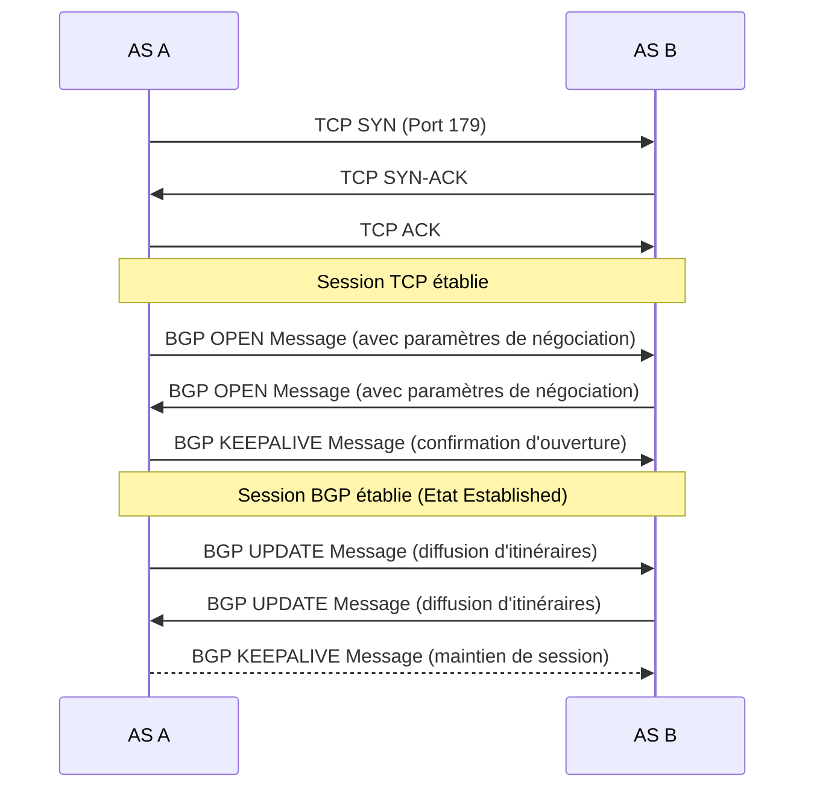

---
aliases:
  - "Border Gateway Protocol"
  - "BGP"
archetype: protocole
port_defaut: 179
couche_osi:
  - "Couche 7 - Application"
rfc:
  - "RFC 4271"
  - "RFC 1771"
cssclasses:
  - max
tags:
  - protocole/bgp
  - routage-reseau
  - protocole/tcp
  - port/179
  - modele-osi/couche-7
  - reseau/systeme-autonome
  - internet
---

# BGP Protocol

> [!info] Carte d'Identité
> * **Couche OSI** : Couche 7 - Application
> * **Port par défaut** : `TCP/179`
> * **Transport** : TCP

## ⚙️ Fonctionnement (Handshake)

Le **Border Gateway Protocol (BGP)** est un protocole de routage externe (EGP) utilisé pour échanger des informations de routage entre différents systèmes autonomes (AS) sur Internet. Il s'appuie sur TCP pour l'établissement de sessions fiables.

L'établissement d'une session BGP, souvent appelée "peering", suit les étapes suivantes :



1.  **Établissement de la session TCP** : Les routeurs BGP (appelés pairs ou voisins) établissent d'abord une session TCP sur le port 179. C'est la phase de *handshake TCP* standard (SYN, SYN-ACK, ACK).
2.  **Négociation des capacités (OPEN)** : Une fois la session TCP établie, les pairs échangent des messages `OPEN`. Ces messages contiennent des informations cruciales telles que le numéro de système autonome (AS), l'ID du routeur BGP, la version du protocole BGP et les capacités optionnelles supportées (par exemple, la capacité de gérer différentes familles d'adresses IPv4/IPv6). Si les négociations réussissent, les pairs passent à l'état `OPENCONFIRM`.
3.  **Maintien de la session (KEEPALIVE)** : Après l'échange réussi des messages `OPEN`, les pairs échangent des messages `KEEPALIVE` pour confirmer l'établissement de la session BGP et la maintenir active. La session BGP est alors dans l'état `ESTABLISHED`, prête à échanger des informations de routage.

## 📦 Structure du Paquet (Header)

Tous les messages BGP partagent un en-tête commun de 19 octets.

| Champ | Taille | Description |
|---|---|---|
| **Marker** | 16 octets | Utilisé pour l'authentification et doit être tout à '1' si non utilisé. |
| **Length** | 2 octets | Longueur totale du message BGP en octets, y compris l'en-tête. |
| **Type** | 1 octet | Indique le type du message BGP (OPEN, UPDATE, NOTIFICATION, KEEPALIVE). |

### Messages BGP clés

BGP utilise quatre types de messages principaux pour gérer les informations de routage:

1.  **OPEN** : Utilisé pour établir et négocier une session BGP entre deux pairs.
2.  **UPDATE** : Le message le plus important, utilisé pour échanger des informations de routage. Il contient des annonces de nouvelles routes, des retraits de routes, et des attributs de chemin.
3.  **NOTIFICATION** : Envoyé lorsqu'une erreur est détectée, entraînant la fermeture de la session BGP.
4.  **KEEPALIVE** : Envoyé périodiquement entre les pairs pour confirmer que la connexion est toujours active et éviter l'expiration du *hold timer*.

### Structure du message UPDATE

Le message `UPDATE` est crucial et se compose de trois parties principales:

1.  **Withdrawn Routes** : Liste des préfixes de routes qui ne sont plus atteignables.
2.  **Path Attributes** : Ensemble d'attributs décrivant le chemin vers les préfixes annoncés.
3.  **Network Layer Reachability Information (NLRI)** : Liste des préfixes IP qui sont désormais atteignables via le chemin décrit par les attributs.

## Attributs BGP

Les attributs de chemin sont des informations supplémentaires incluses dans les messages `UPDATE` qui aident BGP à déterminer le meilleur chemin vers une destination. Ils sont classifiés en quatre catégories :

1.  **Well-known Mandatory** : Doivent être reconnus par toutes les implémentations BGP et sont inclus dans chaque message `UPDATE`.
    *   ***ORIGIN*** : Indique l'origine de l'information de routage (IGP, EGP, Incomplete).
    *   ***AS_PATH*** : Liste des AS que l'itinéraire a traversés. Utilisé pour prévenir les boucles de routage et pour la sélection du meilleur chemin.
    *   ***NEXT_HOP*** : L'adresse IP du routeur suivant sur le chemin vers la destination.

2.  **Well-known Discretionary** : Doivent être reconnus par toutes les implémentations BGP, mais ne sont pas obligatoirement présents dans chaque message `UPDATE`.
    *   ***LOCAL_PREF*** : Préféré localement, indique la préférence du chemin pour sortir de l'AS. Valeur la plus élevée est préférée.
    *   ***ATOMIC_AGGREGATE*** : Indique qu'un agrégat a été effectué, et que les informations d'attribut de chemin pour les routes agrégées ne sont pas complètes.

3.  **Optional Transitive** : Peuvent être compris par les routeurs BGP et propagés à d'autres AS, même si le routeur ne les comprend pas.
    *   ***MULTI_EXIT_DISC (MED)*** : Utilisé pour influencer la décision d'un AS voisin sur le point d'entrée préféré. Valeur la plus basse est préférée.
    *   ***COMMUNITIES*** : Un attribut optionnel et transitif qui permet de tagger les routes et d'appliquer des politiques.

4.  **Optional Non-Transitive** : Peuvent être compris mais ne sont pas propagés aux autres AS s'ils ne sont pas reconnus.
    *   ***ORIGINATOR_ID*** : ID du routeur qui a injecté la route dans le BGP.
    *   ***CLUSTER_LIST*** : Utilisé dans les routeurs BGP pour prévenir les boucles dans les environnements de *route reflector*.

## 🦈 Analyse Wireshark

> [!tip] Filtres Utiles
> ```
> # Filtrer par protocole BGP
> bgp
>
> # Filtrer les messages OPEN
> bgp.type == 1
>
> # Filtrer les messages UPDATE
> bgp.type == 2
>
> # Filtrer les messages KEEPALIVE
> bgp.type == 4
>
> # Filtrer les messages NOTIFICATION
> bgp.type == 3
>
> # Filtrer les routes retirées dans un UPDATE
> bgp.withdrawn_routes
>
> # Filtrer par AS_PATH (exemple pour AS 65001)
> bgp.as_path contains "65001"
> ```

## 🛡️ Sécurité

> [!danger] Vulnérabilités Connues
> *   **Hijacking de route / Faux annonces** : Des acteurs malveillants peuvent annoncer des blocs d'adresses IP qu'ils ne possèdent pas, détournant ainsi le trafic. C'est une vulnérabilité majeure du BGP.
> *   **Attaques par déni de service (DoS)** : La saturation des sessions BGP ou l'envoi de messages `NOTIFICATION` malveillants peut perturber les sessions de routage.
> *   **Faiblesse de l'authentification** : Historiquement, BGP ne chiffrait pas ou n'authentifiait pas les messages par défaut, rendant les sessions vulnérables au *spoofing* ou à l'interception. L'utilisation de TCP MD5 ou BGPsec (bien que peu déployé) est recommandée pour l'authentification.
> *   **Configuration incorrecte** : Des erreurs de configuration peuvent conduire à des fuites de routes (route leaks), où des routes internes sont annoncées publiquement, ou à l'interruption du routage.
> *   **Sniffing** : Est-ce chiffré ? Non, le protocole BGP lui-même n'inclut pas de chiffrement par défaut. Le chiffrement du trafic BGP nécessiterait des mesures supplémentaires comme IPSec au niveau de la couche réseau.
> *   **Spoofing** : Authentification faible ? Oui, sans mesures additionnelles comme TCP MD5 ou BGPsec, l'authentification est limitée. Les adresses sources/destinations TCP peuvent être *spoofées*, bien que BGP s'appuie sur la connectivité TCP directe entre pairs.

Des efforts comme **RPKI (Resource Public Key Infrastructure)** et **BGPsec** visent à renforcer la sécurité de BGP en permettant aux AS d'authentifier les origines des routes et les chemins AS_PATH, réduisant ainsi les risques de *hijacking* et d'annonces malveillantes.