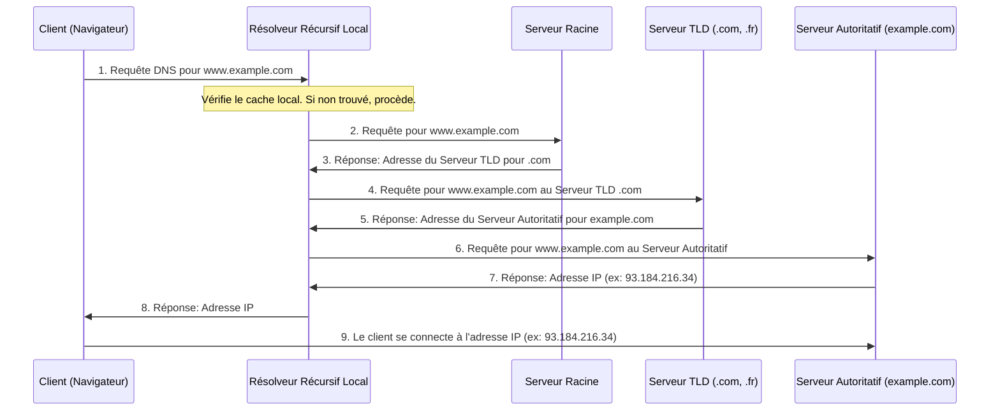

---
aliases:
  - DNS
  - Domain Name System
  - Système de Noms de Domaine
archetype: protocole
port_defaut: UDP/TCP 53
couche_osi:
  - "Couche 7 - Application"
rfc:
  - RFC 1034
  - RFC 1035
  - RFC 4033
  - RFC 4034
  - RFC 4035
cssclasses:
  - max
tags:
  - protocole/dns
  - dns
  - modele-osi/couche-7
  - protocole/tcp
  - protocole/udp
  - reseau/adressage/ip
  - dns/tld
  - architecture/reseau
  - serveur
---

# Domain Name System (DNS)

> [!info] Carte d'Identité
> * **Couche OSI** : Couche 7 - Application
> * **Port par défaut** : `UDP/TCP 53`
> * **Transport** : *UDP* (pour les requêtes standard) / *TCP* (pour les transferts de zone et les réponses volumineuses)

Le **Domain Name System (DNS)** est le "bottin téléphonique" d'Internet, traduisant les noms de domaine lisibles par l'homme (ex: `www.example.com`) en adresses IP numériques (ex: `93.184.216.34`) que les ordinateurs utilisent pour s'identifier et communiquer.

## 🏗️ Architecture et Types de Serveurs DNS

Le DNS est un système distribué et hiérarchique, composé de plusieurs types de serveurs qui collaborent pour résoudre les requêtes.

### Types de Serveurs DNS

1.  **Résolveurs Récursifs (DNS Resolvers / Recursive Resolvers)** : Ce sont les intermédiaires entre les clients (navigateurs, applications) et les serveurs DNS autoritaires. Ils reçoivent les requêtes des clients et effectuent une série de requêtes vers d'autres serveurs DNS pour trouver l'adresse IP correspondante. Ils mettent en cache les réponses pour accélérer les requêtes futures.
2.  **Serveurs Racines (Root Nameservers)** : Au sommet de la hiérarchie DNS, il existe 13 serveurs racines logiques (mais des centaines d'instances physiques). Ils répondent aux requêtes du résolveur récursif en indiquant l'adresse du serveur de domaine de premier niveau (TLD) approprié.
3.  **Serveurs TLD (Top-Level Domain Nameservers)** : Ces serveurs gèrent les informations pour toutes les extensions de domaine de premier niveau (par exemple, `.com`, `.org`, `.net`, ou les ccTLD comme `.fr`, `.uk`). Ils reçoivent une requête du résolveur et renvoient l'adresse du serveur DNS autoritaire pour le domaine spécifique.
4.  **Serveurs Autoritaires (Authoritative Nameservers)** : Ces serveurs contiennent les enregistrements DNS finaux pour un domaine spécifique. Ils fournissent l'adresse IP réelle demandée au résolveur récursif.

## ⚙️ Fonctionnement (Processus de Résolution DNS)

Le processus de résolution DNS transforme un nom de domaine en une adresse IP.


### Étapes détaillées du processus de résolution:
1.  **Cache Local du Client**: Le client (ordinateur, smartphone) vérifie d'abord son propre cache DNS local. S'il trouve l'information, le processus s'arrête là.
2.  **Requête au Résolveur Récursif**: Si l'information n'est pas en cache, le client envoie une requête DNS à son résolveur DNS configuré (souvent fourni par l'FAI ou un service DNS public comme Google DNS).
3.  **Requête au Serveur Racine**: Le résolveur récursif interroge un serveur racine pour le nom de domaine complet.
4.  **Réponse du Serveur Racine**: Le serveur racine répond avec l'adresse du serveur TLD responsable de l'extension du domaine (par exemple, `.com`).
5.  **Requête au Serveur TLD**: Le résolveur récursif envoie ensuite une requête au serveur TLD identifié.
6.  **Réponse du Serveur TLD**: Le serveur TLD répond avec l'adresse du serveur DNS autoritaire pour le domaine spécifique (par exemple, `example.com`).
7.  **Requête au Serveur Autoritatif**: Le résolveur récursif interroge le serveur DNS autoritaire.
8.  **Réponse du Serveur Autoritatif**: Le serveur autoritaire fournit l'adresse IP correspondante au nom de domaine.
9.  **Cache et Réponse au Client**: Le résolveur récursif met en cache l'adresse IP reçue et la transmet au client.
10. **Connexion**: Le client utilise cette adresse IP pour établir une connexion avec le serveur web désiré.

## 📄 Types d'Enregistrements DNS

Les enregistrements DNS (Resource Records - RRs) sont stockés dans les fichiers de zone des serveurs DNS autoritaires et fournissent diverses informations sur un domaine.

| Type d'Enregistrement | ID Type (Décimal) | RFC Définissant | Description | Fonction |
|---|---|---|---|---|
| **A** | 1 | RFC 1035 | Enregistrement d'adresse | Mappe un nom d'hôte à une adresse IPv4 (32 bits). |
| **AAAA** | 28 | RFC 3596 | Enregistrement d'adresse IPv6 | Mappe un nom d'hôte à une adresse IPv6 (128 bits). |
| **CNAME** | 5 | RFC 1035 | Enregistrement de nom canonique | Crée un alias d'un nom à un autre. La recherche DNS continue avec le nouveau nom. |
| **MX** | 15 | RFC 1035 | Enregistrement d'échange de courrier | Spécifie les serveurs de messagerie responsables de la réception d'e-mails pour un domaine. |
| **NS** | 2 | RFC 1035 | Enregistrement de serveur de noms | Indique les serveurs DNS autoritaires pour un domaine. |
| **SOA** | 6 | RFC 1035 | Start of Authority | Contient des informations administratives sur la zone (serveur primaire, e-mail de l'administrateur, numéro de série, timers). |
| **PTR** | 12 | RFC 1035 | Enregistrement de pointeur | Effectue la résolution inverse (mappe une adresse IP à un nom d'hôte). |
| **TXT** | 16 | RFC 1035 | Enregistrement de texte | Permet de stocker des chaînes de texte arbitraires (souvent utilisé pour les enregistrements SPF, DKIM, DMARC, ou la vérification de domaine). |
| **SRV** | 33 | RFC 2782 | Enregistrement de service | Spécifie l'emplacement (nom d'hôte et port) de services spécifiques. |
| **CAA** | 257 | RFC 6844 | Certification Authority Authorization | Permet aux propriétaires de domaine de spécifier quelles autorités de certification (CA) sont autorisées à émettre des certificats pour leur domaine. |
| **DNSKEY** | 48 | RFC 4034 | DNSSEC Key Record | Contient la clé publique utilisée pour vérifier les signatures DNSSEC. |
| **RRSIG** | 46 | RFC 4034 | Resource Record Signature | Stocke les signatures numériques utilisées pour authentifier les enregistrements dans DNSSEC. |
| **DS** | 43 | RFC 4034 | Delegation Signer | Utilisé dans DNSSEC pour établir une chaîne de confiance entre une zone parente et une zone enfant. |
| **NSEC/NSEC3** | 47 / 50 | RFC 4034 / RFC 5155 | Next Secure / Next Secure v3 | Fait partie de DNSSEC ; utilisé pour prouver la non-existence d'un nom ou d'un type d'enregistrement. |

## 📦 Structure du Paquet (Header)

Un message DNS (requête ou réponse) a une structure standard, commençant par un en-tête de 12 octets.

| Champ | Taille | Description |
|---|---|---|
| **ID (Identification)** | 16 bits | Un identifiant unique généré par le client pour faire correspondre les requêtes aux réponses. |
| **QR (Query/Response)** | 1 bit | Indique si le message est une requête (0) ou une réponse (1). |
| **Opcode** | 4 bits | Type d'opération (0 pour requête standard, 1 pour requête inverse, etc.). |
| **AA (Authoritative Answer)** | 1 bit | Dans une réponse, indique si le serveur est autoritaire pour le domaine. |
| **TC (Truncation)** | 1 bit | Indique que le message a été tronqué (généralement car il dépassait la taille limite UDP de 512 octets). |
| **RD (Recursion Desired)** | 1 bit | Indique au serveur si le client souhaite une résolution récursive. |
| **RA (Recursion Available)** | 1 bit | Dans une réponse, indique si le serveur peut effectuer la résolution récursive. |
| **Z (Reserved)** | 3 bits | Réservé, doit être à zéro. |
| **RCODE (Response Code)** | 4 bits | Code de réponse (0 pour pas d'erreur, 1 pour erreur de format, 2 pour erreur de serveur, 3 pour nom non existant (NXDOMAIN), etc.). |
| **QDCOUNT (Question Count)** | 16 bits | Nombre d'entrées dans la section Question. |
| **ANCOUNT (Answer Count)** | 16 bits | Nombre d'enregistrements de ressources dans la section Réponse. |
| **NSCOUNT (Authority Record Count)** | 16 bits | Nombre d'enregistrements de ressources dans la section Autorité. |
| **ARCOUNT (Additional Record Count)** | 16 bits | Nombre d'enregistrements de ressources dans la section Additionnel. |

## 🦈 Analyse Wireshark

> [!tip] Filtres Utiles
> ```
> # Filtrer par protocole DNS
> dns
>
> # Filtrer les requêtes DNS
> dns.flags.response == 0
>
> # Filtrer les réponses DNS
> dns.flags.response == 1
>
> # Filtrer les requêtes pour un nom de domaine spécifique
> dns.qry.name == "www.example.com"
>
> # Filtrer les réponses avec un code d'erreur (par ex. NXDOMAIN)
> dns.flags.rcode == 3
>
> # Filtrer les requêtes/réponses utilisant TCP
> dns and tcp.port == 53
>
> # Filtrer les requêtes/réponses utilisant UDP
> dns and udp.port == 53
> ```

## 🛡️ Sécurité

Le DNS, conçu pour la scalabilité plutôt que la sécurité, est vulnérable à diverses attaques.

> [!danger] Vulnérabilités Connues
> *   **Sniffing** : Les requêtes DNS standard ne sont pas chiffrées, ce qui permet à un attaquant d'intercepter les requêtes et réponses pour voir quels sites sont visités ou manipuler les réponses s'il est sur le chemin.
> *   **Spoofing / Cache Poisoning (Empoisonnement du Cache DNS)** : Un attaquant injecte de fausses informations DNS (adresses IP falsifiées) dans le cache d'un résolveur DNS. Lorsqu'un utilisateur demande un nom de domaine, le résolveur empoisonné renvoie la fausse adresse IP, redirigeant l'utilisateur vers un site malveillant (phishing, distribution de malwares). Cela exploite des faiblesses comme l'utilisation d'UDP et le manque de randomisation de l'ID de transaction.
> *   **Attaques par déni de service distribué (DDoS)** : Les serveurs DNS peuvent être ciblés par des attaques DDoS pour les rendre inaccessibles, empêchant la résolution des noms de domaine. Le DNS peut également être utilisé comme vecteur d'amplification DDoS.
> *   **DNS Tunneling** : Une technique qui encapsule d'autres protocoles (comme SSH, HTTP) dans des requêtes et réponses DNS pour contourner les pare-feu ou exfiltrer des données.

### Mécanismes de Sécurité (DNSSEC)

**DNSSEC (Domain Name System Security Extensions)** est une suite de spécifications de l'IETF visant à sécuriser les données échangées via le DNS.

*   **Principe**: DNSSEC ajoute des signatures cryptographiques aux enregistrements DNS existants. Ces signatures sont stockées sur les serveurs de noms DNS aux côtés des enregistrements habituels.
*   **Fonctionnement**: Lors d'une requête, un résolveur DNS compatible DNSSEC vérifie la signature numérique associée à la réponse. Cela confirme que les données proviennent du serveur autoritaire légitime et n'ont pas été altérées en transit.
*   **Chaîne de Confiance**: DNSSEC établit une "chaîne de confiance" cryptographique, du serveur racine jusqu'aux serveurs autoritaires de domaine, en utilisant des paires de clés publiques/privées (Zone-Signing Key - ZSK, Key-Signing Key - KSK) et des enregistrements DS (Delegation Signer).
*   **Protection**: DNSSEC protège contre l'empoisonnement du cache et les attaques de type "man-in-the-middle" en assurant l'authenticité et l'intégrité des données DNS, ainsi qu'une preuve d'inexistence authentifiée (NSEC/NSEC3). Il ne garantit pas la confidentialité (cryptage) ni la disponibilité.
*   **Inconvénients**: L'implémentation de DNSSEC peut être complexe et augmenter la taille des réponses DNS. Tous les résolveurs ne supportent pas encore DNSSEC.