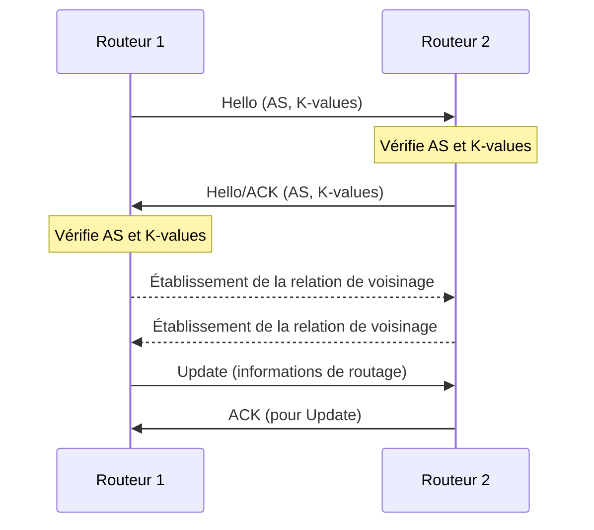

---
aliases:
  - EIGRP
  - Enhanced Interior Gateway Routing Protocol
  - Protocole EIGRP
  - EIGRP Protocol
archetype: protocole
port_defaut: IP Protocol 88
couche_osi:
  - "Couche 3 - Réseau"
rfc:
  - RFC 7868
cssclasses:
  - max
tags:
  - protocole
  - protocole/eigrp
  - routage
  - routage/dynamique
  - modele-osi/couche-3
  - reseau
  - fournisseur/cisco
  - protocole/eigrp/rtp
  - protocole/eigrp/dual
  - protocole/eigrp/paquet
  - protocole/eigrp/voisinage
  - reseau/systeme-autonome
---

# EIGRP (Enhanced Interior Gateway Routing Protocol)

> [!info] Carte d'Identité
> * **Couche OSI** : Couche 3 - Réseau
> * **Port par défaut** : `IP Protocol 88`
> * **Transport** : *Protocole de Transport Fiable (RTP) interne à EIGRP*

Le *Enhanced Interior Gateway Routing Protocol* (EIGRP) est un protocole de routage avancé, initialement propriétaire à Cisco, qui combine les caractéristiques des protocoles à vecteur de distance et à état de liens. Il est conçu pour une convergence rapide et une efficacité de bande passante, le rendant adapté aux réseaux de moyenne à grande taille. Depuis 2013, Cisco a permis à d'autres fournisseurs d'implémenter une version limitée d'EIGRP.

## ⚙️ Fonctionnement (Handshake)

EIGRP n'utilise pas un "handshake" de connexion traditionnel comme TCP, mais établit des relations de voisinage via un processus de découverte.

1.  **Découverte des Voisins** : Les routeurs EIGRP envoient des paquets *Hello* à l'adresse de multidiffusion `224.0.0.10` sur leurs interfaces actives.
2.  **Formation de l'Adjacence** : Lorsqu'un routeur reçoit un paquet Hello, il vérifie que son numéro de Système Autonome (AS) et ses *K-values* (poids des métriques) correspondent à ceux du routeur émetteur. Si les paramètres correspondent, il ajoute l'émetteur à sa table de voisins et répond avec un paquet Hello (qui peut aussi servir d'acquittement).
3.  **Échange d'Informations de Routage** : Une fois l'adjacence formée, les routeurs échangent leurs informations de topologie via des paquets *Update*.

EIGRP utilise le *Diffusing Update Algorithm* (DUAL) pour garantir des chemins sans boucles et une convergence rapide du réseau. Pour la livraison fiable de certains paquets (Update, Query, Reply), EIGRP implémente son propre *Reliable Transport Protocol* (RTP), tandis que les paquets Hello et Acknowledgment peuvent être envoyés de manière non fiable.



## 📦 Structure du Paquet (Header)

Les paquets EIGRP sont encapsulés directement dans des paquets IP avec le numéro de protocole `88`. Chaque paquet EIGRP commence par un en-tête commun de 20 octets, suivi de champs *Type-Length-Value* (TLV) de taille variable contenant les données spécifiques.

| Champ               | Taille    | Description                                                                                                                                                                                                                                                                                                                            |
| :------------------ | :-------- | :------------------------------------------------------------------------------------------------------------------------------------------------------------------------------------------------------------------------------------------------------------------------------------------------------------------------------------- |
| **Version**         | 4 bits    | Version du protocole EIGRP.                                                                                                                                                                                                                                                                                                 |
| **Opcode**          | 4 bits    | Indique le type de paquet EIGRP : `1` pour Update, `3` pour Query, `4` pour Reply, `5` pour Hello/ACK, `10` pour SIA-Query, `11` pour SIA-Reply.                                                                                                                                                                      |
| **Checksum**        | 24 bits   | Somme de contrôle calculée sur l'ensemble du paquet EIGRP pour vérifier l'intégrité.                                                                                                                                                                                                                                    |
| **Flags**           | 32 bits   | Champ d'indicateurs ; par exemple, le bit `Init` (0x1) est utilisé lors de l'établissement initial de l'adjacence.                                                                                                                                                                                                       |
| **Sequence Number** | 32 bits   | Utilisé par le *Reliable Transport Protocol* (RTP) pour les paquets fiables afin d'assurer l'ordre de livraison et la détection des doublons. Les paquets Hello et ACK ont un numéro de séquence nul.                                                                                                                |
| **Ack Number**      | 32 bits   | Numéro de séquence du dernier paquet fiable reçu du voisin.                                                                                                                                                                                                                                                         |
| **AS Number**       | 32 bits   | Numéro du Système Autonome (AS) auquel appartient le routeur EIGRP. Doit correspondre entre voisins pour établir l'adjacence.                                                                                                                                                                                           |
| **TLVs**            | Variable  | Les *Type-Length-Value* (TLV) transportent les données spécifiques au paquet, telles que les informations de routage (routes internes/externes), les paramètres DUAL, la version logicielle, etc.                                                                                                                        |

## 🦈 Analyse Wireshark

> [!tip] Filtres Utiles
> ```
> # Filtrer par protocole EIGRP (filtre d'affichage)
> eigrp
>
> # Filtrer par numéro de protocole IP (filtre de capture ou d'affichage)
> ip.proto == 88
>
> # Filtrer les paquets Hello
> (eigrp.opcode == 5) && (eigrp.ack == 0)
>
> # Filtrer les paquets Acknowledgment
> (eigrp.opcode == 5) && (eigrp.ack != 0)
>
> # Filtrer les paquets Update
> eigrp.opcode == 1
>
> # Filtrer les paquets Query
> eigrp.opcode == 3
>
> # Filtrer les paquets Reply
> eigrp.opcode == 4
> ```

## 🛡️ Sécurité

EIGRP, comme d'autres protocoles de routage, présente des vulnérabilités qui, si elles sont exploitées, peuvent entraîner des interruptions de service ou des compromissions de routage.

> [!danger] Vulnérabilités Connues
> *   **Attaques par déni de service (DoS)** : Les routeurs peuvent être surchargés par l'injection de fausses annonces de voisins EIGRP, provoquant des tempêtes ARP ou une consommation excessive des ressources CPU.
> *   **Injection de routes/Attaques de trou noir (Blackhole)** : L'injection de routes falsifiées peut rediriger le trafic vers des destinations inexistantes, créant des "trous noirs" qui absorbent les paquets.
> *   **Usurpation d'identité (Spoofing) et inondation de paquets Hello** : La création de faux voisins EIGRP ou l'inondation de paquets Hello peut déstabiliser les relations de voisinage et la table de routage.
> *   **Manipulation des K-values** : L'altération des K-values peut perturber en permanence le domaine EIGRP.

> [!warning] Mesures de Sécurité
> *   **Authentification** : Utiliser l'authentification EIGRP (MD5 ou SHA-256) pour vérifier l'identité des voisins et prévenir les injections de routes non autorisées.
> *   **Listes de Contrôle d'Accès (ACL)** : Implémenter des ACLs pour filtrer le trafic EIGRP et restreindre l'accès aux interfaces.
> *   **Segmentation Réseau** : Segmenter le réseau pour limiter la portée des déploiements EIGRP et réduire l'impact d'une éventuelle brèche de sécurité.
> *   **Mises à jour Régulières** : Maintenir le firmware et le logiciel des équipements réseau à jour pour corriger les vulnérabilités connues.
> *   **Intégration IPsec** : Envisager l'intégration d'IPsec pour chiffrer le trafic de routage EIGRP et garantir la confidentialité et l'intégrité des messages.
> *   **Routage EIGRP Stub** : Utiliser la fonction *EIGRP Stub* sur les routeurs en périphérie pour limiter la propagation des requêtes et les ressources de calcul.