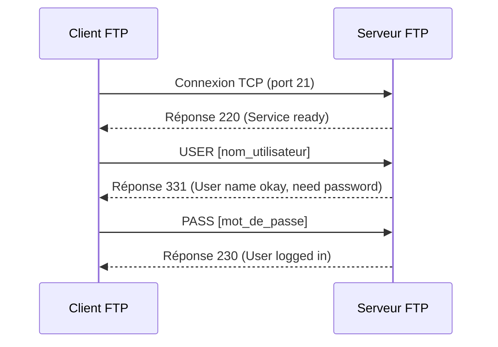

---
aliases:
  - FTP
  - File Transfer Protocol
  - Protocole de Transfert de Fichiers
archetype: protocole
port_defaut: 21 (contrôle), 20 (données en mode actif)
couche_osi:
  - "Couche 7 - Application"
rfc:
  - RFC 959
cssclasses:
  - max
tags:
  - protocole
  - protocole/ftp
  - modele-osi/couche-7
  - protocole/tcp
  - fichiers/transfert
  - securite/vulnerabilite
  - chiffrement
  - sniffing-reseau
  - attaque/port-bouncing
  - analyse/trafic-reseau
  - connexion/controle
  - connexion/donnees
  - mode/actif
  - mode/passif
---

# File Transfer Protocol

> [!info] Carte d'Identité
> * **Couche OSI** : Couche 7 - Application
> * **Port par défaut** : `TCP/21` (contrôle), `TCP/20` (données en mode actif)
> * **Transport** : TCP

## ⚙️ Fonctionnement (Handshake)
Le **File Transfer Protocol (FTP)** est un protocole standard utilisé pour le transfert de fichiers entre un client et un serveur sur un réseau informatique. Il se distingue par l'utilisation de deux connexions TCP distinctes : une connexion de contrôle et une connexion de données.

1.  **Connexion de Contrôle (Port 21 TCP)** :
    *   Établie au début de la session FTP et reste ouverte pendant toute sa durée.
    *   Utilisée pour échanger les commandes du client vers le serveur (par exemple, `USER`, `PASS`, `LIST`, `RETR`, `STOR`) et les réponses du serveur (codes numériques avec messages textuels).
    *   Le client initie cette connexion vers le port 21 du serveur.



2.  **Connexion de Données (Port 20 TCP ou port éphémère)** :
    *   Établie uniquement lorsque des données sont transférées (par exemple, listing de répertoire, téléchargement ou envoi de fichier).
    *   Peut fonctionner selon deux modes : **actif** ou **passif**.

### Modes de Fonctionnement

#### Mode Actif
En mode actif, le client envoie son adresse IP et un numéro de port aléatoire (N) au serveur via la connexion de contrôle. Le serveur initie ensuite une connexion de données depuis son port 20 (le port de données FTP par défaut) vers le port N du client.

> [!warning] Problème du Mode Actif
> Le mode actif pose souvent des problèmes avec les pare-feu côté client, car le serveur tente d'établir une connexion entrante vers le client, ce qui est généralement bloqué par mesure de sécurité.

```mermaid
sequenceDiagram
    participant C as Client
    participant S as Serveur
    C->>S: Commande PORT IP_Client, Port_Client_N (via conn. contrôle)
    S-->>C: Réponse 200 (Commande OK)
    S->>C: Connexion TCP (depuis Port 20 du serveur vers Port_Client_N)
    S<->C: Transfert de données
```

#### Mode Passif
En mode passif, le client envoie une commande `PASV` au serveur via la connexion de contrôle. Le serveur répond avec son adresse IP et un numéro de port aléatoire (M) sur lequel il écoute les connexions de données entrantes. Le client initie ensuite la connexion de données depuis un port éphémère (P) vers le port M du serveur.

> [!info] Avantage du Mode Passif
> Le mode passif est plus adapté aux environnements où les clients se trouvent derrière des pare-feu ou des NAT, car le client initie toujours la connexion, simplifiant la gestion des flux.

```mermaid
sequenceDiagram
    participant C as Client
    participant S as Serveur
    C->>S: Commande PASV (via conn. contrôle)
    S-->>C: Réponse 227 (Entering Passive Mode IP_Serveur, Port_Serveur_M)
    C->>S: Connexion TCP (depuis Port_Client_P vers Port_Serveur_M)
    C<->S: Transfert de données
```

## 📦 Structure du Paquet (Commandes et Réponses)
FTP est un protocole de couche application qui utilise des commandes textuelles et des réponses numériques. Il n'a pas de "header de paquet" fixe comme TCP ou IP. Les informations sont encapsulées dans la charge utile TCP.

| Type | Format | Description |
|---|---|---|
| **Commande Client** | `[COMMANDE] [arguments]\r\n` | Ex: `USER anonymous`, `PASS email@example.com`, `LIST`, `RETR filename.txt` |
| **Réponse Serveur** | `[Code Numérique] [Message Textuel]\r\n` | Ex: `200 Command okay`, `227 Entering Passive Mode`, `530 Not logged in` |

## 🦈 Analyse Wireshark
> [!tip] Filtres Utiles
> ```
> # Filtrer par protocole
> ftp
>
> # Filtrer par messages de contrôle FTP
> ftp.request.command or ftp.response.code
>
> # Filtrer le trafic de données FTP (peut nécessiter de connaître les ports dynamiques)
> tcp.port eq 20 or tcp.port eq [port_données_passif]
> ```

## 🛡️ Sécurité
> [!danger] Vulnérabilités Connues
> *   **Transfert en clair** : FTP transmet les identifiants de connexion (noms d'utilisateur et mots de passe) et les données de fichiers en *texte clair*. Cela rend le protocole très vulnérable aux attaques par sniffing ou écoute clandestine, où un attaquant peut intercepter facilement les informations sensibles. Est-ce chiffré ? Non.
> *   **Absence de chiffrement** : Le FTP natif n'inclut aucun mécanisme de chiffrement pour les données transférées, ce qui expose les informations confidentielles à l'interception et à la lecture par des tiers non autorisés.
> *   **Attaques par *Port Bouncing*** : Une ancienne vulnérabilité où un attaquant pouvait utiliser la commande `PORT` pour faire rebondir des connexions de données via le serveur FTP, permettant potentiellement d'analyser des ports ou de contourner des pare-feu internes.
> *   **Authentification faible** : L'authentification repose uniquement sur des noms d'utilisateur et des mots de passe qui sont envoyés en clair, la rendant susceptible aux attaques par force brute ou par dictionnaire.

## 🔗 Notes Connexes
*   **Version Sécurisée** : FTPS, SFTP
*   **Attaque liée** : Sniffing, ManInTheMiddleAttack