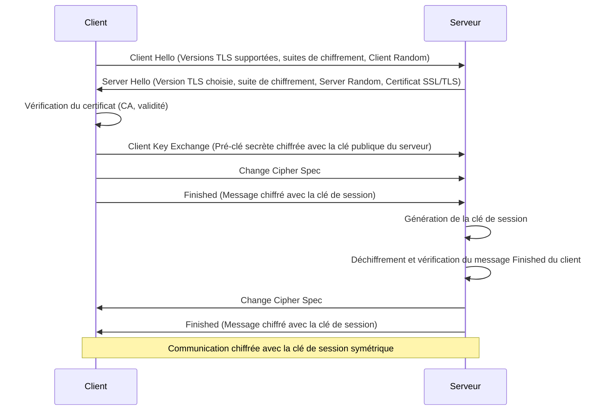

---
aliases:
  - HTTPS
  - HTTP Secure
  - Hypertext Transfer Protocol Secure
  - HTTP Sécurisé
  - TLS
  - SSL
archetype: protocole
port_defaut: 443
couche_osi:
  - "Couche 6 - Présentation"
  - "Couche 7 - Application"
rfc:
  - RFC 2818
  - RFC 5246
  - RFC 9110
tags:
  - protocole/https
  - protocole/http
  - protocole/ssl-tls
  - chiffrement
  - confidentialite
  - integrite
  - authentification
  - certificat/ssl-tls
  - port/443
  - protocole/tcp
  - modele-osi/couche-6
  - modele-osi/couche-7
  - communication/handshake
  - mitm
  - phishing
  - chiffrement/cle-session
  - chiffrement/cle-publique
  - certificat/autorite-certification
  - architecture
---

# HTTPS (Hypertext Transfer Protocol Secure)

> [!info] Carte d'Identité
> * **Couche OSI** : Couche 6 - Présentation, Couche 7 - Application
> * **Port par défaut** : `TCP/UDP 443`
> * **Transport** : TCP

HTTPS (Hypertext Transfer Protocol Secure) est une extension du protocole HTTP qui assure une communication sécurisée sur un réseau, tel qu'Internet. Il protège la transmission des données entre un client (par exemple, un navigateur web) et un serveur (par exemple, un serveur web) en utilisant le protocole de chiffrement *Transport Layer Security* (TLS), anciennement *Secure Sockets Layer* (SSL).

L'importance de HTTPS réside dans sa capacité à offrir trois mécanismes de sécurité essentiels : la **confidentialité**, l'**intégrité des données** et l'**authentification**. La confidentialité est assurée par le chiffrement des données, les rendant illisibles pour les tiers non autorisés. L'intégrité des données garantit que les informations échangées ne sont pas altérées pendant le transit. L'authentification, via les certificats numériques, vérifie l'identité du serveur, protégeant ainsi contre les attaques de type "homme du milieu" (Man-in-the-Middle) et le phishing.

L'architecture de HTTPS repose sur l'ajout d'une couche TLS/SSL au-dessus de HTTP. Le port par défaut pour HTTPS est le port TCP 443, tandis que HTTP utilise le port 80.

## ⚙️ Fonctionnement (Handshake)

L'établissement d'une connexion HTTPS commence par une phase de négociation appelée *poignée de main TLS* (TLS Handshake). Ce processus permet au client et au serveur d'établir des clés secrètes pour la communication chiffrée.



Les étapes clés de la poignée de main TLS sont les suivantes:
1.  **Client Hello** : Le client initie la connexion en envoyant un message "Client Hello" au serveur. Ce message inclut la version de TLS la plus élevée supportée par le client, une liste des suites de chiffrement qu'il prend en charge (combinaisons d'algorithmes de chiffrement et de hachage), et un nombre aléatoire appelé "Client Random".
2.  **Server Hello** : Le serveur répond avec un message "Server Hello", qui contient la version de TLS choisie par le serveur, la suite de chiffrement sélectionnée parmi celles proposées par le client, un autre nombre aléatoire ("Server Random"), et son *certificat SSL/TLS*. Le certificat contient la clé publique du serveur et est émis par une autorité de certification (CA) de confiance.
3.  **Vérification du certificat** : Le client vérifie l'authenticité du certificat du serveur auprès de l'autorité de certification émettrice. Cette étape garantit que le client communique avec le serveur légitime et non un imposteur.
4.  **Client Key Exchange** : Le client génère une pré-clé secrète (pre-master secret) et la chiffre à l'aide de la clé publique du serveur obtenue à partir du certificat. Il envoie ensuite cette pré-clé chiffrée au serveur.
5.  **Génération des clés de session** : Le client et le serveur utilisent les nombres aléatoires (Client Random, Server Random) et la pré-clé secrète pour générer une clé de session symétrique unique. Cette clé symétrique sera utilisée pour chiffrer toutes les communications ultérieures pour cette session, car le chiffrement symétrique est plus rapide que le chiffrement asymétrique.
6.  **Change Cipher Spec et Finished** : Le client envoie un message "Change Cipher Spec" pour indiquer qu'il passera désormais au chiffrement avec la clé de session. Il envoie ensuite un message "Finished" chiffré avec la nouvelle clé de session, prouvant qu'il a bien généré la bonne clé. Le serveur effectue les mêmes opérations et envoie son propre message "Finished" chiffré.
7.  **Communication sécurisée** : Une fois la poignée de main TLS terminée, toutes les données échangées entre le client et le serveur sont chiffrées à l'aide de la clé de session symétrique.

## 📦 Structure du Paquet (Header)

HTTPS, en tant que couche sécurisée au-dessus de HTTP, n'a pas de structure de paquet distincte au niveau application comme HTTP. Au lieu de cela, les messages HTTP sont encapsulés et chiffrés par le protocole TLS (ou SSL). Le protocole TLS Record est responsable du transport des données d'application, ainsi que des messages de la poignée de main et des alertes.

Le protocole TLS Record ajoute un en-tête de 5 octets à chaque fragment de données. Cet en-tête n'est pas chiffré initialement et contient les champs suivants:

| Champ          | Taille    | Description                                                                                                                                                                                                                                                                                                        |
| :------------- | :-------- | :----------------------------------------------------------------------------------------------------------------------------------------------------------------------------------------------------------------------------------------------------------------------------------------------------------------- |
| **Content Type** | 1 octet   | Indique le type de protocole encapsulé (par exemple, Handshake (22), ChangeCipherSpec (20), Alert (21) ou Application Data (23)).                                                                                                                                                                |
| **Version**    | 2 octets  | Indique la version de TLS (par exemple, TLS 1.0 = `0x0301`, TLS 1.2 = `0x0303`).                                                                                                                                                                                                                       |
| **Length**     | 2 octets  | Spécifie la longueur du fragment de données TLS chiffrées qui suit l'en-tête, à l'exclusion de l'en-tête lui-même. La taille maximale d'un enregistrement TLS est de 16 Ko (16384 octets).                                                                                              |

Après l'en-tête, les données (y compris les en-têtes et le corps du message HTTP) sont fragmentées, compressées (facultatif), un code d'authentification de message (MAC) est ajouté pour l'intégrité, puis elles sont chiffrées.

## 🦈 Analyse Wireshark

L'analyse du trafic HTTPS avec Wireshark permet d'observer les phases de la poignée de main TLS, même si les données d'application sont chiffrées. Pour déchiffrer le trafic HTTPS, il est nécessaire de disposer des clés de session, souvent via un fichier de log de clés (`(Pre)-Master-Secret log file`) généré par le navigateur.

> [!tip] Filtres Utiles
> ```
> # Filtrer par protocole TLS (pour HTTPS)
> tls
> # Filtrer par port HTTPS par défaut
> tcp.port == 443
> # Combiner pour voir les paquets TLS sur le port 443
> tcp.port == 443 and tls
> # Filtrer les messages Client Hello (début de la poignée de main)
> tls.handshake.type == 1
> # Filtrer les messages Server Hello
> tls.handshake.type == 2
> # Filtrer les données d'application chiffrées
> tls.record.content_type == 23
> # Filtrer une erreur spécifique (Alerts)
> tls.record.content_type == 21
> ```
Lors de l'examen du trafic HTTPS, les paquets "Client Hello" et "Server Hello" sont visibles en clair et contiennent des informations sur les versions TLS, les suites de chiffrement et les certificats. Cependant, les paquets de "Application Data" seront affichés comme des données chiffrées indéchiffrables sans les clés appropriées.

## 🛡️ Sécurité

HTTPS assure une sécurité robuste en intégrant les mécanismes de TLS/SSL, qui sont cruciaux pour la protection des données en ligne.

*   **Confidentialité (Chiffrement)** : Les données échangées entre le client et le serveur sont chiffrées à l'aide d'algorithmes symétriques robustes (tels que AES) après la poignée de main TLS. La clé de session symétrique est établie de manière sécurisée via la cryptographie asymétrique (RSA ou Diffie-Hellman éphémère) lors de la poignée de main. Cela rend les données illisibles pour toute entité non autorisée qui intercepterait le trafic.
*   **Authentification** : L'authentification du serveur est assurée par l'utilisation de *certificats numériques SSL/TLS* émis par des autorités de certification (CA) de confiance. Le certificat contient la clé publique du serveur et des informations d'identité qui permettent au client de vérifier que le serveur est bien celui qu'il prétend être. Cela protège contre les attaques d'usurpation d'identité et les attaques de type "homme du milieu". Certains scénarios peuvent également impliquer une authentification mutuelle (client et serveur s'authentifiant mutuellement) à l'aide de certificats client.
*   **Intégrité des données** : TLS garantit que les données ne sont pas altérées pendant leur transmission. Ceci est réalisé en utilisant des codes d'authentification de message (MAC) ou des HMAC (Keyed-Hash Message Authentication Code) calculés sur les données. Si une modification est détectée, la connexion est immédiatement interrompue.

> [!danger] Vulnérabilités Connues
> *   **Sniffing** : Est-ce chiffré ? [Oui] Les données d'application sont chiffrées par TLS, empêchant l'écoute clandestine. Cependant, l'en-tête du *TLS Record Protocol* n'est pas chiffré, mais il ne contient pas d'informations sensibles sur le contenu.
> *   **Spoofing** : Authentification faible ? [Non] L'authentification est robuste grâce aux certificats numériques et aux autorités de certification. Cependant, des problèmes peuvent survenir en cas de certificats mal émis, périmés ou révoqués, ou si une autorité de certification est compromise.
> *   **Attaques sur la configuration TLS** : Des configurations TLS faibles (utilisation de suites de chiffrement obsolètes, versions TLS anciennes comme SSLv3 ou TLS 1.0/1.1) peuvent exposer à des vulnérabilités connues (par exemple, POODLE, BEAST, CRIME). Il est essentiel d'utiliser les versions de TLS les plus récentes (comme TLS 1.3) et des suites de chiffrement fortes.
> *   **Attaques de dégradation (SSL Stripping)** : Un attaquant peut tenter de forcer une connexion HTTPS à revenir à HTTP non sécurisé. Le client doit toujours vérifier que la connexion est bien HTTPS (icône de cadenas dans le navigateur) pour se pr'otéger contre ces attaques.
> *   **Problèmes de certificat** : Les certificats auto-signés ou non fiables peuvent entraîner des avertissements de sécurité et ouvrir la porte à des attaques. Les certificats doivent être émis par des CA de confiance et être valides.