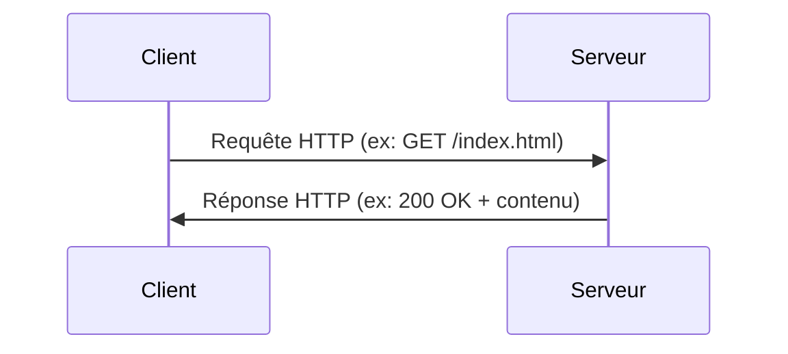

---
aliases:
  - Hypertext Transfer Protocol
  - Protocole de Transfert Hypertexte
archetype: protocole
port_defaut: TCP/80
couche_osi:
  - "Couche 7 - Application"
rfc:
  - RFC 9110
  - RFC 9111
  - RFC 9112
cssclasses:
  - max
tags:
  - protocole
  - protocole/http
  - modele-osi/couche-7
  - protocole/tcp
  - modele/client-serveur
  - application/web
  - communication/handshake
---

# HTTP (Hypertext Transfer Protocol)

Le **Hypertext Transfer Protocol (HTTP)** est un protocole de la couche application utilisé pour les systèmes d'information distribués, collaboratifs et hypermédias. Il constitue le fondement de la communication de données pour le World Wide Web, permettant l'échange de documents hypertexte et d'autres ressources entre clients (navigateurs web) et serveurs web.

> [!info] Carte d'Identité
> * **Couche OSI** : Couche 7 - Application
> * **Port par défaut** : `TCP/80`
> * **Transport** : TCP

## ⚙️ Fonctionnement (Requête-Réponse)
HTTP fonctionne selon un modèle client-serveur, où une transaction commence par un client soumettant une requête à un serveur. Le serveur tente de satisfaire la requête et renvoie une réponse au client. Contrairement à des protocoles comme TCP, HTTP n'a pas de "handshake" d'établissement de connexion au niveau applicatif. L'établissement de la connexion TCP sous-jacente est géré séparément.

Le cycle typique de requête-réponse HTTP est le suivant :

1.  **Ouverture de connexion TCP** : Le client établit une connexion TCP au port 80 (par défaut) du serveur.
2.  **Envoi de la requête HTTP** : Le client envoie un message de requête HTTP au serveur.
3.  **Traitement de la requête** : Le serveur reçoit la requête, la traite et génère une réponse.
4.  **Envoi de la réponse HTTP** : Le serveur envoie un message de réponse HTTP au client.
5.  **Fermeture de connexion TCP (ou persistance)** : La connexion TCP peut être fermée après la réponse, ou maintenue pour des requêtes ultérieures (connexions persistantes, introduites avec HTTP/1.1 pour réduire la latence).



## 📦 Structure des Messages HTTP

Les messages HTTP (requêtes et réponses) sont constitués de trois parties principales : une ligne de début (ligne de requête ou ligne de statut), des en-têtes (headers), et un corps de message optionnel.

### Structure d'une Requête HTTP
Une requête HTTP comprend :
1.  **Ligne de Requête** : Spécifie la méthode HTTP, l'URI de la ressource cible et la version du protocole HTTP.
    *   Exemple : `GET /index.html HTTP/1.1`
2.  **En-têtes de Requête** : Paire clé-valeur fournissant des métadonnées sur la requête, le client ou la ressource demandée.
    *   Exemples : `Host: www.example.com`, `User-Agent: Mozilla/5.0`, `Accept: text/html`.
3.  **Ligne vide** : Une ligne vide sépare les en-têtes du corps du message.
4.  **Corps de Requête (Optionnel)** : Contient des données supplémentaires, comme des données de formulaire soumises avec les méthodes `POST` ou `PUT`.

```
GET /index.html HTTP/1.1
Host: www.example.com
User-Agent: Mozilla/5.0 (Windows NT 10.0; Win64; x64) AppleWebKit/537.36
Accept: text/html,application/xhtml+xml,application/xml;q=0.9,*/*;q=0.8
Accept-Language: fr,fr-FR;q=0.8,en-US;q=0.5,en;q=0.3
Accept-Encoding: gzip, deflate, br
Connection: keep-alive
```

### Structure d'une Réponse HTTP
Une réponse HTTP comprend :
1.  **Ligne de Statut** : Indique la version du protocole HTTP, un code de statut numérique et une phrase de raison textuelle.
    *   Exemple : `HTTP/1.1 200 OK`
2.  **En-têtes de Réponse** : Paire clé-valeur fournissant des métadonnées sur la réponse, le serveur ou la ressource renvoyée.
    *   Exemples : `Content-Type: text/html`, `Server: Apache`, `Date: Tue, 15 Nov 2025 08:00:00 GMT`.
3.  **Ligne vide** : Une ligne vide sépare les en-têtes du corps du message.
4.  **Corps de Réponse (Optionnel)** : Contient la ressource demandée (ex: page HTML, image) ou un message d'erreur.

```
HTTP/1.1 200 OK
Date: Tue, 15 Nov 2025 08:00:00 GMT
Server: Apache/2.4.41 (Ubuntu)
Last-Modified: Mon, 14 Nov 2025 10:30:00 GMT
Content-Length: 1234
Content-Type: text/html; charset=UTF-8
Connection: keep-alive

<!DOCTYPE html>
<html>
<head><title>Exemple</title></head>
<body>
    <h1>Bienvenue sur ma page !</h1>
</body>
</html>
```

## Méthodes HTTP
Les méthodes HTTP (aussi appelées verbes) indiquent l'action que le client souhaite effectuer sur une ressource.

| Méthode  | Description                                                                                                                                                                                                                                                                                                    | Sûr (Safe) | Idempotent | Corps de requête | Corps de réponse |
| :------- | :------------------------------------------------------------------------------------------------------------------------------------------------------------------------------------------------------------------------------------------------------------------------------------------------------------- | :--------- | :--------- | :--------------- | :--------------- |
| **GET**  | Récupère une représentation de la ressource spécifiée par l'URI. C'est la méthode la plus courante pour la lecture de données.                                                                                                                                                                    | Oui        | Oui        | Non              | Oui              |
| **HEAD** | Identique à `GET`, mais sans corps de réponse. Utilisé pour obtenir uniquement les en-têtes de la ressource (utile pour vérifier l'existence ou les métadonnées).                                                                                                                                 | Oui        | Oui        | Non              | Non              |
| **POST** | Soumet des données à une ressource spécifiée, souvent pour créer une nouvelle ressource ou envoyer des données de formulaire.                                                                                                                                                                       | Non        | Non        | Oui              | Oui              |
| **PUT**  | Remplace toutes les représentations actuelles de la ressource cible avec le contenu de la requête. Utilisé pour créer ou mettre à jour une ressource à une URI spécifiée.                                                                                                                         | Non        | Oui        | Oui              | Oui              |
| **DELETE** | Supprime la ressource spécifiée.                                                                                                                                                                                                                                                              | Non        | Oui        | Non              | Oui              |
| **PATCH** | Applique des modifications partielles à une ressource.                                                                                                                                                                                                                                         | Non        | Non        | Oui              | Oui              |
| **OPTIONS** | Décrit les options de communication prises en charge par le serveur pour une ressource ou pour le serveur en général.                                                                                                                                                                                 | Oui        | Oui        | Non              | Oui              |
| **CONNECT** | Établit un tunnel vers le serveur identifié par la ressource cible.                                                                                                                                                                                                                           | Non        | Non        | Oui              | Oui              |
| **TRACE** | Effectue un test de bouclage du message le long du chemin vers la ressource cible.                                                                                                                                                                                                                   | Oui        | Oui        | Non              | Oui              |

*   **Sûr (Safe)** : Une méthode est "sûre" si elle ne modifie pas l'état du serveur (opérations de lecture seule).
*   **Idempotent** : Une méthode est "idempotente" si l'exécution répétée de la requête produit le même résultat qu'une seule exécution.

## Codes de Statut HTTP
Les codes de statut HTTP sont des codes numériques à trois chiffres renvoyés par le serveur dans la ligne de statut de la réponse. Ils indiquent l'état de la requête et si elle a été traitée avec succès ou non.

| Catégorie | Plage | Description                                                                                                                                  | Exemples courants                                                                                                                                                                                                                                                                                                                                                                          |
| :-------- | :---- | :------------------------------------------------------------------------------------------------------------------------------------------- | :----------------------------------------------------------------------------------------------------------------------------------------------------------------------------------------------------------------------------------------------------------------------------------------------------------------------------------------------------------------------------------------- |
| **1xx**   | 100-199 | **Réponses informationnelles** : La requête a été reçue et le processus se poursuit.                                          | `100 Continue` : Le serveur a reçu les en-têtes de la requête et le client doit continuer à envoyer le corps de la requête. `101 Switching Protocols` : Le demandeur a demandé au serveur de changer de protocole.                                                                                                                                               |
| **2xx**   | 200-299 | **Succès** : La requête a été reçue, comprise et acceptée avec succès.                                                     | `200 OK` : La requête a réussi (réponse standard pour les requêtes HTTP réussies). `201 Created` : La requête a été accomplie et une nouvelle ressource a été créée. `204 No Content` : La requête a été traitée avec succès, mais ne renvoie aucun contenu.                                                                         |
| **3xx**   | 300-399 | **Redirection** : Une action supplémentaire doit être effectuée par le client pour compléter la requête.                   | `301 Moved Permanently` : La ressource demandée a été déplacée de manière permanente vers une nouvelle URL. `302 Found` : La ressource demandée a été temporairement déplacée vers une nouvelle URL. `304 Not Modified` : La ressource n'a pas été modifiée depuis la dernière requête.                                                     |
| **4xx**   | 400-499 | **Erreur client** : La requête contient une syntaxe incorrecte ou ne peut pas être traitée.                                | `400 Bad Request` : Le serveur n'a pas pu comprendre la requête en raison d'une syntaxe invalide. `401 Unauthorized` : La requête nécessite une authentification de l'utilisateur. `403 Forbidden` : Le serveur a compris la requête mais refuse de l'autoriser. `404 Not Found` : La ressource demandée n'a pas pu être trouvée. |
| **5xx**   | 500-599 | **Erreur serveur** : Le serveur n'a pas pu exécuter une requête apparemment valide.                                        | `500 Internal Server Error` : Une erreur inattendue a été rencontrée par le serveur. `503 Service Unavailable` : Le serveur n'est pas prêt à traiter la requête (souvent dû à une surcharge ou une maintenance).                                                                                                                                                |

## 🦈 Analyse Wireshark
L'analyse des paquets HTTP avec Wireshark permet de comprendre le flux de communication, la structure des requêtes et réponses, et de diagnostiquer des problèmes.

> [!tip] Filtres Utiles
> ```
> # Filtrer par protocole HTTP
> http
>
> # Filtrer par méthode de requête HTTP spécifique (ex: POST)
> http.request.method == "POST"
>
> # Filtrer les réponses HTTP avec un code de statut spécifique (ex: 404 Not Found)
> http.response.code == 404
>
> # Filtrer les requêtes HTTP vers un hôte spécifique
> http.host == "www.example.com"
> ```

## 🛡️ Sécurité
Le protocole HTTP, dans sa version standard, est intrinsèquement **non chiffré**. Cela signifie que toutes les communications (requêtes, réponses, en-têtes, corps de message) sont transmises en texte clair sur le réseau.

> [!danger] Vulnérabilités Connues
> *   **Sniffing** : Comme HTTP n'est pas chiffré, un attaquant qui intercepte le trafic réseau peut facilement lire toutes les informations échangées, y compris les identifiants de connexion, les données personnelles ou les informations de session.
>     *   **Est-ce chiffré ?** Non. Toutes les données sont en clair.
> *   **Man-in-the-Middle (MitM)** : Sans chiffrement, un attaquant peut intercepter et potentiellement modifier les communications entre le client et le serveur sans être détecté.
> *   **Attaques au niveau applicatif** : Bien que ce ne soit pas une vulnérabilité directe du protocole HTTP lui-même, de nombreuses attaques web (ex: *SQL Injection*, *Cross-Site Scripting (XSS)*, *Broken Authentication*, *Security Misconfiguration*) exploitent des faiblesses dans les applications web qui utilisent HTTP. Le manque de chiffrement de HTTP aggrave souvent l'impact de ces vulnérabilités en facilitant l'accès aux données.

Pour atténuer ces risques, l'utilisation de **HTTPS (Hypertext Transfer Protocol Secure)** est fortement recommandée. HTTPS utilise **TLS (Transport Layer Security)** pour chiffrer les communications HTTP, assurant la confidentialité, l'intégrité des données et l'authentification du serveur.