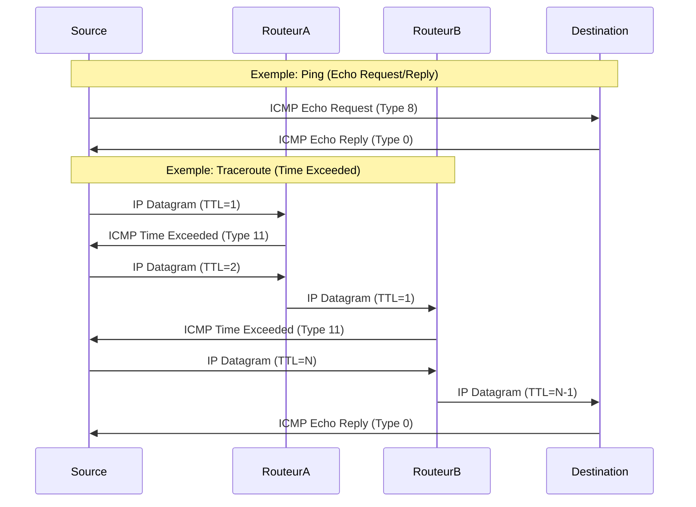

---
aliases:
  - Protocole ICMP
  - Internet Control Message Protocol
  - Ping
  - Traceroute
  - ICMP
cssclasses:
  - max
archetype: protocole
port_defaut: N/A (utilise le protocole IP)
couche_osi:
  - Couche 3 - Réseau
rfc:
  - RFC 792
  - RFC 777
tags:
  - protocole/icmp
  - modele-osi/couche-3
  - protocole/ip
  - reseau
  - communication/handshake
  - outil/wireshark
  - attaque/deni-de-service
  - attaque/deni-de-service/icmp-flood
  - reconnaissance
  - attaque/deni-de-service/smurf-attack
  - attaque/tunneling/icmp
  - vulnerabilite
  - ttl
---

# Internet Control Message Protocol (ICMP)

> [!info] Carte d'Identité
> * **Couche OSI** : Couche 3 - Réseau
> * **Port par défaut** : `N/A` (utilise le protocole IP directement)
> * **Transport** : IP

Le *Internet Control Message Protocol* (ICMP) est un protocole de la suite TCP/IP utilisé par les périphériques réseau, comme les routeurs, pour envoyer des messages d'erreur et des informations opérationnelles. ICMP est essentiel pour la gestion des erreurs et le diagnostic sur les réseaux IP. Il est souvent considéré comme faisant partie du protocole IP lui-même, plutôt qu'un protocole de couche supérieure.

## ⚙️ Fonctionnement (Messages ICMP)
ICMP n'est pas un protocole de connexion au sens où TCP l'est, il n'y a pas de "handshake" pour établir une session. Il s'agit d'un protocole sans connexion qui transmet des messages indépendants pour diagnostiquer les problèmes de communication réseau. Voici quelques types de messages ICMP courants :

*   **Echo Request/Reply (Type 8/0)** : Utilisé par l'outil *Ping* pour vérifier la joignabilité d'un hôte. L'émetteur envoie une requête d'écho et l'hôte cible répond par une réponse d'écho si elle est accessible.
*   **Destination Unreachable (Type 3)** : Indique qu'un datagramme ne peut pas être livré à sa destination. Cela peut être dû à un réseau, un hôte, un protocole ou un port inaccessible, ou à une fragmentation nécessaire mais impossible.
*   **Time Exceeded (Type 11)** : Indique qu'un datagramme a dépassé son temps de vie (TTL) ou que le temps d'assemblage d'un fragment a expiré. C'est le message clé utilisé par l'outil *Traceroute* pour déterminer le chemin d'un paquet à travers un réseau.
*   **Redirect (Type 5)** : Envoyé par un routeur à un hôte pour l'informer d'un chemin plus court pour atteindre une destination donnée.



## 📦 Structure du Paquet (Header)
Le header ICMP est encapsulé dans le header IP et suit immédiatement ce dernier. Le protocole IP identifie ICMP via le champ `Protocol` du header IP, qui a la valeur `1` pour ICMP.

| Champ | Taille | Description |
|---|---|---|
| **Type** | 8 bits | Indique le type de message ICMP (ex: 8 pour Echo Request, 0 pour Echo Reply, 3 pour Destination Unreachable, 11 pour Time Exceeded). |
| **Code** | 8 bits | Fournit plus de détails sur le type de message. Par exemple, pour "Destination Unreachable", le code 0 signifie "Network unreachable", le code 1 "Host unreachable", etc. |
| **Checksum** | 16 bits | Utilisé pour la détection d'erreurs sur l'en-tête ICMP et les données. |
| **Données spécifiques au type** | Variable | Contient des informations supplémentaires qui varient en fonction du Type et du Code du message ICMP. Pour les messages Echo Request/Reply, il inclut un identifiant et un numéro de séquence. |

## 🦈 Analyse Wireshark
L'analyse de trafic ICMP avec Wireshark permet de diagnostiquer de nombreux problèmes réseau, comme des boucles de routage, des hôtes inaccessibles ou des problèmes de connectivité.

> [!tip] Filtres Utiles
> ```
> # Filtrer par protocole ICMP
> icmp
>
> # Filtrer les requêtes et réponses d'écho (Ping)
> icmp.type == 8 or icmp.type == 0
>
> # Filtrer les messages Destination Unreachable
> icmp.type == 3
>
> # Filtrer les messages Time Exceeded (Traceroute)
> icmp.type == 11
>
> # Filtrer un code spécifique pour Destination Unreachable (ex: Host Unreachable)
> icmp.type == 3 and icmp.code == 1
> ```

## 🛡️ Sécurité
> [!danger] Vulnérabilités Connues
> *   **Denial of Service (DoS)** : Le *Ping Flood* est une attaque où un grand nombre de requêtes Echo Request sont envoyées à une cible pour la submerger et perturber sa disponibilité.
> *   **Information Gathering** : Les messages ICMP peuvent révéler des informations sur la topologie du réseau et l'état des hôtes, ce qui peut être exploité par un attaquant. Par exemple, les messages "Destination Unreachable" peuvent indiquer les ports ouverts ou fermés.
> *   **Smurf Attack** : Une forme de *DoS* qui utilise ICMP. L'attaquant envoie des requêtes *Ping* avec l'adresse IP de la victime comme adresse source à un réseau de diffusion. Les machines de ce réseau répondent toutes à la victime, saturant sa bande passante.
> *   **Tunneling ICMP** : Des outils peuvent encapsuler d'autres protocoles (comme SSH ou HTTP) dans des paquets ICMP pour contourner les pare-feu ou les systèmes de détection d'intrusion qui ne sont pas configurés pour inspecter le contenu des messages ICMP.
> *   **Sniffing** : Les paquets ICMP ne sont *pas* chiffrés par défaut. Le contenu des messages ICMP, y compris les données optionnelles, peut être intercepté et lu par un attaquant.
> *   **Spoofing** : Il est possible de falsifier l'adresse IP source des paquets ICMP. Cela est utilisé dans les attaques de *Ping Flood* et de *Smurf* pour masquer l'origine réelle de l'attaque.
