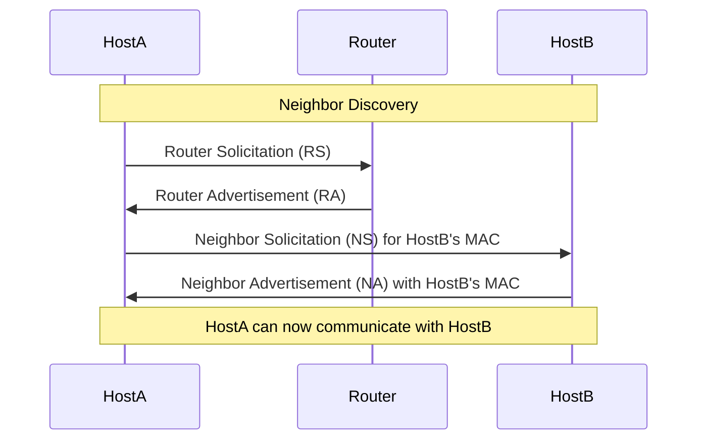

---
aliases:
  - "ICMPv6"
  - "Internet Control Message Protocol for IPv6"
  - "Protocole de message de contrôle Internet pour IPv6"
  - "Neighbor Discovery Protocol"
  - "NDP"
archetype: protocole
port_defaut:
couche_osi:
  - "Couche 3 - Réseau"
rfc:
  - "RFC 4443"
  - "RFC 4861"
cssclasses:
  - max
tags:
  - protocole/icmpv6
  - protocole/ip/ipv6
  - modele-osi/couche-3
  - protocole/ndp
  - protocole/ndp/router-solicitation
  - protocole/ndp/router-advertisement
  - protocole/ndp/neighbor-solicitation
  - protocole/ndp/neighbor-advertisement
  - protocole/ndp/redirect
  - norme/rfc
  - outil/wireshark
  - paquet
---

# ICMPv6

> [!info] Carte d'Identité
> * **Couche OSI** : Couche 3 - Réseau
> * **Port par défaut** : N/A (Protocole de Couche 3)
> * **Transport** : Directement sur IPv6

## ⚙️ Fonctionnement

Le protocole *Internet Control Message Protocol for IPv6* (ICMPv6), défini dans la [RFC 4443](https://datatracker.ietf.org/doc/html/rfc4443), est une partie intégrante d'IPv6, jouant un rôle crucial pour les diagnostics, le reporting d'erreurs et diverses fonctionnalités opérationnelles au niveau de la couche réseau. Contrairement à ICMPv4 qui est un protocole de support, ICMPv6 est *essentiel* au fonctionnement d'IPv6, notamment pour la résolution d'adresses, la découverte de routeurs et la gestion des voisins. Il est encapsulé directement dans le champ "Next Header" de l'en-tête IPv6, avec une valeur de 58.

Les fonctions principales d'ICMPv6 incluent :
*   **Signalement d'erreurs** : Informer l'expéditeur de problèmes lors de la livraison d'un paquet.
*   **Messages d'information** : Fournir des diagnostics et des informations sur l'état du réseau.
*   **Neighbor Discovery Protocol (NDP)** : Un ensemble de messages ICMPv6 cruciaux pour la découverte de routeurs, la résolution d'adresses, la détection des adresses dupliquées et la gestion des voisins sur une liaison locale.

### Mécanismes de résolution d'adresses IPv6 et découverte de voisins (NDP)

Le *Neighbor Discovery Protocol* (NDP) remplace les fonctions d'ARP (Address Resolution Protocol) et d'ICMP Router Discovery d'IPv4. Il utilise plusieurs types de messages ICMPv6 :



*   **Router Solicitation (RS)** : Les hôtes envoient des messages RS pour localiser les routeurs sur la liaison et demander des *Router Advertisements* immédiats.
*   **Router Advertisement (RA)** : Les routeurs envoient des messages RA pour annoncer leur présence, les informations de préfixe pour l'auto-configuration des adresses (SLAAC), les paramètres de liaison et les passerelles par défaut. Les RA peuvent être envoyés périodiquement ou en réponse à un RS.
*   **Neighbor Solicitation (NS)** : Utilisé par un hôte pour déterminer l'adresse de liaison (MAC) d'un voisin (ou pour vérifier sa joignabilité) et pour la *Détection d'Adresses Dupliquées* (DAD).
*   **Neighbor Advertisement (NA)** : Réponse à un message NS, contenant l'adresse de liaison du voisin. Il peut aussi être envoyé de manière non sollicitée pour annoncer un changement d'adresse de liaison.
*   **Redirect** : Un routeur utilise ce message pour informer un hôte d'un meilleur routeur de premier saut pour une destination spécifique.

## 📦 Structure du Paquet (Header)

Le paquet ICMPv6 est encapsulé directement après l'en-tête IPv6 et est composé des champs suivants :

| Champ         | Taille    | Description                                                                                                                                                                                                                                      |
| :------------ | :-------- | :----------------------------------------------------------------------------------------------------------------------------------------------------------------------------------------------------------------------------------------------- |
| **Type**      | 8 bits    | Indique le type du message ICMPv6 (par exemple, 1 pour Destination Unreachable, 128 pour Echo Request). Les valeurs inférieures à 128 sont des messages d'erreur, les valeurs 128 et supérieures sont des messages d'information. |
| **Code**      | 8 bits    | Fournit des informations plus spécifiques sur le type de message. Par exemple, pour "Destination Unreachable", le code peut indiquer "No route to destination" ou "Administratively prohibited".                                     |
| **Checksum**  | 16 bits   | Vérifie l'intégrité du message ICMPv6. Calculé sur l'en-tête IPv6 "pseudo-header", l'en-tête ICMPv6 et la charge utile ICMPv6.                                                                                                           |
| **Body**      | Variable  | Contient des données spécifiques au type et au code du message. Par exemple, pour les messages d'erreur, il inclut une partie de l'en-tête IPv6 du paquet original plus les 128 premiers octets de son corps.                         |

## 🦈 Analyse Wireshark

> [!tip] Filtres Utiles
> ```
> # Filtrer par protocole ICMPv6
> icmpv6
>
> # Filtrer les messages de type Router Solicitation
> icmpv6.type == 133
>
> # Filtrer les messages de type Router Advertisement
> icmpv6.type == 134
>
> # Filtrer les messages de type Neighbor Solicitation
> icmpv6.type == 135
>
> # Filtrer les messages de type Neighbor Advertisement
> icmpv6.type == 136
>
> # Filtrer les messages d'erreur (types < 128)
> icmpv6.type < 128
>
> # Filtrer une erreur spécifique (ex: Destination Unreachable)
> icmpv6.type == 1 && icmpv6.code == 0
> ```

L'analyse des captures Wireshark pour ICMPv6 est essentielle pour le dépannage des réseaux IPv6. Elle permet de visualiser les interactions NDP, l'auto-configuration des adresses, la détection des routeurs et le diagnostic des problèmes de connectivité.

## 🛡️ Sécurité

> [!danger] Vulnérabilités Connues
> *   **Sniffing** : Les messages ICMPv6 ne sont pas chiffrés par défaut. Un attaquant peut intercepter les messages NDP pour obtenir des informations sur la topologie du réseau et les adresses MAC/IPv6 des hôtes. [Non chiffré]
> *   **Spoofing (Usurpation)** : L'usurpation de messages ICMPv6, en particulier ceux du NDP, représente une menace significative.
    *   **Usurpation de Router Advertisement (RA)** : Un attaquant peut envoyer de faux messages RA pour se désigner comme routeur par défaut, injecter de faux préfixes DNS, ou rediriger le trafic (attaque de type *Man-in-the-Middle*).
    *   **Usurpation de Neighbor Advertisement (NA)** : Un attaquant peut usurper des messages NA pour associer sa propre adresse de liaison à l'adresse IPv6 d'une autre machine, réalisant ainsi un empoisonnement de la cache des voisins, similaire à l'ARP spoofing en IPv4.
    *   **Détection d'Adresses Dupliquées (DAD)** : L'usurpation de réponses DAD peut empêcher un hôte d'obtenir une adresse IPv6 valide.
> *   **Denial of Service (DoS)** : L'envoi massif de messages ICMPv6 malveillants peut saturer un hôte ou un routeur, entraînant un déni de service.
> *   **Faible Authentification** : Par défaut, les messages ICMPv6 ne sont pas authentifiés, ce qui rend les attaques par usurpation (spoofing) plus faciles. Des mécanismes comme *SEcure Neighbor Discovery* (SEND), défini dans la [RFC 3971](https://datatracker.ietf.org/doc/html/rfc3971), visent à atténuer ces risques en utilisant la cryptographie pour authentifier les messages NDP, mais son déploiement reste limité.