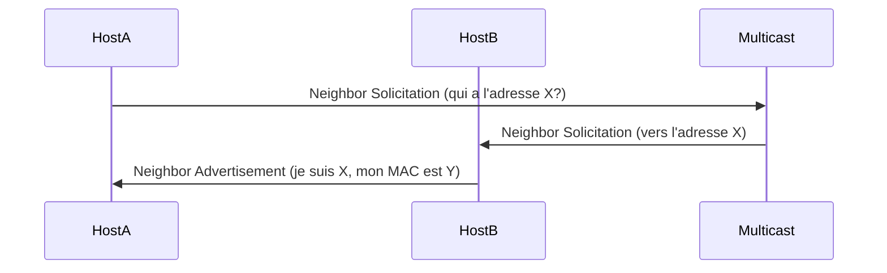

---
aliases:
  - IPv6
  - Internet Protocol version 6
  - Internet Protocol V6
archetype: protocole
port_defaut: N/A
couche_osi:
  - "Couche 3 - Réseau"
rfc:
  - RFC 8200
  - RFC 4291
cssclasses:
  - max
tags:
  - protocole/ip/ipv6
  - protocole/ndp
  - protocole/icmpv6
  - modele-osi/couche-3
  - outil/wireshark
  - protocole/ipv6/adressage
  - protocole/ipv6/adressage/unicast
  - protocole/ipv6/adressage/global-unicast
  - protocole/ipv6/adressage/link-local
  - protocole/ipv6/adressage/unique-local
  - protocole/ipv6/adressage/multicast
  - protocole/ipv6/adressage/anycast
  - protocole/ipv6/packet-structure
  - protocole/ipv6/extension-headers
  - protocole/ipv6/flow-label
  - protocole/ipv6/traffic-class
  - protocole/ipv6/hop-limit
  - protocole/ipv6/payload-length
  - protocole/ipv6/dual-stack
  - protocole/ipv6/migration
  - protocole/ipv6/tunneling
  - protocole/ipv6/nat64
  - protocole/ipv6/slaac
  - protocole/ipv6/dad
  - reseau/adressage
  - reseau/routage
---

# IPv6

> [!info] Carte d'Identité
> * **Couche OSI** : Couche 3 - Réseau
> * **Port par défaut** : `N/A`

IPv6 est la version la plus récente du protocole Internet, conçue pour remplacer l'IPv4. Son développement a été motivé par l'épuisement des adresses IPv4 disponibles et par le besoin d'améliorer la flexibilité, l'efficacité et la sécurité de l'adressage et du routage sur Internet.

## ⚙️ Fonctionnement (Neighbor Discovery Protocol - NDP)
À la couche liaison de données, IPv6 n'utilise pas ARP (Address Resolution Protocol). Il s'appuie sur le **Neighbor Discovery Protocol (NDP)**, qui fait partie de l'ICMPv6 (Internet Control Message Protocol for IPv6). NDP permet la découverte de voisins, la détection d'adresses dupliquées (DAD), l'autoconfiguration stateless (SLAAC) et le routage des paquets sur le lien local.



## ⚙️ Caractéristiques Clés et Différences avec IPv4

| Caractéristique | IPv4 | IPv6 |
|---|---|---|
| **Taille d'Adresse** | 32 bits | 128 bits |
| **Format d'Adresse** | Décimal pointé | Hexadécimal séparé par des deux-points |
| **En-tête** | Variable (20-60 octets) | Fixe (40 octets), en-têtes d'extension optionnels |
| **Fragmentation** | Par les routeurs et les hôtes | Uniquement par les hôtes source |
| **Checksum** | Présent dans l'en-tête IP | Non présent dans l'en-tête IP (géré par les couches supérieures) |
| **ARP** | Oui | Remplacé par NDP (Neighbor Discovery Protocol) |
| **DHCP** | Oui | DHCPv6 ou Autoconfiguration sans état (SLAAC) |
| **Qualité de Service (QoS)** | Options limitées | Champs Flow Label et Traffic Class dédiés |
| **Sécurité (IPsec)** | Optionnel | Intégré (RFC 4301) |

## 📦 Structure du Paquet (Header)

L'en-tête IPv6 est simplifié et de taille fixe (40 octets), ce qui facilite le traitement par les routeurs. Des fonctionnalités supplémentaires sont implémentées via des **en-têtes d'extension** optionnels, placés entre l'en-tête IPv6 de base et l'en-tête de la couche supérieure.

| Champ | Taille | Description |
|---|---|---|
| **Version** | 4 bits | Toujours `0110` (6) |
| **Traffic Class** | 8 bits | Priorité du paquet, équivalent au champ DSCP/ToS IPv4 |
| **Flow Label** | 20 bits | Permet d'identifier des flux de paquets nécessitant un traitement spécial (QoS) |
| **Payload Length** | 16 bits | Longueur de la charge utile (en-têtes d'extension + données) en octets |
| **Next Header** | 8 bits | Type du prochain en-tête (TCP, UDP, ICMPv6 ou un en-tête d'extension IPv6) |
| **Hop Limit** | 8 bits | Décrémenté à chaque saut. Quand il atteint 0, le paquet est abandonné (TTL IPv4) |
| **Source Address** | 128 bits | Adresse IPv6 de l'émetteur du paquet |
| **Destination Address** | 128 bits | Adresse IPv6 du destinataire du paquet |

## 🌐 [[IPv6AddressTypes|Types d'Adresses IPv6]]

IPv6 définit plusieurs types d'adresses pour différents scénarios de communication :
*   **Unicast** : Identifie une seule interface. Un paquet envoyé à une adresse unicast est livré à cette interface spécifique.
    *   *Global Unicast Addresses (GUA)* : Adresses routables globalement, équivalentes aux adresses publiques IPv4. (ex: `2001:db8::/32`)
    *   *Link-Local Addresses (LLA)* : Utilisées uniquement sur un lien local (segment de réseau). Non routables. (ex: `fe80::/10`)
    *   *Unique Local Addresses (ULA)* : Équivalentes aux adresses privées IPv4, routables au sein d'un site mais non sur Internet. (ex: `fc00::/7` ou `fd00::/8`)
*   **Multicast** : Identifie un groupe d'interfaces. Un paquet envoyé à une adresse multicast est livré à toutes les interfaces membres du groupe. (ex: `ff00::/8`)
*   **Anycast** : Identifie un groupe d'interfaces (généralement sur différents nœuds) mais le paquet est livré *à la plus proche* (selon le routage) des interfaces du groupe.

## 🛣️ Mécanismes de Transition

Pour permettre une migration progressive et coexister avec IPv4, plusieurs mécanismes de transition ont été développés :
*   **Dual Stack** : Les hôtes et routeurs supportent simultanément les piles IPv4 et IPv6. Ils peuvent communiquer avec des nœuds IPv4 et IPv6. C'est la méthode de transition la plus courante.
*   **Tunneling** : Les paquets IPv6 sont encapsulés dans des paquets IPv4 pour traverser des infrastructures IPv4. Des exemples incluent 6to4, ISATAP, Teredo.
*   **NAT64** : Permet aux hôtes IPv6 de communiquer avec des serveurs IPv4 en traduisant les adresses et les en-têtes. Un serveur DNS64 est souvent utilisé pour traduire les requêtes DNS des hôtes IPv6 en adresses IPv4.

## 🦈 Analyse Wireshark

> [!tip] Filtres Utiles
> ```
> # Filtrer par protocole IPv6
> ipv6
>
> # Filtrer les paquets Neighbor Discovery Protocol (NDP)
> icmpv6.nd
>
> # Filtrer les adresses Link-Local
> ipv6.addr == fe80::/10
>
> # Filtrer par champ Flow Label
> ipv6.flow_label == 0x12345
> ```

## 🛡️ Sécurité

IPv6 a été conçu avec des fonctionnalités de sécurité renforcées par rapport à IPv4.

> [!danger] Vulnérabilités Connues
> *   **IPsec intégré** : L'architecture IPv6 exige le support d'IPsec (Internet Protocol Security) qui offre l'authentification (AH) et le chiffrement (ESP) au niveau de la couche réseau. Bien que le support soit obligatoire, son utilisation effective reste optionnelle et dépend de la configuration.
> *   **Sniffing** : Est-ce chiffré ? Non par défaut. Les paquets IPv6 ne sont pas chiffrés intrinsèquement. Seule l'activation et la configuration d'IPsec garantissent le chiffrement.
> *   **Spoofing** : Authentification faible ? NDP est vulnérable à des attaques de *Neighbor Spoofing* ou *Man-in-the-Middle* si la sécurisation de NDP (SEND - Secure Neighbor Discovery) n'est pas implémentée, similaire aux vulnérabilités d'ARP en IPv4.
> *   **Scanner d'Adresses** : La grande taille de l'espace d'adressage IPv6 rend les scanners d'adresses traditionnels inefficaces. Cependant, des techniques comme le scan par devinette ou l'exploitation de la structure des adresses (par ex., en utilisant les 64 bits de l'EUI-64 ou des identifiants d'interface prévisibles) peuvent être utilisées.

## ➕ Avantages d'IPv6

*   **Énorme Espace d'Adresses** : Résout le problème de l'épuisement des adresses.
*   **Simplification des En-têtes** : Traitement plus efficace par les routeurs.
*   **Autoconfiguration (SLAAC)** : Permet aux hôtes de générer leurs propres adresses IPv6 sans serveur DHCP.
*   **Sécurité Renforcée** : IPsec est intégré à la spécification, bien que son activation reste manuelle.
*   **Qualité de Service (QoS)** : Les champs Traffic Class et Flow Label facilitent la gestion des flux.
*   **Meilleure Mobilité** : Mobile IPv6 permet aux appareils de maintenir leur connectivité en changeant de point d'accès réseau.