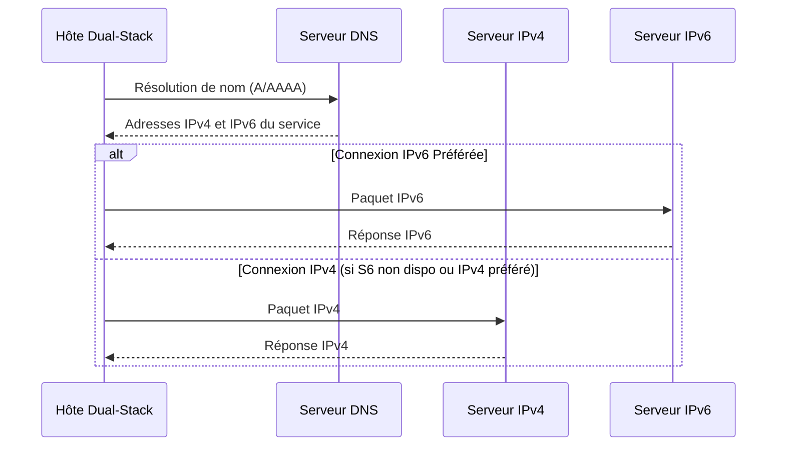

---
aliases:
  - Migration Double Pile IPv6
  - IPv6 Dual-Stack Migration
  - Dual-Stack Migration
  - Double Pile
  - IPv6 Dual Stack
archetype: protocole
port_defaut: N/A
couche_osi:
  - "Couche 3 - Réseau"
rfc:
  - "RFC 3484"
  - "RFC 4213"
cssclasses:
  - max
tags:
  - protocole/ip/dual-stack
  - protocole/ip/ipv4
  - protocole/ip/ipv6
  - protocole/ip/header
  - protocole/ipv6/migration
  - protocole/ipv6/nat64
  - protocole/ipv6/tunneling
  - reseau/coexistence-ipv4-ipv6
  - protocole/dns
  - dns/dns64
  - modele-osi/couche-3
  - norme/rfc
  - outil/wireshark
---

# IPv6 Dual-Stack Migration

> [!info] Carte d'Identité
> * **Couche OSI** : Couche 3 - Réseau
> * **Port par défaut** : `N/A`
> * **Transport** : *Coexistence IPv4/IPv6*

La *migration Dual-Stack* (ou *Double Pile*) est une stratégie de transition qui permet à un hôte ou à un routeur de fonctionner simultanément avec les protocoles **IPv4** et **IPv6**. Cette approche assure une coexistence directe des deux piles de protocole sur le même équipement, permettant ainsi aux applications de communiquer sur l'un ou l'autre protocole en fonction de la disponibilité et de la configuration.

> [!success] Avantages Clés
> *   **Coexistence Transparente** : Permet aux réseaux et aux applications de continuer à utiliser IPv4 tout en introduisant progressivement IPv6.
> *   **Flexibilité** : Les hôtes peuvent communiquer avec des services IPv4 et IPv6 sans nécessiter de mécanismes de traduction ou de tunneling complexes pour le trafic local.
> *   **Moins de Complexité Initiale** : Comparée au tunneling ou à la traduction, la configuration de base de la double pile est souvent plus simple pour les terminaux.

## ⚙️ Fonctionnement (Coexistence)
Le fonctionnement en *double pile* implique qu'un hôte ou un routeur dispose d'une interface réseau capable de traiter les paquets IPv4 et IPv6. Il maintient une adresse IPv4 et une adresse IPv6 pour la même interface logique. Lorsqu'une application souhaite établir une connexion, elle peut interroger le DNS pour obtenir des enregistrements A (IPv4) et/ou AAAA (IPv6). L'algorithme de sélection d'adresse par défaut (décrit dans le **RFC 3484**) détermine quelle adresse IP sera utilisée pour établir la connexion, privilégiant généralement IPv6 si disponible.



> [!info] Différences avec Tunneling et Traduction
> *   **Tunneling** : Encapsule les paquets IPv6 dans des paquets IPv4 (ou inversement) pour traverser un réseau qui ne supporte qu'un seul protocole. Le protocole "interne" n'est pas routé nativement par les routeurs intermédiaires.
> *   **Traduction (NAT64/DNS64)** : Convertit les en-têtes et adresses IPv6 en IPv4 (et inversement), permettant à des hôtes IPv6 de communiquer avec des hôtes IPv4 sans double pile. C'est une méthode sans état ou avec état qui modifie les paquets.
> *   **Dual-Stack** : Les deux piles de protocole sont actives et traitent les paquets nativement sans encapsulation ni modification d'en-tête, sur la même interface.

## 📦 Structure du Paquet (Gestion des Headers)
Dans un environnement *double pile*, l'hôte ou le routeur gère les paquets IPv4 et IPv6 de manière native. Il n'y a pas de structure de paquet spécifique au processus de "migration double pile" lui-même, mais plutôt une capacité à traiter les deux types d'en-têtes IP.

Les paquets IPv4 contiennent un en-tête IPv4 standard (version 4, adresse source/destination sur 32 bits, etc.), tandis que les paquets IPv6 contiennent un en-tête IPv6 standard (version 6, adresse source/destination sur 128 bits, etc.). L'interface réseau et le système d'exploitation sont configurés pour reconnaître et traiter correctement les deux formats.

| Champ (Exemple IPv4) | Taille | Description |
|---|---|---|
| **Version** | 4 bits | Indique la version du protocole (4) |
| **Header Length (IHL)** | 4 bits | Longueur de l'en-tête IPv4 |
| **Source Address** | 32 bits | Adresse IP source |
| **Destination Address** | 32 bits | Adresse IP de destination |
| **...** | ... | ... |

| Champ (Exemple IPv6) | Taille | Description |
|---|---|---|
| **Version** | 4 bits | Indique la version du protocole (6) |
| **Traffic Class** | 8 bits | Priorité du paquet |
| **Flow Label** | 20 bits | Utilisé pour l'identification de flux |
| **Payload Length** | 16 bits | Longueur du champ de données |
| **Next Header** | 8 bits | Type d'en-tête suivant (TCP, UDP, ICMPv6, etc.) |
| **Hop Limit** | 8 bits | Décrémenté par chaque routeur (TTL IPv4) |
| **Source Address** | 128 bits | Adresse IPv6 source |
| **Destination Address** | 128 bits | Adresse IPv6 de destination |

## 🦈 Analyse Wireshark
L'analyse des communications dans un environnement *double pile* nécessite de filtrer les paquets en fonction de leur version IP.

> [!tip] Filtres Utiles
> ```
> # Filtrer les paquets IPv4
> ip
>
> # Filtrer les paquets IPv6
> ipv6
>
> # Filtrer le trafic DNS qui résout à la fois A et AAAA
> dns and (dns.flags.response == 1) and (dns.a or dns.aaaa)
>
> # Filtrer le trafic TCP pour une adresse IPv6 spécifique
> ipv6.addr == 2001:db8::1 and tcp
>
> # Filtrer le trafic UDP pour une adresse IPv4 spécifique
> ip.addr == 192.168.1.100 and udp
> ```

## 🛡️ Sécurité
La gestion d'une infrastructure en *double pile* introduit des considérations de sécurité supplémentaires, principalement dues à l'augmentation de la surface d'attaque et à la complexité de la gestion.

> [!danger] Vulnérabilités et Défis Connus
> *   **Surface d'Attaque Accrue** : La présence de deux piles IP signifie que les systèmes sont potentiellement exposés à des vulnérabilités sur les deux protocoles. Chaque pile doit être sécurisée indépendamment.
> *   **Gestion de la Sécurité** : Les pare-feu, les systèmes de détection d'intrusion (IDS) et les politiques de sécurité doivent être configurés pour gérer et surveiller efficacement le trafic IPv4 et IPv6. Une mauvaise configuration peut laisser des brèches dans l'une des piles.
> *   **Complexité de la Configuration** : La configuration correcte des adresses, du routage et des règles de pare-feu pour les deux protocoles est plus complexe et augmente le risque d'erreurs humaines.
> *   **Problèmes de Performances** : Dans certains cas, une mauvaise implémentation de la sélection d'adresse ou des problèmes de routage peuvent entraîner des latences accrues si le système tente de basculer entre les deux protocoles ou si IPv6 est préféré mais moins performant sur un segment de réseau.
> *   **Transition Incomplète** : La coexistence prolongée peut retarder la migration complète vers IPv6, maintenant ainsi les dépendances à IPv4.
> *   **Sniffing** : Les paquets IPv4 et IPv6 ne sont pas intrinsèquement chiffrés. La protection nécessite l'utilisation de protocoles de couche supérieure tels que **TLS** ou de protocoles de sécurité IP tels que **IPsec**.
> *   **Spoofing** : L'authentification au niveau IP est absente. Les mécanismes comme **Secure Neighbor Discovery (SEND)** pour IPv6 et **IPsec** peuvent atténuer le *spoofing*, mais doivent être implémentés activement.