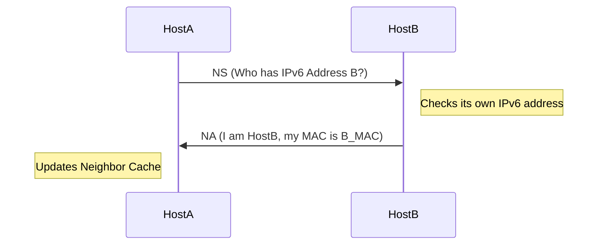

---
aliases:
  - Protocole de découverte de voisins IPv6
  - IPv6 Neighbor Discovery Protocol
  - NDP
  - Neighbor Discovery
archetype: protocole
port_defaut: N/A (utilise ICMPv6)
couche_osi:
  - "Couche 3 - Réseau"
rfc:
  - "RFC 4861"
cssclasses:
  - max
tags:
  - protocole/ndp
  - protocole/ip/ipv6
  - protocole/icmpv6
  - protocole/ndp/neighbor-solicitation
  - protocole/ndp/neighbor-advertisement
  - protocole/ndp/router-solicitation
  - protocole/ndp/router-advertisement
  - protocole/ndp/redirect
  - protocole/ipv6/dad
  - protocole/ipv6/slaac
  - modele-osi/couche-3
  - reseau/adressage/mac
  - protocole/arp
---

# IPv6 Neighbor Discovery Protocol

> [!info] Carte d'Identité
> * **Couche OSI** : Couche 3 - Réseau
> * **Port par défaut** : `N/A (utilise ICMPv6)`
> * **Transport** : N/A (couche réseau)

Le **Neighbor Discovery Protocol (NDP)** est un protocole fondamental dans la suite IPv6 qui remplace les fonctions de l'ARP (Address Resolution Protocol), de la découverte de routeurs [[ICMPProtocol|ICMP]] et des redirections ICMP d'IPv4. Il permet aux nœuds IPv6 sur le même lien de se découvrir mutuellement, de résoudre les adresses IPv6 en adresses de couche de liaison (MAC), de détecter les routeurs voisins et de maintenir des informations de joignabilité. NDP utilise le protocole **ICMPv6** (Internet Control Message Protocol for IPv6) pour toutes ses opérations.

## ⚙️ Fonctionnement (Handshake)

NDP joue un rôle crucial dans plusieurs mécanismes clés d'IPv6, notamment la **résolution d'adresses**, la **détection d'adresses dupliquées (DAD)**, la **découverte de routeurs**, la **découverte de préfixes** et la **détection d'injoignabilité de voisin (NUD)**.

NDP s'appuie sur cinq types de messages ICMPv6 pour remplir ses fonctions :

1.  **Neighbor Solicitation (NS)** (Type 135 ICMPv6) :
    *   Utilisé par un nœud pour déterminer l'adresse de couche de liaison d'un nœud voisin (similaire à l'ARP Request en IPv4).
    *   Permet de vérifier qu'un voisin est toujours joignable via son adresse de couche de liaison en cache (NUD).
    *   Employé pour la Détection d'Adresses Dupliquées (DAD) afin de s'assurer qu'une adresse unicast IPv6 est unique avant d'être assignée à une interface.
    *   Envoyé à une adresse multicast de nœud sollicité (Solicited-Node Multicast Address).

2.  **Neighbor Advertisement (NA)** (Type 136 ICMPv6) :
    *   Réponse à un message Neighbor Solicitation, contenant l'adresse de couche de liaison du nœud cible.
    *   Peut être envoyé de manière non sollicitée pour annoncer un changement d'adresse de couche de liaison ou la présence d'un nœud.

3.  **Router Solicitation (RS)** (Type 133 ICMPv6) :
    *   Envoyé par un hôte lorsqu'il démarre ou est connecté à un lien pour localiser les routeurs présents sur le segment et demander qu'ils annoncent leur présence.
    *   Dirigé vers l'adresse multicast "All-Routers" (FF02::2).

4.  **Router Advertisement (RA)** (Type 134 ICMPv6) :
    *   Envoyé par les routeurs pour annoncer leur présence, les préfixes de lien, les informations de configuration (comme les serveurs DNS) et d'autres paramètres importants.
    *   Peut être envoyé périodiquement ou en réponse à un message Router Solicitation.
    *   Utilisé pour l'autoconfiguration d'adresses sans état (SLAAC).

5.  **Redirect** (Type 137 ICMPv6) :
    *   Envoyé par un routeur à un hôte pour l'informer d'un meilleur chemin (un "next-hop" plus optimal) vers une destination spécifique sur le même lien.
    *   Seuls les routeurs peuvent envoyer des messages de redirection, et seuls les hôtes les traitent.

Voici un exemple simplifié du processus de résolution d'adresse via NS/NA :



## 📦 Structure du Paquet (Header)

Les messages NDP sont encapsulés dans des messages ICMPv6. La structure générale d'un message ICMPv6 est la suivante, suivie des champs spécifiques à chaque type de message NDP.

| Champ       | Taille (bits) | Description                                                               |
| :---------- | :------------ | :------------------------------------------------------------------------ |
| **Type**    | 8             | Identifie le type de message ICMPv6 (ex: 135 pour NS, 136 pour NA).      |
| **Code**    | 8             | Sous-type du message (généralement 0 pour NDP).                         |
| **Checksum**| 16            | Somme de contrôle pour l'intégrité du message ICMPv6 et de certaines parties de l'en-tête IPv6. |
| **Corps**   | Variable      | Contient les données spécifiques au message NDP.                        |

**Détails du corps des messages NDP :**

*   **Neighbor Solicitation (NS)** (Type 135)
    | Champ               | Taille (bits) | Description                                                           |
    | :------------------ | :------------ | :-------------------------------------------------------------------- |
    | **Reserved**        | 32            | Doit être à zéro.                                                     |
    | **Target Address**  | 128           | L'adresse IPv6 cible dont l'adresse de couche de liaison est recherchée ou dont la joignabilité est vérifiée. |
    | **Options**         | Variable      | Contient généralement l'option Source Link-Layer Address (l'adresse MAC de l'expéditeur). |

*   **Neighbor Advertisement (NA)** (Type 136)
    | Champ               | Taille (bits) | Description                                                           |
    | :------------------ | :------------ | :-------------------------------------------------------------------- |
    | **R (Router) Flag** | 1             | Indique si l'expéditeur est un routeur.                               |
    | **S (Solicited) Flag** | 1             | Indique si le NA est une réponse à un NS spécifique (si oui, Target Address doit correspondre). |
    | **O (Override) Flag** | 1             | Indique si l'adresse de couche de liaison fournie doit remplacer toute entrée existante dans le cache du voisin. |
    | **Reserved**        | 29            | Doit être à zéro.                                                     |
    | **Target Address**  | 128           | L'adresse IPv6 du nœud qui a envoyé le NA.                            |
    | **Options**         | Variable      | Contient généralement l'option Target Link-Layer Address (l'adresse MAC du nœud cible). |

*   **Router Solicitation (RS)** (Type 133)
    | Champ               | Taille (bits) | Description                                                           |
    | :------------------ | :------------ | :-------------------------------------------------------------------- |
    | **Reserved**        | 32            | Doit être à zéro.                                                     |
    | **Options**         | Variable      | Peut contenir l'option Source Link-Layer Address.                     |

*   **Router Advertisement (RA)** (Type 134)
    | Champ               | Taille (bits) | Description                                                           |
    | :------------------ | :------------ | :-------------------------------------------------------------------- |
    | **Cur Hop Limit**   | 8             | Valeur par défaut pour le champ Hop Limit dans les paquets envoyés par les hôtes sur le lien. |
    | **M (Managed) Flag**| 1             | Indique si DHCPv6 doit être utilisé pour l'autoconfiguration d'adresses avec état. |
    | **O (Other) Flag**  | 1             | Indique si DHCPv6 doit être utilisé pour obtenir d'autres informations de configuration (non-adresses). |
    | **H (Home Agent) Flag** | 1             | Utilisé en mobilité IPv6.                                          |
    | **Preference**      | 3             | Indique la préférence du routeur par rapport aux autres.              |
    | **Reserved**        | 2             | Doit être à zéro.                                                     |
    | **Router Lifetime** | 16            | Durée de validité du routeur en secondes (0 signifie que le routeur n'est plus un routeur par défaut). |
    | **Reachable Time**  | 32            | Durée pendant laquelle un voisin est considéré comme atteignable après avoir reçu une confirmation de joignabilité. |
    | **Retrans Timer**   | 32            | Intervalle entre les retransmissions des messages NS.                 |
    | **Options**         | Variable      | Peut inclure des options comme Prefix Information, MTU, RDNSS (Recursive DNS Server), etc. |

*   **Redirect** (Type 137)
    | Champ               | Taille (bits) | Description                                                           |
    | :------------------ | :------------ | :-------------------------------------------------------------------- |
    | **Reserved**        | 32            | Doit être à zéro.                                                     |
    | **Target Address**  | 128           | L'adresse IPv6 du meilleur prochain saut pour la destination.          |
    | **Destination Address**| 128           | L'adresse IPv6 de la destination pour laquelle la redirection est émise. |
    | **Options**         | Variable      | Peut inclure Target Link-Layer Address et Redirected Header.          |

## 🦈 Analyse Wireshark

> [!tip] Filtres Utiles
> ```
> # Filtrer par protocole NDP (messages ICMPv6 de type 133-137)
> icmpv6.nd
>
> # Filtrer spécifiquement les messages Neighbor Solicitation
> icmpv6.nd.ns
> icmpv6.type == 135
>
> # Filtrer spécifiquement les messages Neighbor Advertisement
> icmpv6.nd.na
> icmpv6.type == 136
>
> # Filtrer spécifiquement les messages Router Solicitation
> icmpv6.nd.rs
> icmpv6.type == 133
>
> # Filtrer spécifiquement les messages Router Advertisement
> icmpv6.nd.ra
> icmpv6.type == 134
>
> # Filtrer spécifiquement les messages Redirect
> icmpv6.nd.redirect
> icmpv6.type == 137
>
> # Filtrer les NS pour une adresse cible spécifique
> icmpv6.nd.ns.target_address == fe80::1234:5678:9abc:def0
>
> # Filtrer les RA avec le flag 'M' (Managed Address Configuration) à 1
> icmpv6.nd.ra.flags.managed == 1
> ```

## 🛡️ Sécurité

> [!danger] Vulnérabilités Connues
> *   **Sniffing** : Les messages NDP sont transmis en clair et ne sont pas chiffrés. Des attaquants peuvent intercepter ces messages pour obtenir des informations sur la topologie du réseau et les adresses de couche de liaison.
> *   **Spoofing (Usurpation)** :
    *   **NS/NA Spoofing** : Similaire à l'ARP spoofing en IPv4. Un attaquant peut envoyer de faux messages Neighbor Solicitation ou Neighbor Advertisement avec une adresse de couche de liaison forgée pour manipuler la table de cache des voisins d'une cible, redirigeant le trafic vers l'attaquant.
    *   **RA Spoofing** : Un attaquant peut usurper l'identité d'un routeur et envoyer de faux messages Router Advertisement contenant des informations incorrectes (par exemple, de faux préfixes de réseau ou des adresses de passerelle par défaut). Cela peut entraîner une autoconfiguration d'adresses invalides ou une redirection du trafic vers des destinations malveillantes.
    *   **Redirect Spoofing** : Un attaquant peut envoyer de faux messages Redirect pour informer un hôte d'un "meilleur chemin" non existant ou malveillant, détournant ainsi le trafic.
> *   **DAD Attack (Duplicate Address Detection Attack)** : Sur les réseaux utilisant l'autoconfiguration sans état, un attaquant peut répondre à toutes les tentatives DAD d'un hôte, affirmant que l'adresse est déjà utilisée. Cela empêche l'hôte d'obtenir une adresse IPv6 fonctionnelle.
> *   **Manque d'authentification** : Par défaut, NDP ne fournit pas de mécanismes d'authentification forts pour vérifier l'origine des messages, ce qui le rend vulnérable aux attaques d'usurpation d'identité. Des extensions comme **Secure Neighbor Discovery (SEND)** ont été développées pour ajouter des mécanismes de sécurité basés sur la cryptographie.