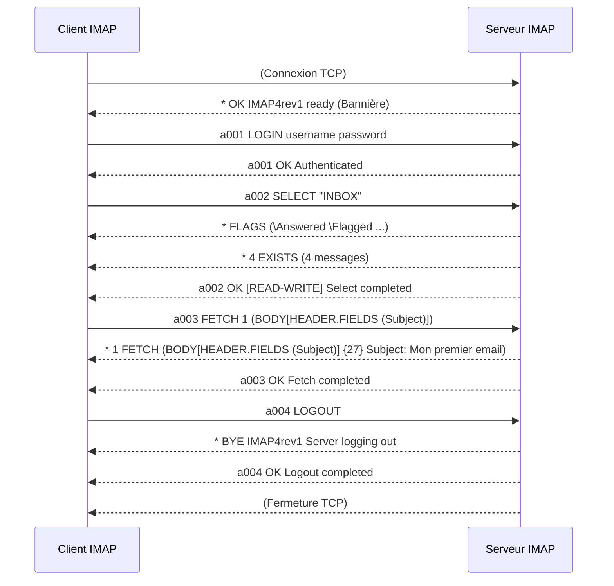

---
aliases:
  - IMAP
  - Internet Message Access Protocol
  - Protocole d'accès aux messages Internet
archetype: protocole
port_defaut: 143 (non-chiffré), 993 (chiffré, IMAPS)
couche_osi:
  - "Couche 7 - Application"
rfc:
  - RFC 9051 (IMAP4rev2)
  - RFC 3501 (IMAP4rev1)
  - RFC 2060 (IMAP4rev1)
cssclasses:
  - max
tags:
  - protocole
  - protocole/imap
  - modele-osi/couche-7
  - protocole/tcp
  - email
  - application/messagerie
  - chiffrement
  - protocole/ssl-tls
  - outil/wireshark
  - protocole/pop3
  - protocole/imap/commande
  - communication/reseau
  - securite/donnees
  - authentification
---

# IMAP (Internet Message Access Protocol)

> [!info] Carte d'Identité
> * **Couche OSI** : Couche 7 - Application
> * **Port par défaut** : `TCP/143` (non-chiffré), `TCP/993` (chiffré IMAPS)
> * **Transport** : TCP

L'**Internet Message Access Protocol** (IMAP) est un protocole standard de la couche application qui permet aux clients de messagerie de récupérer et de manipuler des messages électroniques sur un serveur de messagerie distant via une connexion TCP/IP. Contrairement au POP3, l'IMAP est conçu pour permettre une gestion complète d'une boîte aux lettres par plusieurs clients de messagerie, les messages restant généralement sur le serveur jusqu'à ce que l'utilisateur les supprime explicitement. Cela permet un accès aux e-mails depuis n'importe quel appareil et la synchronisation des actions (lu, non lu, déplacé) sur tous les clients.

## ⚙️ Fonctionnement (Session IMAP)
La connexion IMAP s'établit via une connexion TCP, généralement sur le port 143 pour les communications non chiffrées ou le port 993 pour IMAPS (IMAP sur SSL/TLS). Une fois la connexion TCP établie, la communication IMAP est basée sur un modèle commande-réponse textuel.

Le processus de session IMAP suit généralement les étapes suivantes :
1.  **Connexion TCP** : Le client établit une connexion TCP avec le serveur IMAP.
2.  **Bannière du Serveur** : Le serveur envoie une bannière d'accueil, indiquant qu'il est prêt à recevoir des commandes et listant parfois ses capacités.
3.  **Authentification** : Le client s'authentifie auprès du serveur à l'aide de commandes comme `LOGIN` (nom d'utilisateur et mot de passe) ou via des mécanismes SASL (Simple Authentication and Security Layer).
4.  **Sélection de Boîte aux Lettres** : Après une authentification réussie, le client sélectionne une boîte aux lettres à gérer (par exemple, `SELECT INBOX`).
5.  **Exécution des Commandes** : Le client peut ensuite émettre diverses commandes pour interagir avec les messages de la boîte aux lettres sélectionnée, telles que :
    *   `LIST` : Pour lister les dossiers (boîtes aux lettres).
    *   `FETCH` : Pour récupérer les en-têtes ou le corps des messages.
    *   `SEARCH` : Pour rechercher des messages sur le serveur.
    *   `STORE` : Pour modifier les drapeaux (flags) des messages (par exemple, marquer comme lu/non lu).
    *   `CREATE`, `DELETE`, `RENAME` : Pour gérer les boîtes aux lettres.
6.  **Déconnexion** : Le client peut terminer la session avec la commande `LOGOUT`.



## 📦 Structure du Paquet (Commandes et Réponses)
IMAP étant un protocole textuel, il n'y a pas de structure de paquet binaire fixe comme pour TCP ou IP. La communication se fait par des lignes de texte terminées par CRLF. Chaque commande client est préfixée d'un "tag" alphanumérique unique pour la session, qui est ensuite inclus dans la réponse du serveur pour faire correspondre les requêtes et les réponses.

| Élément | Description | Exemple |
|---|---|---|
| **Tag Client** | Identifiant alphanumérique unique pour chaque commande client. | `a001`, `ID002` |
| **Commande** | Verbe IMAP indiquant l'action à effectuer. | `LOGIN`, `SELECT`, `FETCH` |
| **Arguments** | Paramètres spécifiques à la commande (e.g., nom d'utilisateur, nom de boîte aux lettres, critères de recherche). | `username password`, `"INBOX"`, `1 (BODY[TEXT])` |
| **Réponse Taguée** | Réponse du serveur, préfixée par le même tag que la commande, indiquant le statut (OK, NO, BAD). | `a001 OK Authenticated` |
| **Réponse Non-Taguée** | Réponses du serveur (e.g., listes de messages, capacités du serveur, statut de la boîte aux lettres) qui ne sont pas directement liées à une commande spécifique. Précédées d'un `*`. | `* OK IMAP4rev1 ready` |

## 🦈 Analyse Wireshark
L'analyse du protocole IMAP avec Wireshark permet d'observer les échanges entre le client et le serveur.

> [!tip] Filtres Utiles
> ```
> # Filtrer tout le trafic IMAP
> imap
>
> # Filtrer par port IMAP standard (non-chiffré)
> tcp.port == 143
>
> # Filtrer par port IMAPS (chiffré)
> tcp.port == 993
>
> # Filtrer les requêtes de login (peut révéler les identifiants si non-chiffré)
> imap.request.command == "LOGIN"
>
> # Afficher les noms d'utilisateur et mots de passe (uniquement si non-chiffré)
> imap.request.username or imap.request.password
> ```
En l'absence de chiffrement (port 143), Wireshark peut afficher le nom d'utilisateur et le mot de passe en clair, ainsi que le contenu des messages. Pour les connexions IMAPS (port 993), le trafic est chiffré par SSL/TLS, rendant ces informations illisibles sans déchiffrement.

## 🛡️ Sécurité
> [!danger] Vulnérabilités Connues
> * **Sniffing** : Si la communication IMAP n'est pas chiffrée (utilisation du port 143), les identifiants de connexion et le contenu des e-mails sont transmis en clair et peuvent être facilement interceptés par un attaquant sur le réseau. Il est impératif d'utiliser IMAPS (port 993) avec SSL/TLS pour chiffrer la session.
> * **Authentification Faible / Spoofing** : Le protocole IMAP lui-même acceptait traditionnellement l'authentification en texte clair. Bien que l'utilisation de TLS soit désormais recommandée, le manque de prise en charge native de l'authentification multifacteur (MFA) par IMAP peut permettre à des attaquants de contourner les exigences MFA via des clients tiers, facilitant les attaques par *password spraying* ou *brute-force*.
> * **Vulnérabilités Serveur** : Des vulnérabilités dans les implémentations logicielles des serveurs IMAP peuvent être exploitées pour obtenir un accès non autorisé aux comptes de messagerie ou au serveur lui-même (par exemple, des vulnérabilités d'injection SQL ou des failles de déni de service par épuisement de mémoire).
> * **IMAP Injection** : Il s'agit d'une vulnérabilité où un attaquant peut injecter et exécuter des commandes IMAP arbitraires sur un système vulnérable en manipulant les entrées utilisateur. Cela peut entraîner la manipulation d'e-mails, la prise de contrôle de comptes ou la distribution de logiciels malveillants.
