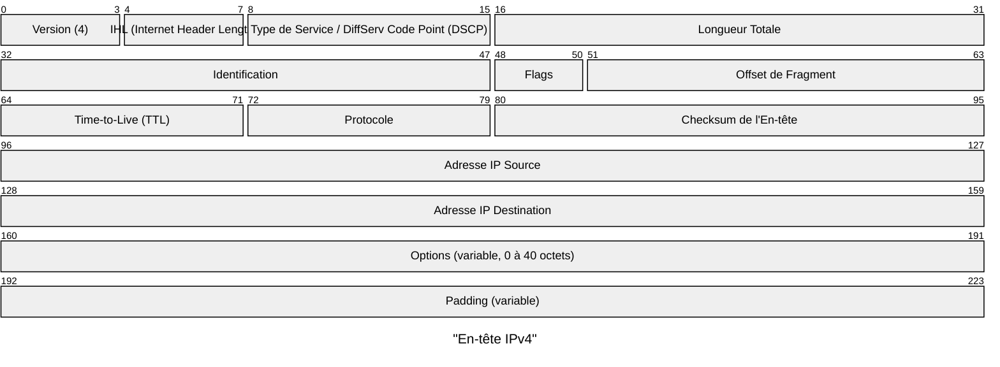
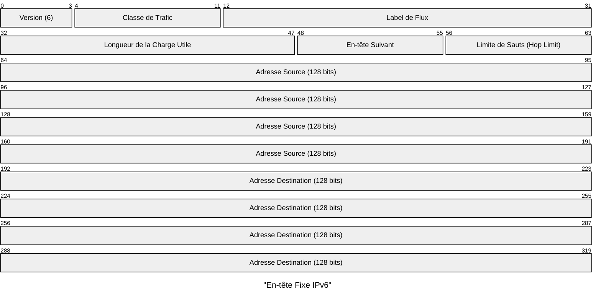

---
aliases:
  - Protocole Internet
  - IP
  - Internet Protocol
archetype: protocole
port_defaut: N/A
couche_osi:
  - "Couche 3 - Réseau"
rfc:
  - IPv4: RFC 791
  - IPv6: RFC 8200 (succède à RFC 2460)
cssclasses:
  - max
tags:
  - protocole/ip
  - protocole/internet
  - protocole/ip/ipv4
  - protocole/ip/ipv6
  - protocole/ip/connectionless
  - protocole/ip/unicast
  - protocole/ip/broadcast
  - protocole/ip/multicast
  - protocole/ip/private-address
  - protocole/ip/link-local
  - protocole/ip/loopback
  - protocole/ip/header
  - reseau/adressage/ip
  - modele-osi/couche-3
---

# Internet Protocol

> [!info] Carte d'Identité
> * **Couche OSI** : Couche 3 - Réseau
> * **Port par défaut** : `N/A`
> * **Transport** : Protocole de la couche réseau

## ⚙️ Fonctionnement

Le **Protocole Internet (IP)** est le protocole de communication fondamental de la suite de protocoles Internet, responsable de l'acheminement des datagrammes à travers les frontières des réseaux. Sa fonction de routage établit l'interconnexion des réseaux, formant ainsi Internet. L'IP a pour tâche de livrer les paquets de l'hôte source à l'hôte de destination en se basant uniquement sur les adresses IP présentes dans les en-têtes des paquets.

L'IP est un protocole *sans connexion* (connectionless), ce qui signifie que chaque paquet est traité indépendamment, sans qu'une connexion préalable ne soit établie entre la source et la destination. Les décisions de routage sont prises pour chaque paquet individuellement par les routeurs intermédiaires, qui déterminent le meilleur chemin pour atteindre la destination.

## Versions du Protocole Internet

Le Protocole Internet existe en deux versions principales : IPv4 et IPv6.

### IPv4

**IPv4** (Internet Protocol version 4) est la première version du Protocole Internet à être une spécification autonome, déployée sur l'ARPANET en janvier 1983. Il utilise des adresses de 32 bits, ce qui limite l'espace d'adressage à environ 4,3 milliards d'adresses uniques (2^32). Bien que de grands blocs soient réservés à des fins de réseau spéciales, l'épuisement des adresses IPv4 est un problème majeur ayant conduit au développement d'IPv6.

#### Mécanismes d'adressage IPv4
Les adresses IPv4 sont généralement représentées en *notation décimale à points*, composée de quatre octets exprimés individuellement en nombres décimaux (sans zéros non significatifs supplémentaires) et séparés par des points (par exemple, 192.168.1.1).

*   **Unicast** : Identifie une interface réseau unique. Les paquets envoyés à une adresse unicast sont livrés à cette interface spécifique.
*   **Broadcast** : Permet d'envoyer un message à tous les appareils d'un segment de réseau local. Le trafic broadcast est limité au réseau local et n'est pas routé sur Internet.
*   **Multicast** : Utilisé pour envoyer des messages à un groupe de dispositifs. Les hôtes intéressés rejoignent un groupe multicast pour recevoir les paquets.

Des blocs d'adresses spécifiques sont réservés pour des usages particuliers :
*   **Adresses privées** : Environ 18 millions d'adresses sont réservées pour les réseaux privés (par exemple, 10.0.0.0/8, 172.16.0.0/12, 192.168.0.0/16) telles que définies par le RFC 1918. Ces paquets ne sont pas routables sur l'Internet public.
*   **Adresses link-local** : La plage 169.254.0.0/16 est allouée pour la configuration réseau sans serveur DHCP, permettant aux appareils de s'auto-attribuer une adresse pour la communication sur un lien local.
*   **Adresses de bouclage (Loopback)** : La plage 127.0.0.0/8 (couramment 127.0.0.1) est utilisée par un dispositif pour s'envoyer du trafic à lui-même, principalement pour des tests ou des communications internes à la machine.

#### Structure de l'En-tête IPv4

L'en-tête IPv4 est une structure de 20 à 60 octets qui contient des champs d'information sur le paquet. La taille minimale est de 20 octets (sans options), et la taille maximale est de 60 octets (avec options).



### IPv6

**IPv6** (Internet Protocol version 6) est la version la plus récente du Protocole Internet, développée par l'IETF pour résoudre le problème anticipé de l'épuisement des adresses IPv4. Il a été ratifié en tant que norme Internet le 14 juillet 2017 (RFC 8200).

#### Mécanismes d'adressage IPv6
Les adresses IPv6 sont longues de 128 bits, offrant un espace d'adressage considérablement élargi. Elles sont représentées par huit groupes de quatre chiffres hexadécimaux chacun, séparés par des deux-points (par exemple, 2001:0db8:0000:0000:0000:8a2e:0370:7334). Les représentations peuvent être raccourcies selon des règles spécifiques (par exemple, 2001:db8::8a2e:370:7334).

*   **Unicast** : Identifie une seule interface réseau, similaire à IPv4. Deux portées sont définies : *link-local* (valide uniquement sur un segment de lien unique) et *global* (routable sur Internet).
*   **Multicast** : Le mode multicast d'IPv6 est similaire à celui d'IPv4, permettant l'envoi de paquets à plusieurs hôtes intéressés qui rejoignent un groupe multicast. IPv6 ne prend pas en charge la diffusion traditionnelle (broadcast) ; le même résultat est obtenu en envoyant un paquet au groupe multicast link-local (ff02::1).
*   **Anycast** : Une nouvelle méthode d'adressage où plusieurs interfaces (hôtes) se voient attribuer la même adresse Anycast. Un paquet envoyé à une adresse anycast est livré à une seule des interfaces membres, généralement l'hôte le plus proche en termes de coût de routage.

IPv6 introduit également l'*autoconfiguration d'adresses sans état* (SLAAC), où les appareils peuvent générer et configurer automatiquement leurs propres adresses IPv6 sans avoir besoin d'un serveur DHCP. Il réduit également la dépendance à la *traduction d'adresses réseau (NAT)*, rendant la communication de bout en bout plus simple.

#### Structure de l'En-tête IPv6

Un paquet IPv6 se compose de deux parties : un en-tête fixe et une ou plusieurs en-têtes d'extension optionnelles. L'en-tête fixe occupe les 40 premiers octets (320 bits) du paquet IPv6.



Les **en-têtes d'extension** d'IPv6 transportent des options qui sont utilisées pour un traitement spécial d'un paquet dans le réseau, par exemple pour le routage, la fragmentation et la sécurité (IPsec). Contrairement à IPv4, les routeurs ne fragmentent jamais un paquet IPv6 ; la fragmentation est gérée par l'hôte source.

## 📦 Structure du Paquet (Header)

### En-tête IPv4
| Champ | Taille (bits) | Description |
|---|---|---|
| **Version** | 4 | Version du protocole Internet (pour IPv4, c'est toujours 4). |
| **IHL** (Internet Header Length) | 4 | Longueur de l'en-tête IP en mots de 32 bits (unités de 4 octets). La valeur minimale est 5 (20 octets), maximale 15 (60 octets). |
| **Type de Service / DSCP** | 8 | Spécifie les services différenciés (DiffServ) pour la qualité de service (QoS). |
| **Longueur Totale** | 16 | Longueur totale du datagramme IP en octets, incluant l'en-tête et les données. La taille maximale est 65 535 octets. |
| **Identification** | 16 | Champ d'identification unique utilisé pour identifier les fragments d'un datagramme original. |
| **Flags** | 3 | Trois bits de contrôle pour la fragmentation : Réservé, Don't Fragment (DF), More Fragments (MF). |
| **Offset de Fragment** | 13 | Indique la position du fragment actuel dans le datagramme original, en unités de 8 octets. |
| **Time-to-Live (TTL)** | 8 | Limite le nombre de sauts (routeurs) que le paquet peut traverser avant d'être écarté. Décrémenté à chaque saut. |
| **Protocole** | 8 | Identifie le protocole de la couche supérieure (par exemple, TCP, UDP, ICMP) contenu dans la charge utile du paquet. |
| **Checksum de l'En-tête** | 16 | Utilisé pour la détection d'erreurs dans l'en-tête IP. Le paquet est écarté si le checksum est invalide. |
| **Adresse IP Source** | 32 | L'adresse IP de l'expéditeur du paquet. |
| **Adresse IP Destination** | 32 | L'adresse IP du destinataire prévu du paquet. |
| **Options** | Variable (0-40) | Champ optionnel utilisé pour des fonctions de contrôle ou de débogage. |
| **Padding** | Variable | Remplissage pour garantir que l'en-tête est un multiple de 32 bits (4 octets). |

### En-tête Fixe IPv6
| Champ | Taille (bits) | Description |
|---|---|---|
| **Version** | 4 | Version du protocole Internet (pour IPv6, c'est toujours 6). |
| **Classe de Trafic** | 8 | Utilisé pour la classification du trafic, y compris la notification explicite de congestion (ECN) et les services différenciés (DiffServ). |
| **Label de Flux** | 20 | Permet d'identifier des séquences de paquets qui nécessitent un traitement spécial par les routeurs IPv6, comme une qualité de service non standard. |
| **Longueur de la Charge Utile** | 16 | Longueur de la charge utile du paquet en octets, qui inclut les en-têtes d'extension et les données de la couche supérieure. |
| **En-tête Suivant** | 8 | Identifie le type d'en-tête qui suit immédiatement l'en-tête IPv6 (un en-tête d'extension ou un en-tête de couche supérieure). |
| **Limite de Sauts (Hop Limit)** | 8 | Identique au champ TTL d'IPv4, décrémenté par chaque nœud qui transfère le paquet. Le paquet est écarté si la limite atteint zéro. |
| **Adresse Source** | 128 | L'adresse IPv6 de l'expéditeur initial du paquet. |
| **Adresse Destination** | 128 | L'adresse IPv6 du destinataire prévu du paquet. |

## 🦈 Analyse Wireshark

Wireshark offre un support complet pour l'analyse des protocoles IP, permettant de capturer, filtrer et analyser le trafic IPv4 et IPv6.

> [!tip] Filtres Utiles
> ```
> # Filtrer tout le trafic IP (IPv4 et IPv6)
> ip
>
> # Filtrer le trafic IPv4
> ip.version == 4
> ip
>
> # Filtrer le trafic IPv6
> ipv6
> ip.version == 6
>
> # Filtrer par adresse IP source ou destination (IPv4)
> ip.addr == 192.168.1.1
> ip.src == 192.168.1.1
> ip.dst == 192.168.1.1
>
> # Filtrer par sous-réseau IPv4 (notation CIDR)
> ip.addr == 192.168.1.0/24
>
> # Filtrer par adresse IP source ou destination (IPv6)
> ipv6.addr == 2001:db8::1
> ipv6.src == 2001:db8::1
> ipv6.dst == 2001:db8::1
>
> # Filtrer les paquets fragmentés IPv4
> ip.flags.mf == 1 or ip.frag_offset != 0
>
> # Filtrer le trafic ICMP (pour IPv4 et IPv6)
> icmp or icmpv6
> ```

## 🛡️ Sécurité

Les protocoles Internet ont montré des vulnérabilités mises en évidence par des attaques réseau et des évaluations de sécurité. La sécurité n'a pas été entièrement anticipée lors de la conception initiale de l'ARPANET et des débuts d'Internet.

> [!danger] Vulnérabilités Connues
> *   **IP Spoofing** : Une technique où les attaquants manipulent l'adresse IP source dans les paquets pour usurper l'identité d'une entité de confiance ou masquer leur identité. Cela peut être utilisé pour contourner les contrôles d'accès ou lancer des attaques DoS. La défense implique le filtrage des paquets aux frontières du réseau.
> *   **Attaques par Fragmentation IP** : Exploitation du processus de division des grands paquets en fragments plus petits. Les attaquants peuvent manipuler ou inonder un réseau avec des paquets fragmentés pour submerger les ressources, perturber la communication ou échapper aux mécanismes de détection. Des pare-feu et systèmes de détection d'intrusion peuvent aider à atténuer ces attaques.
> *   **Attaques de Routage IP** : Visent à perturber ou manipuler le processus de routage pour rediriger le trafic, intercepter des données ou mener des attaques de type "homme du milieu" (MitM). L'utilisation de protocoles de routage sécurisés avec authentification et chiffrement, ainsi que la surveillance réseau, peuvent prévenir ces attaques.
> *   **Attaques DDoS basées sur IP** : Les attaquants peuvent utiliser l'adresse IP pour lancer des attaques DDoS, surchargeant les serveurs de l'entreprise avec un trafic excessif, ce qui entraîne des temps d'arrêt du système.
> *   **Sniffing** : L'IP lui-même ne fournit pas de chiffrement des données. La confidentialité est assurée par des protocoles de couches supérieures comme *IPsec*.
> *   **Spoofing** : L'IP ne fournit pas d'authentification intégrée de la source, laissant la porte ouverte à l'usurpation d'identité. *IPsec* peut apporter l'authentification et l'intégrité des paquets.

Les protocoles de la couche supérieure de la suite de protocoles Internet sont responsables de la résolution des problèmes de fiabilité et de sécurité non gérés par IP.