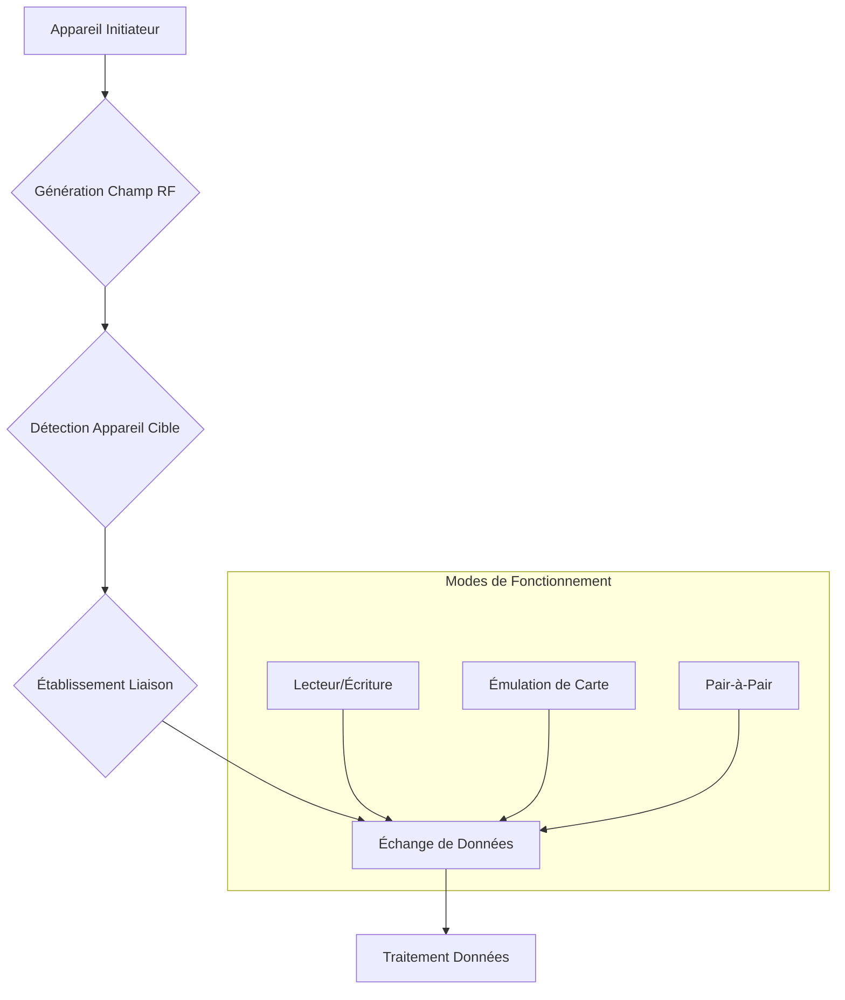

---
aliases:
  - Communication en Champ Proche
  - NFC
  - Near Field Communication
archetype: protocole
port_defaut: N/A
couche_osi:
  - "Couche 1 - Physique"
  - "Couche 2 - Liaison"
rfc:
  - RFC 9428
  - RFC 4729
  - ISO/IEC 18092
  - ISO/IEC 14443
  - ISO/IEC 15693
cssclasses:
  - max
tags:
  - nfc
  - sans-fil
  - communication/sans-fil
  - courte-portee
  - couplage-inductif
  - radiofrequence
  - modele-osi/couche-1
  - modele-osi/couche-2
  - nfc/mode/lecteur-ecriture
  - nfc/mode/emulation-carte
  - nfc/mode/pair-a-pair
  - norme/iso-iec-14443
  - norme/felica
  - norme/iso-iec-18092
  - nfc-forum
  - protocole/llcp
  - ndef
  - donnee/structure
  - paiement-sans-contact
  - rfid
  - protocole/reseau
  - protocole/sans-fil
---

# Near Field Communication (NFC)

> [!info] Carte d'Identité
> * **Couche OSI** : Couche 1 - Physique, Couche 2 - Liaison
> * **Port par défaut** : `N/A`
> * **Transport** : N/A (Communication directe par couplage inductif)

## ⚙️ Fonctionnement (Principes et Modes de Communication)

La Communication en Champ Proche (NFC) est un ensemble de protocoles de communication sans fil à courte portée qui permet l'échange de données entre deux appareils électroniques sur une distance de 4 centimètres (1,5 pouce) ou moins. Elle repose sur le principe du *couplage inductif* entre deux bobines électromagnétiques. Un appareil, l'initiateur, génère un champ RF (Radio Fréquence) qui peut alimenter une cible passive, ou les deux appareils peuvent générer leurs propres champs pour communiquer.

Le processus de communication se déroule généralement en quatre étapes :
1.  **Génération du Champ Électromagnétique** : Un appareil compatible NFC génère un champ électromagnétique, créant une zone d'influence autour de lui.
2.  **Détection de l'Appareil** : Lorsqu'un autre appareil compatible NFC entre dans ce champ, il est détecté et son antenne est activée par le champ électromagnétique.
3.  **Établissement du Canal de Communication et Échange de Données** : Les deux appareils établissent un canal de communication et échangent des données.
4.  **Traitement des Données** : L'appareil récepteur traite les données reçues et effectue les actions appropriées.

NFC supporte différents modes de fonctionnement :
*   **Mode Lecteur/Écriture** : Un appareil NFC actif (comme un smartphone) lit les informations stockées sur des étiquettes NFC passives ou écrit des données sur celles-ci, comme des URL ou des informations de contact.
*   **Mode d'Émulation de Carte** : Un appareil compatible NFC se comporte comme une carte à puce sans contact, permettant des transactions telles que le paiement ou la billetterie. Les services comme Apple Pay et Google Pay utilisent ce mode.
*   **Mode Pair-à-Pair (Peer-to-Peer)** : Deux appareils NFC actifs peuvent communiquer directement entre eux pour échanger des informations de manière ad hoc, comme des contacts ou des fichiers.

Les standards NFC sont basés sur des normes d'identification par radiofréquence (RFID) existantes, notamment ISO/IEC 14443 et FeliCa (JIS X 6319-4), et incluent les normes ISO/IEC 18092 (NFCIP-1) et celles définies par le NFC Forum. Ces normes régissent l'initialisation, la négociation et la maintenance de la communication aux couches physique et liaison de données. Le protocole Logical Link Control Protocol (LLCP) du NFC Forum définit un protocole de couche 2 du modèle OSI pour la communication pair-à-pair.

## 📦 Structure des Données (NDEF)

NFC utilise le format d'échange de données NFC (NDEF - NFC Data Exchange Format) pour structurer l'échange d'informations entre appareils et tags NFC. NDEF est un format de message binaire léger qui encapsule une ou plusieurs charges utiles (payloads) définies par l'application.

Un message NDEF est composé d'un ou plusieurs *enregistrements NDEF (NDEF Records)*. Chaque enregistrement NDEF est une unité d'information autonome qui contient :
*   **Un En-tête (Header)** : Décrit la charge utile avec des informations telles que le type, la longueur et un identifiant optionnel.
    *   **Payload Length (Longueur de la Charge Utile)** : Indique la taille des données utiles.
    *   **Type** : Spécifie le type de données (par exemple, URL, texte, type MIME, ou types spécifiques à NFC).
    *   **ID (Identifiant)** : Un champ optionnel pour identifier un enregistrement particulier au sein d'un message NDEF.
*   **Une Charge Utile (Payload)** : Les données réelles à stocker ou à échanger.

| Champ        | Taille | Description                                                                |
|--------------|--------|----------------------------------------------------------------------------|
| **MB (Message Begin)** | 1 bit  | Indique le début d'un message NDEF (premier enregistrement).|
| **ME (Message End)**   | 1 bit  | Indique la fin d'un message NDEF (dernier enregistrement). |
| **CF (Chunk Flag)**    | 1 bit  | Indique si la charge utile est fragmentée.                               |
| **SR (Short Record)**  | 1 bit  | Indique si le champ de longueur de la charge utile est court (1 octet) ou long (4 octets). |
| **IL (ID Length)**     | 1 bit  | Indique la présence d'un champ d'identifiant de charge utile. |
| **TNF (Type Name Format)** | 3 bits | Format du champ de type d'enregistrement (ex: vide, URI, MIME, NFC Well Known Type). |
| **Payload Length** | 1 ou 4 octets | Longueur de la charge utile.                                     |
| **ID Length**    | 1 octet  | Longueur du champ ID (si IL est défini).                                   |
| **Type**         | Variable | Décrit le type de la charge utile.              |
| **ID**           | Variable | Identifiant optionnel de l'enregistrement.                   |
| **Payload**      | Variable | Les données réelles (texte, URL, vCard, etc.).      |

## 🦈 Analyse Wireshark

L'analyse directe des communications NFC avec Wireshark est complexe car il s'agit d'une technologie à très courte portée fonctionnant aux couches physiques et liaison. Les captures "over-the-air" nécessiteraient un équipement spécialisé pour intercepter le champ électromagnétique.

Cependant, Wireshark peut être utilisé pour analyser les données NDEF (NFC Data Exchange Format) une fois qu'elles ont été lues ou écrites par un appareil NFC et transmises à une application ou un système qui les rend disponibles pour l'analyse.

> [!tip] Compréhension des données NFC
> En l'absence de capture directe du signal RF, l'analyse se concentre souvent sur les **messages NDEF** échangés. Ces messages contiennent des *enregistrements* qui encapsulent les données transférées (ex: URL, texte, contacts).
>
> Pour les développeurs, il est plus courant d'instrumenter les applications utilisant NFC pour loguer les messages NDEF reçus ou envoyés, puis d'analyser ces logs.

## 🛡️ Sécurité

Bien que le NFC offre une sécurité inhérente grâce à sa très courte portée de communication (quelques centimètres), ce qui rend l'interception plus difficile qu'avec d'autres technologies sans fil, il n'est pas totalement exempt de vulnérabilités.

> [!danger] Vulnérabilités Connues
> *   **Écoute Clandestine (Eavesdropping)** : Un attaquant avec un équipement spécialisé peut intercepter les communications NFC à courte distance.
> *   **Attaques par Relais (Relay Attacks / Man-in-the-Middle)** : Un attaquant peut intercepter et relayer la communication entre un appareil légitime et un lecteur NFC, permettant des transactions ou un accès non autorisé.
> *   **Altération des Données (Data Tampering)** : Des acteurs malveillants pourraient manipuler les données échangées lors d'une transaction NFC.
> *   **Clonage** : Les données d'une carte NFC peuvent être copiées, permettant de créer une carte clonée pour un accès ou une utilisation frauduleuse.
> *   **Logiciels Malveillants (Malware)** : Des signaux NFC manipulés peuvent potentiellement déclencher le téléchargement de logiciels malveillants sur les appareils (des vulnérabilités ont été découvertes et corrigées).
> *   **Perte ou Vol d'Appareils** : Un appareil NFC perdu ou volé, s'il n'est pas correctement sécurisé (ex: par authentification biométrique), peut être utilisé pour des paiements ou un accès non autorisé.

*   **Chiffré ?** : Le NFC lui-même ne fournit pas toujours un chiffrement inhérent à toutes les communications. Cependant, les applications utilisant le NFC, en particulier pour les paiements ou les données sensibles, peuvent implémenter des algorithmes de chiffrement (comme ceux utilisés pour les cartes de crédit) et s'appuyer sur des *éléments sécurisés (Secure Elements)* matériels pour protéger les informations.
*   **Authentification faible ?** : La simple proximité peut parfois être suffisante pour initier une communication NFC. Pour des transactions ou un accès sécurisé, des mesures d'authentification supplémentaires sont souvent requises et fortement recommandées, telles que des codes PIN, l'authentification biométrique (empreinte digitale, reconnaissance faciale) ou des processus d'authentification forts au niveau de l'application.

## 📝 Applications Courantes

NFC est une technologie polyvalente avec un large éventail d'applications pratiques:
*   **Paiements sans Contact** : Utilisation de smartphones et de cartes pour des transactions rapides et sécurisées (ex: Apple Pay, Google Pay).
*   **Contrôle d'Accès** : Clés numériques, badges d'accès pour les bâtiments, les transports en commun ou les véhicules.
*   **Transfert de Données** : Partage rapide de petites quantités de données comme des contacts, des URL, des photos ou l'établissement de connexions Bluetooth/Wi-Fi.
*   **Billetterie Électronique** : Tickets de transport, billets d'événements, cartes de fidélité.
*   **Paires Intelligentes (Smart Pairing)** : Simplification du jumelage d'appareils Bluetooth ou de la configuration de réseaux Wi-Fi par simple contact.
*   **Étiquettes et Affiches Intelligentes (Smart Tags/Posters)** : Accès à des informations supplémentaires, des promotions ou des automatisations en tapant sur des étiquettes NFC intégrées.
*   **Vérification d'Identité Numérique** : Utilisation de jetons d'identité autorisés pour vérifier des appareils ou des identités.

## 🔗 Notes Connexes
*   **Technologie mère** : RadioFrequencyIdentification (RFID)
*   **Applications** : PaiementSansContact
*   **Standards** : ISO14443, ISO18092