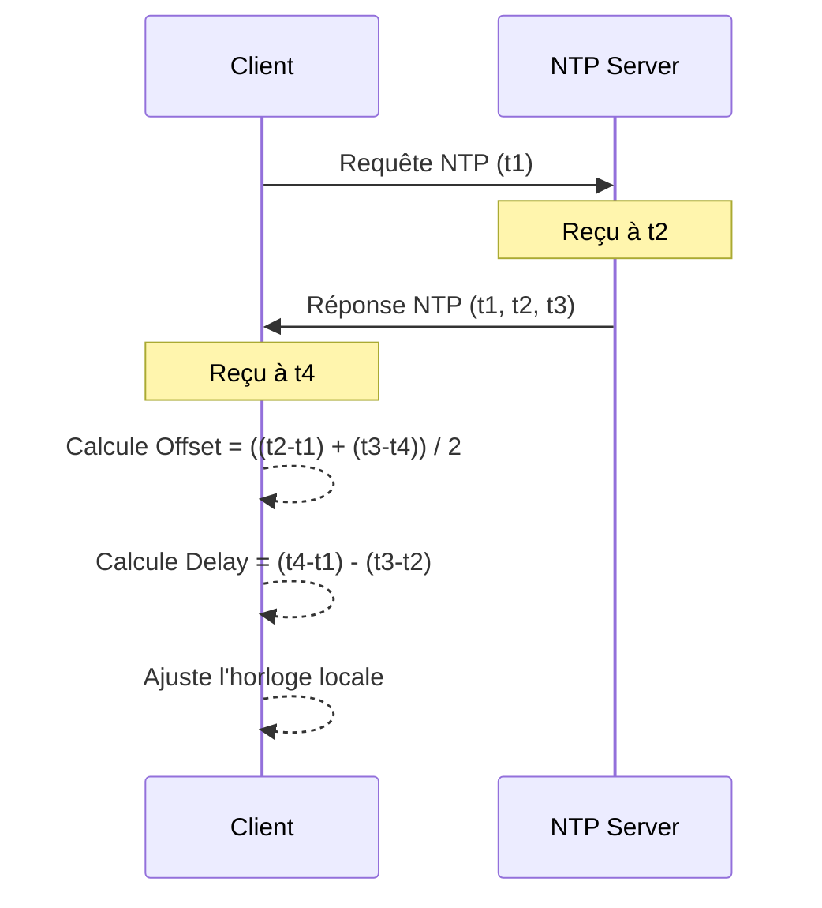

---
cssclasses:
  - max
aliases:
  - Network Time Protocol
  - NTP
  - Protocole de Temps Réseau
archetype: protocole
port_defaut: 123
couche_osi:
  - "Couche 7 - Application"
rfc:
  - RFC 5905
  - RFC 1305
tags:
  - protocole/ntp
  - protocole/reseau
  - protocole/udp
  - modele-osi/couche-7
  - communication/handshake
  - modele/client-serveur
  - synchronisation/horloge
---

# Network Time Protocol (NTP)

Le **Network Time Protocol (NTP)** est un protocole réseau fondamental utilisé pour la synchronisation des horloges d'ordinateurs sur des réseaux à paquets, à latence variable. Il assure que tous les systèmes connectés disposent d'une heure précise et coordonnée, généralement avec une précision de quelques millisecondes par rapport au Temps Universel Coordonné (UTC). Développé par David L. Mills de l'Université du Delaware, NTP est l'un des plus anciens protocoles Internet encore en usage.

> [!info] Carte d'Identité
> * **Couche OSI** : Couche 7 - Application
> * **Port par défaut** : `UDP 123`
> * **Transport** : UDP

## ⚙️ Fonctionnement (Handshake)

Le protocole NTP opère principalement selon un modèle client-serveur, mais prend également en charge les modes *peer* (pair-à-pair), *broadcast* et *multicast*. En mode client-serveur, la synchronisation horaire repose sur l'échange de paquets contenant des horodatages pour calculer le décalage (offset) et le délai (delay) du réseau.

Le processus de synchronisation implique quatre horodatages clés :

1.  **T1 (Originate Timestamp)** : Le client envoie un paquet de requête au serveur, enregistrant l'heure de départ du client (t1).
2.  **T2 (Receive Timestamp)** : Le serveur reçoit le paquet de requête du client, enregistrant l'heure de réception par le serveur (t2).
3.  **T3 (Transmit Timestamp)** : Le serveur envoie un paquet de réponse au client, enregistrant l'heure de départ du serveur (t3).
4.  **T4 (Final Receive Timestamp)** : Le client reçoit le paquet de réponse du serveur, enregistrant l'heure de réception par le client (t4).

À partir de ces quatre horodatages, le client calcule le délai total aller-retour du réseau et le décalage de son horloge par rapport à celle du serveur :

*   **Délai (Delay)** = (T4 - T1) - (T3 - T2)
*   **Décalage (Offset)** = ((T2 - T1) + (T3 - T4)) / 2

Le client ajuste ensuite son horloge locale en fonction de ce décalage pour se synchroniser avec le serveur.



## 📦 Structure du Paquet (Header)

Un paquet NTP standard est généralement une structure de données de 48 octets, divisée en plusieurs champs essentiels pour la synchronisation.

| Champ               | Taille    | Description                                                                                                                                                                                                                                                                     |
| :------------------ | :-------- | :------------------------------------------------------------------------------------------------------------------------------------------------------------------------------------------------------------------------------------------------------------------------------ |
| **Leap Indicator (LI)** | 2 bits    | Indique une seconde intercalaire imminente à insérer ou supprimer à la fin du mois.                                                                                                                                                                             |
| **Version Number (VN)** | 3 bits    | Spécifie la version de NTP utilisée (actuellement la version 4).                                                                                                                                                                                                |
| **Mode**            | 3 bits    | Indique le mode de fonctionnement (client, serveur, symétrique actif, symétrique passif, broadcast, message de contrôle).                                                                                                                                         |
| **Stratum**         | 8 bits    | Représente le niveau de la couche NTP de l'horloge locale. Stratum 0 (sources de référence comme les horloges atomiques), Stratum 1 (serveurs directement connectés à Stratum 0), etc. Le maximum est 16.                                |
| **Poll Interval**   | 8 bits    | Spécifie l'intervalle maximal entre les messages successifs.                                                                                                                                                                                                       |
| **Precision**       | 8 bits    | Décrit la précision de l'horloge locale.                                                                                                                                                                                                                       |
| **Root Delay**      | 32 bits   | Délai aller-retour total vers la source de référence primaire.                                                                                                                                                                                                    |
| **Root Dispersion** | 32 bits   | Dispersion maximale (pire cas) entre l'horloge du système local et la source de référence primaire.                                                                                                                                                                  |
| **Reference ID**    | 32 bits   | Identifiant de l'horloge de référence spécifique.                                                                                                                                                                                                              |
| **Reference Timestamp** | 64 bits   | Heure à laquelle l'horloge système a été réglée pour la dernière fois.                                                                                                                                                                                      |
| **Originate Timestamp** | 64 bits   | Heure à laquelle la requête a quitté le client pour le serveur (t1).                                                                                                                                                                                      |
| **Receive Timestamp** | 64 bits   | Heure à laquelle la requête a été reçue par le serveur (t2).                                                                                                                                                                                             |
| **Transmit Timestamp** | 64 bits   | Heure à laquelle la réponse a quitté le serveur pour le client (t3).                                                                                                                                                                                     |
| **Extension Fields** | Variable  | Champs optionnels pour l'authentification et les extensions.                                                                                                                                                                                                   |
| **Authenticator**   | Variable  | Champs pour l'authentification du message (clé MD5, hachage).                                                                                                                                                                                                     |

## 🦈 Analyse Wireshark
NTP utilise le port UDP 123.

> [!tip] Filtres Utiles
> ```
> # Filtrer par protocole
> ntp
>
> # Filtrer par mode (ex: client)
> ntp.mode == 3
>
> # Filtrer par stratum (ex: stratum 1)
> ntp.stratum == 1
>
> # Afficher les paquets avec un champ LI (Leap Indicator) différent de "no warning"
> ntp.li != 0
> ```

## 🛡️ Sécurité
La sécurité de NTP est cruciale en raison de son rôle dans la synchronisation horaire, qui peut impacter de nombreux services dépendant du temps.

> [!danger] Vulnérabilités Connues
> *   **Attaques par déni de service (DoS) et amplification DDoS** : Les services NTP mal configurés ou exposés peuvent être exploités pour des attaques par amplification DDoS. Un attaquant envoie de petites requêtes à un serveur NTP vulnérable avec l'adresse IP de la victime usurpée, et le serveur répond avec des paquets beaucoup plus volumineux à la victime, saturant ainsi son réseau. La commande `MONLIST` (Mode 6) était particulièrement utilisée pour ce type d'attaque, bien que la plupart des serveurs modernes l'aient désactivée.
> *   **Usurpation (Spoofing)** : Sans mécanismes d'authentification robustes, un attaquant peut usurper l'identité d'un serveur NTP fiable pour fournir des informations horaires incorrectes, ce qui peut perturber les systèmes ou les mécanismes de sécurité basés sur le temps.
> *   **Attaques Man-in-the-Middle (MITM)** : Un attaquant peut intercepter et manipuler les paquets NTP en transit pour altérer les horodatages, bien que les calculs de décalage et de délai de NTP soient conçus pour atténuer certains de ces effets.
> *   **Vulnérabilités logicielles** : Des failles de sécurité, y compris des injections de commande, peuvent exister dans les implémentations logicielles de NTP (ex: `ntpd`), pouvant permettre à des attaquants de compromettre le service ou d'exécuter du code arbitraire.
> *   **Sniffing** : Le protocole NTP ne chiffre pas les données de temps par défaut. Les paquets peuvent être sniffés pour observer les horodatages, mais cela ne compromet pas directement la synchronisation si l'authentification est en place.

**Authentification** :
NTPv2 a introduit des schémas d'authentification. Pour sécuriser les communications, NTPv4 utilise des mécanismes d'authentification pour vérifier l'intégrité et l'authenticité des paquets. Initialement, l'authentification basée sur MD5 était supportée, mais elle est désormais considérée comme trop faible et **AES-CMAC** est recommandée pour une meilleure sécurité. Cela permet de garantir que les paquets proviennent d'une source fiable et n'ont pas été altérés.