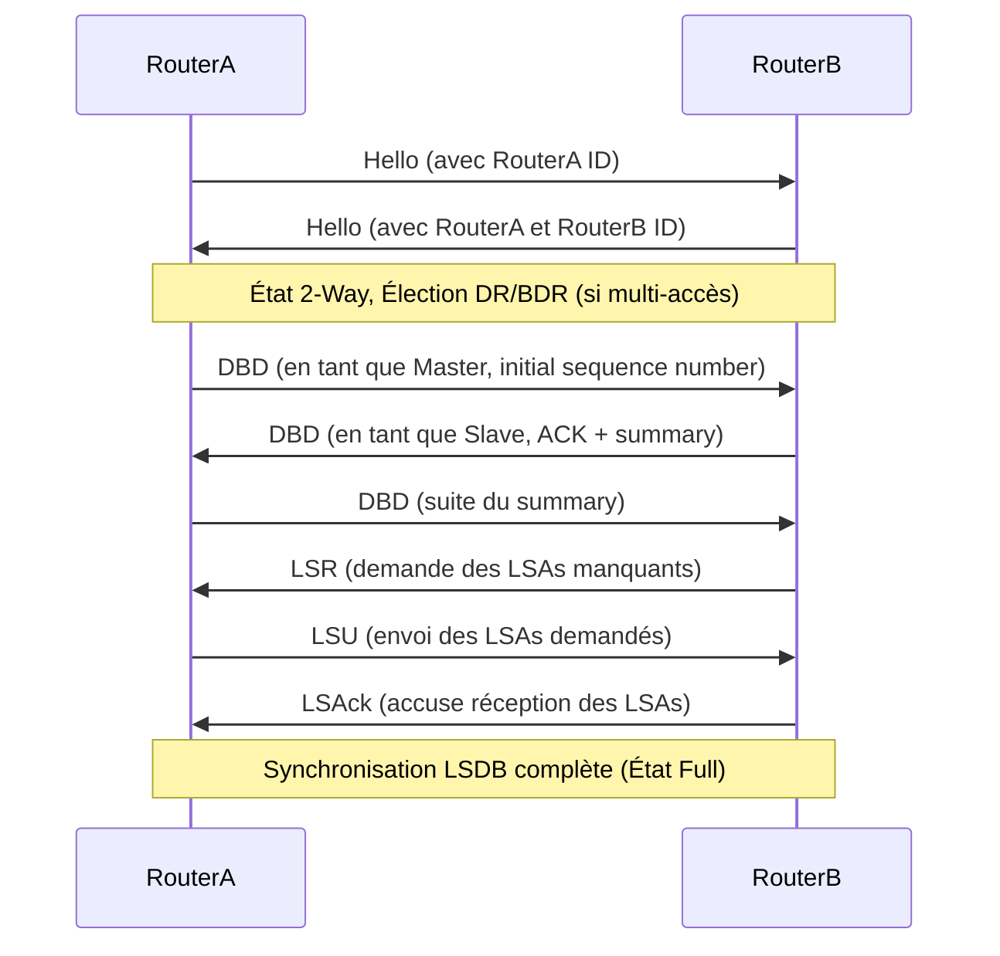

---
aliases:
  - "OSPF"
  - "Open Shortest Path First"
  - "Protocole OSPF"
archetype: protocole
port_defaut: "Protocole IP 89"
couche_osi:
  - "Couche 3 - Réseau"
rfc:
  - "RFC 2328" # OSPFv2
  - "RFC 5340" # OSPFv3
cssclasses:
  - max
tags:
  - protocole/ospf
  - routage
  - routage/dynamique
  - protocole/igp
  - modele-osi/couche-3
  - protocole/ip
  - routage/etat-de-lien
  - algorithme/dijkstra
  - protocole/ospf/lsa
  - protocole/ospf/lsdb
  - protocole/ospf/hello
  - protocole/ospf/dbd
  - protocole/ospf/lsr
  - protocole/ospf/lsu
  - protocole/ospf/lsack
  - protocole/ospf/ospfv2
  - protocole/ospf/ospfv3
  - reseau/multicast
  - reseau/systeme-autonome
  - protocole/ip/ipv4
  - protocole/ip/ipv6
---

# Protocole OSPF (Open Shortest Path First)

> [!info] Carte d'Identité
> * **Couche OSI** : Couche 3 - Réseau
> * **Port par défaut** : `Protocole IP 89`
> * **Transport** : IP

Le protocole **Open Shortest Path First (OSPF)** est un protocole de routage dynamique à état de lien (link-state) largement utilisé comme protocole de passerelle interne (IGP) au sein d'un système autonome (AS). OSPF a été conçu pour les environnements TCP/IP et prend en charge le découpage en sous-réseaux IP. Il est réputé pour sa scalabilité, son efficacité et sa capacité à prévenir les boucles de routage.

## ⚙️ Fonctionnement (Adjacence et Synchronisation de Base de Données)

OSPF fonctionne en construisant une carte topologique détaillée du réseau. Chaque routeur OSPF maintient une base de données d'état de lien (LSDB) qui contient des informations sur l'état de ses interfaces et de ses voisins. Ces informations sont échangées via des annonces d'état de lien (LSAs - Link-State Advertisements) inondées dans la zone (area). Chaque routeur utilise ensuite l'algorithme de Dijkstra (également appelé Shortest Path First - SPF) pour calculer le chemin le plus court vers chaque destination et construire sa table de routage.

Le processus d'établissement d'une relation de voisinage (adjacence) entre routeurs OSPF est une étape cruciale :

1.  **Découverte des Voisins (Hello)** : Les routeurs OSPF se découvrent mutuellement en envoyant périodiquement des paquets *Hello* sur leurs interfaces activées pour OSPF. Ces paquets sont envoyés à l'adresse de multidiffusion 224.0.0.5 (tous les routeurs OSPF) ou FF02::5 pour IPv6. Les paquets Hello contiennent des informations telles que l'ID du routeur, l'ID de la zone, les intervalles Hello/Dead, et les routeurs voisins déjà vus. Pour que deux routeurs deviennent voisins, certains paramètres dans les paquets Hello doivent correspondre, notamment l'ID de zone, les intervalles Hello/Dead, le masque de sous-réseau (sur les réseaux de diffusion), et les paramètres d'authentification.

2.  **Élection Master/Slave (Exstart)** : Une fois la relation bidirectionnelle établie (état 2-Way), les routeurs échangent des paquets *Database Description (DBD)* pour décrire le contenu de leur LSDB. Une élection Master/Slave est effectuée pour gérer la séquence d'échange de DBD, le routeur avec le Router ID le plus élevé devenant le Master.

3.  **Synchronisation de la LSDB (Exchange, Loading, Full)** : Les routeurs échangent ensuite les en-têtes de LSA via les paquets DBD. Si un routeur découvre qu'il lui manque des informations ou que ses informations sont obsolètes, il envoie des paquets *Link State Request (LSR)* pour demander des LSAs spécifiques. Le voisin répond avec des paquets *Link State Update (LSU)* contenant les LSAs demandés. Chaque LSU reçu est accusé de réception par un paquet *Link State Acknowledgment (LSAck)* pour assurer la fiabilité. Ce processus se poursuit jusqu'à ce que les bases de données d'état de lien soient synchronisées, atteignant l'état *Full*.



### Versions d'OSPF

OSPF a évolué pour s'adapter aux changements de l'adressage IP et des exigences réseau :
*   **OSPFv1** : La version originale définie dans la RFC 1131, avec des limitations en termes de scalabilité et d'extensibilité.
*   **OSPFv2** : La version la plus couramment utilisée aujourd'hui, définie dans la RFC 2328. Elle inclut des améliorations telles que le support des masques de sous-réseau à longueur variable (VLSM) et du routage inter-domaine sans classe (CIDR). Elle est conçue exclusivement pour les réseaux IPv4.
*   **OSPFv3** : Conçue pour prendre en charge les réseaux IPv6 et définie dans la RFC 5340. OSPFv3 a des formats de paquets différents et gère les informations de préfixe IPv6. Les ID de zone et de routeur restent des nombres de 32 bits malgré l'adressage IPv6 de 128 bits.

### Messages Clés d'OSPF

OSPF utilise cinq types de paquets pour établir et maintenir les relations de voisinage et échanger les informations de routage. Chaque paquet OSPF a un en-tête commun de 24 octets.

1.  **Hello Packet (Type 1)** : Utilisé pour la découverte dynamique des voisins, pour établir et maintenir les relations de voisinage. Envoyé périodiquement (par défaut toutes les 10 secondes sur Ethernet) à l'adresse multicast 224.0.0.5.
2.  **Database Description (DBD) Packet (Type 2)** : Utilisé pour la formation des adjacences et l'échange de résumés de la base de données d'état de lien (LSDB). Les paquets DBD contiennent des descriptions des en-têtes LSA de la LSDB du routeur.
3.  **Link State Request (LSR) Packet (Type 3)** : Si un routeur découvre, via les paquets DBD, qu'il a besoin de plus d'informations sur une partie spécifique de la LSDB de son voisin, il envoie des LSR pour demander des LSAs spécifiques.
4.  **Link State Update (LSU) Packet (Type 4)** : Utilisé pour répondre aux LSRs et pour annoncer de nouvelles informations d'état de lien. Les LSUs transportent les Link State Advertisements (LSAs) réels.
5.  **Link State Acknowledgment (LSAck) Packet (Type 5)** : Utilisé pour accuser réception d'un paquet LSU. Cela fait partie du mécanisme de fiabilité d'OSPF pour garantir que tous les LSAs sont transmis et reçus avec succès.

### États de Voisinage OSPF

Un routeur OSPF traverse plusieurs états avant d'établir une adjacence *Full* avec un voisin.

1.  **Down** : État initial où aucun paquet Hello n'a été reçu d'un voisin.
2.  **Init** : Un routeur a reçu un paquet Hello d'un voisin, mais n'a pas encore vu son propre Router ID dans le champ "Neighbors" du paquet Hello du voisin.
3.  **2-Way** : Les deux routeurs ont vu leur propre Router ID dans les paquets Hello de l'autre, confirmant la communication bidirectionnelle. Sur les réseaux multi-accès, l'élection du Routeur Désigné (DR) et du Routeur Désigné de Sauvegarde (BDR) a lieu à cet état.
4.  **Exstart** : Les routeurs négocient la relation Master/Slave et le numéro de séquence initial pour l'échange des paquets DBD. Le routeur avec le Router ID le plus élevé devient le Master.
5.  **Exchange** : Les routeurs échangent des paquets DBD, qui contiennent des résumés de leurs bases de données d'état de lien.
6.  **Loading** : Après l'échange de DBD, si des routeurs identifient des parties manquantes ou obsolètes dans leurs LSDB respectives, ils envoient des paquets LSR pour demander les LSAs spécifiques. Les LSU sont envoyés en réponse.
7.  **Full** : Les bases de données d'état de lien sont entièrement synchronisées entre les routeurs, et ils sont considérés comme pleinement adjacents.

### Types de Routeurs OSPF

Dans un domaine OSPF, les routeurs sont classés en fonction de leur rôle et de leur fonction au sein de la topologie hiérarchique.

*   **Internal Router (Routeur Interne)** : Un routeur dont toutes les interfaces appartiennent à la même zone OSPF. Il a une vue complète et cohérente de la topologie au sein de sa zone et maintient une LSDB pour cette zone spécifique.
*   **Backbone Router (Routeur Dorsal)** : Tout routeur ayant au moins une interface connectée à la zone de backbone (Zone 0). Les ABRs sont toujours classés comme des routeurs dorsaux.
*   **Area Border Router (ABR - Routeur de Bordure de Zone)** : Un routeur qui connecte une ou plusieurs zones OSPF à la zone de backbone (Zone 0). Les ABRs maintiennent des LSDBs distinctes pour chaque zone qu'ils connectent et génèrent des LSAs de type 3 (Summary LSAs) et 4 (ASBR Summary LSAs) pour partager les informations de routage entre les zones.
*   **Autonomous System Boundary Router (ASBR - Routeur de Bordure de Système Autonome)** : Un routeur qui redistribue des routes externes (provenant d'autres protocoles de routage comme [[BGPProtocol|BGP]] ou de routes statiques) dans le domaine OSPF. Il génère des LSAs de type 5 (External LSAs) ou de type 7 (NSSA External LSAs) en fonction du type de zone.

### Types de Zones OSPF

OSPF divise un système autonome en zones pour optimiser le routage et améliorer la scalabilité, en réduisant la taille des tables de routage et le trafic LSA.

*   **Backbone Area (Zone 0)** : La zone centrale de tout réseau OSPF, également appelée Zone 0. Elle connecte toutes les autres zones non-backbone. Toutes les zones non-backbone doivent être directement connectées à la zone de backbone (physiquement ou via des liens virtuels).
*   **Standard Area (Zone Standard)** : Le type de zone le plus basique et le plus illimité dans OSPF. Elle permet à tous les types de LSAs de passer, offrant une image complète de la topologie de routage.
*   **Stub Area (Zone Rétive)** : Une zone qui n'accepte pas les routes externes (LSAs de type 5) provenant de l'extérieur du domaine OSPF. Au lieu de cela, elle s'appuie sur une route par défaut injectée par l'ABR pour atteindre les destinations externes, réduisant ainsi la taille de la table de routage des routeurs internes. Un ASBR ne peut pas être configuré dans une stub area.
*   **Totally Stubby Area (Zone Totalement Rétive)** : Une extension de la stub area qui bloque non seulement les LSAs de type 5, mais aussi les LSAs de résumé de type 3 et 4 provenant d'autres zones OSPF. Les routeurs de cette zone dépendent entièrement d'une route par défaut (0.0.0.0) injectée par l'ABR pour toute destination en dehors de leur propre zone.
*   **Not-So-Stubby Area (NSSA - Zone Non-Totalement Rétive)** : Une variation de la stub area qui permet l'introduction de routes externes dans la zone via des ASBRs. Ces routes externes sont annoncées comme des LSAs de type 7, qui sont ensuite traduites en LSAs de type 5 par l'ABR NSSA et inondées dans la zone de backbone. Cela permet à une stub area d'avoir un ASBR local.

## 📦 Structure du Paquet (Header OSPF Commun)

Tous les paquets OSPF commencent par un en-tête commun de 24 octets.

| Champ               | Taille (bits) | Description                                                                                                                                                                                                                                 |
| :------------------ | :------------ | :------------------------------------------------------------------------------------------------------------------------------------------------------------------------------------------------------------------------------------------ |
| **Version**         | 8             | Numéro de version OSPF (2 pour OSPFv2, 3 pour OSPFv3). Permet aux routeurs d'assurer la compatibilité.                                                                                                                       |
| **Type**            | 8             | Type de paquet OSPF (1: Hello, 2: DBD, 3: LSR, 4: LSU, 5: LSAck).                                                                                                                                                               |
| **Packet Length**   | 16            | Longueur totale du paquet OSPF en octets, incluant l'en-tête et les données.                                                                                                                                                  |
| **Router ID**       | 32            | L'identifiant unique du routeur OSPF émetteur du paquet.                                                                                                                                                                        |
| **Area ID**         | 32            | L'identifiant de la zone à laquelle le paquet appartient. Les paquets traversant un lien virtuel sont étiquetés avec l'ID de la zone de backbone (0.0.0.0).                                                                  |
| **Checksum**        | 16            | Somme de contrôle standard IP de tout le contenu du paquet (à l'exception du champ d'authentification de 64 bits).                                                                                                                  |
| **Auth Type (OSPFv2)** | 16            | Type de schéma d'authentification utilisé (0: Aucune, 1: Texte clair, 2: MD5). (Uniquement OSPFv2)                                                                                                                      |
| **Authentication (OSPFv2)** | 64            | Champ utilisé par le schéma d'authentification. (Uniquement OSPFv2)                                                                                                                                                       |

## 🦈 Analyse Wireshark

> [!tip] Filtres Utiles
> ```
> # Filtrer par protocole OSPF
> ospf
>
> # Capturer uniquement les paquets OSPF (capture filter)
> proto 89
>
> # Filtrer par type de paquet OSPF (Hello, DBD, LSR, LSU, LSAck)
> ospf.type == 1 # Hello
> ospf.type == 2 # DBD (Database Description)
> ospf.type == 3 # LSR (Link State Request)
> ospf.type == 4 # LSU (Link State Update)
> ospf.type == 5 # LSAck (Link State Acknowledgment)
>
> # Filtrer par Router ID de l'annonceur
> ospf.advrouter == 1.1.1.1
>
> # Filtrer par ID de zone
> ospf.area_id == 0.0.0.0
> ```

## 🛡️ Sécurité

> [!danger] Vulnérabilités Connues
> *   **Attaques de Spoofing** : Un attaquant peut injecter de fausses informations de routage en se faisant passer pour un routeur OSPF légitime, envoyant de faux LSAs, ce qui peut entraîner des décisions de routage incorrectes, une instabilité du réseau ou une redirection du trafic vers des nœuds malveillux.
> *   **Attaques par Rejeu (Replay Attacks)** : Un attaquant peut capturer et retransmettre des messages OSPF légitimes, causant potentiellement de la confusion ou des perturbations dans le réseau. Par exemple, un LSA rejoué peut ramener la topologie du réseau à un état antérieur.
> *   **Attaques par déni de service (DoS)** : Les routeurs OSPF peuvent être la cible d'attaques DoS par des injections de paquets malformés ou en surchargeant les ressources du routeur. Une vulnérabilité dans OSPFv2 de Cisco IOS XE pourrait permettre à un attaquant non authentifié et adjacent de provoquer le rechargement inattendu d'un appareil, entraînant un déni de service.
> *   **Empoisonnement de la table de routage** : L'injection d'informations malveillantes qui peuvent altérer la table de routage et diriger le trafic vers des destinations non désirées.

OSPF offre des fonctionnalités de sécurité intégrées, notamment l'authentification des mises à jour de routage, pour aider à prévenir les accès non autorisés et garantir l'intégrité des informations de routage. OSPFv2 supporte l'authentification en texte clair et MD5. Cependant, une mauvaise sélection de clé MD5 ou un routeur compromis peut affaiblir ces protections.