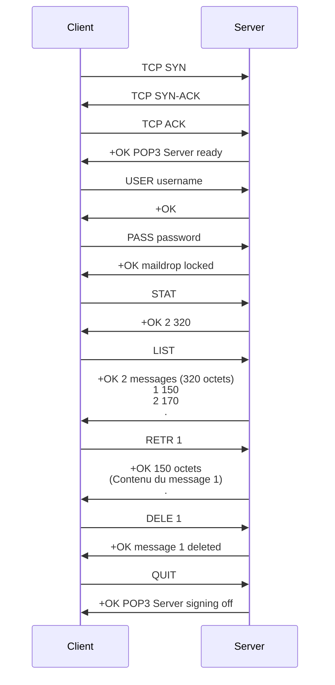

---
aliases:
  - POP3
  - Post Office Protocol 3
  - Post Office Protocol
  - POP
archetype: protocole
port_defaut: TCP/110 (non-chiffré), TCP/995 (SSL/TLS)
couche_osi:
  - "Couche 7 - Application"
rfc:
  - RFC 1939
  - RFC 2449
  - RFC 2595
cssclasses:
  - max
tags:
  - protocole/pop3
  - email
  - modele/client-serveur
  - authentification
  - protocole/tcp
  - protocole/ssl-tls
  - modele-osi/couche-7
  - securite/vulnerabilite
  - sniffing-reseau
  - chiffrement/non-chiffre
  - outil/wireshark
  - communication/handshake
  - protocole/pop3/commande
---

# POP3

> [!info] Carte d'Identité
> *   **Couche OSI** : Couche 7 - Application
> *   **Port par défaut** : `TCP/110` (non-chiffré), `TCP/995` (SSL/TLS)
> *   **Transport** : TCP

Le **Post Office Protocol version 3** (POP3) est un protocole standard de la couche application utilisé par les clients de messagerie électronique pour récupérer les e-mails d'un serveur de messagerie. Il est conçu pour permettre à un client de télécharger les messages sur un appareil local et, par défaut, de les supprimer du serveur, ce qui le rend adapté à l'accès hors ligne depuis un seul appareil.

## ⚙️ Fonctionnement (Handshake)

Le fonctionnement de POP3 est basé sur un modèle client-serveur et progresse à travers plusieurs états : **AUTHORIZATION**, **TRANSACTION** et **UPDATE**.

1.  **Établissement de la connexion** : Le client de messagerie initie une connexion TCP avec le serveur POP3, généralement sur le port 110 (non sécurisé) ou 995 (SSL/TLS).
2.  **Autorisation** : Après la salutation initiale du serveur, le client s'authentifie en envoyant les commandes `USER` (nom d'utilisateur) et `PASS` (mot de passe).
3.  **Transaction** : Une fois authentifié, le client peut émettre des commandes pour gérer les messages. Il peut demander une liste des messages (`LIST`), récupérer le contenu des messages (`RETR`), marquer des messages pour suppression (`DELE`), ou obtenir des identifiants uniques (`UIDL`).
4.  **Mise à jour (Update)** : Lorsque le client envoie la commande `QUIT`, la session entre dans l'état UPDATE. Les messages marqués pour suppression sont alors définitivement retirés du serveur.



## 📦 Structure du Paquet (Header)

POP3 est un protocole textuel basé sur des commandes et des réponses, plutôt que sur une structure de paquet à en-têtes fixes comme TCP/IP. Les échanges se composent de commandes envoyées par le client, suivies de réponses du serveur.

**Commandes courantes du client**:

*   `USER [username]` : Fournit le nom d'utilisateur pour l'authentification.
*   `PASS [password]` : Fournit le mot de passe pour l'authentification.
*   `STAT` : Demande des statistiques sur la boîte aux lettres (nombre de messages et taille totale).
*   `LIST [msg_number]` : Liste tous les messages ou les détails d'un message spécifique (numéro et taille).
*   `RETR [msg_number]` : Récupère le contenu complet d'un message spécifié.
*   `DELE [msg_number]` : Marque un message pour suppression. La suppression effective a lieu lors de la commande `QUIT`.
*   `NOOP` : Ne fait rien, le serveur répond par un accusé de réception positif.
*   `RSET` : Réinitialise l'état de la session, annulant toutes les marques de suppression.
*   `TOP [msg_number] [lines]` : Récupère les en-têtes d'un message et un nombre spécifié de lignes du corps.
*   `UIDL [msg_number]` : Répertorie les identifiants uniques des messages, ou l'identifiant unique d'un message spécifique.
*   `QUIT` : Termine la session et exécute les suppressions marquées.

**Réponses du serveur**:

*   `+OK` : Indique une réponse positive ou un succès, suivi d'un texte descriptif.
*   `-ERR` : Indique une erreur ou un échec, suivi d'un texte descriptif.

## 🦈 Analyse Wireshark

L'analyse du trafic POP3 avec Wireshark est utile pour comprendre les interactions client-serveur et les vulnérabilités liées aux communications non chiffrées.

> [!tip] Filtres Utiles
> ```
> # Filtrer par protocole POP3 (si la couche est décodée)
> pop
>
> # Filtrer par port TCP non sécurisé
> tcp.port == 110
>
> # Filtrer par port TCP sécurisé (POP3S)
> tcp.port == 995
>
> # Combiner les filtres pour le trafic POP3
> tcp.port == 110 or tcp.port == 995
> ```
Il est important de noter que si le client utilise une connexion chiffrée (POP3S sur le port 995), le contenu des commandes et des messages ne sera pas visible en texte clair dans Wireshark sans la clé de déchiffrement SSL/TLS. Pour le trafic non chiffré sur le port 110, Wireshark peut analyser et afficher les commandes POP3 et les réponses.

## 🛡️ Sécurité

POP3 présente plusieurs vulnérabilités inhérentes, principalement dues à sa conception initiale qui privilégiait la simplicité et l'accès hors ligne.

> [!danger] Vulnérabilités Connues
> *   **Sniffing** : Est-ce chiffré ? Non, par défaut.
>     *   Par défaut, POP3 sur le port 110 transmet les noms d'utilisateur, les mots de passe et le contenu des e-mails en **texte clair**, le rendant extrêmement vulnérable aux attaques par écoute (sniffing) sur le réseau.
>     *   **POP3S**, qui utilise SSL/TLS sur le port 995, chiffre la connexion et les données, mitigant ainsi les risques de sniffing.
> *   **Spoofing / Authentification faible** :
>     *   POP3 repose sur une authentification simple par nom d'utilisateur et mot de passe, ce qui le rend vulnérable aux attaques par force brute, aux attaques par dictionnaire et au phishing si des informations d'identification faibles sont utilisées ou mal protégées.
>     *   Le protocole ne prend pas en charge nativement des mécanismes d'authentification plus robustes comme l'authentification à deux facteurs (2FA), augmentant le risque d'accès non autorisé.
>     *   Des vulnérabilités liées à l'implémentation de STARTTLS (pour passer à une connexion chiffrée) ont été découvertes, permettant des attaques d'injection de commandes "Man-in-the-Middle".
> *   **Risques de stockage local** : Les messages étant généralement téléchargés et supprimés du serveur, la sécurité des e-mails dépend entièrement de la protection de l'appareil local du client. La perte, le vol ou la compromission de l'appareil peut entraîner une perte de données ou un accès non autorisé.
> *   **Manque de synchronisation et attaques par répudiation** : La nature "télécharger et supprimer" de POP3 par défaut empêche une synchronisation facile entre plusieurs appareils et peut rendre difficile la gestion des e-mails si le client accède à sa boîte de réception depuis différents endroits. Le protocole est également plus vulnérable aux attaques par répudiation, où un utilisateur peut nier l'envoi ou la réception d'un e-mail.