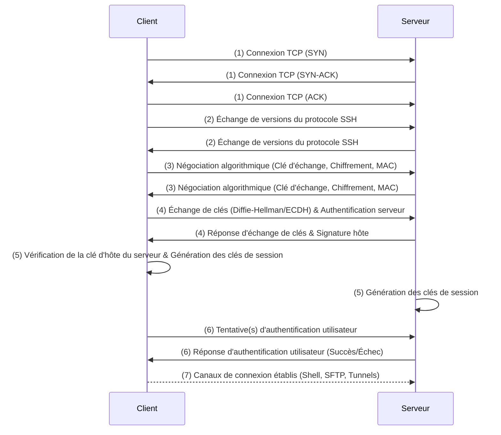

---
aliases:
  - SSH
  - Secure Shell
  - Shell Sécurisé
  - SecureShell
archetype: protocole
port_defaut: 22
couche_osi:
  - "Couche 4 - Transport"
  - "Couche 5 - Session"
  - "Couche 6 - Présentation"
  - "Couche 7 - Application"
rfc:
  - RFC 4250
  - RFC 4251
  - RFC 4252
  - RFC 4253
  - RFC 4254
  - RFC 4255
  - RFC 4256
cssclasses:
  - max
tags:
  - protocole/ssh
  - protocole
  - cryptographie/chiffrement
  - authentification
  - securite/integrite
  - reseau
  - protocole/tcp
  - port
  - history
  - modele/client-serveur
  - modele-osi
  - communication/handshake
  - protocole/sftp
  - protocole/telnet
  - protocole/rlogin
  - protocole/rsh
  - norme/rfc
  - logiciel/open-source
  - acces-distant/sécurisé
  - reseau/tunneling/encapsulation
---

# Secure Shell (SSH)

> [!info] Carte d'Identité
> * **Couche OSI** : Couche 4 - Transport, Couche 5 - Session, Couche 6 - Présentation, Couche 7 - Application
> * **Port par défaut** : `TCP/22`
> * **Transport** : TCP

Le protocole **Secure Shell (SSH)** est un protocole réseau cryptographique qui permet d'opérer des services réseau de manière sécurisée sur un réseau non sécurisé. Il a été conçu comme un remplacement sécurisé pour des protocoles non chiffrés comme Telnet, rlogin et rsh, qui transmettaient les informations d'authentification en texte clair, les rendant vulnérables aux écoutes. SSH fournit un mécanisme pour l'authentification des hôtes, la confidentialité et l'intégrité des données transmises, protégeant ainsi les communications contre l'interception et la manipulation.

## 📜 Historique

La première version du protocole SSH (SSH-1) a été conçue en 1995 par Tatu Ylönen, un chercheur à l'Université de technologie d'Helsinki en Finlande, à la suite d'une attaque par "password sniffing" sur le réseau de son université. Ylönen a publié SSH-1 en tant que logiciel gratuit en juillet 1995. Face à sa popularité croissante, il a fondé SSH Communications Security Corp. en décembre 1995 pour maintenir et commercialiser le protocole.

En 1996, une nouvelle version majeure du protocole, SSH-2, a été introduite pour corriger des problèmes et limitations de SSH-1 et incorporer de nouveaux algorithmes. SSH-2 a été adopté comme standard par l'Internet Engineering Task Force (IETF) en 2006, documenté notamment dans les RFC 4250 à 4256. OpenSSH, une implémentation open-source de SSH-2, a été publiée en 1999 par les développeurs d'OpenBSD et est aujourd'hui la pile logicielle la plus couramment implémentée.

## 📐 Architecture

Le protocole SSH est basé sur une architecture client-serveur et fonctionne comme une suite de protocoles en couches, composée de trois composants hiérarchiques principaux:

1.  **Transport Layer Protocol (RFC 4253)** : Cette couche s'exécute généralement au-dessus de TCP/IP sur le port 22. Elle est responsable de l'authentification du serveur, de la confidentialité et de l'intégrité des données via l'échange de clés initial, la négociation des algorithmes de chiffrement et de compression, et la vérification de l'intégrité. Elle assure un canal sécurisé et confidentiel.
2.  **User Authentication Protocol (RFC 4252)** : Cette couche gère l'authentification de l'utilisateur client auprès du serveur. Elle propose diverses méthodes d'authentification.
3.  **Connection Protocol (RFC 4254)** : Cette couche multiplexe le tunnel chiffré en plusieurs canaux de communication logiques. Elle définit les concepts de canaux, de requêtes de canaux et de requêtes globales, qui déterminent les services SSH fournis, tels que l'exécution de commandes à distance, le transfert de fichiers et le *port forwarding*.

## ⚙️ Fonctionnement (Handshake)

L'établissement d'une connexion SSH sécurisée implique plusieurs étapes, communément appelées le "handshake" SSH.



1.  **Connexion TCP** : Le client SSH initie une connexion TCP standard sur le port 22 (par défaut) avec le serveur SSH.
2.  **Échange de versions du protocole** : Une fois la connexion TCP établie, le client et le serveur échangent leurs chaînes d'identification de version du protocole SSH (par exemple, "SSH-2.0-OpenSSH_8.2") pour s'assurer qu'ils peuvent communiquer.
3.  **Négociation algorithmique** : Le client et le serveur échangent des listes d'algorithmes qu'ils supportent pour l'échange de clés, le chiffrement symétrique, les codes d'authentification de message (MAC) et la compression. Ils s'accordent sur l'ensemble d'algorithmes le plus fort et commun.
4.  **Échange de clés (Key Exchange - KEX)** : C'est la phase où une clé secrète partagée est générée. Les deux parties utilisent un algorithme d'échange de clés (comme Diffie-Hellman ou ECDH) pour dériver un secret partagé sans jamais le transmettre directement sur le réseau. Durant cet échange, le serveur s'authentifie auprès du client en utilisant sa *clé d'hôte publique* (host public key), que le client vérifie souvent contre une liste de clés connues (`~/.ssh/known_hosts`) pour prévenir les attaques de type "Man-in-the-Middle" (MITM).
5.  **Génération des clés de session** : À partir du secret partagé et d'autres données convenues, les deux parties génèrent des clés symétriques pour le chiffrement des données et des clés pour les MAC. Ces clés sont utilisées uniquement pour la durée de la session (clés de session).
6.  **Authentification de l'utilisateur** : Une fois le canal chiffré établi, le client tente de s'authentifier auprès du serveur en utilisant l'une des méthodes configurées (voir ci-dessous).
7.  **Établissement des canaux de connexion** : Si l'authentification est réussie, le serveur établit les canaux logiques demandés par le client, tels qu'un shell interactif, des sessions de transfert de fichiers (SFTP/SCP) ou des tunnels de *port forwarding*.

## 📦 Structure du Paquet (Header)

Après la phase d'échange de clés et l'établissement des clés de session, toutes les communications SSH sont encapsulées dans un format de paquet binaire chiffré au niveau de la couche transport. Un paquet SSH est structuré comme suit :

| Champ             | Taille (bits) | Description                                                                                                                                                                                                                                                                             |
| :---------------- | :------------ | :-------------------------------------------------------------------------------------------------------------------------------------------------------------------------------------------------------------------------------------------------------------------------------------- |
| **`packet_length`** | 32            | Longueur du paquet en octets, *hors* le champ `packet_length` lui-même et le `MAC` (Message Authentication Code).                                                                                                                                                          |
| **`padding_length`**| 8             | Longueur du remplissage aléatoire (`random padding`) en octets.                                                                                                                                                                                                            |
| **`payload`**     | Variable      | Contenu utile du paquet. Ce champ est compressé si la compression a été négociée et est toujours chiffré.                                                                                                                                                               |
| **`random padding`**| Variable      | Remplissage de longueur arbitraire (au moins 4 octets) ajouté pour rendre la longueur totale du paquet (y compris le `payload`) un multiple de la taille du bloc du chiffrement ou de 8, selon le plus grand. Il est chiffré et devrait être composé d'octets aléatoires. |
| **`MAC`**         | Variable      | Message Authentication Code. Si l'authentification de message a été négociée, ce champ contient le MAC, calculé sur les champs précédents (après chiffrement) pour garantir l'intégrité du paquet.                                                                    |

Les champs `packet_length`, `padding_length`, `payload` et `random padding` sont chiffrés avec l'algorithme symétrique négocié lors de l'échange de clés.

## 🦈 Analyse Wireshark

L'analyse du trafic SSH avec Wireshark est limitée en raison du chiffrement. La majeure partie de la charge utile est illisible une fois la phase de handshake terminée. Cependant, il est possible d'observer la phase d'établissement de la connexion et les échanges de versions.

> [!tip] Filtres Utiles
> ```
> # Filtrer par protocole SSH (port par défaut)
> ssh
>
> # Filtrer par port TCP 22
> tcp.port == 22
>
> # Filtrer les messages d'échange de clés SSH (peut être utile lors du handshake)
> ssh.message_code == 20
> ```

## 🔒 Mécanismes de Chiffrement

SSH utilise une approche de chiffrement multi-couches combinant différentes techniques pour assurer la sécurité.

*   **Chiffrement Asymétrique (Clés Publiques/Privées)** : Utilisé pour l'échange de clés initial et l'authentification de l'hôte/utilisateur.
    *   Lors de l'échange de clés (KEX), les clés publiques sont échangées pour dériver un secret partagé sans transmettre la clé privée sur le réseau.
    *   Pour l'authentification par clé publique, le client génère une paire de clés (publique/privée). La clé publique est placée sur le serveur. Le serveur chiffre un message de défi avec la clé publique du client, et le client doit le déchiffrer avec sa clé privée correspondante pour prouver son identité.
*   **Chiffrement Symétrique** : Après l'échange de clés asymétriques, une clé de session unique est générée et utilisée pour chiffrer toutes les données de la session SSH.
    *   Ceci est beaucoup plus rapide que le chiffrement asymétrique et assure la *confidentialité* de la communication.
    *   Des algorithmes comme AES (Advanced Encryption Standard) et ChaCha20 sont couramment utilisés.
*   **Hachage Cryptographique** : Utilisé pour l'intégrité des données via des *Hash-based Message Authentication Codes (HMAC)*.
    *   Un HMAC est calculé pour chaque paquet transmis en utilisant une clé symétrique partagée, le numéro de séquence du paquet et son contenu.
    *   Le destinataire recalcule le HMAC et le compare à celui reçu pour s'assurer que le paquet n'a pas été altéré en transit (*intégrité des données*). Des algorithmes comme SHA-256 et SHA-512 sont recommandés.

## 🔑 Mécanismes d'Authentification

SSH offre plusieurs méthodes pour authentifier un utilisateur client auprès du serveur:

*   **Authentification par mot de passe** : Méthode traditionnelle où l'utilisateur fournit un nom d'utilisateur et un mot de passe. Ces informations sont transmises via le tunnel SSH chiffré. Bien que chiffrée, elle est vulnérable aux attaques par force brute ou aux mots de passe faibles.
*   **Authentification par clé publique (Public Key Authentication)** : C'est la méthode d'authentification la plus sécurisée et recommandée. Elle repose sur une paire de clés asymétriques :
    *   Une *clé privée* reste secrète sur le client.
    *   Une *clé publique* est stockée sur le serveur dans le fichier `~/.ssh/authorized_keys`.
    *   Lors de l'authentification, le serveur utilise la clé publique pour envoyer un défi chiffré au client, que seul le client possédant la clé privée correspondante peut déchiffrer et prouver. La clé privée elle-même n'est jamais transmise.
*   **Authentification basée sur l'hôte (Host-based Authentication)** : Permet à un hôte distant de s'authentifier automatiquement s'il est considéré comme "fiable" par le serveur, en utilisant les clés d'hôte. Moins courante et potentiellement moins sécurisée pour l'accès utilisateur direct.
*   **Authentification interactive clavier (Keyboard-Interactive Authentication)** : Mécanisme flexible où le serveur peut demander n'importe quelle information au client, comme un mot de passe, un code de validation à usage unique (OTP) ou une phrase secrète. Souvent utilisée avec des modules PAM (Pluggable Authentication Modules) pour l'intégration de méthodes d'authentification variées.
*   **Authentification GSSAPI (Generic Security Service Application Program Interface)** : Permet l'intégration de mécanismes d'authentification externes, tels que Kerberos, offrant une authentification robuste dans des environnements d'entreprise.

## 🚀 Principales Utilisations

SSH est un outil polyvalent avec de nombreuses applications essentielles pour l'administration système et le développement.

*   **Accès et exécution de commandes à distance** : L'utilisation la plus courante de SSH est de se connecter à un shell distant sur un serveur et d'exécuter des commandes comme si l'utilisateur était physiquement présent.
*   **Transfert de fichiers sécurisé** : SSH supporte des protocoles sécurisés pour le transfert de fichiers :
    *   **SCP (Secure Copy Protocol)** : Évolué du protocole RCP, il permet de copier des fichiers de manière sécurisée entre un hôte local et un hôte distant ou entre deux hôtes distants.
    *   **SFTP (SSH File Transfer Protocol)** : Un protocole de transfert de fichiers plus riche en fonctionnalités, fonctionnant sur SSH, qui offre des commandes de gestion de fichiers similaires à FTP mais sur une connexion sécurisée.
*   **Port Forwarding (ou Tunneling SSH)** : Permet de créer des tunnels sécurisés à travers une connexion SSH pour rediriger le trafic réseau.
    *   **Local Port Forwarding (`ssh -L`)** : Redirige le trafic d'un port local vers un port sur un serveur distant, potentiellement vers une autre machine accessible depuis le serveur distant. Utile pour accéder à des services internes protégés par un pare-feu comme s'ils étaient locaux.
    *   **Remote Port Forwarding (`ssh -R`)** : Redirige le trafic d'un port sur le serveur distant vers un port sur la machine cliente locale, potentiellement vers une autre machine. Utile pour exposer un service local à un réseau distant.
    *   **Dynamic Port Forwarding (`ssh -D`)** : Crée un proxy SOCKS sur le client qui peut rediriger divers types de trafic via le tunnel SSH vers le serveur distant, puis vers Internet. Permet une navigation web sécurisée ou l'accès à plusieurs services via un point unique.

## 🛡️ Sécurité

SSH est conçu pour être un protocole sécurisé, mais sa mise en œuvre et sa configuration sont cruciales pour maintenir cette sécurité.

> [!danger] Vulnérabilités Connues
> *   **Attaques par force brute** : Si l'authentification par mot de passe est activée et que des mots de passe faibles sont utilisés, les serveurs SSH peuvent être ciblés par des attaques par force brute.
> *   **Vols de clés SSH** : Une clé privée SSH compromise peut accorder un accès non autorisé à des systèmes.
> *   **Algorithmes faibles** : L'utilisation d'anciens algorithmes de chiffrement (comme les chiffrements CBC, MD5 MACs ou les échanges de clés SHA-1) peut exposer la connexion à des vulnérabilités connues.
> *   **Attaques Man-in-the-Middle (MITM)** : Bien que SSH soit conçu pour les prévenir, une clé d'hôte non vérifiée (lors de la première connexion ou si elle est modifiée) peut ouvrir la porte à un MITM si le client accepte un hôte inconnu.

### Bonnes Pratiques de Sécurité

Pour sécuriser les connexions SSH, plusieurs bonnes pratiques doivent être mises en œuvre:

*   **Désactiver l'authentification par mot de passe** : Privilégier l'authentification par clé publique pour éliminer le risque d'attaques par force brute.
*   **Utiliser des clés SSH fortes et les gérer correctement** :
    *   Générer des paires de clés avec des longueurs suffisantes (min. 2048 bits pour RSA, ou Ed25519).
    *   Protéger les clés privées avec une phrase secrète robuste.
    *   Changer ou *faire pivoter* régulièrement les clés SSH.
    *   Révoquer immédiatement les clés compromises.
    *   Stocker les clés privées en toute sécurité et ne jamais les partager.
*   **Désactiver la connexion directe de l'utilisateur root** : Configurer SSH pour empêcher la connexion directe de l'utilisateur `root` et utiliser `sudo` pour les tâches administratives après s'être connecté avec un utilisateur standard.
*   **Changer le port SSH par défaut (22)** : Bien que cela ne soit pas une mesure de sécurité absolue, cela réduit le "bruit" des attaques automatisées qui ciblent le port par défaut.
*   **Limiter les utilisateurs et les adresses IP autorisés** : Restreindre l'accès SSH aux seuls utilisateurs et adresses IP nécessaires via les configurations du serveur SSH et les règles de pare-feu.
*   **Mettre en œuvre l'authentification à deux facteurs (2FA)** : Ajouter une couche de sécurité supplémentaire, même avec des clés SSH, en exigeant un second facteur d'authentification.
*   **Surveiller et enregistrer les journaux SSH** : Examiner régulièrement les journaux pour détecter toute activité suspecte, comme des tentatives de connexion infructueuses.
*   **Maintenir le logiciel SSH à jour** : S'assurer que les clients et serveurs SSH sont régulièrement mis à jour pour bénéficier des derniers correctifs de sécurité et des algorithmes les plus robustes.
*   **Désactiver les algorithmes faibles** : Configurer le serveur SSH pour désactiver les chiffrements CBC, les MAC MD5 et les échanges de clés SHA-1.
*   **Utiliser un hôte bastion** : Pour les infrastructures complexes, un serveur bastion centralisé peut servir de point d'entrée unique et renforcé pour tous les accès SSH aux systèmes internes.

## 🔗 Notes Connexes
*   **Chiffrement** : L'utilisation de techniques de chiffrement symétrique et asymétrique est fondamentale pour la sécurité de SSH.
*   **Authentification** : Les différentes méthodes d'authentification sont cruciales pour vérifier l'identité des utilisateurs et des serveurs.
*   **Tunneling** : Le *port forwarding* est une capacité clé de SSH pour créer des tunnels sécurisés.
*   **Attaques réseau** : Les attaques par force brute et MITM sont des menaces que SSH aide à contrer.