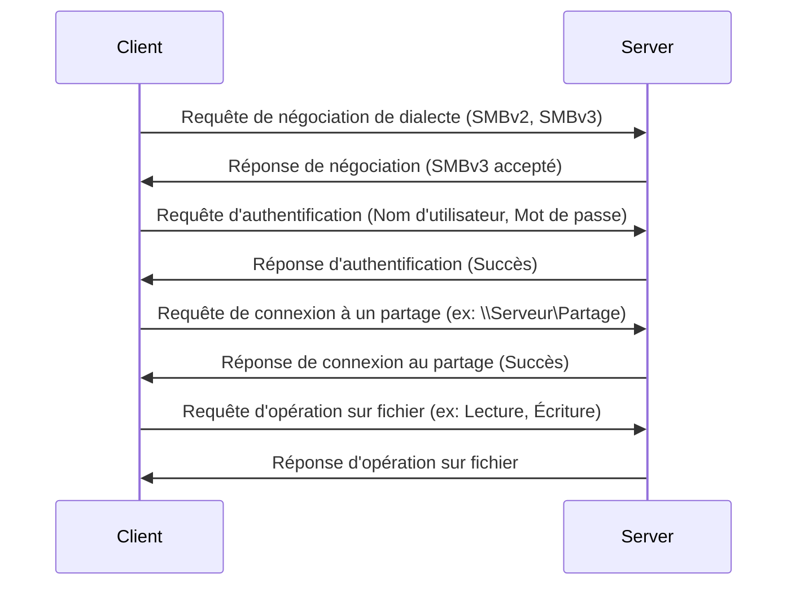

---
aliases:
  - SMB
  - Server Message Block
  - Partage de fichiers Windows
  - Partage d'imprimantes Windows
archetype: protocole
port_defaut: 445
couche_osi:
  - "Couche 7 - Application"
rfc:
  - "RFC 1001"
  - "RFC 1002"
cssclasses:
  - max
tags:
  - protocole/smb
  - modele-osi/couche-7
  - port/445
  - port/139
  - protocole/tcp
  - partage/fichiers
  - systeme-exploitation/windows
  - protocole/netbios
  - authentification
  - chiffrement
  - performance
  - vulnerabilite
  - malware/ransomware
  - modele/client-serveur
  - protocole/smb/smbv1
  - protocole/smb/smbv2
  - protocole/smb/smbv3
  - protocole/smb/smb-multichannel
  - protocole/smb/smb-direct
---

# Server Message Block (SMB)

> [!info] Carte d'Identité
> * **Couche OSI** : Couche 7 - Application
> * **Port par défaut** : `TCP/445`, `TCP/139` (pour NetBIOS sur TCP/IP)
> * **Transport** : TCP

Le protocole **Server Message Block (SMB)** est un protocole de partage de ressources réseau qui permet aux applications d'un système de lire et d'écrire des fichiers et de demander des services à des programmes serveur sur un réseau informatique. Il est principalement utilisé pour le partage de fichiers, d'imprimantes et de ports série entre des ordinateurs sous Microsoft Windows, mais il est également implémenté sur d'autres systèmes d'exploitation.

## ⚙️ Fonctionnement et Versions

Le fonctionnement de SMB repose sur un [[ClientServerModel|modèle client-serveur]], où un client envoie des requêtes et un serveur répond. Le processus général de connexion et de négociation est le suivant :

1.  **Négociation de Dialecte** : Le client et le serveur échangent des messages pour déterminer la version de SMB (le "dialecte") à utiliser pour la communication.
2.  **Authentification** : Le client s'authentifie auprès du serveur en fournissant des informations d'identification (nom d'utilisateur, mot de passe).
3.  **Connexion à un Partage** : Une fois authentifié, le client peut établir une connexion à un partage de fichiers ou d'imprimantes spécifique sur le serveur.
4.  **Accès aux Ressources** : Le client peut ensuite effectuer des opérations sur les fichiers ou les imprimantes (lecture, écriture, création, suppression, etc.).

### Versions du Protocole

SMB a évolué à travers plusieurs versions majeures, chacune apportant des améliorations significatives en termes de performances, de fonctionnalités et de sécurité.

*   **SMBv1** :
    *   C'est la version originale du protocole, introduite dans les années 1980.
    *   Elle est bien connue pour ses nombreuses vulnérabilités de sécurité, notamment celle exploitée par le rançongiciel WannaCry.
    *   Microsoft a déprécié et recommande fortement la désactivation de SMBv1 en raison de son manque de sécurité et de son inefficacité.
    *   Utilisait NetBIOS sur TCP/IP, principalement via le port **TCP/139**, en plus du port TCP/445.

*   **SMBv2** :
    *   Introduite avec Windows Vista et Windows Server 2008, SMBv2 a été une refonte majeure par rapport à SMBv1, visant à réduire le "bruit" du protocole et à améliorer les performances.
    *   Elle a introduit la capacité de regrouper plusieurs commandes SMB en une seule requête (compositing), réduisant le nombre d'allers-retours réseau.
    *   Améliorations de la gestion des verrous de fichiers et de la mise en cache.
    *   Utilise principalement le port **TCP/445**.
    *   SMBv2.1, sorti avec Windows 7 et Windows Server 2008 R2, a apporté des améliorations de performance supplémentaires et la prise en charge de l'unité de transmission maximale (MTU) de grande taille.

*   **SMBv3** :
    *   Lancée avec Windows 8 et Windows Server 2012, SMBv3 a introduit des fonctionnalités de sécurité et de performance critiques pour les environnements virtualisés et le cloud.
    *   **SMB Multichannel** : Permet d'utiliser plusieurs connexions réseau simultanément pour augmenter le débit et la résilience.
    *   **SMB Direct (RDMA)** : Permet d'utiliser des cartes réseau compatibles RDMA pour un accès direct à la mémoire, réduisant la latence et l'utilisation du CPU.
    *   **Chiffrement de bout en bout** : Toutes les données peuvent être chiffrées en transit, protégeant contre l'écoute clandestine.
    *   **Signature de paquets améliorée** : Offre une protection contre la falsification de messages.
    *   Utilise également le port **TCP/445**.
    *   SMB 3.02 et 3.1.1 (Windows 8.1, Server 2012 R2, Windows 10, Server 2016) ont apporté des améliorations continues, notamment une négociation sécurisée par défaut et la protection de l'intégrité de pré-authentification.



## 📦 Structure du Paquet (Header)

Le protocole SMB est complexe et sa structure de paquet varie considérablement entre les versions. Cependant, la plupart des paquets SMB incluent un en-tête commun suivi de données spécifiques à la commande.

Voici une simplification de l'en-tête SMB (pour SMBv2/v3) :

| Champ             | Taille    | Description                                                     |
| :---------------- | :-------- | :-------------------------------------------------------------- |
| **Protocol ID**   | 4 octets  | Toujours `0xFE SMB` pour SMBv2/v3, indiquant le protocole.     |
| **Header Length** | 2 octets  | Longueur de l'en-tête, en octets.                              |
| **Credit Charge** | 2 octets  | Crédits consommés par la requête (pour le contrôle de flux).  |
| **Channel**       | 2 octets  | Identifiant du canal de communication.                         |
| **Reserved**      | 2 octets  | Réservé.                                                       |
| **Command**       | 2 octets  | Type de commande SMB (ex: `SMB2_NEGOTIATE`, `SMB2_READ`).      |
| **Credits Granted**| 2 octets | Crédits accordés par le serveur au client (pour le contrôle de flux). |
| **Flags**         | 4 octets  | Indicateurs de la requête/réponse (ex: `SMB2_FLAGS_SERVER_TO_REDIR`). |
| **Chain Offset**  | 4 octets  | Offset vers la commande suivante dans une requête composée.    |
| **Message ID**    | 8 octets  | Identifiant unique de la requête/réponse.                      |
| **Async ID**      | 8 octets  | Identifiant de l'opération asynchrone.                         |
| **Session ID**    | 8 octets  | Identifiant de la session SMB.                                 |
| **Tree ID**       | 4 octets  | Identifiant de l'arborescence de partage.                      |
| **Buffer Code**   | 2 octets  | Code de tampon.                                                |
| **Reserved**      | 2 octets  | Réservé.                                                       |
| **Signature**     | 16 octets | Signature cryptographique du paquet (si la signature est activée). |
| **Data (Payload)**| Variable  | Données spécifiques à la commande (ex: descripteurs de fichiers, contenu de fichiers). |

## 🦈 Analyse Wireshark

L'analyse du trafic SMB avec Wireshark est cruciale pour le dépannage et l'audit de sécurité.

> [!tip] Filtres Utiles
> ```
> # Filtrer par protocole SMB
> smb
>
> # Filtrer spécifiquement SMBv1
> smb.dialect == "NT LM 0.12"
>
> # Filtrer spécifiquement SMBv2/SMBv3
> smb2
>
> # Filtrer les commandes de lecture
> smb2.command == 0x0008
>
> # Filtrer les commandes d'écriture
> smb2.command == 0x0009
>
> # Filtrer les négociations de dialecte
> smb2.command == 0x0000
>
> # Filtrer par adresse IP source/destination et SMB
> ip.addr == 192.168.1.100 && smb2
>
> # Filtrer les erreurs SMB (statut non succès)
> smb2.nt_status != 0x00000000
> ```

## 🛡️ Sécurité

Les considérations de sécurité pour SMB sont primordiales en raison de son rôle central dans le partage de ressources.

> [!danger] Vulnérabilités Connues et Bonnes Pratiques
> *   **SMBv1** :
    *   **Sniffing** : Les premières versions de SMBv1 ne chiffraient pas le trafic, le rendant vulnérable à l'écoute clandestine.
    *   **Vulnérabilités connues** : SMBv1 est notoire pour ses nombreuses vulnérabilités, dont la plus célèbre est **EternalBlue**, exploitée par WannaCry et NotPetya. Cette vulnérabilité permettait l'exécution de code à distance.
    *   **Authentification faible** : Les mécanismes d'authentification de SMBv1 étaient moins robustes, rendant le *spoofing* et les attaques par *force brute* plus faciles.
    *   **Recommandation** : **Désactiver SMBv1 sur tous les systèmes** et le supprimer si possible.

> *   **SMBv2/v3** :
    *   **Chiffrement** : SMBv3 offre un chiffrement de bout en bout du trafic, protégeant contre l'écoute clandestine. Il doit être activé lorsque la confidentialité est requise.
        *   **Est-ce chiffré ?** Oui, avec SMBv3 (en option, mais fortement recommandé).
    *   **Signature SMB** : Les versions ultérieures de SMB prennent en charge la signature des paquets. Cela garantit l'intégrité des messages et aide à prévenir les attaques de *man-in-the-middle* (MiTM) et le *spoofing*. La signature doit être activée.
    *   **Authentification forte** : SMBv2 et SMBv3 utilisent des mécanismes d'authentification plus robustes (Kerberos, NTLMv2), rendant les attaques par *spoofing* et *force brute* plus difficiles.
    *   **Meilleures pratiques** :
        *   **Mettre à jour** les systèmes d'exploitation pour utiliser les dernières versions de SMB (SMBv3.1.1 est la plus récente et la plus sécurisée).
        *   **Appliquer les correctifs de sécurité** rapidement.
        *   **Restreindre l'accès** aux partages SMB via des pare-feu et des listes de contrôle d'accès (ACL).
        *   Utiliser des **mots de passe forts** et des comptes de service dédiés.
        *   **Surveiller** le trafic SMB pour détecter des activités suspectes.
        *   Envisager de désactiver l'accès SMB depuis Internet.