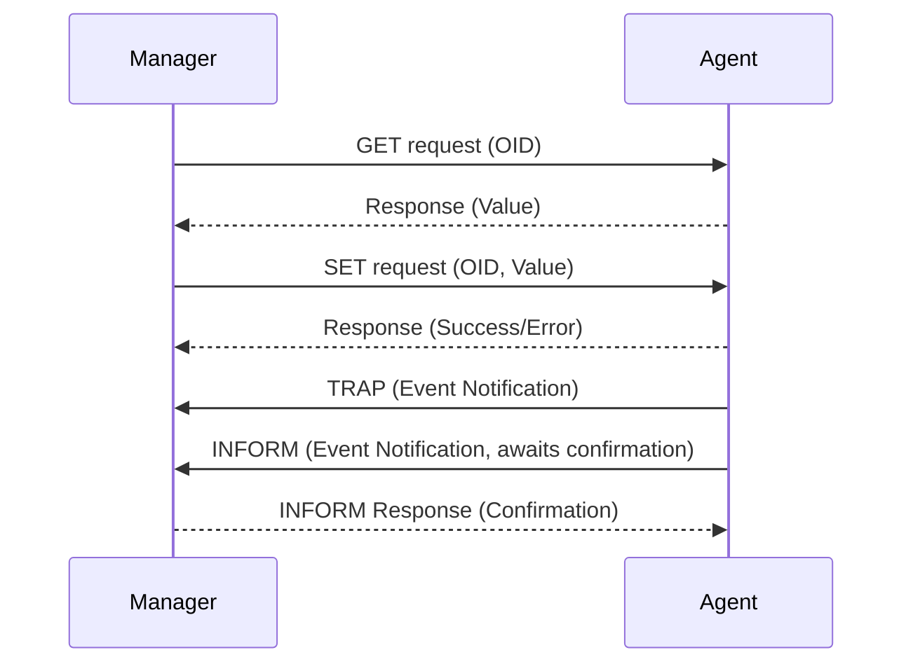

---
aliases:
  - SNMP
  - Simple Network Management Protocol
  - Protocole Simple de Gestion de Réseau
archetype: protocole
port_defaut: UDP 161, UDP 162
couche_osi:
  - "Couche 7 - Application"
rfc:
  - RFC 1157
  - RFC 1901
  - RFC 1905
  - RFC 1906
  - RFC 1907
  - RFC 3410
  - RFC 3411
  - RFC 3412
  - RFC 3413
  - RFC 3414
  - RFC 3415
cssclasses:
  - max
tags:
  - protocole/snmp
  - protocole/reseau
  - modele-osi/couche-7
  - protocole/udp
  - architecture/reseau
  - securite/vulnerabilite
  - chiffrement
  - authentification
  - gestion/reseau
  - peripherique/reseau
---

# Simple Network Management Protocol (SNMP)

> [!info] Carte d'Identité
> * **Couche OSI** : Couche 7 - Application
> * **Port par défaut** : `UDP 161` (Manager vers Agent), `UDP 162` (Agent vers Manager)
> * **Transport** : UDP

Le **Simple Network Management Protocol (SNMP)** est un protocole de la couche application qui facilite l'échange d'informations de gestion entre les périphériques réseau. Il est largement utilisé pour surveiller et gérer les équipements réseau tels que les routeurs, les commutateurs, les serveurs, les imprimantes et les firewalls.

## 🎯 Versions de SNMP
SNMP a évolué à travers plusieurs versions principales :
*   **SNMPv1** : La version originale, définie dans la RFC 1157. Elle utilise des chaînes de communauté (community strings) pour l'authentification, ce qui est considéré comme peu sûr car les chaînes sont transmises en clair.
*   **SNMPv2c** : (Community-Based Simple Network Management Protocol version 2) Améliore SNMPv1 en ajoutant des types d'opération comme `GETBULK` et des structures de données améliorées, mais conserve le même modèle de sécurité basé sur les chaînes de communauté en clair.
*   **SNMPv3** : Introduit des améliorations significatives en matière de sécurité, incluant l'authentification forte (MD5 ou SHA) et le chiffrement (DES, AES) pour protéger les communications. Il offre également des capacités de contrôle d'accès basées sur les utilisateurs.

## ⚙️ Fonctionnement (Architecture et Opérations)
L'architecture SNMP repose sur trois composants principaux : les *gestionnaires SNMP* (Managers), les *agents SNMP* (Agents) et les *bases d'informations de gestion* (Management Information Bases - MIB).

### Architecture
*   **Gestionnaire SNMP (Manager)** : Une application qui s'exécute sur une station de travail dédiée. Il est responsable de la surveillance et du contrôle des périphériques réseau. Le gestionnaire envoie des requêtes SNMP aux agents et reçoit des notifications.
*   **Agent SNMP (Agent)** : Un logiciel qui s'exécute sur le périphérique réseau géré (par exemple, un routeur ou un serveur). L'agent collecte des données sur le périphérique et les rend disponibles pour le gestionnaire SNMP. Il peut également envoyer des notifications (TRAP ou INFORM) au gestionnaire en cas d'événements importants.
*   **Base d'Informations de Gestion (MIB)** : Une collection structurée d'objets (variables) qui représentent les informations de gestion d'un périphérique. Chaque objet dans la MIB est identifié par un *Identifiant d'Objet* (Object Identifier - OID) unique, organisé dans une structure arborescente.

### Opérations Principales
Les gestionnaires SNMP communiquent avec les agents en utilisant un ensemble d'opérations standard :
*   **GET** : Le gestionnaire demande la valeur d'une variable spécifique à un agent.
*   **GETNEXT** : Le gestionnaire demande la valeur de l'instance suivante d'une variable dans une table ou une liste MIB. Utile pour parcourir les tables MIB.
*   **GETBULK** : Introduit dans SNMPv2, permet de récupérer de grandes quantités de données de manière efficace en une seule requête.
*   **SET** : Le gestionnaire modifie la valeur d'une variable sur un agent, permettant de configurer un périphérique.
*   **TRAP** : Un message non sollicité envoyé par un agent à un gestionnaire pour signaler un événement important (par exemple, un redémarrage, une défaillance de lien). Historiquement peu fiable car UDP ne garantit pas la livraison.
*   **INFORM** : Introduit dans SNMPv2, similaire à TRAP mais nécessite une confirmation de réception du gestionnaire, offrant une livraison plus fiable.



## 📦 Structure du Paquet (Header)
Les messages SNMP sont encapsulés dans des datagrammes UDP. La structure exacte varie légèrement selon la version de SNMP, mais elle contient généralement les éléments suivants :

| Champ             | Taille (bits) | Description                                                                |
| :---------------- | :------------ | :------------------------------------------------------------------------- |
| **Version**       | 8             | Version de SNMP utilisée (ex: 0 pour SNMPv1, 1 pour SNMPv2c, 3 pour SNMPv3) |
| **Community String** | Variable      | Chaîne de caractères utilisée pour l'authentification (SNMPv1, SNMPv2c). Transmise en clair. |
| **PDU Type**      | 8             | Type de PDU (Protocol Data Unit), indiquant l'opération (GET, SET, TRAP, etc.). |
| **Request ID**    | 32            | Numéro unique pour identifier la requête et sa réponse correspondante.      |
| **Error Status**  | 8             | Indique si une erreur s'est produite (0 pour pas d'erreur).               |
| **Error Index**   | 8             | Fournit des informations supplémentaires sur l'erreur, si `Error Status` est non nul. |
| **Variable Bindings** | Variable      | Liste des paires OID-valeur représentant les données demandées ou modifiées. |
| **SNMPv3 User-based Security Model (USM) Headers** | Variable      | Champs additionnels pour SNMPv3 incluant : `msgID`, `msgMaxSize`, `msgFlags`, `msgSecurityModel`, `msgAuthoritativeEngineID`, `msgAuthoritativeEngineBoots`, `msgAuthoritativeEngineTime`, `msgUserName`, `msgAuthenticationParameters`, `msgPrivacyParameters`. Ces champs gèrent l'authentification et le chiffrement. |

## 🦈 Analyse Wireshark
Wireshark est un outil essentiel pour analyser le trafic SNMP.

> [!tip] Filtres Utiles
> ```
> # Filtrer par protocole SNMP
> snmp
>
> # Filtrer par version de SNMP (exemple pour v3)
> snmp.version == 3
>
> # Filtrer par type de PDU (exemple pour GET request)
> snmp.pdu.type == 0  # GET Request
> snmp.pdu.type == 3  # SET Request
> snmp.pdu.type == 4  # TRAP
>
> # Filtrer une erreur spécifique (ex: noSuchName)
> snmp.error_status == 2
> ```

## 🛡️ Sécurité
La sécurité est une préoccupation majeure avec SNMP, en particulier avec les versions antérieures.

> [!danger] Vulnérabilités Connues
> *   **Sniffing** : Est-ce chiffré ? [Non (SNMPv1/v2c), Oui (SNMPv3)]
    *   SNMPv1 et SNMPv2c transmettent les chaînes de communauté (équivalentes à des mots de passe) et les données de gestion en clair sur le réseau, les rendant vulnérables à l'écoute clandestine (sniffing).
    *   SNMPv3 offre des mécanismes de chiffrement (DES, 3DES, AES) pour protéger la confidentialité des données.
> *   **Spoofing / Replay Attacks** : Authentification faible ? [Oui (SNMPv1/v2c), Non (SNMPv3)]
    *   L'authentification basée sur les chaînes de communauté dans SNMPv1 et SNMPv2c est très faible et peut être contournée par des attaques par force brute ou des attaques par rejeu si les paquets sont capturés.
    *   SNMPv3 introduit des mécanismes d'authentification robustes (MD5, SHA) pour vérifier l'intégrité des messages et l'identité de l'expéditeur, protégeant ainsi contre les modifications non autorisées et les attaques par rejeu.
> *   **Accès non autorisé** : Les chaînes de communauté par défaut ("public", "private") sont souvent laissées inchangées, permettant un accès facile aux informations ou même la modification des configurations.
> *   **Déni de service (DoS)** : Des requêtes SNMP malveillantes ou excessives peuvent potentiellement surcharger un agent SNMP, entraînant un déni de service pour le périphérique géré.

### Mesures de Sécurité
*   **Utiliser SNMPv3** : Toujours privilégier SNMPv3 pour ses fonctionnalités d'authentification et de chiffrement.
*   **Configurer l'authentification et le chiffrement** : Pour SNMPv3, utiliser des algorithmes d'authentification forts (SHA) et de chiffrement (AES).
*   **Changer les chaînes de communauté par défaut** : Pour les environnements utilisant SNMPv1/v2c, utiliser des chaînes de communauté complexes et non prédictibles.
*   **Restreindre l'accès** : Utiliser des listes de contrôle d'accès (ACL) sur les périphériques réseau pour limiter les adresses IP des gestionnaires SNMP autorisés à communiquer avec les agents.
*   **Sécuriser les MIBs** : Configurer des permissions appropriées pour les objets MIB, en limitant l'accès en écriture aux seules valeurs nécessaires.