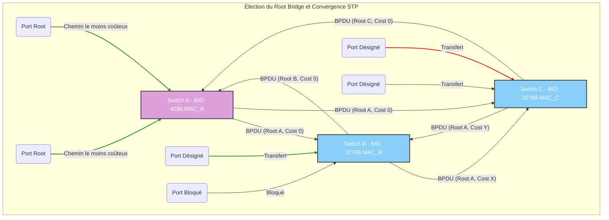

---
aliases:
  - Protocole Spanning Tree
  - STP
  - Rapid Spanning Tree Protocol
  - RSTP
  - Multiple Spanning Tree Protocol
  - MSTP
archetype: protocole
port_defaut: N/A
couche_osi:
  - "Couche 2 - Liaison"
rfc:
  - "IEEE 802.1D"
  - "IEEE 802.1w"
  - "IEEE 802.1s"
cssclasses:
  - max
tags:
  - protocole/stp
  - protocole/reseau
  - reseau/ethernet
  - modele-osi/couche-2
  - reseau/topologie
  - reseau/redondance
  - reseau/securite
  - protocole/stp/bpdu
---

# Spanning Tree Protocol

> [!info] Carte d'Identité
> * **Couche OSI** : Couche 2 - Liaison
> * **Port par défaut** : N/A
> * **Transport** : Ethernet

Le **Spanning Tree Protocol (STP)** est un protocole réseau fondamental de la couche 2, conçu pour prévenir les boucles dans les réseaux Ethernet redondants et les tempêtes de diffusion qui en résultent. Développé par Radia Perlman, il établit une topologie logique sans boucle en désactivant les chemins redondants, tout en permettant une tolérance aux pannes en cas de défaillance d'un lien.

## ⚙️ Fonctionnement (Convergence)

Le STP fonctionne en créant un arbre couvrant (spanning tree) pour garantir un chemin unique et actif entre deux nœuds du réseau. Le processus de convergence du STP suit plusieurs étapes clés pour établir cette topologie sans boucle :

1.  **Élection du Root Bridge** : Chaque domaine de diffusion élit un **Root Bridge** (pont racine). Le switch avec le **Bridge ID (BID)** le plus bas est élu Root Bridge. Le Bridge ID est une combinaison d'une valeur de priorité (par défaut 32768) et de l'adresse MAC du switch. Une priorité plus basse est préférée, et en cas d'égalité, l'adresse MAC la plus basse l'emporte. Tous les ports du Root Bridge sont en état de *Designated Port* et transfèrent le trafic.

2.  **Sélection des Root Ports** : Sur tous les switches non-Root Bridge, un **Root Port** est sélectionné. C'est le port qui offre le chemin le moins coûteux vers le Root Bridge. Le coût du chemin est déterminé par la bande passante du lien (plus la bande passante est élevée, plus le coût est faible). En cas d'égalité de coût, le switch choisit le port avec le plus petit Bridge ID de l'expéditeur, puis le port avec l'ID de port le plus bas.

3.  **Sélection des Designated Ports** : Sur chaque segment LAN, il doit y avoir un seul **Designated Port** qui transfère le trafic vers le Root Bridge. Tous les ports du Root Bridge sont des Designated Ports. Pour les segments non connectés directement au Root Bridge, le Designated Port est celui du switch qui offre le meilleur chemin (coût le plus bas) vers le Root Bridge pour ce segment.

4.  **Identification des Blocked Ports** : Les ports qui ne sont ni Root Port ni Designated Port sont mis en état de **Blocked Port**. Ces ports sont désactivés pour empêcher les boucles et ne transfèrent pas de trafic de données, mais ils continuent de recevoir des BPDUs. En cas de défaillance d'un lien actif, le STP peut réactiver un port bloqué pour restaurer la connectivité.

### Bridge Protocol Data Units (BPDUs)

Les switches échangent des messages appelés **Bridge Protocol Data Units (BPDUs)** pour communiquer des informations sur la topologie du réseau et l'état des ports. Les BPDUs sont cruciaux pour l'élection du Root Bridge et la détermination des chemins.

Il existe deux types principaux de BPDUs dans le STP original (802.1D):
*   **Configuration BPDUs (CBPDU)** : Envoyées par le Root Bridge (puis relayées par les Designated Ports des autres switches) pour annoncer la topologie et participer à l'élection du Root Bridge. Elles contiennent le Root ID, le coût du chemin vers le Root, le Bridge ID de l'expéditeur et l'ID du port.
*   **Topology Change Notification (TCN) BPDUs** : Envoyées par les switches non-Root Bridge pour informer le Root Bridge d'un changement de topologie (ex: un port passe en état up/down). Le Root Bridge accuse réception et informe ensuite les autres switches via des Configuration BPDUs modifiées.


*Description du diagramme:* Le diagramme illustre un réseau simple avec trois switches. Chaque switch échange des BPDUs pour élire un Root Bridge (ici, le Switch A en raison de son BID inférieur). Ensuite, les switches non-Root (B et C) sélectionnent leurs Root Ports vers le Root Bridge. Les Designated Ports sont également choisis pour chaque segment. Enfin, un port est bloqué (sur le Switch C) pour éviter les boucles.

### Modes de fonctionnement (Standards IEEE)

Le STP a évolué à travers plusieurs standards IEEE pour améliorer sa convergence et sa flexibilité:

*   **IEEE 802.1D (STP original)** : Le standard original, introduit en 1990. Il crée une topologie sans boucle pour les réseaux Ethernet. Sa convergence est relativement lente (30 à 50 secondes).
*   **IEEE 802.1w (Rapid Spanning Tree Protocol - RSTP)** : Introduit en 2001, le RSTP offre une convergence significativement plus rapide que le STP original (quelques secondes à quelques millisecondes). Il améliore les états de port et les rôles pour une récupération plus rapide après un changement de topologie. Il est rétrocompatible avec le STP 802.1D.
*   **IEEE 802.1s (Multiple Spanning Tree Protocol - MSTP)** : Permet la création de plusieurs instances de spanning tree au sein d'un réseau. Chaque instance peut regrouper différents VLANs, améliorant ainsi l'efficacité du réseau grâce à une meilleure répartition de charge et une plus grande évolutivité pour les grands réseaux complexes.

## 📦 Structure du Paquet (BPDU Header)

Les BPDUs sont encapsulées dans des trames Ethernet et transportent des informations cruciales pour le fonctionnement du STP. Voici une structure simplifiée des champs principaux d'un BPDU:

| Champ               | Taille     | Description                                                                                                                                                                                             |
| :------------------ | :--------- | :------------------------------------------------------------------------------------------------------------------------------------------------------------------------------------------------------ |
| **Protocol ID**     | 2 octets   | Identifiant du protocole (toujours 0x0000 pour les BPDUs 802.1D).                                                                                                                             |
| **Version ID**      | 1 octet    | Version du protocole (0x00 pour STP, 0x02 pour RSTP).                                                                                                                                         |
| **BPDU Type**       | 1 octet    | Type de BPDU (Configuration BPDU : 0x00 ; TCN BPDU : 0x80).                                                                                                                                   |
| **Flags**           | 1 octet    | Contient des informations sur la topologie, notamment le TCN (Topology Change Notification) Flag et le TCA (Topology Change Acknowledgment) Flag.                                                         |
| **Root ID**         | 8 octets   | Bridge ID du Root Bridge (Priorité + Adresse MAC du Root Bridge).                                                                                                                         |
| **Root Path Cost**  | 4 octets   | Coût du chemin depuis le switch émetteur jusqu'au Root Bridge.                                                                                                                                |
| **Sender Bridge ID**| 8 octets   | Bridge ID du switch qui envoie le BPDU.                                                                                                                                                                 |
| **Port ID**         | 2 octets   | Identifiant du port émetteur du BPDU (Priorité du port + Numéro du port).                                                                                                                 |
| **Message Age**     | 2 octets   | Durée écoulée depuis la génération du BPDU par le Root Bridge.                                                                                                                                |
| **Max Age**         | 2 octets   | Durée de vie maximale d'un BPDU. Si un BPDU est plus ancien que Max Age, il est ignoré.                                                                                                      |
| **Hello Time**      | 2 octets   | Intervalle entre l'envoi de BPDUs par le Root Bridge (par défaut 2 secondes).                                                                                                            |
| **Forward Delay**   | 2 octets   | Durée des états Listening et Learning du port avant de passer en Forwarding (par défaut 15 secondes, total de 30 secondes pour les deux états).                                             |

## 🦈 Analyse Wireshark

Wireshark est un outil essentiel pour analyser les messages STP et dépanner les problèmes de réseau liés. L'analyse des BPDUs permet de vérifier la bonne configuration de STP, d'identifier les Root Bridges, les rôles des ports et de détecter d'éventuels problèmes de convergence ou dispositifs non autorisés.

> [!tip] Filtres Utiles
> ```
> # Filtrer par protocole STP
> stp
>
> # Filtrer les Configuration BPDUs (type 0x00)
> stp.type == 0x00
>
> # Filtrer les TCN BPDUs (type 0x80)
> stp.type == 0x80
>
> # Filtrer par Root ID
> stp.root.id == <MAC_ADRESSE_DU_ROOT_BRIDGE>
>
> # Vérifier les compteurs Message Age
> stp.msg_age
> ```

L'examen des champs du BPDU dans Wireshark, tels que le Root ID, le Root Path Cost, le Sender Bridge ID et les timers (Hello Time, Max Age, Forward Delay), est crucial pour comprendre le comportement du STP dans un réseau.

## 🛡️ Sécurité

Le STP, étant un protocole ancien, a été conçu sans la sécurité comme préoccupation majeure, le rendant vulnérable à certaines attaques.

> [!danger] Vulnérabilités Connues
> *   **Sniffing** : Les BPDUs sont transmises en texte clair, ce qui les rend susceptibles d'être sniffées. Un attaquant peut ainsi obtenir des informations précieuses sur la topologie du réseau.
> *   **Spoofing / Manipulation du Root Bridge** : L'absence de mécanisme d'authentification pour les BPDUs permet à un attaquant d'envoyer de faux BPDUs avec un Bridge ID inférieur à celui du Root Bridge légitime. Cela peut forcer les switches à élire le dispositif de l'attaquant comme nouveau Root Bridge, permettant ainsi de rediriger le trafic et de mener des attaques de type *Man-in-the-Middle*.
> *   **Attaques par déni de service (DoS) / BPDU Flooding** : Un attaquant peut générer un grand volume de BPDUs malveillants, forçant les switches à recalculer continuellement l'arbre couvrant. Cette instabilité peut entraîner des tempêtes de diffusion, une congestion du réseau et une perte temporaire ou totale de la connectivité.

Des mesures préventives telles que l'activation de `BPDU Guard` sur les ports d'accès (qui ne devraient pas recevoir de BPDUs), le `Root Guard` pour maintenir la position du Root Bridge, et la désactivation du STP sur les ports inutilisés peuvent atténuer ces vulnérabilités.