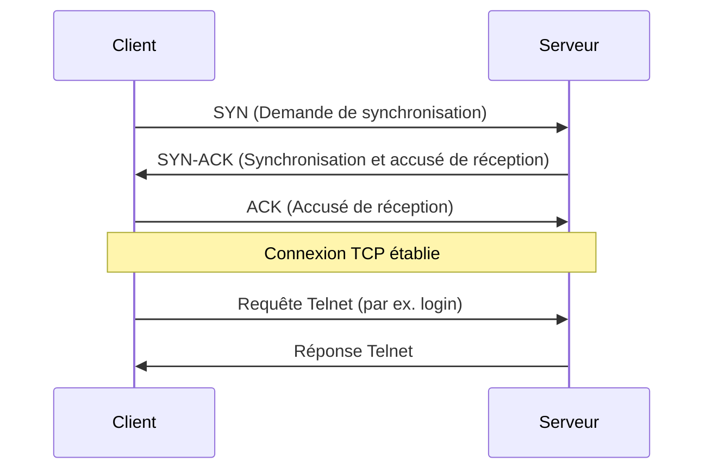

---
aliases:
  - Telnet
  - Telnet Protocol
  - Protocole Telnet
archetype: protocole
port_defaut: 23
couche_osi:
  - "Couche 7 - Application"
rfc:
  - RFC 854
  - RFC 855
cssclasses:
  - max
tags:
  - protocole
  - protocole/telnet
  - protocole/tcp
  - protocole/ssh
  - modele-osi/couche-7
  - communication/handshake
  - sniffing-reseau
  - mitm
  - spoofing
  - vulnerabilite
  - chiffrement/non-chiffre
  - outil/wireshark
---

# Telnet Protocol

> [!info] Carte d'Identité
> * **Couche OSI** : Couche 7 - Application
> * **Port par défaut** : `TCP/23`
> * **Transport** : TCP

## ⚙️ Fonctionnement (Handshake)
Le protocole **Telnet** (TErminal NETwork) est un protocole réseau client-serveur utilisé pour fournir une interface de ligne de commande bidirectionnelle et interactive sur Internet ou les réseaux locaux. Telnet fonctionne au-dessus du protocole **TCP** (Transmission Control Protocol) et utilise le port par défaut 23. L'établissement de la connexion Telnet suit le *three-way handshake* de TCP pour garantir une connexion fiable et orientée connexion.



Une fois la connexion TCP établie, le client Telnet envoie des caractères et des commandes au serveur Telnet, et le serveur répond en renvoyant la sortie à l'écran du client. Telnet définit une interface réseau virtuelle (NVT - Network Virtual Terminal) qui garantit l'interopérabilité entre différents types de terminaux et de systèmes hôtes.

## 📦 Structure du Paquet (Header)
En tant que protocole de couche application, Telnet n'a pas de "header" de paquet fixe au sens des protocoles de transport ou réseau comme TCP ou IP. Au lieu de cela, il s'agit d'un flux d'octets de données, entremêlés de commandes Telnet appelées "options" ou "séquences d'échappement". Ces commandes commencent généralement par l'octet `IAC` (Interpret As Command), qui a la valeur 255 (hex `FF`).

Voici quelques exemples de commandes Telnet courantes :
| Champ (Commande) | Valeur Décimale | Description |
|---|---|---|
| **IAC (Interpret As Command)** | 255 | Indique que l'octet suivant est une commande Telnet. |
| **WILL** | 251 | Le sender est prêt à effectuer l'option spécifiée. |
| **WONT** | 252 | Le sender refuse d'effectuer l'option spécifiée. |
| **DO** | 253 | Le sender demande à la partie distante d'effectuer l'option. |
| **DONT** | 254 | Le sender demande à la partie distante de ne pas effectuer l'option. |
| **SB (Subnegotiation Begin)** | 250 | Début de la négociation d'une option. |
| **SE (Subnegotiation End)** | 240 | Fin de la négociation d'une option. |

## 🦈 Analyse Wireshark
L'analyse de trafic Telnet avec Wireshark est relativement simple, car les données sont transmises en **clair**.

> [!tip] Filtres Utiles
> ```
> # Filtrer par protocole Telnet
> telnet
>
> # Filtrer par port par défaut
> tcp.port == 23
>
> # Filtrer les données Telnet (affichage du contenu)
> telnet.data
> ```
En utilisant ces filtres, il est possible de voir facilement les identifiants de connexion (noms d'utilisateur et mots de passe) ainsi que toutes les commandes exécutées et leurs sorties, ce qui met en évidence les vulnérabilités de sécurité du protocole.

## 🛡️ Sécurité
Telnet est considéré comme un protocole **extrêmement dangereux** et obsolète en raison de ses nombreuses faiblesses de sécurité inhérentes.

> [!danger] Vulnérabilités Connues
> * **Sniffing** : Les données sont transmises en **clair (non chiffrées)**. Cela inclut les noms d'utilisateur, les mots de passe et toutes les informations échangées pendant la session. Un attaquant sur le même réseau peut facilement capturer et lire tout le trafic Telnet à l'aide d'outils comme Wireshark. Est-ce chiffré ? Non.
> * **Spoofing** : L'authentification est faible. Telnet ne fournit aucune méthode intégrée pour vérifier l'identité du serveur ou du client. Un attaquant peut usurper l'identité d'un serveur Telnet légitime (DNS spoofing, ARP spoofing) et intercepter les informations d'identification d'un utilisateur sans que celui-ci ne s'en aperçoive.
> * **Man-in-the-Middle (MITM)** : En l'absence de chiffrement et d'authentification robuste, Telnet est très vulnérable aux attaques de l'homme du milieu, où un attaquant peut écouter, modifier ou injecter des données dans la communication entre le client et le serveur.
> * **Exécution de commandes à distance non autorisée** : Si un attaquant parvient à obtenir les informations d'identification, il peut exécuter des commandes sur le système distant avec les privilèges de l'utilisateur compromis.
> * **Absence d'intégrité des données** : Telnet ne fournit pas de mécanismes pour garantir que les données n'ont pas été altérées pendant le transit.

## 🔗 Alternatives Modernes
En raison des graves faiblesses de sécurité de Telnet, il est impératif d'utiliser des alternatives modernes et sécurisées pour l'accès à distance aux systèmes.

*   **Version Sécurisée** :
    *   **SSH (Secure Shell)** : SSH est l'alternative standard et fortement recommandée à Telnet. Il chiffre tout le trafic entre le client et le serveur, y compris les mots de passe et les données de session, protégeant ainsi contre l'écoute clandestine. Il fournit également une authentification forte pour les clients et les serveurs, et assure l'intégrité des données. SSH utilise le port TCP 22 par défaut.
    *   **TLS/SSL (Transport Layer Security / Secure Sockets Layer)** : Bien que TLS/SSL ne soit pas un protocole de shell à distance en soi, il peut être utilisé pour sécuriser d'autres protocoles. Cependant, pour l'accès à la ligne de commande, SSH est la solution privilégiée.
*   **Attaque liée** :
    *   **Sniffing de Paquets**
    *   **Attaque Man-in-the-Middle (MITM)**
    *   **Attaque par Force Brute** (si les mots de passe sont faibles et que Telnet est exposé)