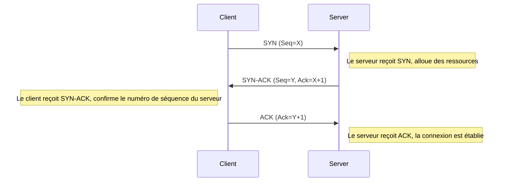
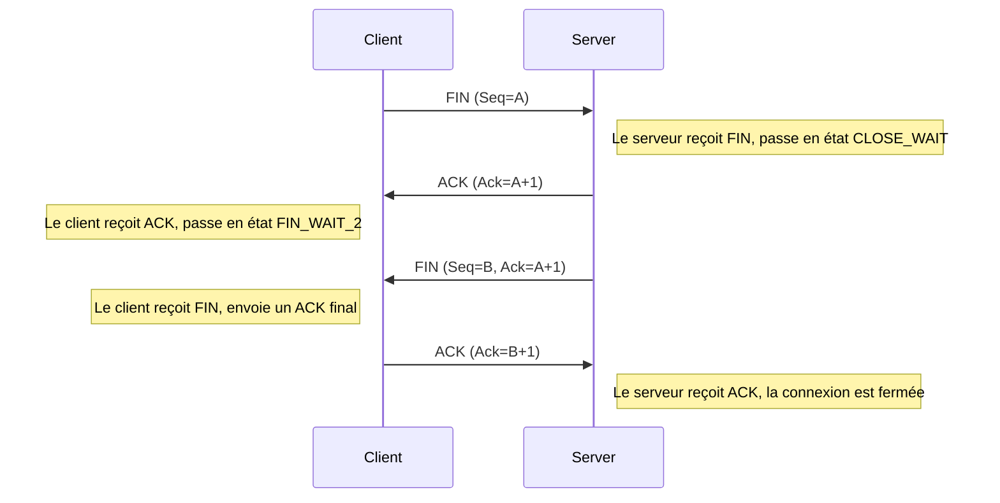

---
aliases:
  - Protocole de contrôle de transmission
  - Transmission Control Protocol
  - TCP
archetype: protocole
port_defaut: 20, 21, 23, 25, 80, 443
couche_osi:
  - "Couche 4 - Transport"
rfc:
  - RFC 793
  - RFC 1323
  - RFC 2018
  - RFC 2581
  - RFC 5681
cssclasses:
  - max
tags:
  - protocole
  - protocole/tcp
  - modele-osi/couche-4
  - modele/tcp-ip
  - modele/tcp-ip/couche-transport
  - reseau
  - fiabilite
  - port
  - communication/handshake
  - protocole/tcp/etablissement-connexion
  - protocole/tcp/terminaison-connexion
  - protocole/tcp/controle-flux
  - protocole/tcp/controle-congestion
  - protocole/tcp/numero-sequence
  - protocole/tcp/acquittement
  - protocole/tcp/fenetre-glissante
  - protocole/tcp/slow-start
  - protocole/tcp/congestion-avoidance
  - protocole/tcp/fast-retransmit
  - protocole/tcp/fast-recovery
---

# Transmission Control Protocol

> [!info] Carte d'Identité
> * **Couche OSI** : Couche 4 - Transport
> * **Port par défaut** : `TCP/UDP 20, 21, 23, 25, 80, 443`
> * **Transport** : TCP

Le **Transmission Control Protocol (TCP)** est un protocole de la couche transport de la suite de protocoles TCP/IP, offrant un service de communication fiable, orienté connexion et en flux continu entre les applications. Il garantit que les données envoyées par une application arrivent intactes, dans le bon ordre, et sans perte ni duplication à l'application destinataire. TCP est fondamental pour de nombreuses applications internet telles que la navigation web (HTTP), le transfert de fichiers (FTP), et l'envoi d'e-mails (SMTP).

## ⚙️ Fonctionnement (Handshake)

TCP établit une connexion logique avant le transfert de données, gère le transfert de manière fiable, et termine la connexion de manière ordonnée.

### Établissement de Connexion (Three-Way Handshake)

L'établissement d'une connexion TCP implique un échange en trois étapes (three-way handshake) pour synchroniser les numéros de séquence et d'acquittement entre le client et le serveur.



1.  **SYN (Synchronize)** : Le client initie la connexion en envoyant un segment SYN au serveur. Ce segment contient un numéro de séquence initial (ISN) généré aléatoirement, `X`.
2.  **SYN-ACK (Synchronize-Acknowledge)** : Le serveur, à la réception du SYN, répond avec un segment SYN-ACK. Ce segment contient son propre numéro de séquence initial `Y` et un numéro d'acquittement `X+1`, confirmant ainsi la réception du SYN du client.
3.  **ACK (Acknowledge)** : Enfin, le client envoie un segment ACK au serveur, contenant le numéro d'acquittement `Y+1`, confirmant la réception du SYN-ACK du serveur. À ce stade, la connexion est pleinement établie et le transfert de données peut commencer.

### Transfert de Données

Une fois la connexion établie, les données sont envoyées sous forme de segments TCP. TCP assure la fiabilité et le contrôle de flux et de congestion.

*   **Numéros de Séquence et d'Acquittement** : Chaque octet de données transféré possède un numéro de séquence. Les acquittements (ACK) sont cumulatifs et indiquent le prochain numéro de séquence attendu par le récepteur. Si un segment n'est pas acquitté dans un certain délai (timeout), il est retransmis.
*   **Contrôle de Flux (Flow Control)** : TCP utilise une *fenêtre glissante* (sliding window) pour éviter qu'un émetteur rapide ne submerge un récepteur lent. La taille de la fenêtre de réception est annoncée par le récepteur dans le champ "Window Size" de l'en-tête TCP. L'émetteur ne peut envoyer des données que tant qu'il y a de l'espace disponible dans la fenêtre du récepteur.
*   **Contrôle de Congestion (Congestion Control)** : TCP ajuste dynamiquement la quantité de données envoyées dans le réseau pour éviter de provoquer ou d'aggraver la congestion. Il utilise des algorithmes comme "slow start", "congestion avoidance", "fast retransmit", et "fast recovery".
    *   **Slow Start** : Augmente la taille de la fenêtre de congestion (cwnd) de manière exponentielle au début d'une connexion ou après une perte.
    *   **Congestion Avoidance** : Une fois le seuil de démarrage lent atteint, la cwnd augmente linéairement pour sonder la capacité du réseau.
    *   **Fast Retransmit/Recovery** : Permet une retransmission rapide des segments perdus sans attendre un timeout et une récupération plus douce après une perte détectée par des acquittements dupliqués.

### Fin de Connexion

La terminaison de connexion TCP est généralement un processus en quatre étapes, souvent appelé "four-way handshake", bien qu'il puisse être réduit à trois étapes si l'une des parties n'a plus de données à envoyer et ferme la connexion immédiatement après avoir reçu un FIN.



1.  **FIN** : Une des parties (client ou serveur) qui souhaite fermer la connexion envoie un segment FIN, indiquant qu'elle n'a plus de données à envoyer.
2.  **ACK** : L'autre partie répond par un ACK pour accuser réception du FIN.
3.  **FIN** : Après avoir fini d'envoyer ses propres données restantes, cette seconde partie envoie également un segment FIN.
4.  **ACK** : La première partie répond par un ACK final, et la connexion est entièrement fermée des deux côtés après un délai d'attente (TIME_WAIT) pour s'assurer que l'ACK final a été reçu.

## 📦 Structure du Paquet (Header)

L'en-tête TCP précède les données de l'application et contient les informations nécessaires à la gestion de la connexion et au transfert fiable des données.

| Champ | Taille (bits) | Description |
|---|---|---|
| **Source Port** | 16 | Numéro de port de l'application émettrice. |
| **Destination Port** | 16 | Numéro de port de l'application réceptrice. |
| **Sequence Number** | 32 | Numéro de séquence du premier octet de données dans ce segment. |
| **Acknowledgement Number** | 32 | Si l'indicateur ACK est défini, c'est le numéro de séquence attendu pour le prochain octet de données du récepteur. |
| **Data Offset (Header Length)** | 4 | Longueur de l'en-tête TCP en mots de 32 bits (4 octets). Indique le début des données. |
| **Reserved** | 6 | Réservé pour une utilisation future, doit être à zéro. |
| **Flags (Control Bits)** | 6 | Contient divers indicateurs pour contrôler la connexion :<br> `URG` (Urgent Pointer), `ACK` (Acknowledgement), `PSH` (Push), `RST` (Reset), `SYN` (Synchronize), `FIN` (Finish). |
| **Window Size** | 16 | Taille de la fenêtre de réception TCP, indiquant la quantité de données que le récepteur est prêt à accepter. |
| **Checksum** | 16 | Somme de contrôle pour la détection d'erreurs sur l'en-tête et les données du segment. |
| **Urgent Pointer** | 16 | Si l'indicateur URG est défini, indique un décalage par rapport au numéro de séquence qui pointe vers la fin des données urgentes. |
| **Options** | Variable | Champs optionnels pour étendre les fonctionnalités (ex: MSS, Window Scale, Timestamps). |
| **Padding** | Variable | Remplissage pour s'assurer que l'en-tête est un multiple de 32 bits. |

## 🦈 Analyse Wireshark

Wireshark est un outil essentiel pour analyser le trafic TCP et comprendre son fonctionnement en détail.

> [!tip] Filtres Utiles
> ```
> # Filtrer par protocole TCP
> tcp
>
> # Filtrer le three-way handshake
> tcp.flags.syn == 1 or tcp.flags.ack == 1
>
> # Filtrer les paquets avec le flag SYN ou FIN
> tcp.flags.syn == 1 || tcp.flags.fin == 1
>
> # Filtrer le trafic TCP sur un port spécifique (ex: HTTP sur 80)
> tcp.port == 80
>
> # Filtrer les segments retransmis
> tcp.analysis.retransmission
>
> # Filtrer les paquets avec une fenêtre TCP de taille 0 (indique un contrôle de flux)
> tcp.window_size == 0
> ```

## 🛡️ Sécurité

> [!danger] Vulnérabilités Connues
> *   **Sniffing** : Le contenu des paquets TCP n'est pas chiffré par défaut. Un attaquant peut intercepter et lire les données. [Non]
>     *   *Solution* : Utiliser des protocoles de couche application sécurisés comme *TLS/SSL* (HTTPS, SMTPS, FTPS) qui chiffrent la charge utile TCP.
> *   **Spoofing d'adresse IP** : Un attaquant peut falsifier l'adresse IP source pour masquer son identité ou contourner les contrôles d'accès. Cependant, l'établissement de connexion en trois étapes rend le *spoofing d'IP purement source* difficile pour établir une connexion TCP complète, car l'attaquant ne recevrait pas le SYN-ACK.
> *   **Attaques de Réinitialisation (TCP Reset Attack)** : Un attaquant peut envoyer un segment TCP avec le flag `RST` activé, usurpant l'identité d'une des parties. Cela peut forcer la fermeture d'une connexion établie.
> *   **Détournement de Session (TCP Session Hijacking)** : Après l'établissement de la connexion, un attaquant peut intercepter le trafic, deviner les numéros de séquence et d'acquittement suivants, et injecter des paquets malveillants, prenant ainsi le contrôle de la session.
> *   **Attaques par déni de service (DoS/DDoS)** : Les attaques SYN Flood exploitent le three-way handshake en envoyant un grand nombre de segments SYN sans répondre aux SYN-ACK, saturant ainsi les ressources du serveur.

## 🔗 Notes Connexes
*   **Version Sécurisée** : *TLS*
*   **Attaque liée** : *SYN Flood*, *TCP Session Hijacking*, *Denial of Service*