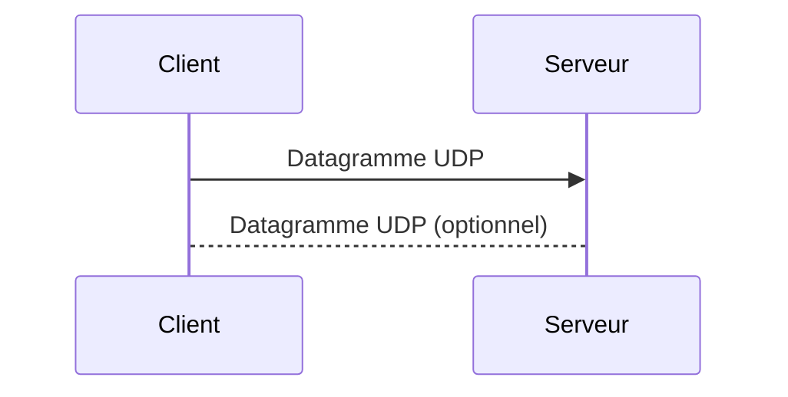

---
aliases:
  - User Datagram Protocol
  - UDP
  - Protocole de Datagramme Utilisateur
archetype: protocole
port_defaut: UDP 53 (DNS), 67/68 (DHCP), 123 (NTP)
couche_osi:
  - "Couche 4 - Transport"
rfc:
  - RFC 768
cssclasses:
  - max
tags:
  - protocole/udp
  - modele-osi
  - modele-osi/couche-4
  - port
  - protocole/tcp
  - protocole/dns
  - protocole/dhcp
  - protocole/ntp
  - latence
  - performance
  - iot
  - reseau
  - vulnerabilite
  - fiabilite
  - communication/reseau
  - application/jeux-en-ligne
  - norme/rfc
  - protocole/udp/datagramme
  - protocole/udp/connectionless
  - protocole/udp/absence-controle-congestion
  - protocole/udp/absence-controle-flux
  - protocole/udp/multicast
  - protocole/udp/broadcast
  - application/streaming-multimedia
---

# User Datagram Protocol

> [!info] Carte d'Identité
> * **Couche OSI** : Couche 4 - Transport
> * **Port par défaut** : `UDP 53 (DNS), 67/68 (DHCP), 123 (NTP)`
> * **Transport** : UDP

Le **User Datagram Protocol (UDP)** est un protocole de la couche transport du modèle OSI, défini dans le RFC 768. Il offre un service de communication de datagrammes simple, sans connexion, par opposition à TCP qui est orienté connexion et fiable.

## ⚙️ Fonctionnement

Contrairement au **Transmission Control Protocol (TCP)** qui établit une connexion fiable via un *handshake* en trois étapes (SYN, SYN-ACK, ACK) avant toute transmission de données, UDP est un protocole *sans connexion* (connectionless).

UDP fonctionne en envoyant des paquets de données, appelés **datagrammes**, directement à la destination sans établir de session préalable. Il n'y a pas de mécanisme intégré pour garantir l'ordre de livraison, détecter les pertes de paquets, ni assurer la retransmission des données. Chaque datagramme est traité indépendamment, comme une entité autonome. Ce modèle "best-effort" (au meilleur effort) privilégie la vitesse et la faible latence au détriment de la fiabilité.



## 📦 Structure du Paquet (Header)

L'en-tête UDP est particulièrement léger, ne faisant que 8 octets (64 bits) de longueur, ce qui contribue à sa faible surcharge (overhead) par rapport à TCP (qui a un en-tête de 20 à 60 octets).

| Champ | Taille (bits) | Description |
|---|---|---|
| **Source Port** | 16 | Numéro de port de l'application expéditrice. Peut être à zéro si le destinataire n'a pas besoin de répondre. |
| **Destination Port** | 16 | Numéro de port de l'application destinataire. |
| **Length** | 16 | Longueur totale du datagramme UDP en octets, incluant l'en-tête UDP et les données. La valeur minimale est 8 (taille de l'en-tête). |
| **Checksum** | 16 | Champ optionnel (obligatoire en IPv6) utilisé pour la détection d'erreurs sur l'en-tête UDP et la charge utile. Si non utilisé, la valeur est zéro. |

## ✅ Avantages de l'UDP

Les avantages de l'UDP découlent directement de sa conception simple et sans connexion:
*   **Faible Latence et Overhead Minimal** : L'absence de handshake, de mécanismes de contrôle de flux, de congestion ou de retransmission réduit considérablement la surcharge protocolaire et le délai de transmission, le rendant très rapide.
*   **Vitesse et Réactivité** : Idéal pour les applications où la rapidité est plus critique que la fiabilité absolue.
*   **Nature Stateless** : Les serveurs peuvent gérer un grand nombre de clients avec moins de ressources mémoire, car aucune information d'état de connexion n'est maintenue.
*   **Support du Multicast et Broadcast** : UDP est bien adapté pour envoyer des données à plusieurs destinataires simultanément (multicast) ou à tous les appareils sur un réseau (broadcast).

## ❌ Inconvénients de l'UDP

La simplicité d'UDP a des contreparties significatives:
*   **Non-Fiabilité** : UDP ne garantit ni la livraison, ni l'ordre des paquets, ni la protection contre les doublons. Les paquets peuvent être perdus, dupliqués ou arriver dans le désordre.
*   **Absence de Contrôle de Congestion** : UDP n'implémente pas de mécanismes pour s'adapter à la congestion du réseau, ce qui peut entraîner une saturation du réseau si des applications UDP envoient trop de données.
*   **Absence de Contrôle de Flux** : Il n'y a pas de mécanisme pour empêcher un émetteur rapide de submerger un récepteur lent.
*   **Vulnerabilités de Sécurité Potentielles** : L'absence de fonctions de sécurité intégrées comme l'authentification ou la vérification d'intégrité rend les applications UDP vulnérables si elles n'implémentent pas leurs propres mesures de sécurité.

## 🎯 Cas d'Usage Courants

En raison de ses caractéristiques de vitesse et de faible latence, UDP est idéal pour des applications où la perte occasionnelle de données est acceptable et où les délais sont critiques:
*   **Streaming Multimédia (Audio/Vidéo)** : Pour des services comme la Voix sur IP (VoIP) et le streaming vidéo, une petite perte de qualité est préférable à des retards importants causés par la retransmission de paquets perdus.
*   **Jeux en Ligne** : La faible latence est cruciale pour une expérience de jeu fluide, même si cela signifie parfois la perte de quelques mises à jour de l'état du jeu.
*   **Protocoles Requête/Réponse Simples** : Le DNS (Domain Name System), le NTP (Network Time Protocol) et le DHCP (Dynamic Host Configuration Protocol) utilisent souvent UDP pour leur rapidité et l'envoi de petites quantités de données transactionnelles.
*   **IoT (Internet des Objets)** : Pour l'envoi de petits paquets de données de télémétrie où les mises à jour fréquentes sont plus importantes que la livraison garantie.
*   **Protocoles de Routage** : Certains protocoles comme le RIP (Routing Information Protocol) utilisent UDP.

## 🦈 Analyse Wireshark

> [!tip] Filtres Utiles
> ```
> # Filtrer par protocole UDP
> udp
>
> # Filtrer par un port UDP spécifique (ex: DNS)
> udp.port == 53
>
> # Filtrer les datagrammes UDP non identifiés comme un protocole de couche supérieure
> udp && !(dns || ntp || dhcp) # ou d'autres protocoles encapsulés
>
> # Filtrer un champ spécifique dans l'en-tête UDP (ex: longueur du datagramme > 100 octets)
> udp.length > 100
>
> # Filtrer le contenu de la charge utile UDP (ex: séquence 81:60:03 au début de la charge utile)
> udp[8:3]==81:60:03
> ```

Wireshark peut identifier et analyser le trafic UDP, même lorsque des protocoles de couche application sont encapsulés au-dessus. Les statistiques de Wireshark offrent également des vues sur les *endpoints* UDP (adresse IP et port) et les *conversations* UDP (combinaison de deux *endpoints*).

## 🛡️ Sécurité

UDP, de par sa nature sans connexion et son manque de mécanismes de fiabilité et de contrôle, présente des vulnérabilités inhérentes:
*   **Sniffing** : UDP ne fournit pas de chiffrement par lui-même. La confidentialité des données dépend des protocoles de couche application ou des solutions de sécurité implémentées au-dessus (ex: VPN).
*   **Spoofing** : L'absence d'authentification ou de handshake rend UDP particulièrement sensible à l'**usurpation d'adresse IP (IP Spoofing)**. Les attaquants peuvent facilement forger l'adresse IP source des datagrammes UDP, rendant difficile l'identification de la source réelle d'une attaque.
*   **Attaques par Déni de Service (DoS/DDoS)** : Les **attaques par inondation UDP (UDP Flood)** sont courantes. Un attaquant envoie un grand volume de datagrammes UDP à des ports aléatoires sur un serveur cible, souvent avec des adresses IP sources usurpées. Le serveur est alors contraint de générer de nombreuses réponses [[ICMPProtocol|ICMP]] "Destination Unreachable", épuisant ses ressources et entraînant un déni de service pour le trafic légitime. Une autre vulnérabilité récente est le *Loop Denial-of-Service* (CVE-2024-2169) où des serveurs peuvent communiquer indéfiniment, conduisant à un DoS.
*   **Vulnérabilité aux Attaques par Rejeu (Replay Attacks)** : Puisqu'UDP ne maintient pas de séquence de paquets, il est plus facile pour les attaquants d'intercepter et de rejouer des paquets ultérieurement.

Pour les applications qui utilisent UDP et qui nécessitent de la fiabilité ou de la sécurité, ces mécanismes doivent être implémentés au niveau de l'application elle-même.