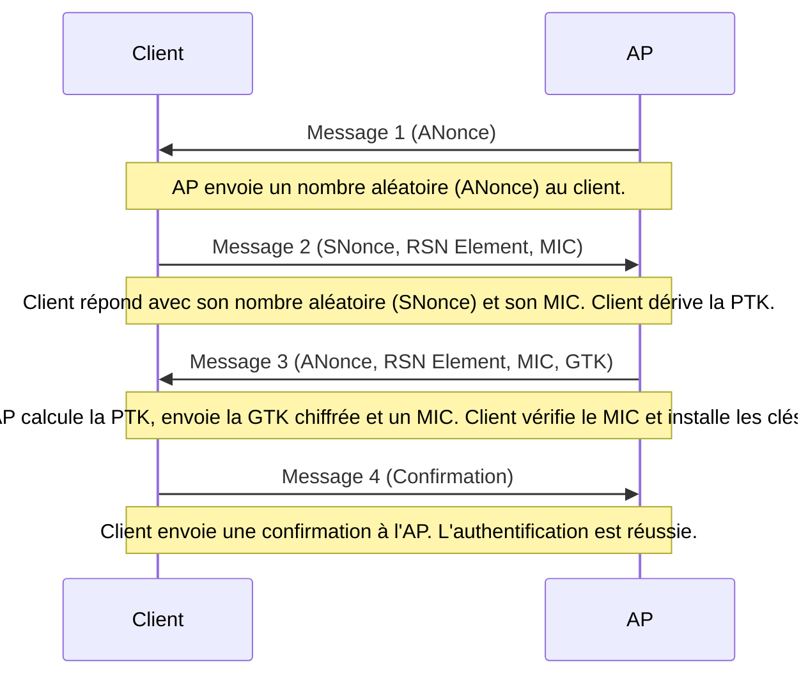

---
cssclasses:
  - max
aliases:
  - Wi-Fi Protected Access 2
  - WPA2 Protocol
archetype: protocole
port_defaut: N/A (Couche Liaison)
couche_osi:
  - "Couche 2 - Liaison"
rfc:
  - "IEEE 802.11i"
tags:
  - wifi/wpa2
  - protocole/ieee-802.11
  - modele-osi/couche-2
  - reseau/couche-2
  - chiffrement
  - cryptographie/chiffrement
  - chiffrement/aes
  - protocole/ccmp
  - wifi/wpa2/psk
  - wifi/wpa2/enterprise
  - protocole/radius
  - protocole/eap
  - communication/handshake
  - wifi/wpa2/four-way-handshake
  - wifi/wpa2/pmk
  - wifi/wpa2/ptk
  - wifi/wpa2/gtk
  - authentification
  - reseau/sans-fil
  - securite/sans-fil
---

# WPA2

> [!info] Carte d'Identité
> * **Couche OSI** : Couche 2 - Liaison
> * **Port par défaut** : `N/A`
> * **Transport** : *Wi-Fi (IEEE 802.11)*

## Description Technique

**WPA2** (Wi-Fi Protected Access 2) est un protocole de sécurité et un standard utilisé pour sécuriser les réseaux informatiques sans fil. Introduit en 2004, il est le successeur du standard WPA original et est devenu la norme de l'industrie pour la sécurisation des connexions Wi-Fi jusqu'à l'arrivée de WPA3. Il met en œuvre les éléments obligatoires de la norme **IEEE 802.11i**, offrant des fonctionnalités de sécurité renforcées.

Le but principal de WPA2 est de chiffrer les données transmises sur un réseau sans fil, empêchant ainsi l'accès non autorisé et l'écoute clandestine. Il utilise l'algorithme **Advanced Encryption Standard (AES)** avec une clé de 128 bits, renforçant la sécurité grâce au protocole **CCMP (Counter-Mode/CBC-MAC Protocol)**. CCMP assure un chiffrement robuste et l'intégrité des données en utilisant différents vecteurs d'initialisation (IV) à des fins de chiffrement et d'authentification.

WPA2 prend en charge deux modes de fonctionnement:
*   **WPA2-PSK (Pre-Shared Key)** : Couramment utilisé dans les réseaux domestiques et les petites entreprises. Les utilisateurs se connectent en entrant une phrase secrète pré-partagée qui est utilisée pour dériver les clés de chiffrement. Tous les appareils connectés au réseau partagent la même phrase secrète.
*   **WPA2-Enterprise** : Typiquement utilisé dans les grandes organisations. Il nécessite un serveur d'authentification, tel que **RADIUS (Remote Authentication Dial-In User Service)**, pour vérifier l'identité des utilisateurs. Chaque utilisateur dispose d'un nom d'utilisateur et d'un mot de passe uniques, et le serveur d'authentification gère le processus d'authentification. Ce mode utilise le protocole **EAP (Extensible Authentication Protocol)** pour la dérivation des clés.

## ⚙️ Fonctionnement (Handshake)

La communication sécurisée en WPA2 est établie via un processus en plusieurs étapes. Initialement, les appareils s'associent au point d'accès (AP) via une requête d'association. Ceci est suivi d'un *handshake* en 4 étapes, une étape cruciale pour garantir que le client et l'AP possèdent la bonne clé pré-partagée (PSK) sans la transmettre réellement.

Ce *handshake* en 4 étapes (ou *four-way handshake*) est conçu pour que le point d'accès (authenticator) et le client sans fil (supplicant) puissent prouver individuellement qu'ils connaissent la **PMK (Pairwise Master Key)** ou la PSK sans jamais envoyer la clé elle-même. À partir de cette PMK, une **PTK (Pairwise Transient Key)** est générée pour le chiffrement du trafic unicast, et une **GTK (Group Temporal Key)** est utilisée pour le trafic broadcast et multicast.

Le processus se déroule comme suit:



1.  **Message 1 (AP vers Client)** : L'AP envoie un nombre aléatoire (ANonce) au client. Avec cette information, le client peut dériver la **PTK (Pairwise Transient Key)**.
2.  **Message 2 (Client vers AP)** : Le client répond avec son propre nombre aléatoire (SNonce), un élément RSN et un code d'intégrité de message (MIC). Le client utilise l'ANonce, le SNonce, la PMK (dérivée de la PSK), les adresses MAC de l'AP et du client pour calculer la PTK.
3.  **Message 3 (AP vers Client)** : Après avoir vérifié le message 2, l'AP calcule également la PTK et envoie un message chiffré au client contenant l'ANonce, un élément RSN, un autre MIC, et la **GTK (Group Temporal Key)**, utilisée pour le trafic de groupe.
4.  **Message 4 (Client vers AP)** : Après avoir vérifié le message 3, le client envoie une confirmation à l'AP que les clés temporaires (PTK et GTK) ont été installées avec succès.

Une fois le *handshake* terminé, la PTK est utilisée pour chiffrer le trafic unicast, et la GTK est utilisée pour le trafic broadcast.

## 📦 Structure du Paquet (Header)

WPA2 utilise le **CCMP (Counter Mode with Cipher Block Chaining Message Authentication Code Protocol)** pour le chiffrement et l'intégrité des messages. CCMP encapsule la charge utile du paquet IEEE 802.11.

Les informations de sécurité WPA2 sont insérées dans l'en-tête du paquet Wi-Fi, avant la charge utile.

| Champ | Taille | Description |
|---|---|---|
| **Link Header** | Variable | En-tête IEEE 802 pour le paquet Wi-Fi, incluant la charge utile mais excluant le CRC du paquet. |
| **Packet Number (PN)** | 6 octets | Chaque paquet est numéroté individuellement pour détecter les paquets dupliqués. |
| **Flags** | 2 octets | Contient le flag `ExtIV` (Extension Initialization Vector) indiquant que cet en-tête contient 8 octets au lieu des 4 utilisés dans WEP obsolète. |
| **Key ID** | | Partie de l'en-tête pour l'identification de la clé. |
| **Payload data** | Variable | Contenu des données du paquet, incluant les en-têtes des couches 3 à 7. Le chiffrement est en mode CCM (RFC 3610). |
| **Message Integrity Code (MIC)** | 8 octets | Code calculé par CBC-MAC pour l'intégrité du message. Essentiellement doublement chiffré. |
| **Packet's CRC** | 4 octets | Vérification de redondance cyclique (Cyclic Redundancy Check) de détection d'erreurs, calculée selon la norme IEEE 802. |

## 🦈 Analyse Wireshark

Pour analyser le trafic WPA2 avec Wireshark, il est impératif de capturer le *four-way handshake*. Sans cette capture, Wireshark ne pourra pas déchiffrer le trafic. Il faut également configurer Wireshark avec la phrase secrète (PSK) du réseau Wi-Fi.

> [!tip] Filtres Utiles
> ```
> # Filtrer par protocole EAPOL (pour le handshake en 4 étapes)
> eapol
>
> # Filtrer par protocole 802.11 (couche liaison)
> wlan
>
> # Filtrer les paquets de données chiffrés (avant déchiffrement)
> wlan.fc.type_subtype == 0x20 || wlan.fc.type_subtype == 0x21 || wlan.fc.type_subtype == 0x28 || wlan.fc.type_subtype == 0x29 || wlan.fc.type_subtype == 0x2a || wlan.fc.type_subtype == 0x2b || wlan.fc.type_subtype == 0x2c || wlan.fc.type_subtype == 0x2d || wlan.fc.type_subtype == 0x2e || wlan.fc.type_subtype == 0x2f
>
> # Filtrer le trafic HTTP après déchiffrement
> http
> ```
Pour déchiffrer le trafic WPA2-PSK, accédez aux préférences de Wireshark (`Edit -> Preferences -> Protocols -> IEEE 802.11`), cochez "Enable Decryption" et ajoutez la clé de déchiffrement en tant que `wpa-pwd` au format `mot_de_passe:SSID` ou simplement `mot_de_passe`. Redémarrer ou recharger la capture peut être nécessaire pour appliquer les modifications.

## 🛡️ Sécurité

WPA2 a considérablement amélioré la sécurité des réseaux sans fil par rapport à ses prédécesseurs, WEP et WPA. L'utilisation de l'algorithme de chiffrement **AES (Advanced Encryption Standard)**, avec le protocole **CCMP**, est une pierre angulaire de sa robustesse. AES, développé par le gouvernement américain pour protéger les données classifiées, est un algorithme de chiffrement puissant largement considéré comme sûr. CCMP assure la confidentialité des données et l'intégrité des messages en utilisant le *Cipher Block Chaining Message Authentication Code*.

> [!danger] Vulnérabilités Connues
> *   **Sniffing** : Le trafic est chiffré par AES-CCMP, rendant le *sniffing* difficile sans la clé de déchiffrement. Cependant, si un attaquant capture le *four-way handshake* et connaît la PSK (dans le cas de WPA2-PSK), il peut déchiffrer le trafic ultérieur.
> *   **Attaques par dictionnaire/Brute-force (WPA2-PSK)** : La sécurité de WPA2-PSK dépend fortement de la robustesse de la phrase secrète (PSK). Des mots de passe faibles sont vulnérables aux attaques par dictionnaire et par force brute, où un attaquant tente de deviner la PSK en capturant le *handshake* en 4 étapes et en essayant de calculer la PTK pour chaque mot de passe de sa liste.
> *   **KRACK (Key Reinstallation Attack)** : Découverte en 2017, cette vulnérabilité exploite une faille dans le protocole WPA2 lui-même, affectant toutes les implémentations WPA2, y compris WPA2-Personal et WPA2-Enterprise. L'attaque KRACK permet à un attaquant à portée du réseau de manipuler et de réinstaller la troisième étape du *four-way handshake* pour forcer la réutilisation de clés de chiffrement, ce qui peut mener à la déchiffrement, l'injection et la manipulation de données. Bien que WPA2-AES soit également vulnérable, l'impact est particulièrement catastrophique contre les protocoles WPA-TKIP ou GCMP. Des mises à jour logicielles et micrologicielles sont nécessaires pour se protéger contre cette attaque.
> *   **Spoofing** : Dans le cas de WPA2-Enterprise, l'authentification est plus forte grâce à l'utilisation de serveurs RADIUS et EAP. Cependant, des attaques de *spoofing* peuvent toujours être tentées si les certificats ne sont pas correctement validés ou si des techniques d'ingénierie sociale sont utilisées.
> *   **Authentification faible** : Pour WPA2-PSK, une phrase secrète faible est une vulnérabilité majeure. Pour WPA2-Enterprise, bien que l'authentification soit plus robuste, elle peut être compromise par des identifiants d'utilisateur faibles ou des serveurs d'authentification mal configurés.
