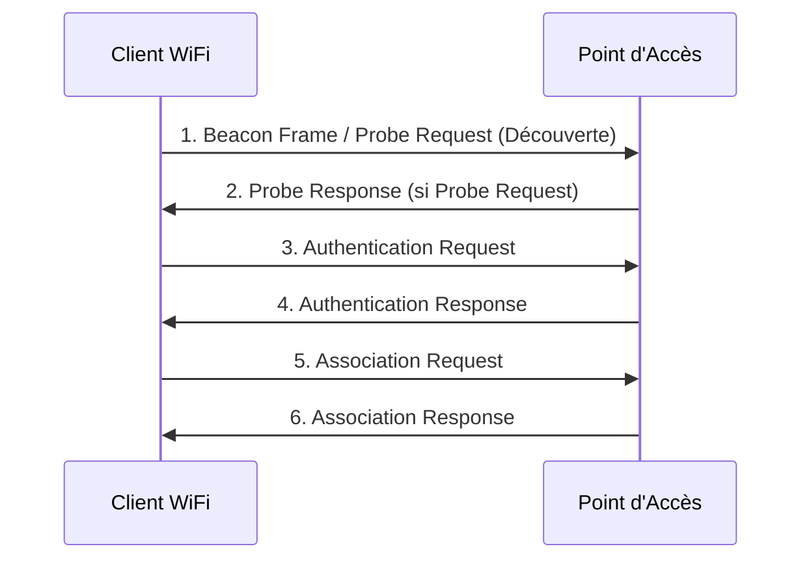

---
aliases:
  - Wi-Fi
  - Wireless Fidelity
  - IEEE 802.11
archetype: protocole
port_defaut:
couche_osi:
  - Couche 1 - Physique
  - Couche 2 - Liaison
rfc:
  - IEEE 802.11
  - IEEE 802.11a
  - IEEE 802.11b
  - IEEE 802.11g
  - IEEE 802.11n
  - IEEE 802.11ac
  - IEEE 802.11ax
cssclasses:
  - max
tags:
  - reseau/sans-fil/wi-fi
  - communication/handshake
  - gestion-acces/csma-ca
  - identifiant/ssid
---

# Wi-Fi (Wireless Fidelity)

> [!info] Carte d'Identité
> * **Couche OSI** : Couche 1 - Physique, Couche 2 - Liaison
> * **Port par défaut** : `N/A`
> * **Transport** : *IEEE 802.11*

Le *Wi-Fi*, abréviation de Wireless Fidelity, est une technologie de réseau local sans fil (WLAN) basée sur les spécifications techniques du standard IEEE 802.11. Il permet aux appareils de se connecter à un réseau ou à internet sans fil, en utilisant des ondes radio.

## ⚙️ Fonctionnement (Handshake d'Association)
L'établissement d'une connexion Wi-Fi entre un client (station) et un point d'accès (AP) implique un processus d'association en plusieurs étapes : la découverte, l'authentification et l'association.



1.  **Découverte** : La station peut découvrir les réseaux disponibles de deux manières. Elle écoute les *Beacon Frames* diffusées périodiquement par les points d'accès (mode passif) ou envoie des *Probe Requests* (mode actif) pour solliciter des réponses des AP à portée.
2.  **Réponse de Sonde** : Les AP répondent aux *Probe Requests* avec des *Probe Responses*, fournissant des informations sur le réseau (SSID, débits supportés, etc.).
3.  **Authentification** : La station envoie une *Authentication Request* à l'AP. Historiquement, l'authentification ouverte ou par clé partagée était utilisée. Les normes modernes (WPA2/WPA3) utilisent des mécanismes plus robustes basés sur IEEE 802.1X ou PSK (Pre-Shared Key).
4.  **Réponse d'Authentification** : L'AP répond par une *Authentication Response* indiquant le succès ou l'échec de l'authentification.
5.  **Association** : Une fois authentifiée, la station envoie une *Association Request* à l'AP, demandant à se joindre au réseau. Cette requête inclut les capacités de la station.
6.  **Réponse d'Association** : L'AP répond avec une *Association Response* confirmant l'association et attribuant un ID d'association (AID) à la station. Une fois associée, la station peut échanger des données.

### CSMA/CA (Carrier Sense Multiple Access with Collision Avoidance)
Le Wi-Fi utilise le mécanisme *CSMA/CA* (Carrier Sense Multiple Access with Collision Avoidance) pour gérer l'accès au support de transmission partagé (les ondes radio) et éviter les collisions. Ce protocole, utilisé dans les réseaux sans fil 802.11, vise à réduire la probabilité que deux appareils transmettent des données simultanément.
Le processus se déroule comme suit :
*   **Écoute du support (Carrier Sense)** : Une station qui souhaite transmettre écoute le canal pour s'assurer qu'il est libre.
*   **IFS (Interframe Spacing)** : Si le canal est libre pendant une période définie (IFS), la station attend un temps aléatoire appelé *Backoff Timer*.
*   **Décompte du Backoff** : Si le canal reste libre pendant le décompte, la station transmet. Si le canal devient occupé, le décompte est mis en pause et reprend lorsque le canal est de nouveau libre.
*   **Accusé de réception (ACK)** : Après la transmission, le récepteur envoie un ACK. Si l'émetteur ne reçoit pas d'ACK, il suppose une collision et réessaie après un nouveau backoff.
*   **NAV (Network Allocation Vector)** : Les stations maintiennent un *Network Allocation Vector* (NAV), un mécanisme de réservation virtuelle du support. Les trames RTS/CTS (Request To Send/Clear To Send) peuvent être utilisées pour coordonner l'accès et mettre à jour le NAV des autres stations, leur indiquant de s'abstenir de transmettre pendant une certaine durée.

### SSID (Service Set Identifier)
Le *SSID* (Service Set Identifier) est le nom d'un réseau Wi-Fi. C'est une chaîne de caractères (jusqu'à 32 octets) qui identifie de manière unique un réseau sans fil. Les points d'accès diffusent généralement leur SSID dans les balises (Beacon Frames), permettant aux clients de découvrir les réseaux disponibles. Les clients peuvent également sonder des SSID spécifiques. Le SSID est sensible à la casse.

## 📦 Structure du Paquet (Header IEEE 802.11)
Les paquets Wi-Fi sont appelés des *trames* (frames) 802.11. Une trame 802.11 typique se compose d'un en-tête MAC, d'un corps de trame et d'une séquence de contrôle de trame (FCS).
L'en-tête MAC contient des informations cruciales pour le routage et le contrôle au niveau de la couche liaison de données. Les champs principaux incluent:

| Champ              | Taille (Octets) | Description                                                                                             |
| :----------------- | :-------------- | :------------------------------------------------------------------------------------------------------ |
| **Frame Control**  | 2               | Identifie le type de trame (gestion, contrôle, données) et contient des sous-champs (version, type, sous-type, To DS, From DS, Power Mgmt, WEP, etc.). |
| **Duration/ID**    | 2               | Indique la durée de la transmission pour les mécanismes d'accès au support (NAV) ou un ID d'association. |
| **Address 1 (RA)** | 6               | Adresse MAC du récepteur (Receiver Address) de la trame.                                 |
| **Address 2 (TA)** | 6               | Adresse MAC de l'émetteur (Transmitter Address) de la trame.                                 |
| **Address 3**      | 6               | Peut être l'adresse de destination (DA) ou l'adresse source (SA) en fonction des bits To DS/From DS. |
| **Sequence Control** | 2               | Contient le numéro de séquence et le numéro de fragment, utilisés pour la réorganisation des segments et la détection des doublons. |
| **Address 4**      | 6               | Utilisé uniquement dans les systèmes de distribution sans fil (WDS) pour les répéteurs.    |
| **QoS Control**    | 2               | Champ optionnel pour la qualité de service (802.11e).                                        |
| **HT Control**     | 4               | Champ optionnel pour le haut débit (802.11n et plus).                                        |

## 🦈 Analyse Wireshark
> [!tip] Filtres Utiles
> ```
> # Filtrer par protocole Wi-Fi
> wlan
>
> # Filtrer les trames de gestion (type 0)
> wlan.fc.type == 0
>
> # Filtrer les trames de contrôle (type 1)
> wlan.fc.type == 1
>
> # Filtrer les trames de données (type 2)
> wlan.fc.type == 2
>
> # Filtrer par type/sous-type (ex: requêtes d'association)
> wlan.fc.type_subtype == 0x0000 # Association Request
> wlan.fc.type_subtype == 0x0001 # Association Response
> wlan.fc.type_subtype == 0x0004 # Probe Request
> wlan.fc.type_subtype == 0x0005 # Probe Response
> wlan.fc.type_subtype == 0x0008 # Beacon
> wlan.fc.type_subtype == 0x000b # Authentication
> wlan.fc.type_subtype == 0x0029 # ACK (Acknowledgement)
> wlan.fc.type_subtype == 0x0027 # RTS (Request To Send)
> wlan.fc.type_subtype == 0x0028 # CTS (Clear To Send)
>
> # Filtrer par SSID
> wlan_mgt.ssid == "NomDeMonReseau"
>
> # Filtrer par BSSID (MAC du point d'accès)
> wlan.bssid == aa:bb:cc:dd:ee:ff
>
> # Filtrer par adresse MAC de la station (émetteur/récepteur/source/destination)
> wlan.addr == aa:bb:cc:dd:ee:ff
> wlan.ta == aa:bb:cc:dd:ee:ff # Transmitter Address
> wlan.ra == aa:bb:cc:dd:ee:ff # Receiver Address
> ```

## 🛡️ Sécurité
> [!danger] Vulnérabilités Connues
> *   **Sniffing** : Si le réseau n'est pas chiffré (mode ouvert), les données peuvent être interceptées. Avec les protocoles de sécurité modernes (WPA2/WPA3), le trafic est chiffré.
> *   **Spoofing** : Usurpation d'adresse MAC ou de points d'accès malveillants (*Rogue AP*) pour tromper les utilisateurs.
> *   **Attaques par dictionnaire/Brute-force** : Contre les clés pré-partagées (PSK) si le mot de passe est faible.

### Protocoles de Sécurité Wi-Fi
L'évolution des standards Wi-Fi a également vu l'amélioration des protocoles de sécurité pour protéger les réseaux sans fil.

*   **WEP (Wired Equivalent Privacy)** :
    *   Le plus ancien protocole de sécurité Wi-Fi, introduit avec la norme 802.11 d'origine.
    *   Utilise l'algorithme de chiffrement *RC4* avec une clé statique.
    *   Extrêmement vulnérable et facilement cassable, il est fortement déconseillé.
*   **WPA (Wi-Fi Protected Access)** :
    *   Solution provisoire développée en 2003 pour corriger les faiblesses du WEP avant la finalisation du 802.11i.
    *   Utilise le protocole *TKIP* (Temporal Key Integrity Protocol) pour le chiffrement dynamique des clés.
    *   Bien que plus sûr que WEP, TKIP a également montré des vulnérabilités.
*   **WPA2 (Wi-Fi Protected Access 2)** :
    *   Basé sur la norme *IEEE 802.11i*, ratifié en 2004, c'est le standard de sécurité Wi-Fi le plus répandu.
    *   Utilise l'algorithme de chiffrement *AES* (Advanced Encryption Standard) avec le mode de chiffrement *CCMP* (Counter Mode with Cipher Block Chaining Message Authentication Code Protocol) pour une sécurité robuste.
    *   **WPA2-Personal (PSK)** : Pour les réseaux domestiques et petites entreprises, utilise une clé pré-partagée.
    *   **WPA2-Enterprise** : Pour les grandes entreprises, il s'appuie sur le standard *IEEE 802.1X* et des serveurs d'authentification (ex: RADIUS) pour une authentification par utilisateur/appareil. Il utilise des méthodes d'authentification avancées comme EAP-TLS, EAP-PEAP.
*   **WPA3 (Wi-Fi Protected Access 3)** :
    *   Introduit en 2018, il est le dernier standard de sécurité, offrant des améliorations significatives par rapport à WPA2.
    *   **WPA3-Personal** : Remplace le PSK par le protocole *SAE* (Simultaneous Authentication of Equals), offrant une meilleure protection contre les attaques par dictionnaire hors ligne.
    *   **WPA3-Enterprise** : Offre une force de chiffrement de 192 bits et des protections renforcées pour les réseaux sensibles.
    *   Inclut l'*Opportunistic Wireless Encryption* (OWE) pour améliorer la sécurité des réseaux ouverts publics.

## Standards IEEE 802.11 et leurs Spécifications
L'évolution du Wi-Fi est marquée par une série de standards IEEE 802.11, chacun apportant des améliorations en termes de débit, de portée et de fréquences. Le Wi-Fi Alliance a introduit un système de dénomination simplifié (Wi-Fi 4, 5, 6, etc.) pour aider à différencier ces versions.

| Standard                | Année | Fréquences Opérationnelles | Débit Max Théorique | Caractéristiques Clés                                                                                                                   |
| :---------------------- | :---- | :------------------------- | :------------------ | :-------------------------------------------------------------------------------------------------------------------------------------- |
| **802.11 (Original)**   | 1997  | 2.4 GHz                    | 1-2 Mbps            | Première norme WLAN, utilise DSSS (Direct Sequence Spread Spectrum) et FHSS (Frequency Hopping Spread Spectrum).             |
| **802.11a**             | 1999  | 5 GHz                      | 54 Mbps             | Utilise l'OFDM (Orthogonal Frequency-Division Multiplexing), moins sujette aux interférences dans la bande 5 GHz.       |
| **802.11b**             | 1999  | 2.4 GHz                    | 11 Mbps             | Utilise DSSS, a popularisé le Wi-Fi, portée plus longue mais sensible aux interférences de la bande 2.4 GHz.            |
| **802.11g**             | 2003  | 2.4 GHz                    | 54 Mbps             | Combine les avantages de 802.11a (OFDM) et 802.11b (2.4 GHz), rétrocompatible avec 802.11b.                               |
| **802.11n (Wi-Fi 4)**   | 2009  | 2.4 / 5 GHz                | 600 Mbps            | Introduction du *MIMO* (Multiple-Input Multiple-Output) et du *Channel Bonding* (agrégation de canaux) pour augmenter le débit et la portée. |
| **802.11ac (Wi-Fi 5)**  | 2013  | 5 GHz                      | 6.9 Gbps            | Connu sous le nom de Wi-Fi 5, opère principalement sur la bande 5 GHz, introduction du *MU-MIMO* (Multi-User MIMO) en downlink et des canaux plus larges (jusqu'à 160 MHz). |
| **802.11ax (Wi-Fi 6/6E)** | 2019  | 2.4 / 5 / 6 GHz            | 9.6 Gbps            | Connu sous le nom de Wi-Fi 6, améliore l'efficacité dans les environnements denses. Introduction de l'*OFDMA* (Orthogonal Frequency-Division Multiple Access), *BSS Coloring*, *Target Wake Time* (TWT) et MU-MIMO en uplink et downlink. Le Wi-Fi 6E étend l'utilisation à la bande 6 GHz. |

## 🔗 Notes Connexes
<!-- Aucune note connexe générée car la politique de non-lien est en vigueur. -->