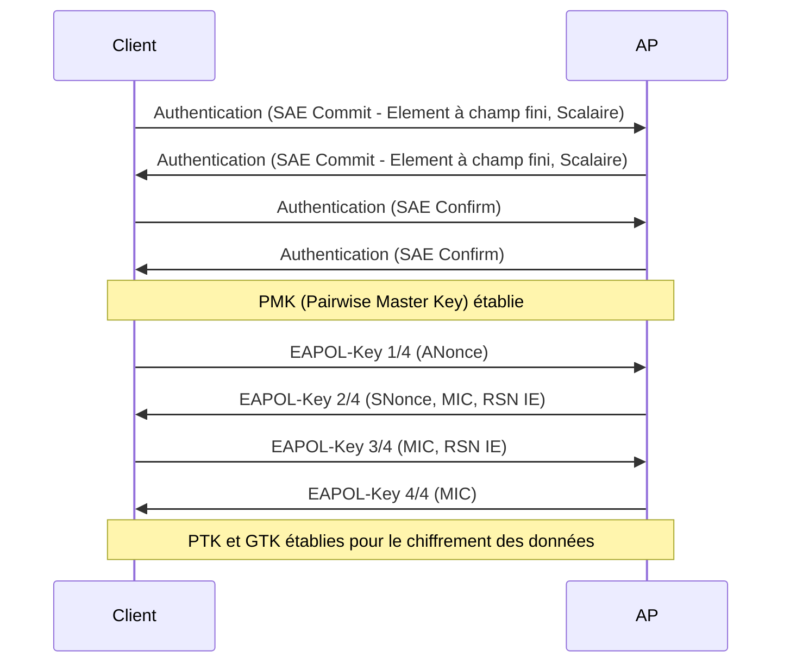

---
aliases:
  - WPA3
  - Wi-Fi Protected Access 3
  - WPA 3
  - SAE
  - Opportunistic Wireless Encryption
archetype: protocole
port_defaut: N/A
couche_osi:
  - "Couche 2 - Liaison"
rfc:
  - IEEE 802.11-2016
  - IEEE 802.11w
  - RFC 8110
cssclasses:
  - max
tags:
  - norme/standard
  - wifi/wpa3
  - securite/sans-fil
  - protocole/ieee-802.11
  - protocole/sae
  - protocole/owe
  - authentification
  - chiffrement
  - confidentialite/chiffrement
  - communication/handshake
  - modele-osi/couche-2
  - outil/wireshark
  - protocole/ieee-802.11w
  - securite/pmf
  - securite/pfs
---

# WPA3

> [!info] Carte d'Identité
> * **Couche OSI** : Couche 2 - Liaison
> * **Port par défaut** : N/A
> * **Transport** : Wi-Fi (IEEE 802.11)

WPA3 (Wi-Fi Protected Access 3) est la troisième génération du standard de sécurité Wi-Fi, développée par la Wi-Fi Alliance et introduite en 2018 pour succéder à WPA2. Son objectif principal est d'améliorer la sécurité globale des réseaux Wi-Fi en renforçant l'authentification et le chiffrement.

## ⚙️ Fonctionnement (Handshake)

WPA3 introduit des mécanismes d'authentification et d'échange de clés significativement améliorés par rapport à WPA2, ciblant différentes catégories d'utilisation.

### WPA3-Personal (Mode Personnel)

Le mode personnel de WPA3 remplace le mécanisme de clé pré-partagée (PSK) de WPA2 par l'authentification simultanée d'égaux (**Simultaneous Authentication of Equals - SAE**), également connue sous le nom de protocole Dragonfly. Ce protocole d'établissement de clé sécurisé offre une meilleure protection contre les attaques par dictionnaire hors ligne et les attaques par force brute.

Le handshake SAE établit une clé de session unique à chaque connexion, garantissant la *confidentialité persistante* (Perfect Forward Secrecy - PFS). Même si un attaquant parvenait à compromettre la clé d'une session ultérieure, le trafic chiffré des sessions précédentes resterait protégé.


*Note: Le diagramme ci-dessus illustre la phase d'authentification SAE suivie du 4-way handshake traditionnel pour l'établissement des clés de session (PTK et GTK).*

### WPA3-Enterprise (Mode Entreprise)

Pour les réseaux d'entreprise traitant des données sensibles, WPA3-Enterprise continue d'utiliser le protocole 802.1X et le *Extensible Authentication Protocol* (EAP) pour l'authentification. Cependant, il renforce la suite cryptographique, imposant une force de chiffrement équivalente à 192 bits (Suite B).

### Wi-Fi Enhanced Open (OWE)

WPA3 introduit le mode *Wi-Fi Enhanced Open*, qui utilise l'*Opportunistic Wireless Encryption* (OWE) pour sécuriser les réseaux Wi-Fi ouverts (publics, invités) qui ne nécessitent pas de mot de passe. OWE fournit un chiffrement transparent entre le client et le point d'accès via un échange de clés Diffie-Hellman, protégeant les données contre l'écoute passive (sniffing).

### Mode de Transition

Pour faciliter l'adoption de WPA3, un mode de transition permet aux réseaux de prendre en charge simultanément WPA2 et WPA3, assurant une rétrocompatibilité avec les appareils plus anciens.

## 📦 Structure du Paquet (Header)

WPA3 n'introduit pas un "en-tête de paquet" distinct au sens TCP/IP, mais modifie les champs de l'élément d'information RSN (Robust Security Network) au sein des trames de gestion 802.11 (telles que les balises et les réponses de sonde).

| Champ (dans RSN IE) | Taille | Description |
|---|---|---|
| **Version** | 2 octets | Version du protocole RSN (toujours 1) |
| **Cipher Suite Selector** | 4 octets | Indique la suite de chiffrement (ex: CCMP-128, GCMP-256) |
| **Authentication and Key Management (AKM) Suite Selector** | 4 octets | Indique la méthode AKM. Pour WPA3-Personal, la valeur est `00-0F-AC:8` (SAE). Pour WPA2-PSK, elle est `00-0F-AC:2`. |
| **RSN Capabilities** | 2 octets | Contient des drapeaux de capacité, notamment pour les *Protected Management Frames* (PMF). |
| **Group Management Cipher Suite** | 4 octets | Définit la suite de chiffrement pour les trames de gestion protégées.|

Une différence notable est que les *Protected Management Frames* (PMF), spécifiées par IEEE 802.11w, sont obligatoires pour toutes les connexions WPA3 afin de protéger le trafic de gestion sans fil (désauthentification, désassociation) contre l'espionnage et la falsification.

## 🦈 Analyse Wireshark

L'analyse des communications WPA3 avec Wireshark se concentre sur les trames IEEE 802.11 et les échanges EAPOL (Extensible Authentication Protocol over LAN).

> [!tip] Filtres Utiles
> ```
> # Filtrer par protocole EAPOL (pour le 4-way handshake)
> eapol
>
> # Filtrer par type d'AKM pour SAE (WPA3-Personal)
> wlan.rsn.akm.type == 8
>
> # Filtrer les trames de gestion protégées (PMF)
> wlan.fixed.frame_control.subtype == 12 # Deauthentication
> wlan.fixed.frame_control.subtype == 10 # Disassociation
> wlan.fixed.wep == 1 # Indique le chiffrement des trames de gestion
> ```

**Décriffrement des Paquets WPA3 :**
En raison de l'implémentation de la confidentialité persistante (PFS) via SAE, le déchiffrement passif du trafic WPA3 avec Wireshark est plus complexe qu'avec WPA2. Contrairement à WPA2 où la connaissance du PSK et la capture du 4-way handshake suffisaient pour déchiffrer tout le trafic, WPA3 utilise une *Pairwise Master Key* (PMK) unique pour chaque connexion. Pour déchiffrer le trafic WPA3, il est nécessaire d'obtenir la PMK directement depuis le client ou le point d'accès (par exemple, en activant la journalisation détaillée sur `wpa_supplicant` ou `hostapd`) et de l'ajouter manuellement dans les préférences de déchiffrement 802.11 de Wireshark.

## 🛡️ Sécurité

WPA3 apporte des améliorations significatives en matière de sécurité par rapport à son prédécesseur.

> [!danger] Vulnérabilités Connues
> *   **Attaques "Dragonblood" (2019)** : Des vulnérabilités ont été découvertes dans le handshake Dragonfly (SAE) de WPA3, permettant potentiellement des attaques par dictionnaire et par dégradation, en particulier en mode de transition.
> *   **Sniffing** : Le trafic est chiffré. Cependant, en mode OWE, l'authentification n'est pas fournie, ce qui peut rendre les réseaux OWE vulnérables aux attaques "Evil Twin" si une authentification basée sur l'identité n'est pas ajoutée.
> *   **Spoofing** : PMF rend les attaques de *spoofing* sur les trames de gestion plus difficiles, mais des vulnérabilités peuvent exister dans des implémentations spécifiques.

### Améliorations de Sécurité

*   **Résistance aux Attaques par Dictionnaire hors ligne** : Le protocole SAE rend les attaques par devinette de mot de passe beaucoup plus difficiles en exigeant une interaction avec le réseau à chaque tentative d'authentification, empêchant ainsi les attaques par dictionnaire hors ligne.
*   **Confidentialité Persistante (Perfect Forward Secrecy - PFS)** : Chaque session Wi-Fi utilise une clé de session unique. Cela signifie que même si un attaquant parvient à compromettre la clé d'une session, il ne pourra pas déchiffrer le trafic des sessions précédentes.
*   **Chiffrement Renforcé** :
    *   WPA3-Personal utilise l'algorithme Advanced Encryption Standard (AES) en mode Galois/Counter Mode (GCM) avec une force de chiffrement de 128 bits.
    *   WPA3-Enterprise offre une suite de sécurité de 192 bits (appelée Suite B), comprenant AES-GCM-256, HMAC-SHA-384 et ECDH/ECDSA avec des courbes P-384, pour les environnements nécessitant une sécurité maximale, comme les organisations gouvernementales ou militaires.
*   **Protection des Trames de Gestion (Protected Management Frames - PMF)** : Les PMF (norme IEEE 802.11w) sont obligatoires dans WPA3, ce qui protège les trames de gestion Wi-Fi (comme les trames de désauthentification) contre les attaques par usurpation d'identité et de déni de service (DoS).
*   **Chiffrement Individuel des Données** : Pour les réseaux ouverts, OWE chiffre le trafic de données entre le client et le point d'accès, garantissant la confidentialité des données même sans mot de passe réseau. Cela protège contre l'espionnage passif des utilisateurs sur le même réseau.
*   **Wi-Fi Certified Easy Connect** : Simplifie l'intégration sécurisée des appareils IoT (Internet des Objets) dépourvus d'interface utilisateur, souvent via des codes QR ou NFC, réduisant ainsi les vulnérabilités liées aux mots de passe faibles.

### Différences avec WPA2

| Caractéristique             | WPA2                                 | WPA3                                                                                                                                                                                          |
| :-------------------------- | :----------------------------------- | :------------------------------------------------------------------------------------------------------------------------------------------------------------------------------------------ |
| **Authentification**        | PSK (Pre-Shared Key) pour personnel. 802.1X pour entreprise. | SAE (Simultaneous Authentication of Equals) pour personnel, résistant aux attaques par dictionnaire hors ligne. 802.1X amélioré pour entreprise. |
| **Confidentialité persistante (PFS)** | Non                                     | Oui, pour chaque session.                                                                                                                           |
| **Chiffrement personnel**   | AES-CCMP 128 bits.                        | AES-GCM 128 bits (obligatoire).                                                                                                                       |
| **Chiffrement entreprise**  | AES-CCMP 128 bits.                       | Suite de sécurité 192 bits (GCMP-256, HMAC-SHA-384).                                                                   |
| **Réseaux ouverts**         | Non chiffrés.                            | Chiffrement opportuniste (OWE).                                                                                                                       |
| **Trames de gestion**       | Protection optionnelle (802.11w).        | Protection obligatoire (802.11w - PMF).                                                                                                          |
| **Vulnérabilités connues**  | Attaques KRACK (Key Reinstallation Attack), attaques par dictionnaire hors ligne. | Attaques "Dragonblood" (vulnérabilités dans SAE, attaques par dégradation en mode transition).                                                                          |