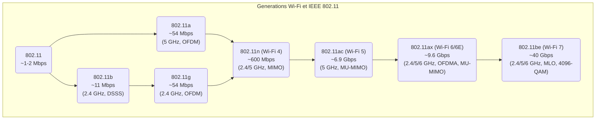

---
aliases:
  - "IEEE 802.11"
  - "802.11"
  - "Wi-Fi"
  - "Wireless Fidelity"
  - "Réseaux sans fil"
  - "WLAN"
  - "Wireless Local Area Network"
archetype: norme
annee: 1997
cssclasses:
  - max
tags:
  - protocole/ieee-802-11
  - wifi
  - reseau/sans-fil
  - norme
  - chiffrement
  - authentification
  - gestion-acces/csma-ca
  - wifi/wpa2
  - wifi/wpa3
  - wifi/mimo
  - wifi/mu-mimo
  - wifi/ofdma
  - wifi/wi-fi-4
  - wifi/wi-fi-5
  - wifi/wi-fi-6
  - certification/wi-fi
  - iot
  - telecommunications
---

# IEEE 802.11 (Wi-Fi)

> [!summary] Objectif
> L'objectif ultime de la norme IEEE 802.11 est de définir les spécifications techniques pour les **Réseaux Locaux Sans Fil (WLAN)**, permettant la communication de données sans fil entre des appareils dans une zone géographique limitée. Elle vise à garantir l'interopérabilité des équipements de différents fabricants et à fournir un cadre pour des communications sans fil fiables, sécurisées et performantes.

## 📋 Périmètre d'Application
*   **Secteur** : Télécommunications, Informatique, Électronique Grand Public, Réseautage d'Entreprise, Internet des Objets (IoT), Smart Home, Industrie. Elle est omniprésente dans la connectivité sans fil.
*   **Portée** : Mondiale. La norme IEEE 802.11 est la base des produits Wi-Fi utilisés partout dans le monde.
*   **Caractère** : Volontaire (Standard Technique). Bien que son adoption soit généralisée, la norme elle-même n'est pas une loi obligatoire, mais un ensemble de spécifications techniques que les fabricants choisissent de respecter pour garantir la compatibilité et l'interopérabilité des produits sous la marque *Wi-Fi*.

## 🔑 Exigences Clés (Spécifications Techniques Fondamentales)
> [!check] Points de Contrôle
> - [ ] **[Couche Physique (PHY)]** : Définition des méthodes de transmission radio, incluant les fréquences, les types de modulation (ex: DSSS, OFDM, MIMO, OFDMA), et les débits de données supportés.
> - [ ] **[Sous-couche d'Accès au Médium (MAC)]** : Mise en œuvre du protocole d'accès au médium **CSMA/CA (Carrier Sense Multiple Access with Collision Avoidance)** pour gérer le partage du spectre radio et éviter les collisions.
> - [ ] **[Sécurité]** : Intégration de mécanismes de sécurité pour l'authentification et le chiffrement des données (ex: WEP, WPA, WPA2, WPA3).
> - [ ] **[Interopérabilité]** : Spécifications garantissant que les équipements conformes à la norme 802.11 de différents fabricants peuvent communiquer entre eux.

## 🔄 Processus de Conformité et d'Interopérabilité
1.  **Développement de la Norme (IEEE)** : Le groupe de travail IEEE 802.11 élabore et révise les amendements de la norme.
2.  **Certification Wi-Fi Alliance** : La **Wi-Fi Alliance** est une organisation industrielle mondiale qui certifie les produits basés sur la norme IEEE 802.11. Ce processus garantit l'interopérabilité entre les équipements et la conformité aux spécifications de la norme.
3.  **Tests de Conformance** : Les produits subissent des tests rigoureux pour s'assurer qu'ils respectent les exigences techniques de la norme et qu'ils peuvent fonctionner correctement avec d'autres appareils certifiés Wi-Fi.

## 📜 Contexte et Historique
La norme IEEE 802.11 a été initialement publiée en **1997** par l'Institute of Electrical and Electronics Engineers (IEEE). Elle visait à créer un standard pour les réseaux locaux sans fil (WLAN) avec des débits initiaux de 1 ou 2 Mbps dans la bande des 2.4 GHz. Depuis, elle a connu de nombreuses révisions et amendements pour répondre aux besoins croissants en bande passante et en fonctionnalités. Le terme *Wi-Fi*, bien que souvent utilisé de manière interchangeable avec 802.11, est en réalité une marque déposée de la Wi-Fi Alliance qui certifie l'interopérabilité des produits basés sur les normes IEEE 802.11.

## 📈 Amendements Majeurs et Évolutions (Générations Wi-Fi)

La norme IEEE 802.11 a évolué à travers plusieurs amendements, chacun apportant des améliorations significatives en termes de débits, de fréquences et de technologies.

*   **802.11 (Original)** (1997) : Débits de 1 ou 2 Mbps dans la bande 2.4 GHz, utilisant les modulations *FHSS (Frequency-Hopping Spread Spectrum)* et *DSSS (Direct Sequence Spread Spectrum)*.
*   **802.11a** (1999) : Utilise la bande 5 GHz et la modulation *OFDM (Orthogonal Frequency-Division Multiplexing)*, atteignant des débits allant jusqu'à 54 Mbps.
*   **802.11b** (1999) : Mise à jour de l'original 802.11, offrant des débits jusqu'à 11 Mbps dans la bande 2.4 GHz, également via DSSS.
*   **802.11g** (2003) : Combine les avantages de 802.11a et 802.11b, opérant à 54 Mbps dans la bande 2.4 GHz en utilisant OFDM.
*   **802.11n (Wi-Fi 4)** (2009) : Introduction du *MIMO (Multiple-Input Multiple-Output)* et de l'*agrégation de canaux (channel bonding)*, permettant des débits théoriques allant jusqu'à 600 Mbps dans les bandes 2.4 GHz et 5 GHz.
*   **802.11ac (Wi-Fi 5)** (2013) : Opère exclusivement dans la bande 5 GHz, améliorant le MIMO avec *MU-MIMO (Multi-User MIMO)* et augmentant la largeur des canaux, atteignant des débits de plusieurs Gigabits par seconde (jusqu'à 6.9 Gbps).
*   **802.11ax (Wi-Fi 6 / Wi-Fi 6E)** (2019) : Connu sous le nom de *High Efficiency Wi-Fi*, il vise à améliorer les performances dans les environnements denses. Il introduit l'*OFDMA (Orthogonal Frequency-Division Multiple Access)*, des temps de réveil ciblés (TWT), et des améliorations du MU-MIMO, supportant les bandes 2.4 GHz, 5 GHz et la nouvelle bande 6 GHz (pour le Wi-Fi 6E), avec des débits jusqu'à 9.6 Gbps.
*   **802.11be (Wi-Fi 7)** (Prévision 2024) : Appelé *Extremely High Throughput (EHT)*, il promet des débits encore plus élevés, une latence réduite et une capacité accrue grâce à des canaux de 320 MHz, une modulation 4096-QAM et l'opération multi-liens (MLO).

## 🛠️ Technologies Sous-jacentes et Protocoles Fondamentaux

### Fréquences
Les normes 802.11 utilisent principalement les bandes de fréquences radio suivantes :
*   **2.4 GHz** : Bande ISM (Industriel, Scientifique et Médical) largement utilisée, sujette aux interférences, mais offrant une meilleure portée.
*   **5 GHz** : Offre plus de canaux non superposés, moins d'interférences et des débits plus élevés, mais avec une portée légèrement réduite par rapport au 2.4 GHz.
*   **6 GHz** : Introduite avec le Wi-Fi 6E, cette bande offre un spectre encore plus large avec de nombreux canaux non superposés, réduisant considérablement la congestion et les interférences pour les appareils compatibles.

### Modulation
Les techniques de modulation utilisées ont évolué avec la norme pour augmenter les débits de données :
*   **DSSS (Direct Sequence Spread Spectrum)** : Utilisée dans 802.11b, encode les données en "chips" pour une meilleure robustesse.
*   **OFDM (Orthogonal Frequency-Division Multiplexing)** : Utilisée par 802.11a/g/n/ac/ax, divise un signal en plusieurs sous-porteuses de fréquence, permettant une transmission de données parallèle et plus efficace.
*   **MIMO (Multiple-Input Multiple-Output)** : Introduite avec 802.11n, utilise plusieurs antennes à l'émetteur et au récepteur pour créer plusieurs flux de données spatiaux sur le même canal, augmentant considérablement le débit.
*   **OFDMA (Orthogonal Frequency-Division Multiple Access)** : Introduite avec 802.11ax, une amélioration de l'OFDM qui permet à plusieurs utilisateurs de transmettre simultanément en divisant un canal en plus petites unités de ressources, améliorant l'efficacité dans les environnements multi-utilisateurs.

### Accès au Médium
Le protocole d'accès au médium standard est le **CSMA/CA (Carrier Sense Multiple Access with Collision Avoidance)**. Contrairement au CSMA/CD (Collision Detection) des réseaux câblés, CSMA/CA est utilisé car la détection de collisions est difficile dans un environnement sans fil. Il fonctionne comme suit :
1.  **Écoute du canal (Carrier Sense)** : Un appareil écoute le médium sans fil pour s'assurer qu'il est libre avant de transmettre.
2.  **Intervalle inter-trame (IFS)** : Si le médium est libre, l'appareil attend un court intervalle.
3.  **Compteur de recul (Backoff Timer)** : Si le médium reste libre, l'appareil initialise un compteur de recul aléatoire et décrémente ce compteur.
4.  **Transmission** : Lorsque le compteur atteint zéro, l'appareil transmet ses données.
5.  **Accusé de réception (ACK)** : Le récepteur envoie un ACK pour confirmer la réception des données. Sans ACK, l'émetteur suppose une collision et retransmet après un nouveau délai de recul.

## 🔒 Aspects de Sécurité

La sécurité est un pilier essentiel des normes 802.11, ayant évolué pour contrer les menaces croissantes :

*   **WEP (Wired Equivalent Privacy)** (1999) : Le premier protocole de sécurité pour 802.11. Il s'est avéré faible et facilement cassable en raison de vulnérabilités dans son implémentation du chiffrement RC4 et de sa gestion des clés.
*   **WPA (Wi-Fi Protected Access)** (2003) : Une amélioration temporaire du WEP, introduisant le *TKIP (Temporal Key Integrity Protocol)* pour des clés dynamiques et l'authentification mutuelle via 802.1X. C'était une solution provisoire en attendant la finalisation de 802.11i.
*   **WPA2 (Wi-Fi Protected Access II)** (2004) : Basé sur la norme IEEE 802.11i, il utilise l'**AES (Advanced Encryption Standard)** avec le mode de chiffrement *CCMP (Counter Mode with Cipher Block Chaining Message Authentication Code Protocol)*. WPA2 est resté le standard de sécurité pendant de nombreuses années, offrant deux modes : WPA2-Personal (PSK) pour les petits réseaux et WPA2-Enterprise (802.1X) pour les grandes entreprises.
*   **WPA3 (Wi-Fi Protected Access 3)** (2018) : La dernière génération de sécurité Wi-Fi, apportant des améliorations significatives :
    *   **SAE (Simultaneous Authentication of Equals)** : Remplace le PSK de WPA2, offrant une meilleure protection contre les attaques par dictionnaire hors ligne.
    *   **Chiffrement opportuniste (Enhanced Open)** : Fournit un chiffrement des données même sur les réseaux ouverts non protégés par mot de passe.
    *   **Protection des cadres de gestion (PMF - Protected Management Frames)** : Protège le trafic de gestion des attaques.
    *   **Sécurité renforcée pour les réseaux IoT** : Avec Wi-Fi Enhanced Open et Wi-Fi Easy Connect.

## 📊 Diagramme Conceptuel : Évolution des Générations Wi-Fi (Débits et Technologies)

