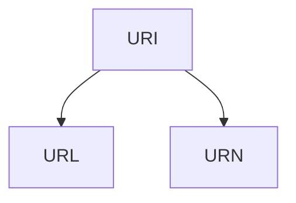

---
aliases:
  - URI
  - Uniform Resource Identifier
  - Identifiant Uniforme de Ressource
archetype: definition
cssclasses:
  - max
tags:
  - web/uri
  - web/url
  - web/urn
  - identification
  - protocole
---

# Uniform Resource Identifier (URI)

> [!question] C'est quoi ?
> Un **Uniform Resource Identifier (URI)** est une chaîne de caractères qui identifie de manière *unique* une ressource, qu'elle soit sur internet ou non. Son rôle est de nommer ou localiser une ressource pour permettre son interaction ou son accès.

## 📜 Origine / Contexte
> [!info] Le saviez-vous ?
> Le concept d'URI a été introduit par Tim Berners-Lee, l'inventeur du World Wide Web, au début des années 1990. Le terme est formalisé dans la RFC 2396 en 1998, puis la RFC 3986 en 2005. L'idée était de fournir un système générique pour identifier n'importe quelle ressource sur le Web, qu'il s'agisse d'un document, d'une image, d'un service ou même d'une personne.

## 🏗️ Structure Générale
Un URI est composé de plusieurs parties optionnelles ou obligatoires, leur présence dépendant du schéma utilisé :

*   **Schéma (Scheme)** : Indique le protocole ou la méthode d'accès à la ressource (ex: `http`, `https`, `ftp`, `mailto`, `file`). Terminé par `:`.
*   **Autorité (Authority)** : Optionnel. Généralement précédé de `//`. Contient :
    *   **Informations d'utilisateur (User Info)** : Optionnel (ex: `user:password@`).
    *   **Hôte (Host)** : Nom de domaine ou adresse IP (ex: `www.example.com`).
    *   **Port (Port)** : Optionnel (ex: `:8080`).
*   **Chemin (Path)** : Identifie la ressource spécifique au sein de l'hôte (ex: `/path/to/resource.html`).
*   **Requête (Query)** : Optionnel. Commencée par `?`. Fournit des données supplémentaires au serveur sous forme de paires clé-valeur (ex: `?name=valeur&param=autre`).
*   **Fragment (Fragment)** : Optionnel. Commencée par `#`. Pointeur vers une sous-ressource au sein de la ressource principale (ex: `#section1`).

Exemple de structure complète :
_**scheme**_`://`_**user:password@**_`_**host**_`:`_**port**_`/`_**path**_`?`_**query**_`#`_**fragment**_

## 🆚 URI vs URL vs URN
La distinction entre URI, URL et URN est fondamentale pour comprendre comment les ressources sont identifiées et localisées :

*   **URI (Uniform Resource Identifier)** : C'est le terme général. Un URI est un identifiant unique pour une ressource. Il sert à *nommer* la ressource. Tous les URL et URN sont des URI.
*   **URL (Uniform Resource Locator)** : Un sous-ensemble des URI qui, en plus d'identifier une ressource, spécifie *comment* y accéder (son "adresse") via un protocole réseau. Les URL sont utilisées pour *localiser* la ressource.
*   **URN (Uniform Resource Name)** : Un sous-ensemble des URI qui identifie une ressource par son *nom unique et persistant*, indépendamment de son emplacement ou de la manière d'y accéder. Les URN sont destinées à rester valides même si la ressource est déplacée ou n'est plus disponible à une adresse spécifique.

Pour résumer :
*   **URI** : *Qu'est-ce que c'est ?* (Identifiant)
*   **URL** : *Où est-ce et comment l'obtenir ?* (Adresse et méthode d'accès)
*   **URN** : *Quel est son nom persistant ?* (Nom unique et indépendant de l'emplacement)

**Diagramme conceptuel :**

## 💡 Exemples Concrets
*   **Exemple 1 (URL - également un URI)** : `https://www.example.com/documents/rapport.pdf?version=2#page3`
    *   C'est une URL car elle spécifie le protocole (`https`), le serveur (`www.example.com`) et le chemin d'accès. Elle permet de *localiser* et d'*accéder* au rapport.
*   **Exemple 2 (URN - également un URI)** : `urn:isbn:0451450523`
    *   C'est une URN qui identifie un livre par son numéro ISBN, indépendamment de l'endroit où le livre peut être trouvé ou comment il pourrait être acquis.
*   **Exemple 3 (URL - également un URI)** : `mailto:john.doe@example.com`
    *   Identifie une ressource (une boîte mail) et le moyen d'interagir avec elle (envoyer un e-mail).