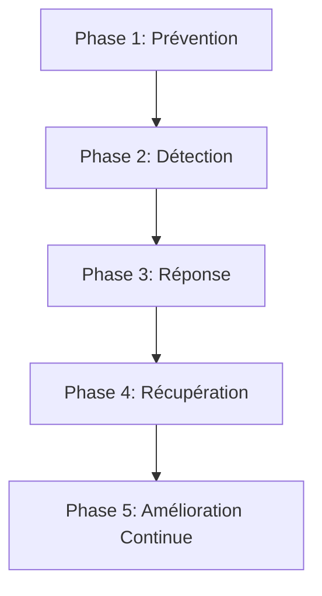

---
aliases:
  - Blue Team
  - Équipe Bleue
  - Cyber Defense Operations
  - Opérations de Défense Cybernétique
archetype: methodologie
source:
  - 
cssclasses:
  - max
tags:
  - blue-team
  - cybersecurite/defensif
  - processus/workflow
  - prevention/protection
  - detection
  - reponse-incident
  - incident/recuperation
  - amelioration-continue
  - defense/defense-en-profondeur
  - hypothese-de-breche
  - visibilite
  - threat-intel
  - outil/siem
  - outil/edr
  - analyse/threat-hunting
  - analyse/forensique
  - resilience
  - securite/posture
  - vulnerabilite/gestion
  - sensibilisation/utilisateur
  - securite/controles
  - gestion-identite/acces
---

# Blue Team

> [!goal] Objectif
> Standardiser l'approche pour protéger et défendre les systèmes d'information contre les menaces cybernétiques, en assurant la continuité des opérations et la résilience organisationnelle.

La **Blue Team** est l'équipe chargée des opérations de cybersécurité défensives au sein d'une organisation. Son rôle principal est de protéger les actifs numériques contre les attaques, de détecter les incidents et d'y répondre efficacement. Elle est le bouclier protecteur de l'entreprise dans le cyberespace.

## 🔄 Le Processus (Workflow)

## 📝 Détail des Phases

### 1. Prévention
Cette phase vise à renforcer la posture de sécurité avant même qu'une attaque ne se produise.
*   **Entrée** : Politiques de sécurité, inventaire des actifs, résultats d'audits de vulnérabilité, informations sur les menaces (Threat Intelligence).
*   **Actions** :
    *   Mise en œuvre et renforcement des contrôles de sécurité (pare-feu, segmentation réseau, gestion des identités et accès).
    *   Gestion des vulnérabilités (patching régulier, durcissement des systèmes et applications).
    *   Sensibilisation et formation des utilisateurs aux bonnes pratiques de sécurité.
    *   Déploiement de solutions de sécurité préventives (Endpoint Protection, passerelles sécurisées).
*   **Sortie** : Environnement IT avec une surface d'attaque réduite, des systèmes durcis et des utilisateurs conscients des risques.

### 2. Détection
Cette phase se concentre sur l'identification rapide et précise des activités malveillantes ou suspectes.
*   **Entrée** : Logs d'événements (systèmes, applications, réseau), alertes de sécurité des outils, flux de Threat Intelligence, données de surveillance réseau.
*   **Actions** :
    *   Monitoring continu des systèmes et réseaux à l'aide de *SIEM* (Security Information and Event Management) et *EDR* (Endpoint Detection and Response).
    *   Analyse des alertes générées par les *IDS/IPS* (Intrusion Detection/Prevention Systems).
    *   Analyse comportementale pour identifier les anomalies.
    *   Chasse aux menaces (Threat Hunting) proactive pour débusquer les attaquants non détectés.
*   **Sortie** : Identification précoce d'activités suspectes, incidents potentiels validés.

### 3. Réponse
Lorsqu'un incident est confirmé, cette phase vise à contenir, éradiquer et analyser la menace.
*   **Entrée** : Incidents de sécurité confirmés, alertes priorisées, rapports d'analyse de la détection.
*   **Actions** :
    *   Contention (Confinement) : Isoler les systèmes affectés pour prévenir la propagation de l'attaque.
    *   Éradication : Supprimer la menace (malware, accès non autorisé, compte compromis).
    *   Analyse forensique : Collecter et analyser les preuves numériques pour comprendre l'étendue et la nature de l'incident.
    *   Communication et coordination avec les parties prenantes internes et externes.
*   **Sortie** : Incident maîtrisé, menace neutralisée, preuves collectées pour analyse post-incident.

### 4. Récupération
Cette phase consiste à restaurer les systèmes et services affectés à leur état normal de fonctionnement, tout en renforçant la sécurité.
*   **Entrée** : Systèmes impactés, résultats de l'analyse forensique, plans de reprise d'activité (PRA).
*   **Actions** :
    *   Restauration des données et systèmes à partir de sauvegardes sécurisées.
    *   Renforcement des contrôles de sécurité pour empêcher une récidive.
    *   Remédiation des vulnérabilités exploitées lors de l'attaque.
    *   Vérification de l'intégrité et de la sécurité des systèmes restaurés.
*   **Sortie** : Opérations normales rétablies, systèmes résilients et sécurisés.

### 5. Amélioration Continue
Cette phase est cruciale pour l'évolution et l'efficacité à long terme de la Blue Team.
*   **Entrée** : Rapports post-mortem d'incidents, nouvelles menaces identifiées, retours d'expérience (REX).
*   **Actions** :
    *   Analyse des leçons apprises de chaque incident pour améliorer les processus, les outils et les compétences.
    *   Mise à jour des politiques de sécurité et des plans de réponse aux incidents.
    *   Adaptation aux nouvelles menaces et aux évolutions technologiques (veille technologique et de sécurité).
    *   Exercices réguliers de simulation d'incidents (tabletop exercises, Purple Teaming).
*   **Sortie** : Une posture de sécurité dynamique et évolutive, des équipes plus compétentes et réactives.

## 💡 Principes Fondamentaux

La Blue Team opère selon plusieurs principes clés :
*   **Défense en profondeur** : Mettre en place plusieurs couches de sécurité pour ralentir et détecter les attaquants.
*   **Hypothèse de brèche** : Partir du principe qu'une intrusion est inévitable et se préparer en conséquence.
*   **Visibilité** : Avoir une vue complète et en temps réel de l'état de sécurité des systèmes.
*   **Réponse rapide** : Minimiser l'impact des incidents par une détection et une réponse agiles.
*   **Amélioration continue** : Apprendre des incidents et des exercices pour renforcer constamment les défenses.

## 🛠️ Outils et Techniques Courantes

La Blue Team s'appuie sur une panoplie d'outils et de techniques :
*   **SIEM** (Security Information and Event Management) : Collecte, agrège et analyse les logs de sécurité.
*   **EDR** (Endpoint Detection and Response) : Surveillance avancée et réponse aux menaces sur les postes de travail et serveurs.
*   **IDS/IPS** (Intrusion Detection/Prevention Systems) : Détectent et/ou bloquent les tentatives d'intrusion.
*   **Threat Intelligence** : Renseignements sur les menaces (IOCs, TTPs des attaquants) pour anticiper et détecter.
*   **Analyse Forensique** : Investigation post-incident pour comprendre comment une attaque s'est déroulée.
*   **CASB** (Cloud Access Security Broker) : Sécurise l'utilisation des services cloud.
*   **DLP** (Data Loss Prevention) : Prévient la fuite de données sensibles.
*   **Vulnerability Management Solutions** : Scanners de vulnérabilités et plateformes de gestion des correctifs.

## 👥 Rôles et Responsabilités

Les membres d'une Blue Team peuvent occuper divers rôles :
*   **Analyste SOC** (Security Operations Center) : Surveille les alertes, analyse les événements, gère les incidents de premier niveau.
*   **Répondeur aux incidents** (Incident Responder) : Mène l'investigation et la réponse aux incidents de sécurité.
*   **Chasseur de menaces** (Threat Hunter) : Recherche activement les menaces non détectées.
*   **Ingénieur Sécurité** (Security Engineer) : Conçoit, déploie et maintient les infrastructures de sécurité.
*   **Architecte Sécurité** (Security Architect) : Conçoit les architectures de sécurité.

## 🆚 Blue Team vs Red Team

La Blue Team est souvent mise en contraste avec la **Red Team**.
*   La **Blue Team** est la force défensive : elle protège, détecte et répond.
*   La **Red Team** est la force offensive : elle simule des attaques réelles pour tester l'efficacité des défenses et identifier les faiblesses.

Ces deux équipes travaillent souvent en synergie (dans ce qu'on appelle le *Purple Teaming*) pour améliorer la posture de sécurité globale de l'organisation.