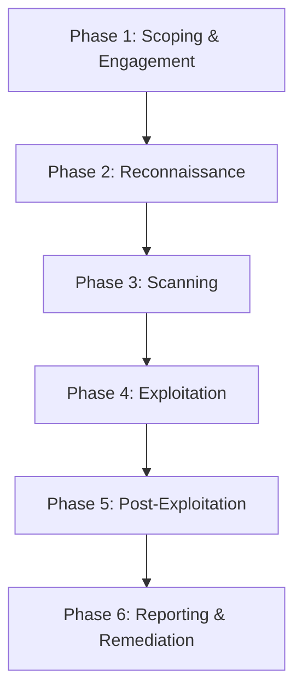

---
aliases:
  - Test d'Intrusion
  - Penetration Testing Methodology
  - Penetration Testing
  - Penetration Test
  - Pentest
archetype: methodologie
source:
  - 
cssclasses:
  - max
tags:
  - pentest
  - methodologie
  - pentest/test-intrusion
  - framework
  - vulnerabilite
  - osint
  - vulnerabilite/owasp-top-10
  - norme/nist
  - framework/ptes
  - privileges/elevation
  - technique/persistance
  - attaque/mouvement-lateral
  - pentest/scoping
  - pentest/reconnaissance
  - pentest/scanning
  - pentest/exploitation
  - pentest/post-exploitation
  - pentest/reporting
  - pentest/remediation
---

# Penetration Testing Methodology

> [!goal] Objectif
> Standardiser l'approche pour évaluer la sécurité d'un système informatique, d'une application ou d'une infrastructure via des simulations d'attaques réalistes, afin d'identifier et de documenter les vulnérabilités exploitables.

## 🔄 Le Processus (Workflow)

## 📝 Détail des Phases

### 1. Scoping & Engagement (Préparation & Accord)
*   **Entrée** : Demande du client, objectifs de sécurité, périmètre initial.
*   **Actions** :
    *   Définition précise du **périmètre** du test (adresses IP, applications, systèmes, etc.).
    *   Établissement des **règles d'engagement** (types de tests autorisés, plages horaires, gestion des incidents).
    *   Détermination des **objectifs** spécifiques (par exemple, compromettre un système particulier, exfiltrer des données).
    *   Signature des documents légaux et contractuels (NDA, SOW - Statement of Work).
*   **Sortie** : Contrat signé, document des règles d'engagement, périmètre validé, calendrier du test.

### 2. Reconnaissance (Collecte d'Informations)
*   **Entrée** : Périmètre défini et accordé.
*   **Actions** :
    *   Collecte d'informations **passives** (OSINT) : recherche DNS, WHOIS, réseaux sociaux, archives web, shodan.io.
    *   Collecte d'informations **actives** (si autorisé) : balayage de ports, requêtes HTTP directes.
    *   Identification des technologies utilisées, versions de logiciels, adresses IP, noms de domaine, sous-domaines, employés.
    *   Cartographie de l'infrastructure cible.
*   **Sortie** : Liste détaillée des cibles (adresses IP, URLs), informations sur l'infrastructure et les technologies, OSINT collecté.

### 3. Scanning (Analyse de Vulnérabilités)
*   **Entrée** : Informations collectées lors de la reconnaissance.
*   **Actions** :
    *   Utilisation d'outils automatisés pour scanner les ports ouverts et les services associés.
    *   Identification des versions de systèmes d'exploitation et d'applications.
    *   Recherche de **vulnérabilités connues** (CVE) et de mauvaises configurations à l'aide de scanners de vulnérabilité (par exemple, Nessus, OpenVAS).
    *   Analyse des applications web pour des failles courantes (OWASP Top 10).
*   **Sortie** : Rapport de scan de vulnérabilités, liste des vulnérabilités potentielles, cartographie détaillée du réseau et des services.

### 4. Exploitation (Compromission du Système)
*   **Entrée** : Vulnérabilités identifiées et analysées.
*   **Actions** :
    *   Tentatives d'exploitation des vulnérabilités pour obtenir un **accès initial** au système cible.
    *   Utilisation de techniques telles que l'injection SQL, le Cross-Site Scripting (XSS), le buffer overflow, les exploits de services.
    *   Évitement des systèmes de détection (IDS/IPS) si possible.
    *   Preuve de concept de chaque exploitation réussie.
*   **Sortie** : Accès au(x) système(s) cible(s), preuves d'exploitation (captures d'écran, accès shell).

### 5. Post-Exploitation (Maintien de l'Accès & Escalade)
*   **Entrée** : Accès initial compromis.
*   **Actions** :
    *   **Escalade de privilèges** pour obtenir des droits plus élevés (par exemple, de simple utilisateur à administrateur système).
    *   **Maintien de l'accès** (persistence) via l'installation de backdoors ou de comptes cachés.
    *   **Collecte de données sensibles** (hachages de mots de passe, fichiers de configuration, documents clés).
    *   **Pivotement** vers d'autres systèmes au sein du réseau pour étendre la compromission.
    *   Analyse de l'impact potentiel et de la portée de l'attaque.
    *   Nettoyage des traces (si convenu avec le client et documenté).
*   **Sortie** : Identification des données sensibles accessibles, chemins de pivotement, preuves d'escalade de privilèges, impact évalué.

### 6. Reporting & Remediation (Rapport & Recommandations)
*   **Entrée** : Toutes les données collectées, preuves d'exploitation et analyse d'impact.
*   **Actions** :
    *   Rédaction du **rapport technique** détaillé : description des vulnérabilités, étapes de reproduction, preuves, impact.
    *   Rédaction du **rapport exécutif** : résumé non technique pour la direction, risques globaux, recommandations stratégiques.
    *   Proposition de **recommandations** claires et exploitables pour la correction des vulnérabilités.
    *   Présentation des résultats au client lors d'un débriefing.
    *   (Optionnel) Accompagnement dans le suivi des corrections et tests de re-médiation.
*   **Sortie** : Rapports de test d'intrusion (technique et exécutif), liste de recommandations, session de débriefing.

## 🔗 Notes Connexes
*   **Framework** : NIST SP 800-115, PTES (Penetration Testing Execution Standard), OWASP Web Security Testing Guide (WSTG)
*   **Outils** : Nmap, Nessus, Metasploit, Burp Suite, Wireshark, John the Ripper