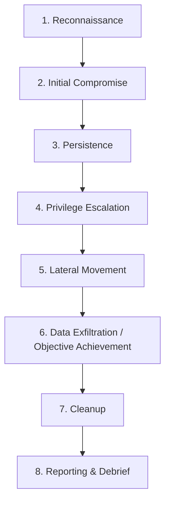

---
aliases:
  - Red Team
  - RedTeaming
  - Équipe Rouge
  - Exercice Red Team
  - Red Team Operation
archetype: methodologie
source:
  - NIST SP 800-115
  - OWASP Testing Guide
cssclasses:
  - max
tags:
  - red-teaming
  - emulation-adversaire
  - securite/posture
  - detection
  - reponse-incident
  - menace/avancee
  - cybersecurite/offensif
  - tactique/ttps
  - acteur-de-menace
  - blue-team
  - resilience
  - formation
  - sensibilisation/utilisateur
  - approche-holistique
  - realisme
  - clandestinite
  - discretion
  - objectif-mission
  - collaboration
  - post-operationnel
  - processus
  - workflow
  - reconnaissance
  - osint
  - compromission-initiale
  - attaque/phishing
  - ingenierie-sociale
  - exploitation
  - vulnerabilite/exploitation
  - persistance
  - backdoor
  - privileges/elevation
  - attaque/mouvement-lateral
  - donnee/exfiltration
  - nettoyage-systeme
  - rapport-audit
  - debriefing
---

# Red Team

> [!goal] Objectif
> Standardiser l'approche pour **simuler une attaque réelle** contre une organisation, évaluer sa posture de sécurité de manière **holistique et réaliste**, et améliorer sa capacité de **détection et de réponse** face à des menaces avancées.

## 💡 Concept Clé et Objectifs

Une opération **Red Team** est un exercice de sécurité offensif simulant les tactiques, techniques et procédures (TTP) d'un **adversaire réel** ciblant une organisation. Son but principal n'est pas de trouver un maximum de vulnérabilités techniques, mais plutôt de tester l'efficacité globale des **défenses humaines, processuelles et technologiques**.

Les objectifs principaux d'une mission Red Team incluent :

*   **Évaluer la posture de sécurité globale** : Tester la capacité de l'organisation à prévenir, détecter et répondre à des attaques sophistiquées.
*   **Tester les capacités de détection et de réponse** (Blue Team) : Mettre à l'épreuve les équipes de sécurité internes (SOC, CERT) et leurs outils.
*   **Améliorer la résilience organisationnelle** : Identifier les lacunes critiques dans la sécurité et fournir des recommandations actionnables.
*   **Former et sensibiliser** : Offrir une opportunité d'apprentissage précieuse pour les équipes de sécurité et les employés.

## 🎯 Caractéristiques Clés

Les opérations Red Team se distinguent par plusieurs caractéristiques fondamentales :

*   **Approche Holistique** : Elles englobent l'ensemble de l'organisation, incluant les aspects techniques, humains et physiques, pour simuler un scénario d'attaque complet.
*   **Réalisme** : Elles visent à répliquer fidèlement les TTP des adversaires réels, souvent avec un niveau de clandestinité élevé.
*   **Clandestinité et Discrétion** : Les attaques sont menées de manière furtive pour éviter la détection par les équipes de défense, reflétant le comportement d'un véritable attaquant.
*   **Objectifs Spécifiques** : Les missions sont souvent axées sur l'atteinte d'un objectif final précis (exfiltration de données sensibles, accès à un système critique) plutôt que sur la simple énumération de vulnérabilités.
*   **Collaboration Post-Opérationnelle** : Une collaboration étroite avec la Blue Team et la direction après l'exercice est cruciale pour l'analyse des résultats et l'amélioration continue.

## 🔄 Le Processus (Workflow)

## 📝 Détail des Phases

### 1. Reconnaissance
*   **Entrée** : Mandat de mission, objectifs définis, périmètre autorisé, informations initiales fournies par la cible (si applicable).
*   **Actions** :
    *   **OSINT (Open Source Intelligence)** : Collecte d'informations publiques sur la cible (employés, technologies, infrastructures, adresses IP, domaines, réseaux sociaux).
    *   **Footprinting et Énumération** : Identification des actifs exposés sur internet, balayage de ports, recherche de sous-domaines, identification de services.
    *   **Veille Ciblée** : Recherche de fuites d'informations, identifiants compromis, vulnérabilités connues liées à la cible.
*   **Sortie** : Une cartographie détaillée de la surface d'attaque, liste de cibles potentielles (personnes, systèmes), vecteurs d'attaque probables, informations pour l'ingénierie sociale.

### 2. Initial Compromise (Compromission Initiale)
*   **Entrée** : Informations de reconnaissance, vecteurs d'attaque identifiés.
*   **Actions** :
    *   **Phishing/Spear-Phishing** : Attaques ciblées par e-mail ou autres canaux.
    *   **Exploitation de Vulnérabilités Externes** : Utilisation de failles dans les applications web, serveurs exposés (CVE).
    *   **Ingénierie Sociale** : Manipulation d'individus pour obtenir un accès (téléphone, physique).
    *   **Accès Physique** : Tentatives d'intrusion physique si autorisé par le mandat.
*   **Sortie** : Une première tête de pont dans le réseau cible (accès à un poste de travail, un serveur, une session utilisateur).

### 3. Persistence (Persistance)
*   **Entrée** : Accès initial compromis.
*   **Actions** :
    *   **Établir des Backdoors** : Création de points d'accès cachés et résilients.
    *   **Créer de Nouveaux Comptes** : Comptes utilisateurs ou de service discrets.
    *   **Modifier des Services Légitimes** : Altération de configurations système pour maintenir l'accès.
    *   **Utilisation de Outils d'Accès à Distance Légitimes** : Utilisation de RDP, SSH, VPN existants.
*   **Sortie** : Accès sécurisé et résilient au réseau cible, indépendant de l'accès initial.

### 4. Privilege Escalation (Élévation de Privilèges)
*   **Entrée** : Accès persistant avec des privilèges standards.
*   **Actions** :
    *   **Exploitation de Vulnérabilités Locales** : Utilisation de failles logicielles ou de configurations erronées.
    *   **Recherche d'Identifiants** : Fichiers de configuration, mots de passe en clair ou hachés en mémoire.
    *   **Détournement de Services** : Exploitation de services avec des privilèges élevés.
    *   **Pass-the-Hash/Pass-the-Ticket** : Réutilisation de hachages ou tickets d'authentification.
*   **Sortie** : Obtention de privilèges élevés (administrateur local, administrateur de domaine, `root`).

### 5. Lateral Movement (Déplacement Latéral)
*   **Entrée** : Privilèges élevés sur un système, accès à des identifiants supplémentaires.
*   **Actions** :
    *   **Discovery du Réseau** : Identification d'autres hôtes, services, partages réseau, trusts de domaine.
    *   **Pivoting** : Utilisation du système compromis comme point de rebond pour attaquer d'autres systèmes.
    *   **Recherche de Cibles de Valeur** : Identification des systèmes contenant les données ou services critiques liés aux objectifs de la mission.
    *   **Utilisation d'Outils d'Administration Légitimes** : PowerShell, PsExec, WMI, RDP, SSH.
*   **Sortie** : Accès à des systèmes clés et progression vers l'objectif final.

### 6. Data Exfiltration / Objective Achievement (Exfiltration de Données / Atteinte de l'Objectif)
*   **Entrée** : Accès aux données ou systèmes cibles avec des privilèges suffisants.
*   **Actions** :
    *   **Collecte de Données** : Identification et agrégation des informations sensibles.
    *   **Compression et Chiffrement** : Préparation des données pour l'exfiltration.
    *   **Exfiltration Furtive** : Utilisation de canaux discrets (DNS, ICMP, HTTPS via C2) pour sortir les données du réseau.
    *   **Atteinte de l'Objectif Spécifique** : Exécution de l'action finale (ex: modification d'un enregistrement, accès à un coffre-fort).
*   **Sortie** : Preuve de l'atteinte de l'objectif de la mission, données exfiltrées (si applicable).

### 7. Cleanup (Nettoyage)
*   **Entrée** : Mission terminée, objectifs atteints.
*   **Actions** :
    *   **Suppression des Artefacts** : Suppression des outils, backdoors, logs d'activités, comptes créés.
    *   **Restauration des Configurations** : Remise en état des systèmes modifiés.
    *   **Effacement des Traces** : Minimiser la détection future des activités de l'équipe rouge.
*   **Sortie** : Environnement cible restauré à son état pré-opérationnel, preuves des activités récoltées pour le rapport.

### 8. Reporting & Debrief (Rapport et Débriefing)
*   **Entrée** : Toutes les données collectées pendant l'opération, preuves d'intrusion, journaux d'activité.
*   **Actions** :
    *   **Analyse des Données** : Corrélation des activités avec les détections de la Blue Team.
    *   **Rédaction du Rapport Technique** : Description détaillée des TTP utilisées, chemins d'attaque, vulnérabilités exploitées.
    *   **Rédaction du Rapport Exécutif** : Résumé des findings clés, impact business, recommandations stratégiques.
    *   **Débriefing avec la Blue Team** : Partage des informations, comparaison des logs, explication des défaillances de détection/réponse.
    *   **Recommandations** : Proposition de mesures correctives techniques et organisationnelles.
*   **Sortie** : Rapports détaillés (technique et exécutif), recommandations concrètes pour l'amélioration de la sécurité, retour d'expérience partagé.