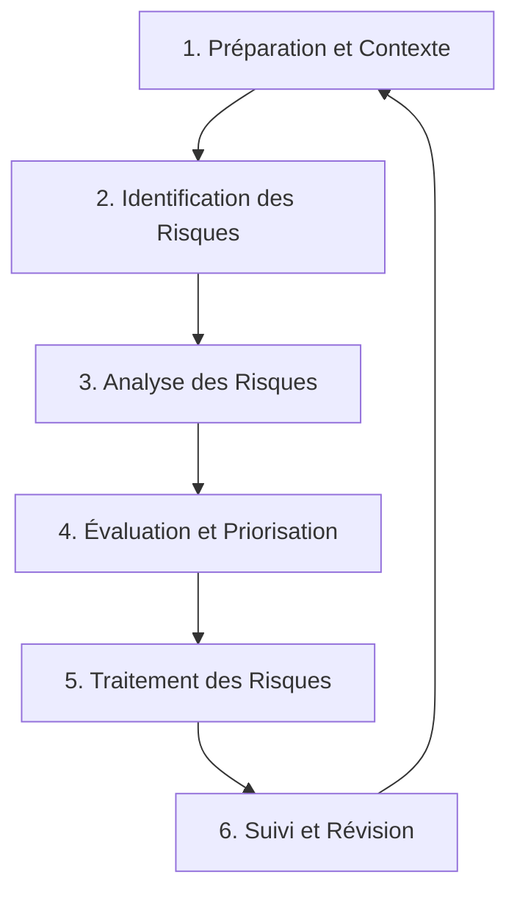

---
aliases:
  - Méthodologie d'Évaluation des Risques
  - Risk Assessment Methodology
  - Évaluation des Risques
  - Risk Assessment
  - Cybersecurity Risk Assessment
  - Analyse des Risques
  - Risk Analysis
archetype: methodologie
source:
  - Google Search
cssclasses:
  - max
tags:
  - methodologie
  - evaluation_des_risques
  - gestion_des_risques
  - cybersecurite/gestion
  - menace
  - vulnerabilite
  - triade-cia
  - conformite/reglementaire
  - modele/fair
  - processus/workflow
  - systeme-information/securite
  - concept/probabilite
  - concept/impact
---

# Risk Assessment Methodology

> [!goal] Objectif
> Standardiser l'approche pour identifier, analyser, évaluer, traiter et surveiller les risques de cybersécurité afin de protéger les actifs informationnels et d'assurer la résilience opérationnelle de l'organisation.

## 🔄 Le Processus (Workflow)

## 📝 Détail des Phases

La méthodologie d'évaluation des risques en cybersécurité est un processus **continu et itératif** visant à comprendre et gérer les menaces pesant sur les systèmes d'information d'une organisation. Elle s'intègre dans un cadre plus large de gestion de la sécurité de l'information (SGSI).

### 1. Préparation et Établissement du Contexte
Cette phase initiale définit les fondations de l'évaluation des risques.
*   **Entrée** : Stratégie de l'organisation, exigences réglementaires (ex: RGPD, HIPAA), politiques internes, ressources disponibles, appétit pour le risque de la direction.
*   **Actions** :
    *   **Définir la portée et les objectifs** de l'évaluation : Quels systèmes, données, processus sont inclus ? Quels sont les objectifs à atteindre (ex: conformité, réduction des incidents) ?
    *   **Établir les critères de risque** : Définir comment la _probabilité_ (likelihood) et l'_impact_ (consequence, magnitude) des risques seront mesurés et évalués, y compris les seuils d'acceptation du risque.
    *   **Assembler l'équipe d'évaluation** : Constituer une équipe avec des compétences variées (experts en sécurité, analystes métier, propriétaires d'actifs).
    *   **Inventorier et classer les actifs** : Identifier et catégoriser tous les actifs informationnels critiques (matériels, logiciels, données sensibles, réseaux, services) en fonction de leur valeur et de leur criticité pour l'organisation (confidentialité, intégrité, disponibilité).
*   **Sortie** : Document de portée et d'objectifs, critères de risque établis, inventaire des actifs classifiés.

### 2. Identification des Risques
L'objectif est de dresser une liste exhaustive des menaces et vulnérabilités pertinentes.
*   **Entrée** : Inventaire des actifs, intelligence sur les menaces, rapports de vulnérabilités connus.
*   **Actions** :
    *   **Identifier les menaces** : Reconnaître les sources potentielles de danger (ex: *cybercriminels*, *acteurs étatiques*, *menaces internes*, *hacktivistes*, *catastrophes naturelles*, erreurs humaines).
    *   **Identifier les vulnérabilités** : Découvrir les faiblesses dans les systèmes, applications, configurations ou processus qui pourraient être exploitées par les menaces (ex: logiciels obsolètes, mauvaises configurations, authentification faible, manque de sensibilisation).
    *   **Associer menaces, vulnérabilités et actifs** : Comprendre comment une menace pourrait exploiter une vulnérabilité pour impacter un actif donné et compromettre sa confidentialité, son intégrité ou sa disponibilité.
*   **Sortie** : Un registre des risques contenant les menaces, les vulnérabilités, les actifs affectés et les scénarios de risque.

### 3. Analyse des Risques
Cette phase évalue la gravité des risques identifiés.
*   **Entrée** : Registre des risques identifiés, critères d'évaluation des risques.
*   **Actions** : Évaluer la *probabilité* d'occurrence de chaque risque et son *impact* potentiel sur l'organisation.
    *   **Analyse Qualitative** :
        *   **Description** : Utilise des échelles descriptives (ex: Faible, Moyen, Élevé) ou des codes couleurs (Vert, Jaune, Rouge) pour évaluer la probabilité et l'impact. Elle repose souvent sur le jugement d'experts et l'expérience.
        *   **Avantages** : Simple à mettre en œuvre, rapide, idéale pour une première identification des risques ou pour les organisations moins matures.
        *   **Inconvénients** : Subjective, peut être sujette aux biais des évaluateurs, manque de granularité pour la priorisation précise.
    *   **Analyse Quantitative** :
        *   **Description** : Utilise des données numériques et des modèles mathématiques pour estimer la perte financière potentielle. Les mesures peuvent inclure la _Single Loss Expectancy (SLE)_, l'_Annual Rate of Occurrence (ARO)_ et l'_Annual Loss Expectancy (ALE)_. Des modèles comme le *FAIR (Factor Analysis of Information Risk)* sont utilisés pour quantifier le risque en termes financiers.
        *   **Avantages** : Objective, fournit des résultats plus détaillés et actionnables en termes financiers, facilite la priorisation basée sur des analyses coût-bénéfice.
        *   **Inconvénients** : Plus complexe et coûteuse, nécessite des données fiables et peut être limitée par leur disponibilité.
*   **Sortie** : Niveaux de risque assignés à chaque scénario (probabilité x impact), souvent représentés dans une matrice de risques.

### 4. Évaluation et Priorisation des Risques
Cette étape consiste à décider quels risques nécessitent une action.
*   **Entrée** : Résultats de l'analyse des risques, critères d'acceptation du risque de l'organisation.
*   **Actions** :
    *   **Comparer les risques** : Mesurer les risques analysés par rapport aux critères d'acceptation définis par l'organisation.
    *   **Prioriser les risques** : Classer les risques en fonction de leur gravité et de l'appétit pour le risque de l'organisation, en se concentrant sur ceux qui ont l'impact le plus élevé et la probabilité la plus forte.
    *   **Décider de l'acceptabilité** : Déterminer quels risques sont acceptables dans l'état actuel et lesquels nécessitent un traitement immédiat.
*   **Sortie** : Liste priorisée des risques, avec une indication des risques acceptés ou à traiter.

### 5. Traitement des Risques
Cette phase élabore et met en œuvre des stratégies pour gérer les risques non acceptés.
*   **Entrée** : Risques priorisés, appétit pour le risque de l'organisation.
*   **Actions** : Développer un plan de traitement des risques, en choisissant parmi quatre options principales :
    *   *Atténuation (Mitigation)* : Mettre en œuvre des contrôles de sécurité (techniques, organisationnels, physiques) pour réduire la probabilité d'occurrence ou l'impact d'un risque. C'est l'approche la plus courante.
    *   *Évitement (Avoidance)* : Modifier les activités de l'entreprise pour éliminer complètement le risque (ex: ne pas utiliser une technologie risquée).
    *   *Transfert (Transfer)* : Partager ou transférer le risque à une tierce partie (ex: souscrire une assurance cyber, externaliser un service à un fournisseur spécialisé).
    *   *Acceptation (Acceptance)* : Accepter le risque résiduel parce que le coût du traitement est jugé supérieur au dommage potentiel, ou parce que le risque est faible et tolérable.
*   **Sortie** : Plan de traitement des risques détaillé, implémentation des contrôles de sécurité, risques résiduels documentés.

### 6. Suivi et Révision
La gestion des risques est un cycle continu qui nécessite une surveillance constante.
*   **Entrée** : Plan de traitement des risques, contrôles implémentés, risques résiduels.
*   **Actions** :
    *   **Surveillance continue** : Examiner régulièrement l'efficacité des contrôles de sécurité mis en place et l'évolution des risques, des menaces et des vulnérabilités.
    *   **Révision périodique** : Réévaluer le processus d'évaluation des risques et les plans de traitement pour s'adapter aux changements technologiques, aux nouvelles menaces, aux exigences réglementaires ou aux évolutions internes.
    *   **Communication et consultation** : Maintenir un dialogue constant avec toutes les parties prenantes sur l'état des risques et les décisions prises.
*   **Sortie** : Rapports de conformité, ajustements des contrôles de sécurité, mise à jour du registre des risques, feedback pour la phase de préparation.

## 👥 Acteurs Impliqués
Une évaluation des risques efficace requiert la collaboration de plusieurs rôles au sein de l'organisation :
*   **Direction Générale (CEO, DPO)** : Définit l'appétit pour le risque et fournit les ressources nécessaires. Responsable ultime de la stratégie de gestion des risques.
*   **Cadres de la Sécurité (CISO, CSO)** : Dirigent le programme de cybersécurité, supervisent les évaluations de risques et la mise en œuvre des contrôles.
*   **Responsables des Technologies (CIO, CTO)** : S'assurent que l'infrastructure et les systèmes supportent les exigences de sécurité et sont alignés avec la stratégie de risque.
*   **Propriétaires d'Actifs** : Les départements ou individus responsables de la gestion et de la protection d'actifs spécifiques.
*   **Équipe d'Audit (Interne/Externe)** : Fournit une assurance indépendante sur l'efficacité du processus de gestion des risques et la conformité aux normes.
*   **Opérations IT/Sécurité** : Implémentent et maintiennent les contrôles de sécurité.
*   **Services Juridiques et Conformité** : S'assurent que la méthodologie respecte les lois et réglementations.
*   **Employés** : Contribuent à l'identification des risques et au respect des politiques de sécurité.

## 🔗 Notes Connexes
*   **Frameworks** :
    *   *NIST Risk Management Framework (RMF)* : Un ensemble de directives et de processus pour gérer les risques de cybersécurité.
    *   *ISO/IEC 27005* : Fournit des lignes directrices pour la gestion des risques de sécurité de l'information, en soutien à l'ISO/IEC 27001.
    *   *NIST Cybersecurity Framework (CSF)* : Cadre volontaire pour la gestion des risques de cybersécurité.
*   **Outils d'Analyse Quantitative** :
    *   *Factor Analysis of Information Risk (FAIR)* : Une taxonomie pour la compréhension, l'analyse et la quantification des risques de l'information.