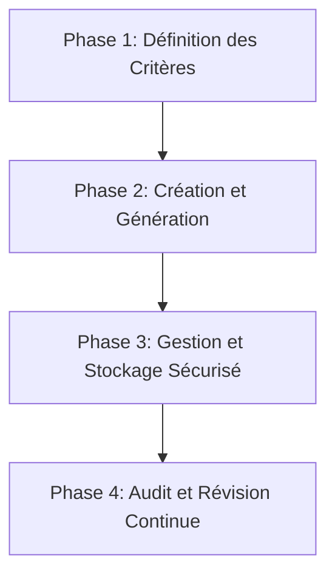

---
tags:
  - securite/mot-de-passe
  - cybersecurite/gestion
  - authentification/mfa
  - norme/recommandation
  - processus/workflow
  - sensibilisation/utilisateur
  - donnees/protection
aliases:
  - Gestion des Mots de Passe Forts
  - Strong Password Management
  - Mot de Passe Fort
  - Strong Password
  - Secure Password Practices
  - Password Best Practices
archetype: methodologie
source:
  - NIST SP 800-63B
  - ANSSI
  - CNIL
  - Centre canadien pour la cybersécurité
cssclasses:
  - max
---

# Gestion des Mots de Passe Forts

> [!goal] Objectif
> Standardiser l'approche de création, de gestion et de protection des **mots de passe forts** pour minimiser les risques de compromission des systèmes et des données sensibles.

## 🔄 Le Processus (Workflow)

## 📝 Détail des Phases

### 1. Définition des Critères

Cette phase établit les bases d'un mot de passe "fort" en se basant sur les recommandations actuelles des autorités en cybersécurité comme le NIST, l'ANSSI et la CNIL.

*   **Entrée** : Directives de sécurité organisationnelles, cadre réglementaire (RGPD, NIS2, DORA), analyses de risques.
*   **Actions** :
    *   **Prioriser la longueur** : Contrairement aux anciennes idées reçues, la longueur est plus importante que la complexité pour la résistance aux attaques par force brute. Le NIST recommande une longueur minimale de huit caractères, mais 12 à 14 caractères sont généralement préconisés, et même 16 pour les comptes privilégiés.
    *   **Intégrer la complexité** : Utiliser une combinaison de lettres minuscules, majuscules, chiffres et caractères spéciaux. Cependant, éviter les schémas prévisibles (ex: commencer par une majuscule, finir par un chiffre) que les humains ont tendance à utiliser.
    *   **Exclure les informations personnelles et les mots courants** : Éviter les noms, dates de naissance, mots de dictionnaire, et informations facilement devinables.
    *   **Bannir la réutilisation** : Chaque compte sensible doit avoir un mot de passe unique.
    *   **Abroger le renouvellement périodique forcé** : Les dernières recommandations (NIST, CNIL) suggèrent d'abandonner l'obligation de changer régulièrement les mots de passe pour les comptes utilisateurs classiques, sauf en cas de compromission avérée ou de comptes à privilèges.
    *   **Interdire les indices de mot de passe** : Les questions de sécurité basées sur des connaissances prévisibles ne sont plus recommandées.
*   **Sortie** : Politique de mots de passe claire et documentée, incluant les critères techniques et les interdictions.

### 2. Création et Génération

Cette phase se concentre sur les méthodes pratiques pour élaborer des mots de passe qui respectent les critères définis.

*   **Entrée** : Politique de mots de passe établie.
*   **Actions** :
    *   **Utiliser des phrases de passe (passphrases)** : Il s'agit de chaînes de mots plus longues (au moins 15 caractères, idéalement quatre mots uniques ou plus) qui sont plus faciles à mémoriser et plus résistantes aux attaques. Ex: "lampe ordinateur jouets rideaux".
    *   **Générer des chaînes aléatoires complexes** : Pour les mots de passe non mémorisés (ex: stockés dans un gestionnaire), privilégier des combinaisons aléatoires de tous types de caractères.
    *   **Employer des gestionnaires de mots de passe** : Ces outils aident à générer des mots de passe forts et uniques, à les stocker de manière chiffrée, et à éviter la réutilisation. Ils ne nécessitent de l'utilisateur de ne retenir qu'un seul mot de passe maître.
    *   **Éviter les mots de passe par défaut** : Changer systématiquement les mots de passe par défaut des nouveaux appareils ou services.
*   **Sortie** : Mots de passe générés conformes aux exigences, listes de mots de passe faibles à bloquer.

### 3. Gestion et Stockage Sécurisé

Cette phase détaille les pratiques pour protéger les mots de passe tout au long de leur cycle de vie.

*   **Entrée** : Mots de passe créés.
*   **Actions** :
    *   **Utiliser un gestionnaire de mots de passe** : Il est essentiel pour stocker les mots de passe de manière chiffrée et sécurisée. Le gestionnaire lui-même doit être protégé par un mot de passe fort et, si possible, l'authentification multifacteur.
    *   **Ne jamais écrire ou partager les mots de passe** : Éviter de les noter sur des post-its, dans des fichiers non sécurisés, ou de les communiquer par des canaux non sécurisés (email, SMS). Aucune entité légitime ne demandera un mot de passe par téléphone ou email.
    *   **Activer l'authentification multifacteur (MFA/2FA)** : Lorsque disponible, la MFA ajoute une couche de sécurité cruciale, même si le mot de passe est compromis.
    *   **Ne pas enregistrer les mots de passe dans les navigateurs partagés** : Éviter le remplissage automatique sur les ordinateurs publics ou partagés.
*   **Sortie** : Mots de passe stockés de manière sécurisée, mécanismes de MFA activés.

### 4. Audit et Révision Continue

Cette phase assure que les pratiques de gestion des mots de passe restent efficaces et à jour face à l'évolution des menaces.

*   **Entrée** : Mots de passe en usage, incidents de sécurité, nouvelles menaces.
*   **Actions** :
    *   **Surveiller les compromissions** : Utiliser des outils pour vérifier si les informations d'identification ont été exposées lors de violations de données publiques. Changer immédiatement les mots de passe compromis.
    *   **Implémenter des listes de refus** : Empêcher l'utilisation de mots de passe connus pour être faibles ou compromis lors de la création ou du changement.
    *   **Réévaluer périodiquement la politique** : Les directives de sécurité évoluent (ex: mises à jour du NIST SP 800-63B). La politique doit être revue pour rester alignée sur les meilleures pratiques et la conformité.
    *   **Former et sensibiliser les utilisateurs** : Informer régulièrement les utilisateurs sur l'importance des mots de passe forts et les bonnes pratiques.
    *   **Verrouillage de compte après échecs répétés** : Configurer les systèmes pour verrouiller temporairement ou définitivement un compte après un certain nombre de tentatives de connexion infructueuses.
*   **Sortie** : Politique de mots de passe à jour, incidents de sécurité résolus, utilisateurs sensibilisés, réduction des risques de compromission.