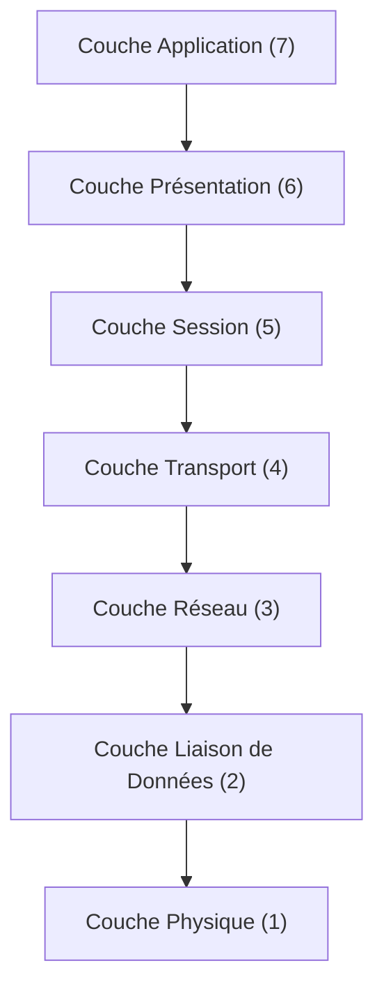

---
aliases:
  - Couche Application
  - Couche 7
  - Application Layer
  - Layer 7
  - OSI Layer 7
cssclasses:
  - max
archetype: modele
tags:
  - modele
  - modele-osi
  - modele-osi/couche-7
  - reseau
  - application
  - protocole
  - communication/reseau
  - abstraction
  - interoperabilite
  - protocole/http
  - protocole/https
  - protocole/smtp
  - protocole/pop3
  - protocole/imap
  - protocole/ftp
  - protocole/dns
  - protocole/telnet
  - protocole/ssh
  - protocole/smb
  - protocole/nfs
---

# Modèle : Application Layer (Couche 7 du Modèle OSI)

> [!abstract] Principe Fondamental
> La couche Application est la septième et dernière couche du modèle OSI, agissant comme l'interface directe entre l'utilisateur et les applications logicielles avec les services réseau sous-jacents, permettant ainsi les interactions numériques quotidiennes telles que la navigation web, l'envoi d'e-mails et le transfert de fichiers.

## 📐 Structure du Modèle
La couche Application est le point le plus élevé du modèle OSI, interagissant directement avec les applications utilisateur. Elle s'appuie sur les services des couches inférieures pour assurer la communication réseau.

## 🧠 Concepts Clés
*   **Interaction Utilisateur-Réseau** : La couche Application est la plus proche de l'utilisateur final et de ses applications. Elle fournit l'interface nécessaire aux applications pour accéder aux services réseau, tels que le courrier électronique, le transfert de fichiers et la navigation web.
*   **Fonctions Essentielles** : Elle permet la communication efficace et sécurisée entre différents programmes d'application au sein d'un réseau. Ses fonctions incluent l'identification et l'authentification des systèmes, la garantie de l'intégrité du transfert de données, l'envoi et la réception d'informations (bases de données, fichiers), la fourniture de services de communication (e-mail, chat), l'hébergement à distance, et la détermination de la syntaxe des protocoles et des données.
*   **Protocoles Applicatifs** : Cette couche définit les protocoles et les normes nécessaires pour permettre la communication entre différentes applications.
    *   **HTTP/HTTPS (HyperText Transfer Protocol Secure)** : Utilisé pour la navigation web et l'envoi de pages HTML.
    *   **SMTP (Simple Mail Transfer Protocol)** : Pour le courrier électronique.
    *   **POP3 (Post Office Protocol version 3) et IMAP (Internet Message Access Protocol)** : Pour la récupération des e-mails.
    *   **FTP (File Transfer Protocol)** : Pour le transfert de fichiers.
    *   **DNS (Domain Name System)** : Pour la résolution des noms de domaine en adresses IP.
    *   **Telnet, SSH (Secure Shell)** : Pour les sessions à distance.
    *   **NFS (Network File System) et SMB/CIFS (Server Message Block/Common Internet File System)** : Pour le partage de fichiers.
*   **Indépendance des Applications** : Il est important de noter que la couche Application n'est pas l'application elle-même, mais fournit plutôt les services et les protocoles qui permettent aux applications de communiquer sur le réseau.
*   **Encapsulation et Conversion des Données** : Avant la transmission, la couche Application encapsule les données de l'application dans des formats appropriés et peut être responsable de la conversion des formats de données si nécessaire.

## ✅ Avantages vs Inconvénients
| Avantages | Inconvénients |
|---|---|
| **Interface intuitive** : Fournit une interface conviviale pour les utilisateurs et les applications afin d'accéder aux ressources réseau, simplifiant des processus complexes. | **Complexité de la couche** : Repose sur les couches inférieures pour gérer les détails techniques, ce qui peut compliquer le dépannage. |
| **Diversité des services** : Supporte de multiples protocoles et services pour diverses applications, améliorant la flexibilité. | **Dépendance des couches inférieures** : Les services de la couche Application peuvent échouer si les couches inférieures fonctionnent mal. |
| **Récupération d'erreurs** : Assure une transmission de données fiable en gérant efficacement les erreurs au niveau applicatif. | **Risques de sécurité** : Vulnérable aux attaques telles que le *phishing* et les *malwares* en raison de son exposition aux interactions utilisateur. |
| **Abstraction** : Permet aux développeurs de se concentrer sur les fonctionnalités de l'application sans se soucier des détails de la transmission réseau physique. | **Performances** : Peut souffrir de latence si les applications ne sont pas optimisées pour les interactions réseau. |
| **Interoperabilité** : Facilite la communication entre différentes applications et systèmes. | **Standardisation variable** : Bien que le modèle OSI soit une référence, la mise en œuvre des protocoles peut varier, entraînant parfois des problèmes d'interopérabilité si non strictement respectés. |
| **Compréhension et dépannage simplifiés** : Le modèle en couches facilite la compréhension et le dépannage des problèmes en les isolant à des couches spécifiques. | |