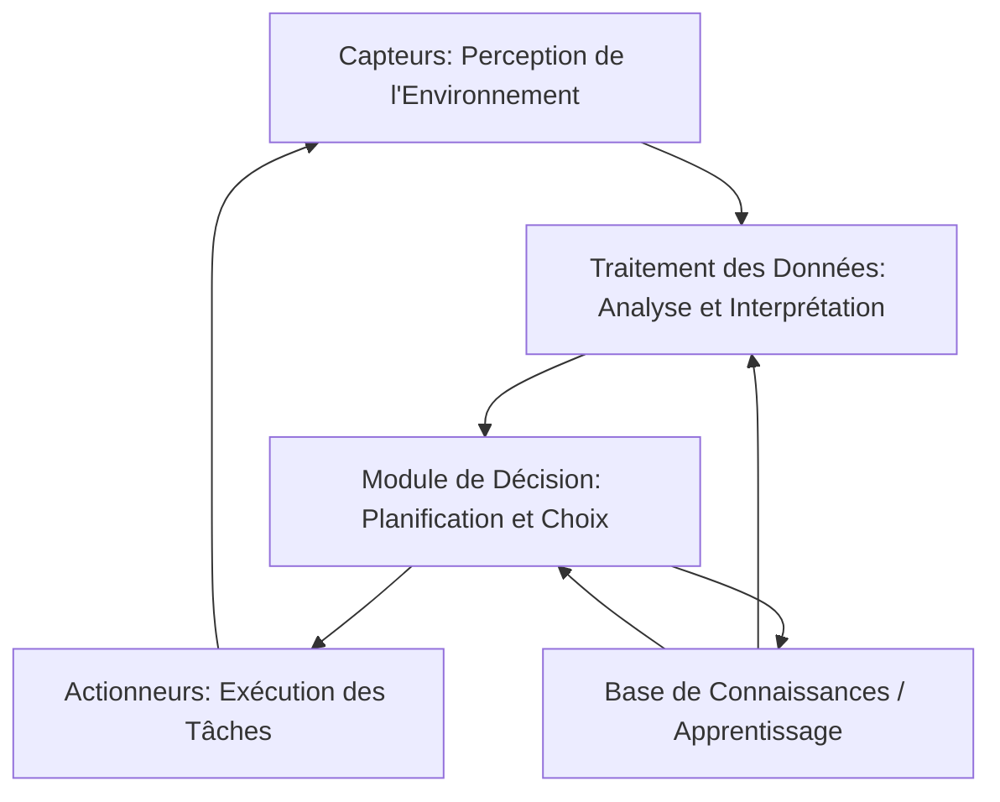

---
aliases:
  - Système Autonome
  - Autonomous System
  - Systèmes Autonomes
cssclasses:
  - max
archetype: modele
tags:
  - systeme/autonome
  - autonomie
  - ia
  - apprentissage-automatique
  - capteur
  - actionneur
  - decision
  - adaptation
  - reseau
  - reseau/systeme-autonome
  - vulnerabilite
  - cyberattaque
  - securite
  - systeme/auto-gouvernance
  - systeme/auto-configuration
  - systeme/auto-optimisation
  - systeme/auto-reparation
  - systeme/auto-protection
  - base-de-connaissances
  - donnee/traitement
---

# Modèle : Système Autonome

> [!abstract] Principe Fondamental
> Un *système autonome* est une entité capable d'opérer de manière indépendante, de prendre des décisions et d'exécuter des actions pour atteindre ses objectifs sans intervention humaine directe constante, en s'adaptant à son environnement.

## 📐 Structure du Modèle

## 🧠 Concepts Clés
*   **Autonomie** : Capacité du système à fonctionner et à prendre des décisions sans intervention humaine directe. Cela implique une auto-gouvernance et une indépendance par rapport à des connexions ou dépendances externes pour ses fonctions principales.
*   **Perception** : L'aptitude du système à recueillir et interpréter des informations sur son environnement via des capteurs (ex: vision par ordinateur, fusion de capteurs).
*   **Décision** : Le processus par lequel le système analyse les données perçues pour formuler un plan d'action et choisir la meilleure ligne de conduite pour atteindre ses objectifs. Cela peut impliquer de l'intelligence artificielle (IA) et de l'apprentissage automatique (machine learning).
*   **Action** : L'exécution physique ou logique des décisions prises par le système, à travers des actionneurs ou des interfaces logicielles.
*   **Adaptation / Apprentissage** : La capacité du système à modifier son comportement ou à améliorer ses performances en fonction de nouvelles données, d'expériences passées ou d'événements imprévus.

## ✅ Avantages vs Inconvénients
| Avantages | Inconvénients |
|---|---|
| **Amélioration de la sécurité** : Réduction de l'erreur humaine dans des tâches complexes ou dangereuses. | **Risques technologiques** : Défaillances matérielles ou logicielles, vulnérabilités aux cyberattaques. |
| **Productivité accrue** : Opérations continues 24/7 sans fatigue, optimisation des processus. | **Coût initial élevé** : Conception, développement et maintenance des systèmes complexes. |
| **Efficacité et Optimisation** : Meilleure gestion des ressources, réduction des déchets et des coûts opérationnels. | **Dilemmes éthiques et juridiques** : Détermination des responsabilités en cas d'incident, prise de décisions morales. |
| **Accès à des environnements hostiles** : Possibilité d'opérer dans des milieux dangereux ou inaccessibles pour l'homme. | **Perte d'emplois** : Automatisation de tâches autrefois effectuées par des humains. |
| **Cohérence et prévisibilité** : Exécution rigoureuse des tâches selon des règles définies. | **Manque de flexibilité face à l'imprévu** : Difficulté à gérer des situations totalement inédites ou ambiguës. |

## Définition Détaillée
Un *système autonome* est un concept qui englobe des technologies capables de fonctionner, de prendre des décisions et d'exécuter des actions avec une intervention humaine minimale, voire nulle. Contrairement à l'automatisation traditionnelle qui suit des scripts rigides, un système autonome peut s'adapter aux changements, apprendre de ses interactions et même coordonner ses actions avec d'autres systèmes. Il se caractérise par sa capacité à percevoir son environnement, à traiter l'information, à prendre des décisions et à agir en conséquence pour atteindre un objectif fixé.

Dans le contexte des réseaux informatiques, un *système autonome (AS)* fait référence à un grand réseau ou un groupe de réseaux qui partage une politique de routage interne cohérente et est géré par une seule entité administrative. Chaque AS est identifié par un numéro unique (ASN).

## Caractéristiques Fondamentales
Les systèmes autonomes modernes, souvent au cœur de l'intelligence artificielle, présentent plusieurs caractéristiques essentielles:
*   **Auto-gouvernance (Self-governance)** : Ils fonctionnent sans supervision humaine constante, basant leurs décisions sur leur programmation et les données collectées.
*   **Auto-configuration (Self-configuration)** : Capacité à s'adapter à des changements de configuration et à intégrer de nouveaux composants.
*   **Auto-optimisation (Self-optimization)** : Ils surveillent et ajustent leurs ressources pour une efficacité optimale, s'adaptant aux besoins des utilisateurs ou de l'entreprise.
*   **Auto-réparation (Self-healing)** : Aptitude à détecter, diagnostiquer et réparer les pannes ou les erreurs au sein du système. Le système dans son ensemble devient plus résilient parce que les opérations quotidiennes sont moins susceptibles d'échouer.
*   **Auto-protection (Self-protection)** : Ils peuvent se défendre contre les attaques malveillantes et les pannes en identifiant les menaces et en prenant des mesures correctives.
*   **Conscience contextuelle** : Aptitude à comprendre et à réagir à leur environnement et aux conditions opérationnelles.

## Principes Opérationnels
Le fonctionnement d'un système autonome repose généralement sur un cycle continu de perception, traitement, décision et action, souvent inspiré du cycle OODA (Observer, Orienter, Décider, Agir) :
1.  **Perception (Sense)** : Le système collecte des données de son environnement via divers capteurs (caméras, radars, LiDAR, microphones, capteurs thermiques, etc.) ou des flux de données.
2.  **Traitement et Interprétation (Process)** : Les données brutes sont analysées et interprétées pour construire une représentation cohérente de l'état actuel de l'environnement et du système lui-même. Cela implique souvent des techniques d'intelligence artificielle et d'apprentissage automatique.
3.  **Décision et Planification (Decide)** : Sur la base de l'interprétation des données et de ses objectifs prédéfinis, le système élabore un plan d'action. Ce module décisionnel peut utiliser des algorithmes complexes, des règles logiques ou des modèles d'apprentissage par renforcement.
4.  **Action (Act)** : Le plan est mis en œuvre par les actionneurs du système (moteurs, bras robotiques, interfaces réseau, etc.) qui modifient l'environnement ou l'état interne du système.

Ce cycle se répète constamment, permettant au système de s'adapter dynamiquement aux changements.

## Exemples de Modèles et Applications Théoriques
Les systèmes autonomes trouvent des applications dans de nombreux domaines et peuvent prendre diverses formes :
*   **Véhicules Autonomes** : Voitures, drones, navires et robots capables de se déplacer et d'opérer sans conducteur humain. Ils utilisent une combinaison de capteurs, d'IA pour la perception, la prise de décision et le contrôle.
*   **Robotique** : Robots industriels effectuant des tâches complexes, robots de service à domicile (ex: aspirateurs autonomes), ou robots d'exploration dans des environnements dangereux.
*   **Systèmes de Gestion de Réseau (Networking AS)** : Dans le domaine d'Internet, un Système Autonome (AS) est un groupe de réseaux IP sous une administration unique, utilisant des protocoles de routage internes (IGP) et externes (BGP) pour échanger des informations de routage.
*   **Informatique Autonome (Autonomic Computing)** : Des systèmes informatiques qui s'auto-gèrent, s'auto-optimisent, s'auto-protègent et s'auto-réparent pour réduire la complexité de gestion et améliorer la résilience.
*   **Systèmes de Contrôle Industriels** : Automatisation de processus de fabrication, de chaînes logistiques, où les machines peuvent s'adapter aux conditions de production.
*   **Applications en Santé** : Dispositifs médicaux autonomes pour la surveillance des patients ou l'assistance chirurgicale.
*   **Espaces Intelligents** : Bâtiments ou villes intelligentes où les systèmes gèrent automatiquement l'énergie, la sécurité et les services.
*   **Finance** : Systèmes de trading algorithmique qui prennent des décisions d'investissement basées sur l'analyse de données en temps réel.

Ces applications illustrent le potentiel transformateur des systèmes autonomes pour des bénéfices en matière de réduction des coûts, de diminution des risques et de création de nouvelles capacités dans des environnements où le contrôle humain direct est impossible.