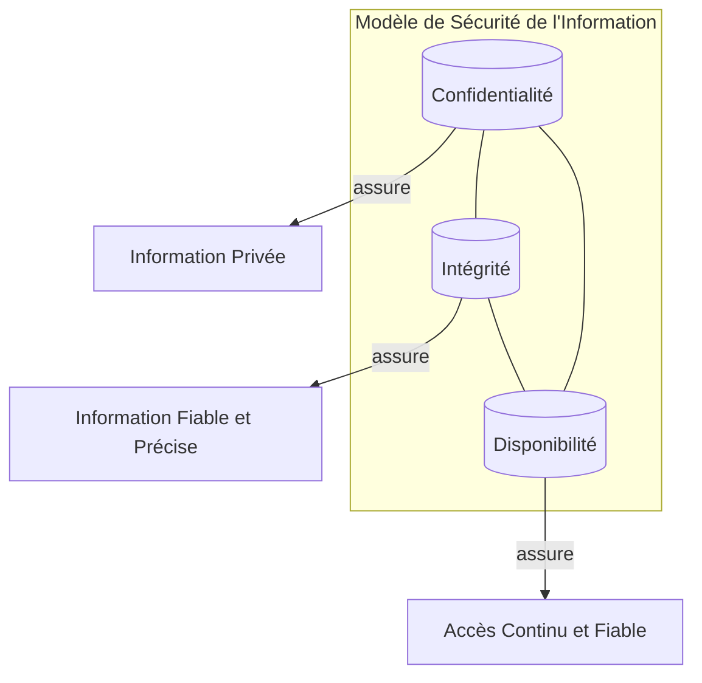

---
aliases:
  - Triade CIA
  - CIA Triad
  - Confidentiality Integrity Availability
archetype: modele
cssclasses:
  - max
tags:
  - modèle/cia-triade
  - cybersecurité/concept-fondamental
  - sécurité-information/confidentialité
  - sécurité-information/intégrité
  - sécurité-information/disponibilité
---

# Modèle : La Triade CIA

> [!abstract] Principe Fondamental
> La Triade CIA (Confidentialité, Intégrité, Disponibilité) est un modèle fondamental en cybersécurité, servant de guide pour élaborer des politiques et des contrôles visant à protéger les informations contre l'accès non autorisé, la modification et l'indisponibilité.

## 📐 Structure du Modèle

## 🧠 Concepts Clés

*   **Confidentialité** : Ce principe garantit que les informations sensibles ne sont accessibles qu'aux personnes ou systèmes autorisés. L'objectif est de prévenir la divulgation non autorisée de données, qu'elle soit intentionnelle ou accidentelle.
    *   **Menaces à la Confidentialité** : L'accès non autorisé via le contournement des mesures de sécurité, les chiffrements faibles, les menaces internes (employés malveillants ou négligents), les attaques de *phishing* et les logiciels malveillants (*malware*) sont des risques majeurs.
    *   **Mesures de Protection** : L'utilisation de techniques de chiffrement robustes (par exemple, AES), les contrôles d'accès basés sur les rôles (RBAC), l'authentification multifacteur (MFA), la classification des données, les réseaux privés virtuels (VPN) et la formation des utilisateurs sont essentiels pour maintenir la confidentialité.

*   **Intégrité** : L'intégrité assure que les données sont fiables, complètes et n'ont pas été altérées ou modifiées de manière non autorisée, que ce soit pendant le stockage ou la transmission. Elle garantit l'exactitude et la cohérence des données tout au long de leur cycle de vie.
    *   **Menaces à l'Intégrité** : La falsification des données (*data tampering*), les logiciels malveillants (y compris les rançongiciels), les privilèges utilisateur excessifs et les manipulations physiques peuvent compromettre l'intégrité.
    *   **Mesures de Protection** : Les fonctions de hachage cryptographique (vérification par sommes de contrôle), les signatures numériques, les contrôles d'accès stricts, le contrôle de version, les journaux d'audit, les solutions de sauvegarde et de récupération, et la formation des employés sont cruciaux pour protéger l'intégrité.

*   **Disponibilité** : Ce principe garantit que les systèmes et les données sont accessibles et fonctionnels pour les utilisateurs autorisés au moment où ils en ont besoin. L'objectif est de minimiser les temps d'arrêt et les perturbations.
    *   **Menaces à la Disponibilité** : Les attaques par déni de service (DoS) et déni de service distribué (DDoS), les pannes matérielles, les coupures de courant, les catastrophes naturelles et les logiciels non patchés ou obsolètes peuvent entraîner une perte de disponibilité.
    *   **Mesures de Protection** : La mise en œuvre de la redondance (ex: RAID, serveurs en cluster), les systèmes de *failover*, les sauvegardes régulières, la maintenance et les mises à jour régulières des systèmes et logiciels, la surveillance des réseaux et la prévention des goulots d'étranglement sont des mesures clés.

## ✅ Avantages vs Inconvénients
| Avantages | Inconvénients |
|---|---|
| Fournit un cadre complet pour l'évaluation des risques de sécurité. | Portée limitée, n'adressant pas explicitement l'authentification, la non-répudiation ou la responsabilité. |
| Permet de prioriser les efforts de sécurité sur les domaines critiques. | Manque de spécificité, ce qui peut rendre l'implémentation difficile pour les organisations moins expérimentées. |
| Offre une structure claire pour la conception et la mise en œuvre des contrôles de sécurité. | Potentiels conflits entre les piliers (ex: une sécurité accrue peut réduire la disponibilité ou l'expérience utilisateur). |
| Aide à assurer un équilibre entre les mesures de protection. | La complexité et les coûts associés à une implémentation rigoureuse peuvent être élevés. |
| Renforce la sécurité des données, la confidentialité et la conformité réglementaire. | Ne constitue pas une solution unique et holistique pour la cybersécurité moderne; doit être complété par d'autres modèles. |

## 🔗 Notes Connexes
*   **Application** : GestionDesRisquesCyber
*   **Modèle concurrent** : ModeleBellLaPadula
*   **Concepts étendus** : Authentification, NonRepudiation, ComptabiliteEnCybersecurite