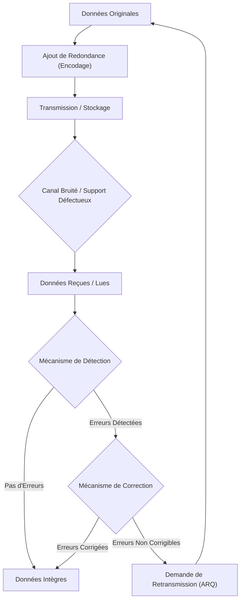

---
aliases:
  - Détection et Correction d'Erreurs
  - Error Detection and Correction
  - EDAC
archetype: modele
cssclasses:
  - max
tags:
  - modele/detection-erreur
  - modele/correction-erreur
  - redondance
  - integrite
  - fiabilite
  - checksum
  - crc
  - bit-parite
  - code-hamming
  - code-reed-solomon
  - fec
  - arq
  - transmission-donnees
  - stockage/donnees
---

# Modèle : Error Detection and Correction

> [!abstract] Principe Fondamental
> La détection et la correction d'erreurs (EDAC) sont des mécanismes fondamentaux qui permettent d'assurer l'intégrité des données lors de leur transmission ou de leur stockage, en ajoutant de l'information redondante pour identifier et, si possible, rectifier les altérations causées par le bruit ou les défaillances du système.

## 📐 Structure du Modèle

## 🧠 Concepts Clés
*   **Redondance** : C'est le principe central de l'EDAC. Il implique l'ajout d'informations supplémentaires aux données originales (bits de parité, sommes de contrôle, codes d'erreur) qui ne sont pas nécessaires pour le contenu même des données, mais sont utilisées pour vérifier leur intégrité.
*   **Codes de Détection d'Erreurs (EDC)** : Ce sont des algorithmes qui ajoutent suffisamment de redondance pour qu'une altération des données puisse être identifiée. Ils signalent la présence d'une erreur sans nécessairement pouvoir la corriger. Les données altérées sont alors généralement rejetées, et une retransmission peut être demandée.
*   **Codes de Correction d'Erreurs (ECC)** : Ces algorithmes vont plus loin que la simple détection en ajoutant une redondance suffisante pour non seulement détecter les erreurs, mais aussi pour déterminer leur position et leur valeur afin de les corriger. Les codes ECC sont souvent utilisés là où la retransmission est coûteuse ou impossible (par exemple, communications spatiales, mémoire RAM).

### Méthodes de Détection d'Erreurs
*   **Bit de Parité** : C'est la méthode la plus simple. Un bit supplémentaire (le bit de parité) est ajouté à un bloc de données. Sa valeur est choisie de sorte que le nombre total de bits à '1' dans le bloc (y compris le bit de parité) soit pair (parité paire) ou impair (parité impaire). Si, à la réception, le compte de bits '1' ne correspond pas, une erreur est détectée. Il ne peut détecter qu'un nombre impair d'erreurs dans le bloc.
*   **Somme de Contrôle (Checksum)** : Une somme de contrôle est calculée en additionnant tous les mots d'un bloc de données. La somme de contrôle est ensuite transmise avec les données. Au destinataire, la somme des données reçues est calculée et comparée à la somme de contrôle reçue. Toute différence indique une erreur. Les sommes de contrôle sont simples à implémenter mais ne sont pas toujours robustes face à certains types d'erreurs.
*   **Vérification de Redondance Cyclique (CRC)** : Le CRC est une méthode de détection d'erreurs plus puissante, couramment utilisée dans les réseaux et le stockage numérique. Elle utilise une division polynomiale des données par un polynôme générateur fixe pour produire une séquence de bits de contrôle, appelée la valeur CRC. Si le CRC calculé à la réception ne correspond pas au CRC reçu, une erreur est détectée. Les CRC peuvent détecter efficacement des erreurs multiples et des erreurs en rafale.

### Méthodes de Correction d'Erreurs
*   **Correction d'Erreurs Directe (FEC - Forward Error Correction)** : Avec le FEC, le récepteur peut détecter et corriger les erreurs sans demander une retransmission des données. Cela est rendu possible grâce à des codes d'erreur sophistiqués ajoutant une redondance significative.
    *   *Codes de Hamming* : Utilisés pour détecter et corriger les erreurs sur un bit unique. Ils sont particulièrement efficaces dans les contextes où les erreurs sont rares et isolées.
    *   *Codes de Reed-Solomon* : Ce sont des codes blocs non binaires puissants qui peuvent corriger des erreurs en rafale (plusieurs bits contigus). Ils sont largement utilisés dans les applications de stockage (CD, DVD, disques durs) et de communication (DSL, Wi-Fi).
*   **Demande de Répétition Automatique (ARQ - Automatic Repeat Request)** : L'ARQ est une stratégie où la détection d'une erreur entraîne une demande automatique de retransmission de la part du récepteur. Si le récepteur détecte une erreur, il envoie un message de "négative acknowledgment" (NACK) ou ne renvoie rien (timeout) au transmetteur, qui retransmet alors le bloc de données. C'est une méthode efficace mais qui introduit de la latence due aux retransmissions.

## ✅ Avantages vs Inconvénients
| Avantages | Inconvénients |
|---|---|
| Assure l'intégrité et la fiabilité des données. | Ajoute de la surcharge (overhead) en termes de bits de données, réduisant le débit utile. |
| Permet la communication sur des canaux bruyants ou peu fiables. | Augmente la complexité des encodeurs et décodeurs. |
| Réduit le besoin de retransmissions (pour FEC), optimisant la bande passante et la latence. | Ne peut pas toujours corriger toutes les erreurs, surtout si la quantité de redondance est limitée. |
| Indispensable pour le stockage de données critiques et les transmissions unidirectionnelles. | Les méthodes de correction d'erreurs peuvent introduire une latence de traitement supplémentaire. |