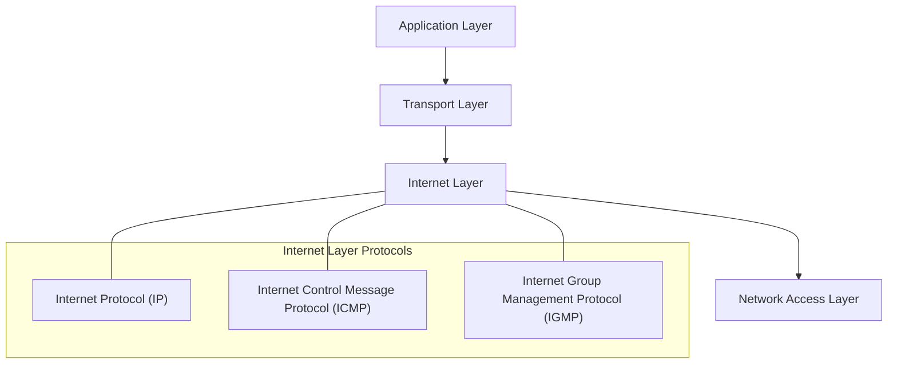

---
aliases:
  - Couche Internet TCP/IP
  - TCP/IP Internet Layer
  - IP Layer
archetype: modele
cssclasses:
  - max
tags:
  - modele
  - modele-tcp-ip
  - modele-tcp-ip/couche-internet
  - protocole/ip
  - protocole/ip/ipv4
  - protocole/ip/ipv6
  - protocole/icmp
  - protocole/igmp
  - reseau/adressage/ip
  - reseau/routage
  - fragmentation-paquets
  - interconnexion-reseau
  - securite/reseau
---

# Modèle : Internet Layer TCP/IP

> [!abstract] Principe Fondamental
> La couche Internet du modèle TCP/IP est responsable de l'adressage logique et du routage des paquets de données à travers différents réseaux, assurant ainsi l'interconnexion globale et la livraison de bout en bout.

## 📐 Structure du Modèle

## 🧠 Concepts Clés
*   **Adressage Logique** : Utilise les adresses IP (IPv4 et IPv6) pour identifier de manière unique les hôtes sur le réseau, permettant aux paquets d'être acheminés vers la bonne destination, indépendamment de la topologie physique du réseau.
*   **Routage (Routing)** : Détermine le meilleur chemin pour les paquets à travers des réseaux interconnectés. Les routeurs examinent les adresses IP de destination des paquets et utilisent des tables de routage pour les transférer vers le prochain saut.
*   **Fragmentation des Paquets** : Si un paquet est trop grand pour être transmis sur un segment de réseau particulier, la couche Internet peut le diviser en fragments plus petits qui sont réassemblés à la destination.
*   **Protocoles Clés** :
    *   **Internet Protocol (IP)** : Le protocole principal de cette couche, responsable de l'adressage et du routage des paquets de données. Il existe en deux versions principales :
        *   ***IPv4*** : Utilise des adresses de 32 bits, offrant environ 4 milliards d'adresses uniques. Il est toujours largement utilisé mais souffre d'un épuisement des adresses.
        *   ***IPv6*** : Utilise des adresses de 128 bits, fournissant un nombre considérablement plus grand d'adresses et incluant des améliorations pour l'efficacité du routage et la sécurité.
    *   **[[ICMPProtocol|Internet Control Message Protocol]] (ICMP)** : Utilisé pour la gestion des erreurs et les messages d'information, comme les messages "destination inaccessible" ou les requêtes d'écho (utilisées par la commande `ping`).
    *   **Internet Group Management Protocol (IGMP)** : Gère l'appartenance des hôtes à des groupes de multidiffusion IP, permettant à un groupe d'hôtes de recevoir des flux de données identiques.

## ✅ Avantages vs Inconvénients
| Avantages | Inconvénients |
|---|---|
| Assure l'interconnexion universelle entre des réseaux hétérogènes. | Ne garantit pas la livraison, la fiabilité ou l'ordre des paquets (ceci est la tâche de la couche Transport). |
| Offre un mécanisme d'adressage flexible et évolutif (IPv6). | La fragmentation/réassemblage peut introduire une surcharge et une complexité. |
| Permet le routage efficace des données à travers des chemins multiples. | La sécurité de base de l'IP était limitée, nécessitant des protocoles supplémentaires (IPsec) pour la protection des données. |
| Indépendante des technologies de couche réseau sous-jacentes. | La gestion des adresses IPv4 est devenue complexe et coûteuse en raison de l'épuisement. |
## 🔗 Notes Connexes
* [[NetworkLayerOSI|OSI Layer 3]]